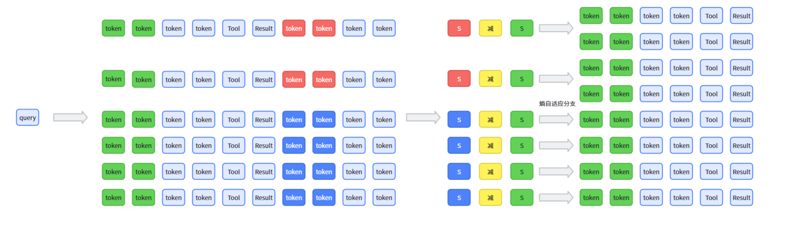
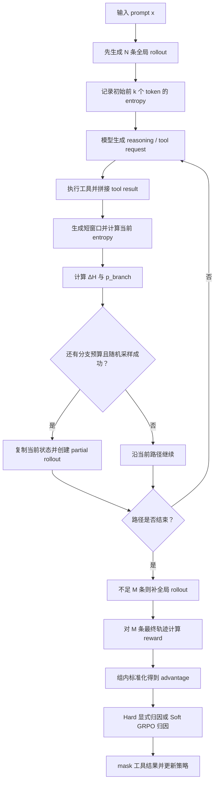

# ARPO 学习笔记：在工具调用后的高熵位置“多试几条路”

> **一句话理解：** ARPO 仍用 GRPO 更新策略，但不再把全部采样预算都花在从头生成
> 的独立轨迹上；它先生成一部分完整路径，再在工具返回后、模型不确定性升高的位置
> 复用已有前缀并创建分支，从而把探索预算放到更关键的决策点。

本文讨论的 ARPO 是 **Agentic Reinforced Policy Optimization**，不是同名的 GUI
Agent 方法。它面向带搜索、浏览器、代码解释器等工具的多轮 LLM Agent。

ARPO 的两个核心组件是：

1. **Entropy-based Adaptive Rollout**：根据工具调用前后的 entropy 变化决定是否
   从当前位置创建 partial rollout；
2. **Advantage Attribution Estimation**：让共享前缀和分支后的独立 token 得到
   合理的优势信号。

---

## 1. 为什么普通 trajectory-level rollout 不够

普通 GRPO 对一个问题从头采样 $G$ 条独立回答：

$$
y_i\sim\pi_{\theta_{\mathrm{old}}}(\cdot\mid x),
\qquad i=1,\ldots,G.
$$

在单轮数学推理中，这通常能够覆盖不同的思路。但在 Agent 场景里，一条轨迹会交替
出现模型输出和外部工具反馈：

$$
\mathcal R=
(\text{reasoning}_1,\text{tool call}_1,\text{tool result}_1,
\ldots,\text{answer}).
$$

### 1.1 Action 与 Observation

在 Agent / 强化学习语境中，**observation** 指模型从外部环境获得的“观察结果”或
“环境反馈”，并不专指图片等视觉信息。一次工具交互可以写成：

$$
\text{当前状态 }s_t
\xrightarrow{\text{模型动作 }a_t}
\text{工具/环境}
\xrightarrow{\text{环境反馈 }o_{t+1}}
\text{新状态 }s_{t+1}.
$$

其中：

- **Action（动作）**：模型主动生成的内容，例如 reasoning token、搜索请求、
  Python 代码或浏览器操作；
- **Observation（环境反馈）**：工具执行 action 后返回的内容，例如搜索摘要、
  网页正文、Python 计算结果、报错信息或浏览器页面状态；
- **新状态**：把 observation 拼接到已有上下文后，模型下一步实际看到的完整上下文。

例如：

| 场景 | 模型 action | 环境 observation |
|---|---|---|
| Python 计算 | 执行 `12 * 8` | `96` |
| 搜索 | 查询“ARPO entropy rollout” | 搜索标题、摘要和网页片段 |
| 代码调试 | 运行一段 Python 代码 | 正常输出或 traceback |

模型不能直接决定工具会返回什么，只能根据返回的 observation 选择下一步 action。
Observation 会影响之后的生成分布，但它本身不是策略采样的 action，因此计算 policy
loss 时必须 mask 掉；模型生成的 reasoning、tool request 和最终 answer 才是训练
对象。

关键问题是：模型看到 prompt 时可能已经形成较明确的推理方向，但外部工具会把新的
observation（环境反馈）插入上下文，改变模型接下来面对的条件分布。ARPO 论文的
先导实验分别考察了使用搜索引擎的知识密集型任务和使用 Python 解释器的计算任务，
观察到：

1. 工具结果插入后，模型随后生成的前 10～50 个 token 经常出现 entropy 上升；
2. 在该实验设置中，搜索 Agent 的 entropy 波动幅度通常大于 Python Agent。

这里测量的不是“搜索结果文本本身的 entropy”，而是模型在读完工具结果之后的
**next-token 概率分布 entropy**。搜索反馈更容易造成较大波动，可以从条件分布迁移
的角度理解：

- 搜索结果通常包含较长的自然语言、多个来源、新实体和原 prompt 中没有出现的事实，
  模型需要重新判断哪些内容相关、哪些来源可信；
- 不同搜索片段可能重复、互补甚至冲突，因此“继续搜索、打开网页、整合证据或直接
  回答”等多个后续动作可能同时合理，next-token 概率会分散到更多候选上；
- 论文计算任务中的 Python 工具通常返回较短且确定的结果，例如一个数字、布尔值或
  简单统计量。这类 observation 往往直接缩小后续推理空间，使模型更容易决定下一步。

因此，论文中的“搜索反馈波动更大”是特定模型、任务和工具输出分布下的实验观察，
并不表示搜索工具天然一定比 Python 工具产生更高 entropy。Python 如果返回长
traceback、复杂表格或大量日志，同样可能显著增加不确定性；反过来，清晰且高度相关
的搜索结果也可能降低 entropy。论文的对比还同时包含任务类型、输出长度和内容结构
等差异，不能仅凭这项观察把波动差异完全归因于工具名称本身。

如果 $G$ 条轨迹都从头独立生成，采样预算会重复消耗在已经比较确定的前半段。ARPO
的想法是：

> 前半段只保留若干全局样本；走到工具返回后的高不确定位置时，再复制当前状态，
> 从这里尝试不同后续。

---

## 2. ARPO 与 GRPO 的关系

ARPO 不是把 GRPO 的 policy loss 全部推翻，而是主要改造 **rollout 数据怎样生成**。

| 环节 | trajectory-level GRPO | ARPO |
|---|---|---|
| 初始采样 | $G$ 条路径都从 prompt 开始 | 先从 prompt 生成 $N<G$ 条 |
| 剩余预算 | 仍用于完整轨迹 | 优先用于工具调用后的 partial rollout |
| 分支位置 | 无显式分支 | entropy 上升的位置更容易分支 |
| 共享前缀 | 不刻意构造 | 分支轨迹显式复用前缀 |
| 优势估计 | 组内相对优势 | hard 或 soft attribution |
| policy objective | GRPO/PPO 风格裁剪 | 默认仍采用 GRPO objective |

可以把整体结构记成：

$$
\boxed{
\text{ARPO}
=
\text{GRPO policy update}
+
\text{entropy-adaptive partial rollout}
+
\text{shared/individual advantage attribution}
}
$$

---

## 3. Token entropy：模型此刻有多犹豫

### 3.1 完整公式

设模型在生成第 $t$ 个 token 时的 logits 为
$\mathbf z_t\in\mathbb R^V$，$V$ 是词表大小，$\tau_{\mathrm{temp}}$ 是解码温度：

$$
\mathbf p_t
=
\operatorname{Softmax}
\left(
\frac{\mathbf z_t}{\tau_{\mathrm{temp}}}
\right).
$$

该位置的 Shannon entropy 为：

$$
\boxed{
H_t
=
-\sum_{j=1}^{V}p_{t,j}\log p_{t,j}
}
$$

直觉：

- 一个 token 的概率接近 1，其余接近 0：$H_t$ 很小，模型比较确定；
- 概率平均分散到很多 token：$H_t$ 很大，模型比较犹豫。

使用自然对数时，完整词表上的最大 entropy 是 $\log V$，因此可归一化为：

$$
\widetilde H_t=\frac{H_t}{\log V}\in[0,1].
$$

#### 一个只有 4 个候选 token 的例子

为了便于手算，假设词表暂时只有：

```text
["继续", "搜索", "计算", "回答"]
```

因此：

$$
V=4,\qquad \log V=\log4\approx1.3863.
$$

真实语言模型的词表通常有数万到十几万个 token，这里把 $V$ 缩小到 4 只是为了展示
entropy 怎样随概率分布变化。

**情况一：模型几乎确定应该生成“继续”**

$$
\mathbf p_t=[0.97,\ 0.01,\ 0.01,\ 0.01].
$$

代入公式：

$$
\begin{aligned}
H_t
&=
-\left(
0.97\log0.97
+3\times0.01\log0.01
\right)\\
&\approx0.1677,
\end{aligned}
$$

$$
\widetilde H_t
=
\frac{0.1677}{1.3863}
\approx0.1210.
$$

概率几乎集中在一个候选上，所以归一化 entropy 很低，模型比较确定。

**情况二：模型在多个合理后续之间犹豫**

$$
\mathbf p_t=[0.40,\ 0.30,\ 0.20,\ 0.10].
$$

此时：

$$
H_t\approx1.2799,
\qquad
\widetilde H_t
\approx
\frac{1.2799}{1.3863}
\approx0.9232.
$$

“继续、搜索、计算、回答”都有不可忽略的概率，概率质量分散到多个候选，因此
entropy 很高。

**情况三：四个候选完全等概率**

$$
\mathbf p_t=[0.25,\ 0.25,\ 0.25,\ 0.25].
$$

此时 entropy 达到该词表下的最大值：

$$
H_t
=
-4\times0.25\log0.25
=
\log4
\approx1.3863,
$$

$$
\widetilde H_t=1.
$$

三种情况可以汇总为：

| next-token 概率分布 | $H_t$ | $\widetilde H_t$ | 直觉 |
|---|---:|---:|---|
| $[0.97,0.01,0.01,0.01]$ | 0.1677 | 0.1210 | 几乎确定 |
| $[0.40,0.30,0.20,0.10]$ | 1.2799 | 0.9232 | 多个候选竞争 |
| $[0.25,0.25,0.25,0.25]$ | 1.3863 | 1.0000 | 完全不确定 |

这里的 entropy 描述的是**整个 next-token 分布的不确定性**，不是“已经采到的那个
token 有多不确定”。例如下面两个分布最后都可能随机采到“继续”：

$$
\mathbf p^{(A)}=[0.97,0.01,0.01,0.01],
$$

$$
\mathbf p^{(B)}=[0.30,0.25,0.25,0.20].
$$

虽然实际观察到的 token 都是“继续”，但第一种情况下模型几乎确信应该选它，
$\widetilde H^{(A)}\approx0.1210$；第二种情况下“继续”只是四个相近候选之一，
$\widetilde H^{(B)}\approx0.9927$。因此，仅看最后采到了哪个 token，无法判断模型
当时有多确定，必须查看采样前的完整概率分布。

### 3.2 为什么观察前 $k$ 个 token

单个位置的 entropy 噪声较大。工程上通常观察一个短窗口，例如工具返回后生成的前
$k=20$ 个 token：

$$
\bar H
=
\frac{1}{k}
\sum_{t=1}^{k}\widetilde H_t.
$$

定义：

$$
\bar H_{\mathrm{init}}
=
\text{轨迹初始生成窗口的平均熵},
$$

$$
\bar H_{\mathrm{now}}
=
\text{本次工具结果拼接后生成窗口的平均熵}.
$$

于是 entropy 变化为：

$$
\boxed{
\Delta H
=
\bar H_{\mathrm{now}}-\bar H_{\mathrm{init}}
}
$$

- $\Delta H>0$：工具反馈后更不确定；
- $\Delta H<0$：工具反馈帮助模型收敛到更明确的后续。

论文把初始和当前窗口写成 entropy 向量
$H_{\mathrm{initial}},H_t\in\mathbb R^{1\times k}$，再写
$\Delta H_t=\operatorname{Normalize}(H_t-H_{\mathrm{initial}})$。上面的“逐位置
归一化后取均值”是便于实现和手算的标量版本。

### 3.3 一个最小代码

```python
import math

def entropy_from_logits(logits):
    m = max(logits)
    exp_values = [math.exp(x - m) for x in logits]
    z = sum(exp_values)
    probabilities = [x / z for x in exp_values]
    entropy = -sum(p * math.log(p) for p in probabilities if p > 0)
    return entropy / math.log(len(probabilities))
```

在配套代码 [arpo_demo.py](./arpo_demo.py) 中：

- `logits=[5,0,-1,-2]` 的归一化 entropy 约为 `0.0465`；
- `logits=[1,1,1,1]` 是均匀分布，归一化 entropy 等于 `1.0000`。

### 3.4 full-vocabulary entropy 与 top-k 近似

如果只能从推理引擎取得 top-k log-prob，常见近似是：

```python
p_list = [math.exp(log_p) for log_p in topk_logprobs]
entropy_proxy = -sum(p * log_p for p, log_p in zip(p_list, topk_logprobs))
```

它只有在 `logprobs` 覆盖完整词表分布时才等于真正的 Shannon entropy。官方仓库
当前 rollout 实现请求有限个 top log-prob，因此得到的是**截断的 entropy proxy**。
它可用于比较同一实现下的相对变化，但不应直接当作精确的全词表 entropy。

---

## 4. Entropy-based Adaptive Rollout

自适应 rollout 可以整理成四个阶段：

### 4.1 总览图如何阅读



这张图从左到右展示了一个完整的 ARPO rollout：**同一个 query 先生成 6 条初始
轨迹，比较工具调用前后的 entropy，再从两个高不确定位置各创建一条分支，最终得到
8 条训练轨迹。**

#### 左侧：6 条初始轨迹

`query` 后面的 6 行分别是一条初始 Agent 轨迹：

```text
模型 token -> Tool 调用 -> Result 返回 -> 模型继续生成 token
```

图中颜色的含义是：

| 图形 | 含义 |
|---|---|
| 绿色 token | 每条轨迹开始时用于估计初始 entropy 的前 $k$ 个模型 token |
| 白底蓝框 token | 普通模型生成 token |
| `Tool` | 模型生成的工具请求 |
| `Result` | 外部工具返回的 observation |
| 红色 token | 工具返回后的 entropy 相对初始值明显升高 |
| 蓝色 token | 工具返回后的 entropy 没有明显升高 |

`Result` 会进入上下文并改变后续 token 分布，但它不是模型采样的 action，因此训练时
应从 policy loss 中 mask 掉。

#### 中间：计算 entropy 变化并判断是否分支

图中的：

```text
S  -  S
```

表示比较工具返回后的当前不确定性与轨迹初始不确定性。按本文符号，更准确地应写成：

$$
\Delta H
=
\bar H_{\mathrm{now}}
-
\bar H_{\mathrm{init}}.
$$

左边红色或蓝色 `S` 对应 $\bar H_{\mathrm{now}}$，右边绿色 `S` 对应
$\bar H_{\mathrm{init}}$，黄色“减”表示求差。这里的 `S` 只是图中的抽象 score，
后文统一使用 entropy 符号 $H$。

最上面两条轨迹的工具后 token 为红色，表示 $\Delta H$ 较大，因而具有更高的：

$$
p_{\mathrm{branch}}
=
\operatorname{clip}
\left(
\alpha+\beta_H\Delta H,\ 0,\ 1
\right).
$$

下面四条轨迹为蓝色，表示 entropy 没有明显升高，所以继续原路径的概率更大。红色
不是“必然分支”的确定性标签；真实实现还会采样随机数。图中画的是一次具体结果：
最上面的两条路径都成功触发了分支。

#### 右侧：从 6 条补到 8 条

这张图使用：

$$
N=\text{init\_sample\_size}=6,
\qquad
M=\text{group\_size}=8.
$$

因此 partial rollout 的总预算为：

$$
M-N=8-6=2.
$$

最上面的两条高熵路径分别新增一条后代，其余四条保持一条：

$$
\underbrace{2+2}_{\text{两条路径各新增一个分支}}
+
\underbrace{1+1+1+1}_{\text{四条路径继续}}
=8.
$$

如果 `beam_size=2`，一条源路径最多新增
`beam_size - 1 = 1` 条分支，正好对应图中的结构。

分支不是从 query 重新生成整条轨迹，而是复用当前节点之前的状态：

```text
query -> shared reasoning -> Tool -> Result
                                      |-- 后续方案 A
                                      `-- 后续方案 B
```

所以两个后代共享分支点以前的模型 token、工具调用和工具结果，只对分支后的后续进行
独立采样。得到 8 条完整轨迹并计算 reward 后，共享前缀和独立后缀如何接收训练信号，
分别由第 8～10 节的 Hard/Soft Advantage Attribution 解释。

### 4.2 阶段一：分配全局与分支预算

设：

- $M$：最终希望得到的 group size；
- $N$：初始全局采样数，$N<M$；
- $M-N$：留给 partial rollout 的预算；
- $B$：beam size，一条源路径最多新增 $B-1$ 条后代。

先从 prompt 独立生成 $N$ 条初始路径：

$$
\{y_i\}_{i=1}^{N}
\sim
\pi_{\theta_{\mathrm{old}}}(\cdot\mid x).
$$

下面的教学例子使用：

$$
M=8,\qquad N=6,\qquad M-N=2.
$$

也就是先生成 6 条，最多再从中间节点补 2 条分支。论文/官方训练示例中常见的配置则
是 `rollout_n=16, initial_rollouts=8, beam_size=2`。

### 4.3 阶段二：工具交互并监控 entropy

每条未完成路径执行下面的循环：

1. 模型生成 reasoning 和 tool request；
2. 执行工具；
3. 把 tool result 拼回上下文；
4. 模型基于新上下文生成一个短窗口；
5. 计算当前 $\bar H_{\mathrm{now}}$ 和 $\Delta H$。

注意：应该在**工具结果已经拼回上下文之后**监控 entropy。否则测到的仍是工具调用前
的模型状态，不能反映外部信息造成的分布变化。

### 4.4 阶段三：把 entropy delta 变成分支概率

论文定义：

$$
\boxed{
P_t
=
\alpha+\beta_H\Delta H_t
}
$$

其中：

- $\alpha$：基础分支概率；
- $\beta_H$：entropy 变化的权重；
- 实现时把 $P_t$ 裁到 $[0,1]$。

于是：

$$
p_{\mathrm{branch}}
=
\operatorname{clip}
\left(
\alpha+\beta_H\Delta H_t,\ 0,\ 1
\right).
$$

采样一个 $u\sim\operatorname{Uniform}(0,1)$：

$$
\operatorname{Action}_t
=
\begin{cases}
\operatorname{Branch},&u\le p_{\mathrm{branch}},\\
\operatorname{Continue},&u>p_{\mathrm{branch}}.
\end{cases}
$$

这给出很直接的单调关系：

$$
\Delta H\uparrow
\quad\Longrightarrow\quad
p_{\mathrm{branch}}\uparrow.
$$

#### 官方代码为什么写成 `random - weight * delta`

官方实现采用了一个等价写法：

```python
entropy_delta = entropy_now - entropy_init
score = random.random() - entropy_weight * entropy_delta
score = max(0.0, min(1.0, score))

if score > branch_probability:
    continue
else:
    create_branch()
```

忽略边界裁剪，创建分支的条件为：

$$
u-\beta_H\Delta H\le\alpha
\iff
u\le\alpha+\beta_H\Delta H.
$$

所以这里变量名如果叫 `prob` 容易误导：它其实是**被 entropy 平移后的随机
score**。真正的有效分支概率仍是：

$$
\operatorname{clip}(\alpha+\beta_H\Delta H,0,1).
$$

### 4.5 阶段四：受预算约束地终止

分支不能无限创建。对当前 prompt：

$$
R_{\mathrm{slots}}
=
M-N-Z_{\mathrm{created}},
$$

其中 $Z_{\mathrm{created}}$ 是已经创建的分支数。一条源路径此轮最多创建：

$$
\boxed{
Z_{\mathrm{source}}
=
\min
\left(
B-1,\ R_{\mathrm{slots}}
\right)
}
$$

当分支预算耗尽后，所有已有路径继续生成到最终答案。如果已有路径都提前结束但总数
仍小于 $M$，论文算法会补充新的全局 rollout，使最终 group size 达到 $M$。

---

## 5. 一个完整的自适应 rollout 数值例子

设：

$$
M=8,\quad N=6,\quad B=2,\quad
\alpha=0.5,\quad\beta_H=0.2.
$$

6 条初始路径记为 A～F，初始归一化 entropy 都先简化为 $0.30$。一次工具调用后：

| 路径 | $\bar H_{\mathrm{init}}$ | $\bar H_{\mathrm{now}}$ | $\Delta H$ | $p_{\mathrm{branch}}$ |
|---|---:|---:|---:|---:|
| A | 0.30 | 0.55 | +0.25 | 0.550 |
| B | 0.30 | 0.25 | -0.05 | 0.490 |
| C | 0.30 | 0.70 | +0.40 | 0.580 |
| D | 0.30 | 0.32 | +0.02 | 0.504 |
| E | 0.30 | 0.60 | +0.30 | 0.560 |
| F | 0.30 | 0.20 | -0.10 | 0.480 |

A 和 C 的 entropy 上升更多，所以它们有更高的分支概率。某次随机采样若 A、C
成功创建分支，预算恰好用完：

```text
初始：A  B  C  D  E  F                       共 6 条
分支：A -> A1, A2     C -> C1, C2            新增 2 条
最终：A1 A2 B C1 C2 D E F                    共 8 条
```

“从 A 创建一条分支”的含义不是重新生成 A 的全部内容，而是复制 A 到分支点的上下文：

```text
prompt -> reasoning -> tool call -> tool result
                                      ├── A1: 后续方案 1
                                      └── A2: 后续方案 2
```

因此两条后代共享分支点之前的模型 token 和外部状态，只在分支后重新采样。

> 高 entropy 只说明“模型存在多个竞争后续”，不保证其中一定有正确答案。ARPO
> 把更多探索预算投到这些位置，最终仍要靠 reward 区分好坏分支。

---

## 6. Rollout 伪代码

```python
def arpo_rollout(prompt, group_size, init_sample_size, beam_size):
    paths = sample_from_prompt(prompt, n=init_sample_size)
    branch_budget = group_size - init_sample_size

    for path in unfinished(paths):
        entropy_init = entropy_of_first_k_tokens(path)

    while any_unfinished(paths):
        for path in unfinished(paths):
            request = continue_until_tool_or_answer(path)

            if request.is_final_answer:
                path.finish()
                continue

            tool_result = execute_tool(request)
            path.append(tool_result)

            preview = generate_first_k_tokens(path)
            entropy_now = entropy(preview)
            delta = entropy_now - path.entropy_init
            p_branch = clip(alpha + entropy_weight * delta, 0, 1)

            max_new = min(
                beam_size - 1,
                branch_budget - num_created_branches,
            )
            for _ in range(max_new):
                if random.random() <= p_branch:
                    paths.append(copy_state_at_current_node(path))

            if num_created_branches == branch_budget:
                finish_all_paths(paths)
                break

    while len(paths) < group_size:
        paths.append(sample_from_prompt(prompt, n=1))

    return paths
```

真实实现还要维护 token mask、工具错误、超时、最大调用次数、KV cache 和不同分支
的环境状态；这段伪代码只呈现算法控制流。

---

## 7. 为什么共享前缀带来 credit assignment 问题

仍看 A 的两个后代：

```text
共享前缀 s_A
   ├── 分支 A1 -> reward 高
   └── 分支 A2 -> reward 低
```

如果直接把 A1 的高 reward 广播给它的所有 token，就会把共享前缀判为“好”；把 A2
的低 reward 广播给所有 token，又会把同一共享前缀判为“坏”。共享动作本身没有变，
结果差异来自分叉后的选择，因此应该把两部分区分开：

- **shared tokens**：分支点之前被多个后代共同复用的模型输出；
- **individual tokens**：分支后每条轨迹独立生成的模型输出。

ARPO 为此提出 hard 和 soft 两种优势归因方式。

---

## 8. Hard Advantage Attribution

### 8.1 每条完整轨迹的组内优势

最终得到 $G=M$ 条轨迹，每条获得 reward $R_i$。先按 GRPO 方式标准化：

$$
\mu_R=\frac{1}{G}\sum_{j=1}^{G}R_j,
$$

$$
\sigma_R=
\sqrt{
\frac{1}{G}\sum_{j=1}^{G}(R_j-\mu_R)^2
},
$$

$$
\boxed{
\widehat A_i
=
\frac{R_i-\mu_R}{\sigma_R+\varepsilon_{\mathrm{num}}}
}
$$

### 8.2 individual token

第 $i$ 条分支独有的 token 直接使用该完整轨迹的优势：

$$
\boxed{
\widehat A_{i,t}^{\mathrm{individual}}
=
\widehat A_i
}
$$

### 8.3 shared token

设共享片段 $s$ 有 $d$ 条后代，后代集合为 $\mathcal D(s)$，则共享 token 的 hard
advantage 为：

$$
\boxed{
\widehat A_{s,t}^{\mathrm{shared}}
=
\frac{1}{d}
\sum_{i\in\mathcal D(s)}
\widehat A_i
}
$$

这样，如果一个共享前缀产生一好一坏两个分支，正负信号会在共享部分相互抵消；真正
拉开 reward 的分支后 token 则保留各自的优势。

---

## 9. Hard advantage 的手算例子

沿用 8 条最终轨迹，设 reward：

$$
R=
[1.0,\ 0.0,\ 0.2,\ 0.9,\ 0.1,\ 0.4,\ 0.8,\ 0.2],
$$

对应：

```text
[A1, A2, B, C1, C2, D, E, F]
```

使用总体标准差：

$$
\mu_R=0.45,
\qquad
\sigma_R
=
\sqrt{0.135}
\approx0.3674.
$$

组内优势约为：

| 轨迹 | reward | $\widehat A_i$ |
|---|---:|---:|
| A1 | 1.0 | +1.497 |
| A2 | 0.0 | -1.225 |
| B | 0.2 | -0.680 |
| C1 | 0.9 | +1.225 |
| C2 | 0.1 | -0.953 |
| D | 0.4 | -0.136 |
| E | 0.8 | +0.953 |
| F | 0.2 | -0.680 |

A1、A2 的共享前缀优势：

$$
\widehat A_A^{\mathrm{shared}}
=
\frac{1.497+(-1.225)}{2}
\approx0.136.
$$

分叉之后：

$$
\widehat A_{A1}^{\mathrm{individual}}=1.497,
\qquad
\widehat A_{A2}^{\mathrm{individual}}=-1.225.
$$

含义很清楚：

- A 的共同前缀只有轻微正贡献；
- A1 分支后的选择被强烈鼓励；
- A2 分支后的选择被强烈抑制。

---

## 10. Soft Advantage Attribution：为什么默认仍可用 GRPO loss

Hard setting 需要显式记录“每个 token 属于哪个共享片段、有哪些后代”，数据结构和
mask 比较复杂。论文还提出 soft setting：**不手工改写 token advantage，仍给每条
轨迹使用自己的 $\widehat A_i$，再用标准 GRPO 目标训练。**

对第 $i$ 条轨迹的第 $t$ 个模型 token，importance ratio 为：

$$
r_{i,t}(\theta)
=
\frac{
\pi_\theta(y_{i,t}\mid x,y_{i,<t})
}{
\pi_{\theta_{\mathrm{old}}}(y_{i,t}\mid x,y_{i,<t})
}.
$$

如果轨迹 $i,j$ 在该位置之前共享完全相同的前缀，并且当前 token 也相同，那么：

$$
y_{i,<t}=y_{j,<t}
\quad\Longrightarrow\quad
r_{i,t}(\theta)=r_{j,t}(\theta).
$$

忽略 clipping、假设后代等权时，共享 token 的梯度贡献为：

$$
\begin{aligned}
\frac{1}{d}\sum_{i=1}^{d}
r_{s,t}\widehat A_i
\nabla_\theta\log\pi_\theta(y_{s,t}\mid s)
&=
r_{s,t}
\left(
\frac{1}{d}\sum_{i=1}^{d}\widehat A_i
\right)
\nabla_\theta\log\pi_\theta(y_{s,t}\mid s)\\
&=
r_{s,t}\widehat A_{s,t}^{\mathrm{shared}}
\nabla_\theta\log\pi_\theta(y_{s,t}\mid s).
\end{aligned}
$$

也就是说，多条后代对同一个共享 token 的梯度相加后，自然形成“平均后代优势”的
效果；分支后因为前缀和 token 不同，ratio 与梯度方向也随之分开。

完整 clipped objective 中还存在 advantage 正负、裁剪状态、长度 mask 和 batch
reduction 等非线性，因此更严谨的说法是：**soft setting 对 hard shared advantage
形成隐式的近似，而不是在所有实现细节下逐项严格相等。**论文实验最终采用 soft
setting 作为默认方案。

---

## 11. ARPO 使用的 GRPO policy objective

对 $G$ 条最终轨迹，PPO/GRPO 风格的目标可写为：

$$
\boxed{
\begin{aligned}
J_{\mathrm{ARPO}}(\theta)
=
\mathbb E\Bigg[
\frac{1}{G}\sum_{i=1}^{G}
\frac{1}{|y_i|}
\sum_{t=1}^{|y_i|}
\min\Big(
&r_{i,t}(\theta)\widehat A_{i,t},\\
&\operatorname{clip}
\left(
r_{i,t}(\theta),1-\epsilon,1+\epsilon
\right)
\widehat A_{i,t}
\Big)
\Bigg].
\end{aligned}
}
$$

训练代码最小化：

$$
\mathcal L_{\mathrm{policy}}=-J_{\mathrm{ARPO}}.
$$

如果加入 reference-policy KL，则：

$$
\mathcal L
=
-J_{\mathrm{ARPO}}
+
\beta_{\mathrm{KL}}
D_{\mathrm{KL}}
\left(
\pi_\theta\parallel\pi_{\mathrm{ref}}
\right).
$$

论文实验的相应配置把 $\beta_{\mathrm{KL}}$ 设为 0。注意不要混淆：

- $\beta_H$：entropy 对分支概率的权重；
- $\beta_{\mathrm{KL}}$：policy loss 中的 KL 系数。

### 11.1 哪些 token 进入 loss

一条 Agent 轨迹同时包含：

1. 模型的 reasoning token；
2. 模型生成的 tool request token；
3. 外部工具返回的 result token；
4. 模型生成的最终 answer token。

工具结果不是策略采样的 action，因此不应当像模型 token 一样计算 policy gradient。
论文实现会把 tool result 从 loss 中 mask 掉，只训练 reasoning、tool request 和
answer 等模型真正生成的 token：

$$
J
=
\frac{
\sum_{i,t}m_{i,t}\,\ell_{i,t}
}{
\sum_{i,t}m_{i,t}
},
\qquad
m_{i,t}=
\begin{cases}
1,&\text{model-generated token},\\
0,&\text{tool-result/padding token}.
\end{cases}
$$

---

## 12. 配套代码怎样对应公式

[arpo_demo.py](./arpo_demo.py) 只依赖 Python 标准库，包含：

| 函数 | 对应内容 |
|---|---|
| `token_entropy()` | $H_t/\log V$ |
| `mean_entropy()` | 前 $k$ 个 token 的平均 entropy |
| `branch_probability()` | $\operatorname{clip}(\alpha+\beta_H\Delta H,0,1)$ |
| `choose_branches()` | 分支概率、beam 限制和剩余 slot |
| `group_relative_advantages()` | GRPO 组内标准化优势 |
| `hard_shared_advantage()` | 后代优势平均 |
| `clipped_grpo_objective()` | 教学用的 token 级裁剪目标 |

运行：

```bash
python arpo_note/arpo_demo.py
```

预期关键输出：

```text
=== 1. token entropy ===
高置信分布的归一化熵: 0.0846
均匀分布的归一化熵:   1.0000

=== 2. entropy-adaptive rollout ===
group_size=8, init_sample_size=6，所以最多补 2 条分支
...
实际创建分支数: 2

=== 3. hard advantage attribution ===
A1: reward=1.0, advantage=+1.497
A2: reward=0.0, advantage=-1.225
...
A1/A2 的共享前缀 advantage: +0.136
```

这不是完整训练器。真实 ARPO 还需要：

- 批量 LLM 推理和 token-level log-prob；
- 工具执行器及超时/异常处理；
- 每个分支的上下文、KV cache 和环境状态复制；
- rollout/reward/mask 的对齐；
- 分布式生成与策略更新。

---

## 13. 从输入到更新的完整流程



---

## 14. 最容易误解的六点

### 14.1 ARPO 不是“entropy 越大，reward 越高”

Entropy 是探索信号，不是质量信号。高 entropy 分支最后仍可能全部失败，必须依赖
reward 完成选择。

### 14.2 分支发生在工具调用之后

ARPO 针对的是外部反馈引入的不确定性。若只在 prompt 开头分支，就退化成普通的多
trajectory sampling。

### 14.3 `group_size` 是最终轨迹数

`init_sample_size` 是先从头生成的数量；新增分支和必要时补充的全局轨迹共同把数量补
到 `group_size`，不能在每个工具位置再无上限地生成一个完整 group。

### 14.4 beam size 与 group size 不同

`beam_size=2` 表示每条源路径最多新增 1 条后代，不表示最终只有 2 条轨迹。全局总量
仍由 `group_size` 控制。

### 14.5 Soft setting 不是“所有 token 使用平均 advantage”

每条完整轨迹仍保存自己的 $\widehat A_i$。只有共享 token 的多条梯度贡献聚合后，
才隐式呈现近似平均优势；分支后的 token 仍被不同轨迹优势分别更新。

### 14.6 工具返回文本不计算 policy loss

工具输出属于环境 observation，不是模型 action。它可以影响之后模型 token 的条件
分布，但本身必须被 mask。

---

## 15. ARPO 的收益与边界

### 15.1 主要收益

- 把更多 rollout 预算用于工具反馈后的关键决策点；
- 共享已有前缀，避免每条候选路径都从头重复生成；
- 对 step-level tool-use 行为提供更细的探索和 credit assignment；
- 仍能复用成熟的 GRPO policy update。

论文在 13 个计算推理、知识推理和深度搜索 benchmark 上报告了优于若干
trajectory-level RL baseline 的结果，并报告达到较好效果时只用了大约一半的工具
调用预算。这是特定模型、数据、工具和训练配置下的实验结果，不应理解成任意任务都
固定节省 50%。

### 15.2 工程边界

- 精确 full-vocabulary entropy 会增加推理引擎的数据传输和计算成本；
- top-k entropy 只是近似，$k$ 太小可能遗漏长尾不确定性；
- entropy 连续偏高时可能反复分支，需要严格的全局 budget；
- 复制文本上下文容易，复制有状态工具/浏览器环境则更复杂；
- 若工具反馈噪声很大，高 entropy 可能把预算吸引到无价值区域；
- 分支轨迹高度相关，有效样本数不能简单按轨迹条数理解。

---

## 16. 最后总结

ARPO 的逻辑可以压缩成四句话：

1. **先全局探索：**用 $N$ 条独立 rollout 保留不同的整体推理方向；
2. **再局部探索：**工具返回后计算 $\Delta H$，高不确定位置更容易分支；
3. **严格控预算：**partial rollout 与补充全局 rollout 的总数最终等于 $M$；
4. **正确分配信用：**共享前缀看后代平均表现，分支后 token 看各自轨迹表现；默认
   soft setting 可通过 GRPO loss 隐式实现这种区别。

最值得记住的不是某个具体阈值，而是下面这个采样原则：

$$
\boxed{
\text{把有限探索预算放在“新信息刚进入、模型最犹豫”的位置}
}
$$

---

## 参考资料

- [ARPO 论文：Agentic Reinforced Policy Optimization](https://arxiv.org/abs/2507.19849)
- [ARPO 论文 HTML（公式与章节）](https://arxiv.org/html/2507.19849)
- [ARPO 官方代码仓库](https://github.com/RUC-NLPIR/ARPO)
- [官方 rollout with tools 实现](https://github.com/RUC-NLPIR/ARPO/blob/main/ARPO/verl_arpo_entropy/verl/workers/rollout/vllm_rollout/vllm_rollout_with_tools.py)
