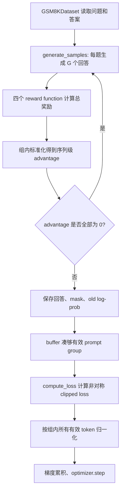

# DAPO 学习笔记：从 GRPO 到长思维链强化学习

> 本笔记结合 DAPO 论文、题图内容和本目录中的教学代码编写。重点不是只记住四个技巧，而是理解它们分别修复了 GRPO 在长思维链（Long-CoT）训练中的什么问题。
>
> 本目录代码使用 Qwen2.5-3B-Instruct、中文 GSM8K、每题 4 个回答和 256-token 输出，适合学习算法主干；它不是论文中 Qwen2.5-32B、每题 16 个回答、最长 20,480 token、128 张 GPU 的完整复现。

## 1. 一句话理解 DAPO

DAPO 可以理解为：

> **保留 GRPO 的组相对优势估计，再通过非对称裁剪、动态采样、token 级损失和超长回答奖励塑形，让长思维链强化学习更有探索性、更稳定，也更节省有效训练样本。**

DAPO 的完整名称是 **Decoupled Clip and Dynamic sAmpling Policy Optimization**。它仍然是一个无 critic 的策略梯度方法：对同一道题生成一组回答，用组内相对奖励估计优势，然后更新策略模型。

官方论文列出的四项关键技术是：

1. Clip-Higher
2. Dynamic Sampling
3. Token-Level Policy Gradient Loss
4. Overlong Reward Shaping

“移除 KL 散度约束”也是 DAPO 的重要设计选择，但论文没有把它列入上面四项关键技术。题图把“移除 KL”编号为第一项，是一种便于讲解的重新组织。

## 2. 从 GRPO 开始

### 2.1 为什么不用 value model

PPO 通常需要一个 value/critic 模型估计优势。GRPO 对同一个问题 $q$ 一次生成 $G$ 个回答：

$$
o_1,o_2,\ldots,o_G \sim \pi_{\theta_{\mathrm{old}}}(\cdot\mid q)
$$

得到奖励 $R_1,\ldots,R_G$ 后，直接进行组内标准化：

$$
\hat A_i =
\frac{R_i-\operatorname{mean}(R_1,\ldots,R_G)}
{\operatorname{std}(R_1,\ldots,R_G)+\epsilon}
$$

同一条回答中的所有 token 共用同一个序列级优势 $\hat A_i$。这样就不再需要单独训练 critic。

本项目对应代码位于 [train.py](./train.py) 的 `generate_experiences()`：

```python
mean_group_rewards = rewards.mean()
std_group_rewards = rewards.std()
advantages = (rewards - mean_group_rewards) / (std_group_rewards + 1e-8)
```

### 2.2 一个组内优势的数值例子

假设一道题生成 4 个回答，总奖励为：

$$
[3,\ 1,\ 1,\ 1]
$$

均值为 $1.5$。当前代码使用 PyTorch 默认的样本标准差，此例标准差恰好为 $1$，因此：

$$
\hat A=[1.5,\ -0.5,\ -0.5,\ -0.5]
$$

训练会提高第一个回答中 token 的概率，降低其余回答中 token 的概率。

如果奖励是：

$$
[1,\ 1,\ 1,\ 1]
$$

那么所有优势都是 0，整个回答组不会产生策略梯度。这正是 Dynamic Sampling 要解决的问题。

### 2.3 PPO/GRPO 的重要性采样比率

对回答 $i$ 的第 $t$ 个 token，定义新旧策略的概率比：

$$
r_{i,t}(\theta)=
\frac{\pi_\theta(o_{i,t}\mid q,o_{i,<t})}
{\pi_{\theta_{\mathrm{old}}}(o_{i,t}\mid q,o_{i,<t})}
=
\exp\left(
\log\pi_\theta-\log\pi_{\theta_{\mathrm{old}}}
\right)
$$

本项目对应：

```python
coef_1 = torch.exp(action_log_probs - old_action_log_probs)
```

为了限制单次更新过大，PPO 使用裁剪后的 surrogate objective。论文写成最大化目标，代码则最小化它的相反数：

```python
coef_2 = torch.clamp(
    coef_1,
    1 - self.args.clip_eps_low,
    1 + self.args.clip_eps_high,
)
per_token_loss = -torch.min(
    coef_1 * advantages.unsqueeze(1),
    coef_2 * advantages.unsqueeze(1),
)
```

## 3. 设计选择：移除 KL 散度约束

### 3.1 KL 在传统 RLHF 中的作用

传统 RLHF 不希望策略模型偏离参考模型太远，通常加入：

$$
\beta D_{\mathrm{KL}}(\pi_\theta\Vert\pi_{\mathrm{ref}})
$$

这有助于保持语言流畅性和原模型能力，避免为了迎合奖励模型而出现异常输出。

### 3.2 为什么长 CoT 训练中可以移除

DAPO 的目标是从 base model 中激发新的长推理行为，例如回溯、检查和自我修正。过强的 KL 约束会持续把模型拉回初始分布，限制这类新行为的产生。因此论文的 DAPO 训练不使用 reference-policy KL。

本项目通过以下配置实现：

```python
beta = 0.0
```

只有 `beta != 0` 时，代码才会复制参考模型并计算 KL：

```python
if self.args.beta != 0.0:
    self.ref_model = deepcopy(model)
```

需要注意：**移除 KL 不是任何场景都更好。** 对开放式对话、偏好对齐或奖励不可靠的任务，KL 仍可能是重要的安全护栏。DAPO 的结论主要建立在答案可验证的数学任务上。

## 4. Clip-Higher：给探索 token 更大的上升空间

### 4.1 对称裁剪的问题

普通 PPO/GRPO 常使用：

$$
\operatorname{clip}(r,1-\epsilon,1+\epsilon),
\qquad \epsilon=0.2
$$

这里最容易误解的是数字 `1.2`。它不是概率，也不是说“把 token
的概率更新为 1.2”。它是新旧概率的比值上界：

$$
r=\frac{p_{\mathrm{new}}}{p_{\mathrm{old}}}
$$

可以把 $r$ 理解成“新概率是旧概率的多少倍”：

- $r=1$：概率没有变化；
- $r=1.1$：概率相对上涨了 10%；
- $r=1.2$：概率相对上涨了 20%；
- $r=0.8$：概率下降到原来的 80%。

因此，把比率裁剪到 $[0.8,1.2]$ 的通俗含义是：

> 对于一个值得鼓励的 token，概率相对上涨 20% 以内，目标函数会继续
> 奖励它；超过 20% 后，这个样本不再因为概率继续上涨而获得更多奖励。

例如某个探索 token 的旧概率是 0.01：

| 旧概率 | 新概率 | 比率 $r=p_{\mathrm{new}}/p_{\mathrm{old}}$ | 目标中的情况 |
|---:|---:|---:|---|
| 0.01 | 0.011 | 1.1 | 没到上界，继续奖励 |
| 0.01 | 0.012 | 1.2 | 到达上裁剪位置 |
| 0.01 | 0.015 | 1.5 | 实际比率是 1.5，但正优势目标按 1.2 计算 |

最后一行并不表示模型会把 0.015 强制改回 0.012，而是表示：从这个
训练样本的角度看，超过 0.012 后继续增大概率，不再得到额外的优化收益。

为什么说这个上界对低概率 token 更苛刻？比较两个 token：

- 常见 token 的旧概率是 0.9。由于概率最大只能是 1，它能达到的最大
  比率只有 $1/0.9\approx1.111$，根本碰不到 1.2 的上裁剪位置。
- 探索 token 的旧概率是 0.01。它只要增加到 0.012，比率就到 1.2，
  很快停止获得额外奖励。

所以，同样使用 1.2 作为上界，常见的高概率 token 几乎不受限制，
低概率探索 token 却很快被截断。这会使模型更容易重复已经熟悉的表达，
而**不容易提高罕见但可能有用的推理 token 的概率。**

### 4.2 DAPO 的非对称裁剪

DAPO 解耦上下界：

$$
\operatorname{clip}
\left(
r,\ 1-\epsilon_{\mathrm{low}},\
1+\epsilon_{\mathrm{high}}
\right)
$$

论文和本项目设置为：

$$
\epsilon_{\mathrm{low}}=0.2,\qquad
\epsilon_{\mathrm{high}}=0.28
$$

于是正优势探索 token 的上裁剪位置从：

$$
0.01\times1.2=0.012
$$

提高为：

$$
0.01\times1.28=0.0128
$$

通俗地说，普通 PPO 在这个 token 相对上涨 20% 后就不再追加奖励；
DAPO 把这个位置放宽到相对上涨 28%。这里不是把概率增加 0.28，
而是允许新概率与旧概率的比值从 1.2 放宽到 1.28。

下界仍保持 $1-0.2=0.8$，避免负优势更新把 token 概率过快压低，造成采样空间坍缩。

### 4.3 对题图说法的精确修正

题图把 $p_{\mathrm{old}}(1+\epsilon)$ 称为“更新后的最大概率”，这是直观解释，但不完全严谨：

- PPO clipping 裁剪的是优化目标中的概率比，不是给神经网络施加硬概率约束。
- 超过裁剪位置后，目标函数不再继续奖励这一方向的变化，但其他 token、其他样本以及共享参数仍可能使概率继续改变。
- 因此更准确的说法是“正优势项开始被截断的位置”，而不是严格的概率最大值。

### 4.4 当前代码中的重要限制

默认配置是：

```python
num_iterations = 1
```

而 `compute_loss()` 中：

```python
old_action_log_probs = (
    inputs["old_action_log_probs"]
    if self.args.num_iterations > 1
    else action_log_probs.detach()
)
```

当 `num_iterations == 1` 时，前向计算中的新旧 log-prob 数值相同，所以 $r=1$。梯度仍然存在，但裁剪不会被触发。因此：

> **本代码虽然配置了 `0.2/0.28`，默认运行时 Clip-Higher 基本没有实际作用。**

要观察裁剪效果，需要固定采样时的 old policy，并对同一批经验进行多次策略更新，例如令 `num_iterations > 1`。

## 5. Dynamic Sampling：只用有区分度的回答组训练

### 5.1 为什么全对和全错都没有梯度

对二值正确性奖励，如果一道题的 $G$ 个回答：

- 全部正确：$[1,1,\ldots,1]$
- 全部错误：$[0,0,\ldots,0]$

那么组内标准差为 0，标准化后的优势全部为 0。把这类问题放进训练 batch，只会减少有效 batch size，并提高梯度方差。

### 5.2 DAPO 的方法

DAPO 先多采样，然后过滤没有奖励差异的 prompt group，直到凑够固定数量的有效问题：

$$
0<
\left|
\{o_i\mid \operatorname{is\_equivalent}(a,o_i)\}
\right|
<G
$$

换句话说，同一道题的一组回答中必须同时存在正确和错误回答。

例子：

- `[1, 1, 1, 1]`：丢弃；
- `[0, 0, 0, 0]`：丢弃；
- `[1, 0, 1, 0]`：保留。

### 5.3 本项目如何近似实现

代码先检查优势中是否存在非零元素：

```python
nonzero_num = advantages.count_nonzero().item()
if nonzero_num == 0:
    continue
```

随后把有效组加入 `buffer`。如果数量不足 `batch_size`，就继续从 DataLoader 取问题并生成回答：

```python
if len(buffer["prompt_response_ids"]) < self.args.batch_size:
    continue
```

这体现了 Dynamic Sampling 的核心思想：**丢弃零优势组，再采样补足有效 batch。**

### 5.4 与官方 DAPO 的差异

本项目总奖励由四个函数相加：

```python
correctness_reward
digit_reward
hard_format_reward
mark_reward
```

所以这里过滤的是“所有回答的**总奖励完全相同**”的组，而不是严格过滤“准确率全 0 或全 1”的组。

例如 4 个回答可能全部答错，但有些格式正确、有些格式错误；它们的总奖励不同，当前代码仍会保留该组。官方 DAPO 使用 `acc` 过滤时会丢弃这种全错组。

另外，`generate()` 没有显式设置：

```python
do_sample=True
```

通常 `transformers.generate()` 默认是贪心解码，此时 `temperature`、`top_p` 和 `top_k` 不会真正产生随机采样效果，组内回答很可能完全相同。除非模型自身的 generation config 覆盖了默认值，否则这会使大量回答组被过滤。实现 Dynamic Sampling 的前提是先真正生成有多样性的回答。

## 6. Token-Level Policy Gradient Loss

### 6.1 GRPO 的 sample-level 聚合

原始 GRPO 先在每条回答内部对 token loss 求平均，再对 $G$ 条回答求平均：

$$
L_{\mathrm{GRPO}}
=
\frac{1}{G}
\sum_{i=1}^{G}
\frac{1}{|o_i|}
\sum_{t=1}^{|o_i|}
\ell_{i,t}
$$

这意味着每条回答权重相同，不论长度。

### 6.2 为什么不适合长 CoT

假设只有两个回答：

- 短回答：2 个 token；
- 长回答：6 个 token。

GRPO 中两个回答各占总损失的 $1/2$：

- 短回答的每个 token 权重：$\frac{1}{2}\times\frac{1}{2}=\frac14$
- 长回答的每个 token 权重：$\frac{1}{2}\times\frac{1}{6}=\frac1{12}$

长回答中单个 token 的梯度权重只有短回答 token 的三分之一。这会导致：

- 高质量长推理中的模式学得不够；
- 低质量长回答中的重复、乱码也得不到足够惩罚。

### 6.3 DAPO 的 token-level 聚合

DAPO 对同一 prompt group 的所有有效 token 一次求平均：

$$
L_{\mathrm{DAPO}}
=
\frac{
\sum_{i=1}^{G}\sum_{t=1}^{|o_i|}\ell_{i,t}
}{
\sum_{i=1}^{G}|o_i|
}
$$

在上面的 2-token 与 6-token 例子中，共有 8 个 token，每个 token 的权重都是 $1/8$：

- 短回答整体占 $2/8=25\%$；
- 长回答整体占 $6/8=75\%$。

长度不再被提前消除，长回答因此对更新产生更大的整体影响。

### 6.4 代码如何对应公式

```python
per_token_loss = per_token_loss.view(
    -1, self.args.num_generations, num_actions
)
action_mask = action_mask.view(
    -1, self.args.num_generations, num_actions
)

loss = (
    per_token_loss.sum(-1).sum(-1)
    / action_mask.sum(-1).sum(-1)
)
loss = loss.mean()
```

张量含义：

- 第一维：batch 中的 prompt group；
- 第二维：每个 prompt 的 $G$ 个回答；
- 第三维：回答 token；
- `action_mask`：只统计真实生成 token，不统计 padding 和 EOS。

这里的实现与题图中的组内 token-level 公式一致。需要注意，官方 verl 复现代码的 `token-mean` 通常是在执行时 mini-batch/micro-batch 的所有 token 上聚合，严格粒度与论文“每个 prompt group 内聚合”略有区别；本目录代码反而更直接地写出了论文公式。

## 7. Overlong Reward Shaping：题图遗漏的一项

长 CoT 训练必须设置最大生成长度。如果回答因达到长度上限而被截断，直接给它错误惩罚会产生噪声：它可能采用了正确推理，只是还没有来得及输出最终答案。

DAPO 先发现“屏蔽所有截断样本的 loss”可以稳定训练，随后采用更平滑的长度惩罚。设：

- 生成硬上限 $L_{\max}=20,480$
- 缓冲区 $L_{\mathrm{cache}}=4,096$
- 无惩罚长度 $L_{\max}-L_{\mathrm{cache}}=16,384$

长度奖励为：

$$
R_{\mathrm{length}}(y)=
\begin{cases}
0,& |y|\le 16,384\\
\dfrac{16,384-|y|}{4,096},
&16,384<|y|\le20,480\\
-1,&|y|>20,480
\end{cases}
$$

例子：

- 16,000 token：长度奖励 $0$
- 18,432 token：长度奖励 $-0.5$
- 20,480 token：长度奖励 $-1$

长度奖励会加到正确性奖励上，使模型逐渐意识到“应该更早完成推理”，而不是在硬截断处突然收到不连续的惩罚。

**本目录代码没有实现 Overlong Reward Shaping。** `max_generate_length=256` 只是硬生成上限，没有缓冲区和线性惩罚。因此当前实现只覆盖了 DAPO 的部分算法要点。

## 8. 奖励函数逐项解释

本项目位于 [reward_func.py](./reward_func.py) 的奖励不是论文原版的单一 $\pm1$ 正确性奖励，而是教学用的多项 shaping reward。

### 8.1 正确性奖励

```python
return [
    2.0 if response == str(ans) else 0.0
    for response, ans in zip(extracted_responses, answers)
]
```

从 `<answer>...</answer>` 中提取结果，完全相等得 2 分。

局限：这里只做字符串精确匹配。例如 `"05"` 与 `"5"`、`"1/2"` 与 `"0.5"` 都会判为不同；官方 DAPO 验证器还会做一定的字符串和 LaTeX 归一化。

### 8.2 数字奖励

```python
0.5 if response.isdigit() else 0.0
```

即使答案错误，只要输出是数字也得到 0.5 分，用来缓解只有最终正确时才有奖励的稀疏性。

### 8.3 严格格式奖励

期望格式为：

```text
<think>
推理过程
</think>
<answer>
最终答案
</answer>
```

完全匹配得到 0.5 分。

当前正则中的 `.` 默认不能跨换行，因此多行推理可能无法通过 `hard_format_reward`。如果用于正式训练，需要确认是否应使用 `re.DOTALL`。

### 8.4 标签局部奖励

`mark_reward()` 对四个标签分别奖励 0.125，最高 0.5。即使整体格式没有完全匹配，只要部分标签正确，也能得到较密集的学习信号。

一条回答的理论最高总奖励为：

$$
2.0+0.5+0.5+0.5=3.5
$$

这类奖励塑形有助于小规模教学实验收敛，但它同时改变了 Dynamic Sampling 的语义，也可能让模型优先优化格式而非数学正确性。

## 9. 代码执行流程



### 9.1 `generate_samples()`

主要工作：

1. 应用 system/user chat template；
2. 把同一个 prompt 复制 `num_generations` 次；
3. 调用 `model.generate()`；
4. 切分 prompt 和 response；
5. 构造 `attention_mask` 与 `action_mask`。

### 9.2 `generate_experiences()`

主要工作：

1. 解码回答；
2. 计算多项奖励并加权求和；
3. 做组内 reward normalization；
4. 丢弃全零优势组；
5. 记录 old-policy 和可选 reference-policy 的 token log-prob。

### 9.3 `compute_loss()`

主要工作：

1. 重新计算当前策略 log-prob；
2. 计算重要性采样比率；
3. 使用 $[1-\epsilon_{\mathrm{low}},1+\epsilon_{\mathrm{high}}]$ 裁剪；
4. 可选加入 KL；
5. 使用 DAPO 的组内 token-level reduction。

### 9.4 `train()`

主要工作：

1. 不断生成经验；
2. 用 buffer 补足被过滤掉的 prompt group；
3. 按 `gradient_accumulation_steps` 累积梯度；
4. 可对同一批采样经验执行 `num_iterations` 次更新；
5. 定期保存模型。

## 10. 本目录实现与论文的对应关系

| DAPO 要点 | 本项目位置 | 当前状态 |
|---|---|---|
| 移除 KL | `GRPOArguments.beta = 0.0` | 已实现 |
| Clip-Higher | `clip_eps_low=0.2`、`clip_eps_high=0.28` | 公式已实现；默认 `num_iterations=1` 时基本不会触发 |
| Dynamic Sampling | 零优势组 `continue`，训练 `buffer` 补样本 | 近似实现；按总奖励而非纯准确率过滤 |
| Token-level PG Loss | `compute_loss()` 最后的 group-token reduction | 已实现 |
| Overlong Reward Shaping | 无 | 未实现 |
| 规则正确性验证 | `correctness_reward()` | 简化实现，仅精确字符串匹配 |
| 真正的随机 rollout | `model.generate()` | 未显式设置 `do_sample=True` |

## 11. 如何理解目录中的两张 loss 曲线

### 11.1 GRPO 曲线


曲线到约 397 step，前期和若干中后期位置有明显尖峰，最后接近 0。

### 11.2 DAPO 曲线


曲线到约 232 step，前期波动幅度更大，约 100 step 后大部分时间接近 0，中间仍有少量尖峰。

### 11.3 不能只凭这两张图判断 DAPO 更好

两张图的：

- step 数不同；
- 纵轴范围不同；
- 相对训练时间不同；
- TensorBoard 标签都叫 `grpo_loss`；
- 没有同时展示 reward、正确率、entropy 和回答长度。

而且 GRPO/DAPO 使用组内标准化优势，正负贡献经常相互抵消，所以 policy loss 接近 0 不代表模型已经学会任务。更有意义的对比指标应包括：

1. 验证集准确率；
2. 平均 reward；
3. 生成 entropy；
4. 平均回答长度及截断率；
5. 有效 prompt group 比例；
6. 每个更新步实际生成的样本数；
7. 相同计算预算下的收敛速度。

## 12. 阅读代码后最应注意的五件事

1. **它是教学实现，不是官方 32B 复现。**
2. **默认 `num_iterations=1`，所以非对称 clipping 只写进了公式，几乎没有实际裁剪效果。**
3. **没有显式 `do_sample=True`，可能导致同题的多个回答完全相同。**
4. **动态采样依据多项总奖励，而论文主要依据二值准确率。**
5. **缺少 Overlong Reward Shaping，因此还不是完整 DAPO。**

## 13. 总结

DAPO 的各项修改可以统一理解为“保护有效梯度”：

- 移除 KL：避免参考模型把新推理模式拉回去；
- Clip-Higher：保护低概率探索 token 的上升空间；
- Dynamic Sampling：避免零优势 prompt 稀释 batch；
- Token-level Loss：避免长回答中的 token 梯度被长度平均稀释；
- Overlong Reward Shaping：避免硬截断制造错误奖励信号。

其中最关键的思想不是“回答越长越好”，而是：

> **让长推理中的每个有效 token 都得到合理权重，同时维持探索，并避免无梯度样本和截断噪声浪费训练。**

## 参考资料

- [DAPO 项目主页](https://dapo-sia.github.io/)
- [DAPO 论文](https://arxiv.org/pdf/2503.14476)
- [BytedTsinghua-SIA/DAPO](https://github.com/BytedTsinghua-SIA/DAPO)
- [本目录训练代码](./train.py)
- [本目录奖励函数](./reward_func.py)
