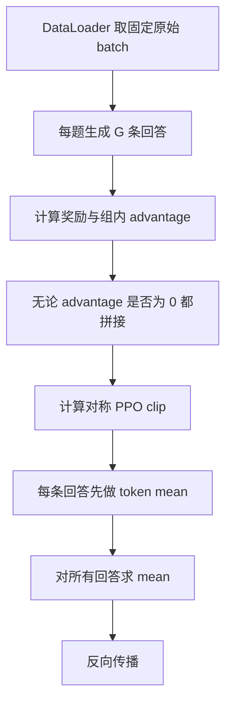
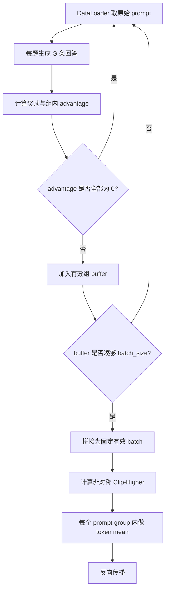

# 从代码看 GRPO 到 DAPO 的修改

> 本文逐项对照：
>
> - [`grpo_from_scratch/train.py`](../grpo_from_scratch/train.py)
> - [`dapo_from_scratch/train.py`](./train.py)
> - 两个目录中的奖励函数、测试脚本和 loss 图片
>
> 目标是回答两个问题：**DAPO 在 GRPO 代码上改了什么？这些修改为什么有用？**

## 1. 先给结论

这两个教学实现的核心差异集中在四处：

1. **对称裁剪改为 Clip-Higher 非对称裁剪**
2. **增加零优势回答组过滤**
3. **增加动态 buffer，补足被过滤掉的 prompt group**
4. **sample-level loss 改为 group token-level loss**

此外还有两个容易误解的地方：

- 论文中的 DAPO 移除了 KL，但本地 GRPO 和 DAPO 代码默认都是
  `beta=0.0`，所以“移除 KL”并不是这两个文件之间的实际代码差异。
- 官方 DAPO 还包含 Overlong Reward Shaping，但本地 DAPO 代码没有实现。

## 2. 总体对比表

| 对比项 | GRPO 教学代码 | DAPO 教学代码 | 是否是实际代码差异 |
|---|---|---|---|
| 组内 advantage | 奖励减组内均值，再除以组内标准差 | 完全相同 | 否 |
| critic/value model | 不使用 | 不使用 | 否 |
| 论文/算法层面的 KL | 使用 $\beta>0$ 的 reference-policy KL | 令 $\beta=0$，移除 KL | 是 |
| 当前本地代码默认值 | `beta=0.0` | `beta=0.0` | 否；本地 GRPO 已提前关闭 KL |
| KL 可选代码分支 | 保留 | 仍然保留 | 否 |
| 裁剪范围 | `[0.8, 1.2]` | `[0.8, 1.28]` | 是 |
| 全零 advantage 组 | 仍进入训练 batch | 直接丢弃 | 是 |
| batch 构造 | 每个 DataLoader batch 直接训练 | 继续采样，buffer 凑够有效组 | 是 |
| loss 聚合 | 每条回答先平均，再平均回答 | 每个 prompt group 内所有 token 一起平均 | 是 |
| Overlong Reward Shaping | 无 | 无 | 当前代码没有实现 |
| 奖励函数 | 四项 shaping reward | 执行逻辑相同 | 否 |
| 测试脚本 | OpenAI 兼容接口推理 | 执行逻辑相同 | 否 |
| 默认模型 | Qwen2.5-1.5B-Instruct | Qwen2.5-3B-Instruct | 是，但不是算法修改 |

## 3. 两者没有改变的主干

DAPO 没有重新发明 GRPO 的 advantage。两份代码都对同一道题生成
$G$ 个回答，并计算：

$$
\hat A_i =
\frac{
R_i-\operatorname{mean}(R_1,\ldots,R_G)
}{
\operatorname{std}(R_1,\ldots,R_G)+10^{-8}
}
$$

对应代码相同：

```python
mean_group_rewards = rewards.mean()
std_group_rewards = rewards.std()
advantages = (
    rewards - mean_group_rewards
) / (
    std_group_rewards + 1e-8
)
```

同一条回答中的所有 token 共享一个序列级 advantage：

```python
advantages.unsqueeze(1)
```

所以 DAPO 仍然是：

- outcome-level reward；
- group-relative advantage；
- 无 value/critic model；
- PPO 风格的重要性比率和 clipped objective。

DAPO 修改的是**如何裁剪、选择训练组、构造 batch 和聚合 token loss**。

## 4. 修改一：对称 Clip 改为 Clip-Higher

### 4.1 GRPO 代码

GRPO 只使用一个参数：

```python
clip_eps = 0.2
```

裁剪代码：

```python
coef_2 = torch.clamp(
    coef_1,
    1 - self.args.clip_eps,
    1 + self.args.clip_eps,
)
```

所以范围是：

$$
[1-0.2,\ 1+0.2]=[0.8,\ 1.2]
$$

### 4.2 DAPO 代码

DAPO 把上下裁剪参数拆开：

```python
clip_eps_low = 0.2
clip_eps_high = 0.28
```

裁剪代码改为：

```python
coef_2 = torch.clamp(
    coef_1,
    1 - self.args.clip_eps_low,
    1 + self.args.clip_eps_high,
)
```

范围变为：

$$
[1-0.2,\ 1+0.28]=[0.8,\ 1.28]
$$

这就是 DAPO 名称中的 **Decoupled Clip**：下界和上界不再共用同一个
$\epsilon$。

### 4.3 `1.2` 和 `1.28` 到底是什么

它们不是 token 概率，而是新旧概率的比率：

$$
r=
\frac{p_{\mathrm{new}}}{p_{\mathrm{old}}}
=
\exp(
\log p_{\mathrm{new}}-\log p_{\mathrm{old}}
)
$$

- $r=1$：概率不变；
- $r=1.2$：新概率是旧概率的 1.2 倍，相对上涨 20%；
- $r=1.28$：新概率是旧概率的 1.28 倍，相对上涨 28%。

### 4.4 数值例子

假设：

```text
旧概率 p_old = 0.01
新概率 p_new = 0.0125
advantage A = 1
```

则：

$$
r=\frac{0.0125}{0.01}=1.25
$$

GRPO 的上界是 1.2：

$$
\min(1.25\times1,\ 1.2\times1)=1.2
$$

DAPO 的上界是 1.28：

$$
\min(1.25\times1,\ 1.25\times1)=1.25
$$

因此：

- GRPO 已经停止从该样本获得额外上涨收益；
- DAPO 仍然鼓励这个正优势 token；
- DAPO 给低概率探索 token 更大的上升空间。

如果比率进一步达到 $r=1.5$：

| 算法 | 正优势目标中使用的上限 |
|---|---:|
| GRPO | 1.2 |
| DAPO | 1.28 |

注意：clipping 裁剪的是优化目标，不是给模型概率设置硬上限。实际概率仍
可能因为其他 token、其他样本和共享参数继续变化。

### 4.5 为什么下界仍然保持 0.8

对于负 advantage，主要由下界控制概率下降速度。DAPO 没有把下界也
放宽到 $1-0.28=0.72$，而是保持：

$$
1-\epsilon_{\mathrm{low}}=0.8
$$

因此 DAPO 主要放宽“好 token 的上涨空间”，没有同时放宽“坏 token
的下降空间”。

### 4.6 当前默认配置下的限制

两份代码默认都是：

```python
num_iterations = 1
```

并且：

```python
old_action_log_probs = (
    inputs["old_action_log_probs"]
    if self.args.num_iterations > 1
    else action_log_probs.detach()
)
```

当 `num_iterations=1` 时，前向数值上：

$$
r=\exp(
\log p_{\mathrm{new}}-\log p_{\mathrm{new}}
)=1
$$

所以两个裁剪区间都不会触发。也就是说：

> 代码中虽然已经把 `[0.8,1.2]` 改成 `[0.8,1.28]`，但在默认配置下，
> Clip-Higher 基本不会真正影响训练。

若要单独验证 Clip-Higher，应让同一批 rollout 被更新多轮，并保持
old-policy log-prob 固定，例如设置 `num_iterations > 1`。

## 5. 修改二：过滤零优势回答组

### 5.1 GRPO 如何处理

GRPO 计算完 advantage 后，无条件加入 batch：

```python
advantages = (
    rewards - mean_group_rewards
) / (
    std_group_rewards + 1e-8
)
batch_advantages.append(advantages)
```

即使所有 advantage 都是 0，该 prompt group 仍然占据训练 batch 的位置。

### 5.2 DAPO 如何处理

DAPO 增加：

```python
nonzero_num = advantages.count_nonzero().item()
if nonzero_num == 0:
    continue
```

只有包含非零 advantage 的回答组，才继续计算 old/reference log-prob 并
加入经验列表。

### 5.3 数值例子：全对或全错

假设一道题生成 4 个回答，正确性奖励全为：

$$
[1,\ 1,\ 1,\ 1]
$$

那么：

$$
\operatorname{mean}=1,\qquad
\operatorname{std}=0
$$

最终：

$$
\hat A=[0,\ 0,\ 0,\ 0]
$$

如果四个回答全部错误：

$$
[0,\ 0,\ 0,\ 0]
$$

结果仍然是：

$$
\hat A=[0,\ 0,\ 0,\ 0]
$$

两种情况都没有“组内谁更好”的信息。

| 算法 | 如何处理 |
|---|---|
| GRPO 教学代码 | 仍放进 batch，最终 loss 为 0 |
| DAPO 教学代码 | `continue` 丢弃，继续找下一道有效题 |

### 5.4 有区分度的回答组

如果奖励为：

$$
[3,\ 1,\ 1,\ 1]
$$

PyTorch 默认样本标准差在此例中为 1，均值为 1.5：

$$
\hat A=[1.5,\ -0.5,\ -0.5,\ -0.5]
$$

该组包含明确的正负学习信号，因此 DAPO 会保留。

### 5.5 本地实现与官方 DAPO 的差别

论文主要根据二值准确率过滤：

- 全对组丢弃；
- 全错组丢弃；
- 同时有正确和错误回答的组保留。

但本地代码使用四项总奖励：

```python
correctness_reward
digit_reward
hard_format_reward
mark_reward
```

因此本地 DAPO 实际判断的是：

> 同一道题的回答之间，“正确性 + 数字 + 格式 + 标签”总奖励是否完全相同。

例如四个回答可能全部错误，但有些格式正确、有些格式错误，总奖励仍有
差异。本地代码会保留该组，而按官方 `acc` 过滤会丢弃该组。

## 6. 修改三：增加动态采样 buffer

只加入 `continue` 还不够。如果丢掉部分 prompt，实际训练 batch 会越来越
小。因此 DAPO 还必须修改 `generate_experiences()` 的返回结构和
`train()` 的 batch 构造方式。

### 6.1 GRPO：原始 batch 直接训练

GRPO 在 `generate_experiences()` 内直接拼接：

```python
return {
    "prompt_response_ids": torch.cat(
        batch_prompt_response_ids, dim=0
    ),
    "attention_mask": torch.cat(
        batch_attention_mask, dim=0
    ),
    "action_mask": torch.cat(
        batch_action_mask, dim=0
    ),
    ...
}
```

训练循环直接把每个 DataLoader batch 放入梯度累积缓存：

```python
inputs = self.generate_experiences(batch)
self.input_buffer[
    idx % self.args.gradient_accumulation_steps
] = inputs
```

因此每次更新消耗固定数量的**原始 prompt**，不保证它们都有有效梯度。

### 6.2 DAPO：先返回 prompt-group 列表

DAPO 的 `generate_experiences()` 不立即拼接，而是返回保留下来的组：

```python
return {
    "prompt_response_ids": batch_prompt_response_ids,
    "attention_mask": batch_attention_mask,
    "action_mask": batch_action_mask,
    "old_action_log_probs": batch_old_action_log_probs,
    "ref_action_log_probs": batch_ref_action_log_probs
        if self.ref_model else None,
    "advantages": batch_advantages,
}
```

每个列表元素仍对应一个 prompt group，便于知道过滤后究竟剩下多少组。

### 6.3 DAPO：训练循环增加 buffer

DAPO 在每个 epoch 开始时创建：

```python
buffer = {
    "prompt_response_ids": [],
    "attention_mask": [],
    "action_mask": [],
    "old_action_log_probs": [],
    "ref_action_log_probs": [],
    "advantages": [],
}
```

每轮生成后，把有效组加入 buffer：

```python
buffer["prompt_response_ids"] += \
    inputs["prompt_response_ids"]
buffer["advantages"] += inputs["advantages"]
```

如果不足目标 batch size：

```python
if len(buffer["prompt_response_ids"]) < \
        self.args.batch_size:
    continue
```

凑够以后才取出固定数量的组并拼接：

```python
inputs = {
    k: torch.cat(v, dim=0)
    for k, v in inputs.items()
}
```

### 6.4 动态采样例子

假设目标：

```text
batch_size = 2 个有效 prompt group
G = 4 条回答/题
```

生成过程：

| 原始 prompt | 回答组奖励 | 是否保留 | buffer 中有效组数 |
|---|---|---|---:|
| 题目 1 | `[1,1,1,1]` | 丢弃 | 0 |
| 题目 2 | `[3,1,1,1]` | 保留 | 1 |
| 题目 3 | `[0,0,0,0]` | 丢弃 | 1 |
| 题目 4 | `[2,0,1,0]` | 保留 | 2 |

此时实际生成了 4 道题，但最终训练 batch 中只有题目 2 和题目 4。

这就是“动态”的含义：

- 每次更新所需的有效 prompt 数固定；
- 为得到这些有效 prompt，实际需要生成多少原始 prompt 不固定。

### 6.5 过滤后再计算 log-prob

GRPO 代码先计算 old/reference log-prob，再计算奖励。

DAPO 调整了顺序：

1. 先计算奖励和 advantage；
2. 零优势组直接 `continue`；
3. 只对保留组计算 old/reference log-prob。

这样可以避免为确定要丢弃的组额外执行策略 log-prob 前向计算。

## 7. 修改四：Sample-Level Loss 改为 Token-Level Loss

这是两份代码在数学目标上最明显的区别。

### 7.1 GRPO 的 sample-level reduction

GRPO：

```python
loss = (
    per_token_loss.sum(dim=1)
    / action_mask.sum(dim=1)
)
loss = loss.mean()
```

对应：

$$
L_{\mathrm{GRPO}}
=
\frac{1}{B}
\sum_{b=1}^{B}
\frac{1}{G}
\sum_{i=1}^{G}
\frac{
\sum_{t=1}^{|o_{b,i}|}\ell_{b,i,t}
}{
|o_{b,i}|
}
$$

计算顺序：

1. 每条回答内部对 token loss 求平均；
2. 再对回答求平均；
3. 每条回答最终权重相同。

GRPO 的流程图也画出了“每条回答先除以自己的有效长度”：


### 7.2 DAPO 的 group token-level reduction

DAPO：

```python
per_token_loss = per_token_loss.view(
    -1,
    self.args.num_generations,
    num_actions,
)
action_mask = action_mask.view(
    -1,
    self.args.num_generations,
    num_actions,
)

loss = (
    per_token_loss.sum(-1).sum(-1)
    / action_mask.sum(-1).sum(-1)
)
loss = loss.mean()
```

对应：

$$
L_{\mathrm{DAPO}}
=
\frac{1}{B}
\sum_{b=1}^{B}
\frac{
\sum_{i=1}^{G}
\sum_{t=1}^{|o_{b,i}|}
\ell_{b,i,t}
}{
\sum_{i=1}^{G}|o_{b,i}|
}
$$

计算顺序：

1. 恢复 `[B,G,T]` 的 prompt-group 结构；
2. 对同一个 prompt 的所有回答和所有有效 token 一起求和；
3. 除以该 prompt group 的有效 token 总数；
4. 最后对 prompt group 求平均。

### 7.3 长短回答的权重例子

同一道题只有两条回答：

```text
回答 1：长度 2
回答 2：长度 6
```

#### GRPO

两条回答各占总 loss 的一半：

| 回答 | 回答整体权重 | 每个 token 权重 |
|---|---:|---:|
| 长度 2 | $1/2$ | $1/4$ |
| 长度 6 | $1/2$ | $1/12$ |

长回答中每个 token 的权重只有短回答 token 的三分之一。

#### DAPO

组内总共有 8 个有效 token，每个 token 权重都为：

$$
\frac{1}{8}
$$

| 回答 | 回答整体权重 | 每个 token 权重 |
|---|---:|---:|
| 长度 2 | $2/8=1/4$ | $1/8$ |
| 长度 6 | $6/8=3/4$ | $1/8$ |

因此长回答包含更多 token 时，会对整个更新产生更大的总影响。

### 7.4 具体 loss 数值例子

假设：

```text
短回答的两个 token loss：[1, 1]
长回答的六个 token loss：[0.5, 0.5, 0.5, 0.5, 0.5, 0.5]
```

GRPO：

$$
L_{\mathrm{GRPO}}
=
\frac{
\frac{1+1}{2}
+
\frac{6\times0.5}{6}
}{2}
=
\frac{1+0.5}{2}
=0.75
$$

DAPO：

$$
L_{\mathrm{DAPO}}
=
\frac{
1+1+6\times0.5
}{2+6}
=
\frac{5}{8}
=0.625
$$

结果不同的原因不是 token loss 公式改变了，而是长短回答的权重分配改变了。

### 7.5 为什么长 CoT 需要这种修改

sample-level 平均会让长回答中的单个 token 权重变小，可能导致：

- 高质量长推理中的有效模式学习不足；
- 低质量长回答中的重复、乱码和无效循环也惩罚不足。

DAPO 让所有有效 token 在同一 prompt group 内具有相同的基础权重，从而
保留回答长度对总梯度的影响。

这并不代表“回答越长越好”。长回答得到正向还是负向更新，仍由该回答的
advantage 决定。

## 8. KL：论文有差异，本地默认配置没有差异

### 8.1 理论上的 GRPO

标准 GRPO 目标中包含参考模型 KL：

$$
L =
L_{\mathrm{policy}}
+
\beta D_{\mathrm{KL}}
$$

其中应取：

$$
\beta>0
$$

这样 KL 才真正参与训练，用于限制当前策略偏离 reference model。具体
$\beta$ 是需要调节的超参数，并没有适合所有任务的固定数值；但如果
$\beta=0$，这项就完全消失了。

### 8.2 理论上的 DAPO

DAPO 论文认为长 CoT 需要更自由地偏离初始模型，因此移除 reference-policy
KL。

### 8.3 本地代码实际情况

GRPO：

```python
beta = 0.0
```

DAPO：

```python
beta = 0.0
```

两份代码也都保留：

```python
if self.args.beta != 0.0:
    self.ref_model = deepcopy(model)
```

以及 $k_3$ KL 的计算分支。

因此：

> 从这两个本地文件做 diff，看不到“GRPO 使用 KL、DAPO 删除 KL”的差异；
> 两者默认都已经关闭 KL，DAPO 代码也没有真正删除可选 KL 分支。

所以需要区分两个结论：

1. **算法层面对比**：GRPO 使用 $\beta>0$ 的 KL，DAPO 使用
   $\beta=0$，这是 DAPO 相对 GRPO 的一项修改。
2. **当前仓库代码对比**：两边默认都是 `beta=0.0`，所以当前
   `grpo_from_scratch` 实际上已经提前采用了“移除 KL”的配置。

若要在本地实验中真实比较这一项，可以配置为：

```python
# GRPO baseline：示例值，仅用于说明 beta 应大于 0
beta = 0.01

# DAPO
beta = 0.0
```

GRPO 的具体 $\beta$ 应根据任务和训练稳定性调节，`0.01` 不是 GRPO
统一规定的标准值。设置 `beta>0` 后，本代码还会复制一份冻结的
`ref_model`，因此会增加模型权重占用和 reference forward 的计算开销。

## 9. 官方 DAPO 还有一项：Overlong Reward Shaping

官方 DAPO 的第四项关键技术是 Overlong Reward Shaping：

- 正常长度不惩罚；
- 接近生成上限时线性增加惩罚；
- 避免在硬截断位置突然把可能正确的推理判为完全错误。

论文配置示例：

```text
无惩罚长度：16,384 token
软惩罚缓冲：4,096 token
生成硬上限：20,480 token
```

但本地 DAPO 只有：

```python
max_generate_length = 256
```

这只是硬生成上限，没有长度奖励函数。因此：

> 当前 `dapo_from_scratch` 实现了 Clip-Higher、动态组过滤和 token-level
> loss，但没有实现完整 DAPO 的 Overlong Reward Shaping。

## 10. 奖励函数与测试脚本没有算法差异

逐项比较可知：

- `grpo_from_scratch/reward_func.py`
- `dapo_from_scratch/reward_func.py`

执行逻辑相同，都是：

```text
正确性奖励：最高 2.0
数字奖励：最高 0.5
严格格式奖励：最高 0.5
标签局部奖励：最高 0.5
```

最大总奖励为：

$$
2.0+0.5+0.5+0.5=3.5
$$

两个 `test.py` 的执行逻辑也相同，只用于通过 OpenAI 兼容接口检查输出。

因此 GRPO/DAPO 的主要差别不在 reward function，而在训练 batch 和 policy
loss 的处理。

## 11. 完整代码流程对比

### 11.1 GRPO



### 11.2 DAPO 教学代码



## 12. 图片与实验曲线应该如何看

GRPO loss：


DAPO loss：


不能只根据这两张图判断 DAPO 更好，原因包括：

1. GRPO 默认模型是 Qwen2.5-1.5B-Instruct；
2. DAPO 默认模型是 Qwen2.5-3B-Instruct；
3. step 数分别约为 397 和 232；
4. 纵轴范围与训练时间不同；
5. 两张图的 TensorBoard 标签都叫 `grpo_loss`；
6. 组内 advantage 正负抵消时，loss 接近 0 不代表准确率高。

合理比较至少还需要：

- 相同基础模型和初始权重；
- 相同随机种子、数据顺序和奖励函数；
- 验证集准确率；
- 平均 reward；
- 生成 entropy；
- 平均回答长度和截断率；
- 有效 prompt group 比例；
- 每次更新实际生成的原始 prompt 数；
- 相同 token/FLOPs 或 wall-clock 预算。

## 13. 当前代码中会影响对比结果的两个细节

### 13.1 两边都没有显式开启随机采样

两份代码调用：

```python
self.model.generate(
    ...,
    temperature=0.9,
    top_p=1,
    top_k=50,
)
```

但没有显式设置：

```python
do_sample=True
```

在常见 Transformers 默认配置下可能执行贪心解码，使同题的 $G$ 个回答
完全相同。

这对 GRPO 已经有影响，对 DAPO 更严重：相同回答会产生相同奖励，随后被
Dynamic Sampling 过滤，可能导致长期凑不够有效 batch。

### 13.2 默认单轮更新使 Clip-Higher 不生效

前面已经说明，`num_iterations=1` 时重要性比率前向值为 1。若目标是比较
GRPO 的 1.2 上界与 DAPO 的 1.28 上界，需要设计能使新旧策略产生差异的
更新方式。

## 14. 哪些修改是真正的 DAPO，哪些只是实验差异

### 算法修改

- `clip_eps` 拆成 `clip_eps_low/clip_eps_high`
- 过滤零优势 prompt group
- 动态采样 buffer
- group token-level loss

### 实现配套修改

- `generate_experiences()` 从直接返回拼接张量，改为返回 group 列表
- 过滤后再计算 old/reference log-prob
- `train()` 在有效组凑齐后才执行 `torch.cat`

### 不是算法修改

- 删除未使用的 `random`、`torch.nn` import
- 模型从 Qwen2.5-1.5B-Instruct 改为 Qwen2.5-3B-Instruct
- 增加注释和 docstring

### 官方有、当前代码没有

- Overlong Reward Shaping
- 论文规模的 32B/长 CoT/大规模分布式训练
- 严格按二值 `acc` 执行的动态过滤

## 15. 一句话记忆

GRPO 与 DAPO 的关系可以概括为：

> **GRPO 负责“同一道题内比较谁答得更好”；DAPO 在此基础上，让低概率
> 探索 token 有更大的上涨空间，只用有区分度的回答组训练，并让长回答
> 中的每个 token 得到与短回答 token 相同的基础权重。**

对应到本地代码就是：

```text
GRPO
  = group-relative advantage
  + symmetric clip
  + sample-level loss

DAPO 教学代码
  = group-relative advantage
  + Clip-Higher
  + zero-advantage group filtering
  + dynamic effective-batch sampling
  + group token-level loss
```
