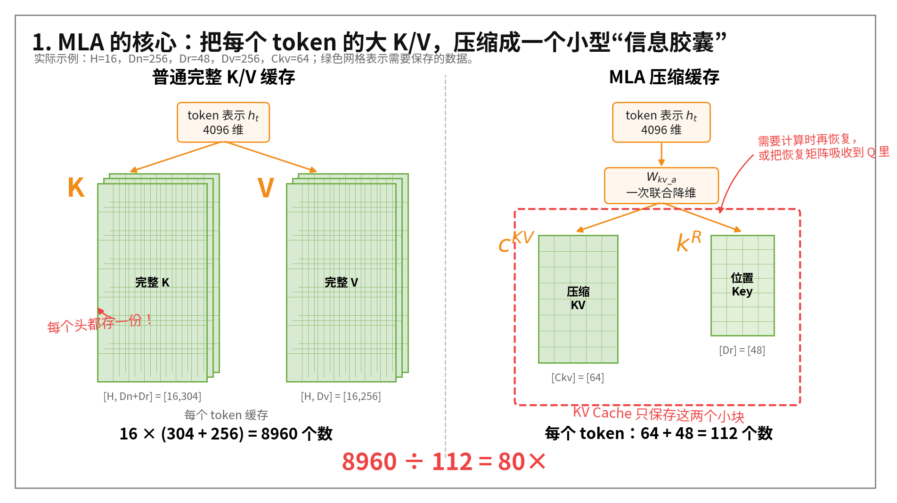
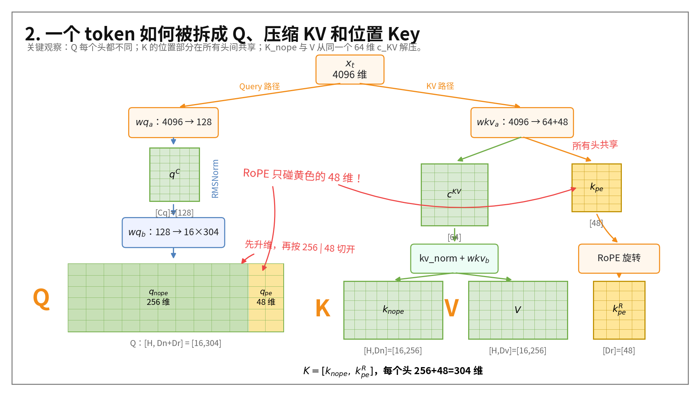
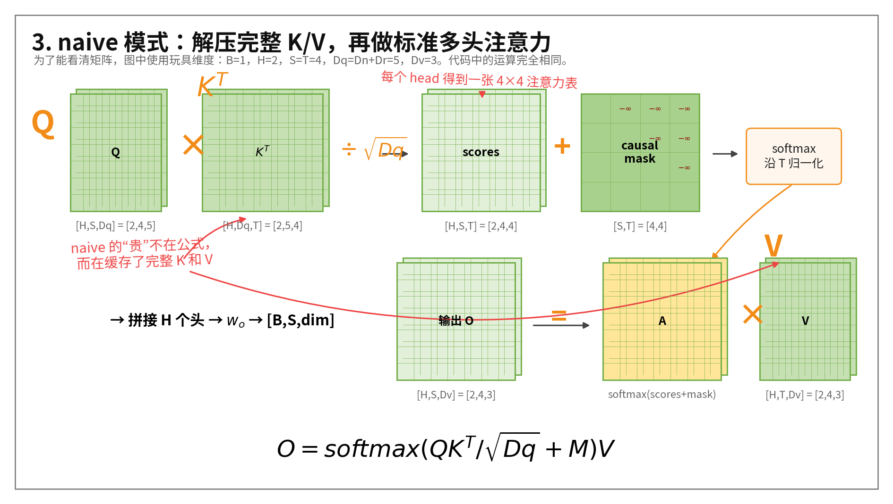
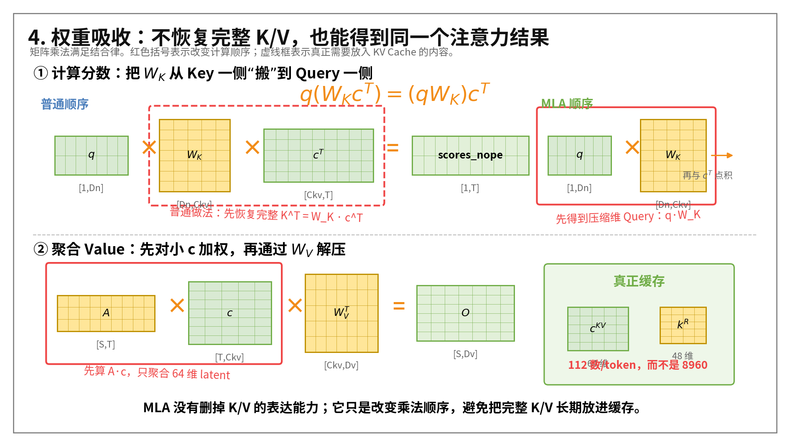
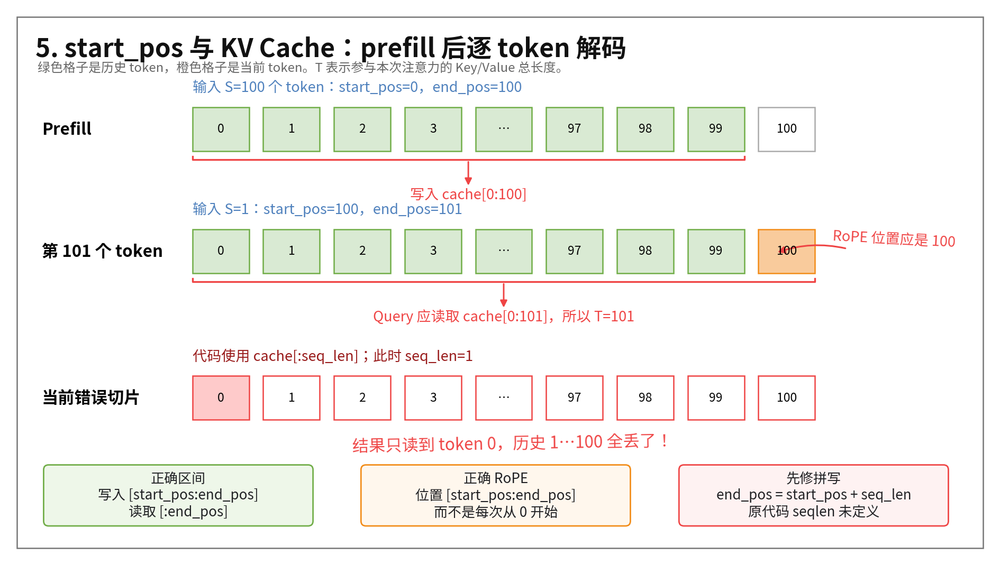

# Multi-head Latent Attention（MLA）原理、例子与代码解析

https://spaces.ac.cn/archives/10091/comment-page-4

> 对应代码：[MLA.py](./MLA.py)  
> 本笔记以代码中的示例参数为主，并穿插一个可以手算的微型例子。

## 1. 先用一句话理解 MLA

普通多头注意力会为每个历史 token 保存所有注意力头的完整 Key 和 Value。MLA 的做法是：

> 把完整 K/V 压缩成一个所有注意力头共享的低维向量，推理时直接在低维空间计算，尽量不把完整 K/V 放进 KV Cache。

它主要解决的是大模型推理时的 **KV Cache 显存开销**，不是把标准注意力公式换成完全不同的东西。



在当前代码的示例参数中，每个 token 的缓存量是：

| 缓存方式 | 每个 token、每层保存的数值个数 |
|---|---:|
| naive 完整 K/V | `16 × ((256 + 48) + 256) = 8960` |
| MLA 压缩缓存 | `64 + 48 = 112` |

因此压缩比例为：

$$
\frac{8960}{112}=80
$$

如果缓存使用 FP16/BF16，每个数占 2 字节，序列长度为 4096，那么单层、单样本大约需要：

| 缓存方式 | 每 token | 4096 个 token、单层 |
|---|---:|---:|
| naive | `8960 × 2 = 17920 B` | `70 MiB` |
| MLA 压缩缓存 | `112 × 2 = 224 B` | `0.875 MiB` |

这里的 80 倍是当前教学参数下的结果，不代表所有 MLA 模型都固定压缩 80 倍。

---

## 2. 代码中的符号和维度

为了避免被变量名绕晕，先统一符号：

| 符号 | 代码变量 | 示例值 | 含义 |
|---|---|---:|---|
| $B$ | `bs` | 4 | batch size |
| $S$ | `seq_len` | 100 | 本次 `forward` 输入的 Query 长度 |
| $T$ | `end_pos` | 100 或更长 | 当前 KV Cache 中可参与注意力的总长度 |
| $D$ | `dim` | 4096 | 模型隐藏维度 |
| $H$ | `n_heads` | 16 | 注意力头数 |
| $C_q$ | `q_lora_rank` | 128 | Query 的低秩维度 |
| $C_{kv}$ | `kv_lora_rank` | 64 | K/V 共享的低秩维度 |
| $D_n$ | `qk_nope_head_dim` | 256 | 每个头中不使用 RoPE 的 Q/K 维度 |
| $D_r$ | `qk_rope_head_dim` | 48 | 每个头中使用 RoPE 的 Q/K 维度 |
| $D_v$ | `v_head_dim` | 256 | 每个头的 Value 维度 |
| $D_q$ | `qk_head_dim` | 304 | 每个头的完整 Q/K 维度，$D_n+D_r$ |

代码中 `einsum` 下标的含义：

| 字母 | 含义 |
|---|---|
| `b` | batch |
| `s` | 当前 Query 位置 |
| `t` | KV Cache 中的历史位置 |
| `h` | attention head |
| `d` | 普通 head dimension |
| `c` | 压缩后的 latent dimension |
| `r` | RoPE dimension |

---

## 3. 为什么 K/V 可以先压缩

对第 $t$ 个 token，MLA 先生成一个共享的低维表示：

$$
c_t^{KV}\in\mathbb{R}^{C_{kv}}
$$

然后**每个注意力头使用不同的升维矩阵，从同一个 $c_t^{KV}$ 恢复自己的内容 Key 和 Value**：

$$
k_{t,h}^{nope}=c_t^{KV}W_{K,h}^{T}
$$

$$
v_{t,h}=c_t^{KV}W_{V,h}^{T}
$$

虽然所有头共享同一个 64 维的 $c_t^{KV}$，但**每个头的 $W_{K,h}$、$W_{V,h}$ 不同，所以最终得到的 K/V 仍然可以不同**。

可以把它想象成：

```text
同一个 64 维“信息胶囊” c_KV
        │
        ├── 头 0 的 W_K / W_V ──> K_0、V_0
        ├── 头 1 的 W_K / W_V ──> K_1、V_1
        ├── ...
        └── 头 15 的 W_K / W_V ─> K_15、V_15
```

这就是 `wkv_a` 和 `wkv_b` 的分工：

```python
# 下投影：4096 -> 64 + 48
self.wkv_a = nn.Linear(
    self.dim,
    self.kv_lora_rank + self.qk_rope_head_dim,
)

# 上投影：64 -> 16 * (256 + 256)
self.wkv_b = nn.Linear(
    self.kv_lora_rank,
    self.n_heads * (self.qk_nope_head_dim + self.v_head_dim),
)
```

其中 `wkv_a` 一次产生两类输出：

```text
[c_KV, k_pe] = wkv_a(x)

c_KV：[B,S,64]，K/V 的共享压缩表示
k_pe：[B,S,48]，单独保存的 Key 位置部分
```

`wkv_b` 则把 `c_KV` 解压为 16 个头各自的 `k_nope` 和 `V`：

```text
[B,S,64]
  -> wkv_b
[B,S,16*(256+256)]
  -> view
[B,S,16,512]
  -> split
k_nope：[B,S,16,256]
V     ：[B,S,16,256]
```



---

## 4. 为什么 Q/K 要拆成 `nope` 和 `rope` 两部分

完整 Query 和 Key 被拆成：

$$
q_h=[q_h^{nope},q_h^{rope}]
$$

$$
k_h=[k_h^{nope},k^{rope}]
$$

于是点积可以拆成两项：

$$
q_hk_h^T
=q_h^{nope}(k_h^{nope})^T
+q_h^{rope}(k^{rope})^T
$$

这两部分分别负责：

- `nope`：主要表达 token 内容，可以进行权重吸收。
- `rope`：携带 token 位置信息，需要经过位置相关的旋转。

### 为什么不把整个 K 都放进 64 维 `c_KV`

RoPE 对不同位置使用不同旋转矩阵 $R_t$。位置 $t$ 的 Key 类似于：

$$
k_t^{rope}=R_t\hat{k}_t
$$

由于 $R_t$ 随位置变化，**通常不能把它像固定的 $W_K$ 一样简单吸收到 Query 投影中。因此 MLA 把很小的 $k^{rope}$ 单独保留下来**。

当前代码中：

```text
k_pe：[B,S,48]
```

它没有 `H` 这一维，说明所有注意力头共享这一个位置 Key。使用时通过：

```python
k_pe.expand(-1, -1, self.n_heads, -1)
```

广播到所有头。这样既保留位置信息，又不会缓存 `H × Dr` 个数。

---

## 5. `forward` 公共部分：先构造 Q 和压缩 KV

### 5.1 输入与缓存位置

```python
bs, seq_len, _ = x.shape
end_pos = start_pos + seq_len
```

示例：

```text
x = [4,100,4096]
start_pos = 0
seq_len = 100
end_pos = 100
```

本次生成的 K/V 应写入：

```text
cache[:, 0:100]
```

### 5.2 Query 路径

```python
q = self.wq_a(x)
q = self.q_norm(q)
q = self.wq_b(q)
q = q.view(bs, seq_len, self.n_heads, self.qk_head_dim)
q_nope, q_pe = torch.split(
    q,
    [self.qk_nope_head_dim, self.qk_rope_head_dim],
    dim=-1,
)
```

形状变化：

```text
x
[4,100,4096]
    │ wq_a
    ▼
[4,100,128]
    │ RMSNorm + wq_b
    ▼
[4,100,4864]
    │ view，其中 4864 = 16 × 304
    ▼
[4,100,16,304]
    │ split 256 | 48
    ├── q_nope：[4,100,16,256]
    └── q_pe  ：[4,100,16,48]
```

这里先降到 128 维，再升到 4864 维，是 Query 的低秩投影。忽略 bias 时，参数量从直接投影的：

```text
4096 × 4864 = 19,922,944
```

下降到：

```text
4096 × 128 + 128 × 4864
= 524,288 + 622,592
= 1,146,880
```

### 5.3 KV 路径

```python
kv = self.wkv_a(x)
kv, k_pe = torch.split(
    kv,
    [self.kv_lora_rank, self.qk_rope_head_dim],
    dim=-1,
)
```

形状变化：

```text
x：[4,100,4096]
  │ wkv_a
  ▼
[4,100,112]
  │ split 64 | 48
  ├── kv/c_KV：[4,100,64]
  └── k_pe   ：[4,100,48]
```

### 5.4 对位置部分应用 RoPE

```python
k_pe = k_pe.unsqueeze(2)  # [B,S,48] -> [B,S,1,48]
q_pe, k_pe = self.rotary_emb(q_pe, k_pe)
```

此时：

```text
q_pe：[4,100,16,48]
k_pe：[4,100,1,48]
```

`cos/sin` 的形状为 `[1,S,1,48]`，可以自动广播到 16 个 Query 头和 1 个共享 Key 头。

---

## 6. naive 模式：先恢复完整 K/V

naive 分支用于直接展示 MLA 和标准注意力之间的关系。

### 6.1 构造完整 Q

```python
q = torch.cat([q_nope, q_pe], dim=-1)
```

```text
[4,100,16,256] + [4,100,16,48]
-> Q：[4,100,16,304]
```

### 6.2 解压 K/V

```python
kv = self.kv_norm(kv)
kv = self.wkv_b(kv)
kv = kv.view(
    bs,
    seq_len,
    self.n_heads,
    self.qk_nope_head_dim + self.v_head_dim,
)
k_nope, v = torch.split(
    kv,
    [self.qk_nope_head_dim, self.v_head_dim],
    dim=-1,
)
```

```text
c_KV：[4,100,64]
-> wkv_b
[4,100,8192]
-> view
[4,100,16,512]
-> split
k_nope：[4,100,16,256]
V     ：[4,100,16,256]
```

### 6.3 拼出完整 K 并缓存

```python
k = torch.cat(
    [k_nope, k_pe.expand(-1, -1, self.n_heads, -1)],
    dim=-1,
)

self.k_cache[:bs, start_pos:end_pos] = k
self.v_cache[:bs, start_pos:end_pos] = v
```

完整 Key 的形状为：

```text
K = [k_nope, k_pe]
  = [4,100,16,256+48]
  = [4,100,16,304]
```

### 6.4 标准注意力

概念上是下面四步：

```python
scores = Q @ K_cache.transpose(-1, -2) / math.sqrt(304)
scores = scores + mask
weights = scores.softmax(dim=-1)
context = weights @ V_cache
```

但当前代码中的 Q/K/V 布局是 `[B,S,H,D]`，所以实际计算前需要把注意力头 `H` 移到前面。按照正确的缓存读取范围 `:end_pos`，等价代码为：

```python
# q：[B,S,H,Dq] -> [B,H,S,Dq]
q_for_matmul = q.transpose(1, 2)

# k_cache：[B,T,H,Dq] -> [B,H,T,Dq] -> [B,H,Dq,T]
k_for_matmul = (
    self.k_cache[:bs, :end_pos]
    .transpose(1, 2)
    .transpose(2, 3)
)

# [B,H,S,Dq] @ [B,H,Dq,T] -> [B,H,S,T]
scores = torch.matmul(q_for_matmul, k_for_matmul) / math.sqrt(self.qk_head_dim)

# 统一恢复为代码后续使用的 [B,S,H,T]
scores = scores.transpose(1, 2)

# mask：[B,S,T] -> [B,S,1,T]，广播到 H 个头
if mask is not None:
    scores = scores + mask.unsqueeze(2)

weights = scores.softmax(dim=-1)  # [B,S,H,T]

# [B,S,H,T] × [B,T,H,Dv] -> [B,S,H,Dv]
context = torch.einsum(
    "bsht,bthd->bshd",
    weights,
    self.v_cache[:bs, :end_pos],
)
```

#### 第一步：计算 $QK^T$

通用形状变化：

```text
Q 原布局       ：[B,S,H,Dq]
Q 转为 head-first：[B,H,S,Dq]

K_cache 原布局 ：[B,T,H,Dq]
K_cache 转置后 ：[B,H,Dq,T]

[B,H,S,Dq] × [B,H,Dq,T]
-> [B,H,S,T]
-> transpose(1,2)
-> scores：[B,S,H,T]
```

对每个 batch、每个注意力头来说，真正执行的是：

```text
[S,Dq] × [Dq,T] -> [S,T]
```

代入 prefill 示例 `B=4, S=100, H=16, T=100, Dq=304`：

```text
q                     ：[4,100,16,304]
q.transpose(1,2)      ：[4,16,100,304]

k_cache               ：[4,100,16,304]
k_cache 两次 transpose：[4,16,304,100]

[4,16,100,304] × [4,16,304,100]
-> [4,16,100,100]
-> transpose(1,2)
-> scores：[4,100,16,100]
```

其中公共维度 `Dq=304` 被点积消掉，Query 长度 `S=100` 和历史长度 `T=100` 被保留，所以每个头都会得到一张 `[100,100]` 的注意力分数表。

除以 `sqrt(304)` 只缩放数值，不改变形状：

```text
[4,100,16,100] / sqrt(304)
-> [4,100,16,100]
```

#### 第二步：加入 mask

mask 不带注意力头维度：

```text
mask              ：[B,S,T]
mask.unsqueeze(2) ：[B,S,1,T]
```

代入示例：

```text
scores：[4,100,16,100]
mask  ：[4,100,100]
       -> unsqueeze(2)
       -> [4,100,1,100]

[4,100,16,100] + [4,100,1,100]
-> 广播 head 维
-> [4,100,16,100]
```

大小为 1 的 head 维会被广播到 16 个注意力头，因此所有头使用同一张因果 mask。

#### 第三步：Softmax

```python
weights = scores.softmax(dim=-1)
```

`dim=-1` 表示沿历史 token 维 `T` 做归一化，形状不变：

```text
scores ：[4,100,16,100]
weights：[4,100,16,100]
```

对于每个 `[b,s,h]`，都有：

$$
\sum_{t=0}^{T-1}weights[b,s,h,t]=1
$$

#### 第四步：注意力权重乘 V

通用形状：

```text
weights：[B,S,H,T]
V_cache：[B,T,H,Dv]

[B,S,H,T] × [B,T,H,Dv]
-> context：[B,S,H,Dv]
```

`einsum("bsht,bthd->bshd")` 中，公共的历史位置维 `t` 被加权求和掉，Value 维 `d` 被保留下来。

代入 `B=4, S=100, H=16, T=100, Dv=256`：

```text
weights：[4,100,16,100]
V_cache：[4,100,16,256]

[4,100,16,100] × [4,100,16,256]
-> context：[4,100,16,256]
```

也就是对每个 batch、每个头执行：

```text
[S,T] × [T,Dv]
-> [S,Dv]

[100,100] × [100,256]
-> [100,256]
```

#### 增量解码第 101 个 token

此时 `S=1, T=end_pos=101`：

```text
Q       ：[4,1,16,304]
K_cache ：[4,101,16,304]
scores  ：[4,1,16,101]
mask    ：[4,1,101] -> [4,1,1,101]
weights ：[4,1,16,101]
V_cache ：[4,101,16,256]
context ：[4,1,16,256]
```

对应公式：

$$
O=softmax\left(\frac{QK^T}{\sqrt{D_q}}+M\right)V
$$



图中使用了小维度方便画出矩阵，但和代码中的 `[B,S,H,D]` 运算完全对应。

---

## 7. 压缩模式的核心：权重吸收

压缩模式不把 `c_KV` 解压为所有历史 token 的完整 `k_nope` 和 `V`。它通过结合律改变矩阵乘法顺序。

### 7.1 将 `wkv_b.weight` 按头拆分

```python
wkv_b = self.wkv_b.weight
wkv_b = wkv_b.view(
    self.n_heads,
    self.qk_nope_head_dim + self.v_head_dim,
    self.kv_lora_rank,
)
```

形状变化：

```text
wkv_b.weight：[16*(256+256),64]
             = [8192,64]

view 后：[16,512,64]

前 256 行：W_K [16,256,64]
后 256 行：W_V [16,256,64]
```

### 7.2 将 K 的升维矩阵吸收到 Query

代码：

```python
q_nope = torch.einsum(
    "bshd,hdc->bshc",
    q_nope,
    wkv_b[:, :self.qk_nope_head_dim],
)
```

形状：

```text
[B,S,H,Dn] × [H,Dn,Ckv]
-> [B,S,H,Ckv]

[4,100,16,256] × [16,256,64]
-> [4,100,16,64]
```

为什么可以这样做？采用代码中的“行向量”约定：

$$
K_{nope}=cW_K^T
$$

所以：

$$
Q_{nope}K_{nope}^T
=Q_{nope}(cW_K^T)^T
=(Q_{nope}W_K)c^T
$$

原来需要 Query 和完整 Key 点积，现在可以让“吸收了 $W_K$ 的 Query”直接与压缩缓存 $c$ 点积。

### 7.3 内容分数和位置分数分别计算

缓存：

```python
self.kv_cache[:bs, start_pos:end_pos] = kv
self.pe_cache[:bs, start_pos:end_pos] = k_pe
```

内容分数：

```python
scores_nope = torch.einsum(
    "bshc,btc->bsht",
    q_nope,
    self.kv_cache[:bs, :end_pos],
)
```

```text
[B,S,H,Ckv] × [B,T,Ckv]
-> [B,S,H,T]
```

代入本笔记的 prefill 示例参数 `B=4, S=100, H=16, T=100, Ckv=64`：

```text
q_nope（已吸收 W_K）：[4,100,16,64]
kv_cache             ：[4,100,64]

[4,100,16,64] × [4,100,64]
-> scores_nope：[4,100,16,100]
```

这里两个输入共同拥有的 `c=64` 被点积消掉；第二个输入中的 `t=100` 被保留下来，成为输出最后一维。

位置分数：

```python
scores_pe = torch.einsum(
    "bshr,btr->bsht",
    q_pe,
    self.pe_cache[:bs, :end_pos],
)
```

```text
[B,S,H,Dr] × [B,T,Dr]
-> [B,S,H,T]
```

代入 `B=4, S=100, H=16, T=100, Dr=48`：

```text
q_pe    ：[4,100,16,48]
pe_cache：[4,100,48]

[4,100,16,48] × [4,100,48]
-> scores_pe：[4,100,16,100]
```

这里被点积消掉的是 `r=48`，输出同样保留 Query 位置 `s`、注意力头 `h` 和历史位置 `t`。

合并：

```python
scores = (scores_nope + scores_pe) / math.sqrt(Dn + Dr)
```

两部分形状完全相同，因此可以逐元素相加：

```text
scores_nope：[4,100,16,100]
scores_pe  ：[4,100,16,100]

相加并除以 sqrt(256+48)
-> scores：[4,100,16,100]
```

如果正在生成第 101 个 token，则 `S=1, T=end_pos=101`，对应形状会变为：

```text
q_nope       ：[4,1,16,64]
kv_cache     ：[4,101,64]
scores_nope  ：[4,1,16,101]

q_pe         ：[4,1,16,48]
pe_cache     ：[4,101,48]
scores_pe    ：[4,1,16,101]

最终 scores ：[4,1,16,101]
```

因为：

$$
qk^T=q_{nope}k_{nope}^T+q_{rope}k_{rope}^T
$$

### 7.4 Value 也延迟解压

标准方式先得到每个历史 token 的完整 Value：

$$
V=cW_V^T
$$

然后计算：

$$
AV=A(cW_V^T)
$$

结合律允许改成：

$$
A(cW_V^T)=(Ac)W_V^T
$$

代码因此先在 64 维 latent 空间聚合：

```python
x = torch.einsum(
    "bsht,btc->bshc",
    scores,
    self.kv_cache[:bs, :end_pos],
)
```

```text
[B,S,H,T] × [B,T,Ckv]
-> [B,S,H,Ckv]
```

代入 prefill 示例参数。此处的 `scores` 已经经过 mask 和 softmax，可以把它理解为注意力权重 $A$：

```text
scores / A：[4,100,16,100]
kv_cache  ：[4,100,64]

[4,100,16,100] × [4,100,64]
-> latent context：[4,100,16,64]
```

这一步把共同的历史位置维 `t=100` 加权求和掉，保留 `c=64`。所以它还不是最终 Value，而是每个 Query、每个头对应的 64 维压缩上下文。

只对聚合后的结果做一次 Value 解压：

```python
x = torch.einsum(
    "bshc,hdc->bshd",
    x,
    wkv_b[:, -self.v_head_dim:],
)
```

```text
[B,S,H,Ckv] × [H,Dv,Ckv]
-> [B,S,H,Dv]
```

代入 `B=4, S=100, H=16, Ckv=64, Dv=256`：

```text
latent context：[4,100,16,64]
W_V           ：[16,256,64]

[4,100,16,64] × [16,256,64]
-> context：[4,100,16,256]
```

这里共同的 `c=64` 被点积消掉，`W_V` 的 `d=256` 成为输出最后一维。也就是说，只有已经聚合好的一个 64 维向量需要解压，不需要先为 100 个历史 token 分别生成完整 Value。

增量解码第 101 个 token 时，对应形状是：

```text
scores          ：[4,1,16,101]
kv_cache        ：[4,101,64]
latent context  ：[4,1,16,64]
W_V             ：[16,256,64]
最终 context    ：[4,1,16,256]
```



---

## 8. 一个可以手算的权重吸收例子

为了验证两种计算顺序真的相同，考虑一个注意力头：

```text
Dn=2
Ckv=1
T=2
```

令 Query、K 解压矩阵和两个 token 的压缩缓存为：

$$
q=[1,2]
$$

$$
W_K=\begin{bmatrix}2\\3\end{bmatrix}
$$

$$
c_0=[4],\qquad c_1=[5]
$$

### 8.1 普通顺序：先恢复完整 K

第 0 个 token：

$$
k_0=c_0W_K^T
=[4]\begin{bmatrix}2&3\end{bmatrix}
=[8,12]
$$

第 1 个 token：

$$
k_1=c_1W_K^T
=[5]\begin{bmatrix}2&3\end{bmatrix}
=[10,15]
$$

计算分数：

$$
qk_0^T=1\times8+2\times12=32
$$

$$
qk_1^T=1\times10+2\times15=40
$$

所以：

$$
scores=[32,40]
$$

### 8.2 MLA 顺序：先把 $W_K$ 吸收到 Query

$$
qW_K
=[1,2]\begin{bmatrix}2\\3\end{bmatrix}
=1\times2+2\times3
=8
$$

然后直接与压缩缓存点积：

$$
scores=[8\times4,8\times5]=[32,40]
$$

结果完全相同，但 MLA 只需要缓存 `[4]`、`[5]`，不需要缓存完整的 `[8,12]`、`[10,15]`。

### 8.3 Value 的手算例子

令：

$$
W_V=\begin{bmatrix}1\\2\end{bmatrix},\qquad A=[0.25,0.75]
$$

先恢复 Value：

$$
v_0=[4,8],\qquad v_1=[5,10]
$$

标准方式：

$$
Av=0.25[4,8]+0.75[5,10]=[4.75,9.5]
$$

MLA 先聚合 latent：

$$
Ac=0.25\times4+0.75\times5=4.75
$$

再解压：

$$
(Ac)W_V^T=4.75[1,2]=[4.75,9.5]
$$

结果仍然相同。

---

## 9. Mask、Softmax 和输出投影

两种分支最终都会得到：

```text
scores：[B,S,H,T]
```

如果传入加性 mask：

```python
scores += mask.unsqueeze(2)
```

假设 `mask` 为 `[B,S,T]`，增加 head 维后为：

```text
[B,S,1,T]
```

它会广播到所有注意力头。因果 mask 的小例子：

$$
M=
\begin{bmatrix}
0&-\infty&-\infty\\
0&0&-\infty\\
0&0&0
\end{bmatrix}
$$

然后沿最后一个维度 $T$ 归一化：

```python
scores = scores.softmax(dim=-1)
```

两种模式都得到：

```text
context：[B,S,H,Dv]
```

最后拼接所有注意力头：

```python
x = x.contiguous().view(bs, seq_len, self.n_heads * self.v_head_dim)
x = self.wo(x)
```

示例：

```text
[4,100,16,256]
-> view
[4,100,4096]
-> wo
[4,100,4096]
```

---

## 10. Prefill 与逐 token 解码

### 10.1 Prefill

一次输入 100 个 token：

```text
start_pos=0
seq_len=100
end_pos=100
```

本次结果写入：

```text
cache[:, 0:100]
```

### 10.2 生成第 101 个 token

下一次只输入一个 token：

```text
start_pos=100
seq_len=1
end_pos=101
```

新 K/V 写入：

```text
cache[:, 100:101]
```

Query 必须读取所有历史位置：

```text
cache[:, :101]
```

而不是只读取 `cache[:, :1]`。



---

## 11. 当前教学代码中的问题

这些是当前 [MLA.py](./MLA.py) 的实现问题，不是 MLA 算法本身的问题。

### 11.1 `seqlen` 未定义

当前代码：

```python
end_pos = start_pos + seqlen
```

应当是：

```python
end_pos = start_pos + seq_len
```

### 11.2 增量解码读取缓存的范围错误

当前多处使用：

```python
self.k_cache[:bs, :seq_len]
self.v_cache[:bs, :seq_len]
self.kv_cache[:bs, :seq_len]
self.pe_cache[:bs, :seq_len]
```

增量解码时应读取到：

```python
:end_pos
```

否则当 `start_pos=100, seq_len=1` 时，只会读取缓存位置 0。

### 11.3 RoPE 没有使用 `start_pos`

当前 `RotaryEmbedding.forward` 总是取：

```python
cos = self.cos_cached[:q.shape[1]]
sin = self.sin_cached[:q.shape[1]]
```

生成第 101 个 token 时，它又会使用位置 0 的 RoPE。正确语义应该是：

```python
cos = self.cos_cached[start_pos:end_pos]
sin = self.sin_cached[start_pos:end_pos]
```

### 11.4 `RotaryEmbedding` 的最大长度没有与 MLA 对齐

当前：

```python
self.rotary_emb = RotaryEmbedding(self.qk_rope_head_dim)
```

这会使用默认 `max_seq_len=1024`。更合理的是：

```python
self.rotary_emb = RotaryEmbedding(
    self.qk_rope_head_dim,
    max_seq_len=self.max_seq_len,
)
```

### 11.5 权重吸收路径忽略 `wkv_b.bias`

`nn.Linear` 默认 `bias=True`，但是压缩分支只使用：

```python
wkv_b = self.wkv_b.weight
```

没有处理 bias，所以 naive 和压缩分支当前不严格等价。教学实现可以考虑：

```python
self.wkv_b = nn.Linear(..., bias=False)
```

或者在压缩分支显式加入对应 bias。

### 11.6 RMSNorm 没有恢复输入 dtype

当前实现将输入转成 float32 后，返回值仍为 float32。混合精度实现通常会记录输入 dtype，归一化后再转回去。

### 11.7 main 调用缺少 `start_pos`

当前：

```python
print(mla(x))
```

至少需要：

```python
print(mla(x, start_pos=0))
```

但还需要同时修复前面列出的 `seqlen` 等问题才能运行。

---

## 12. 用伪代码总结整个前向过程

```python
def forward(x, start_pos, mask=None):
    B, S, _ = x.shape
    T = start_pos + S

    # 1. Query：低秩投影后拆成内容部分和位置部分
    q = wq_b(q_norm(wq_a(x)))
    q = q.view(B, S, H, Dn + Dr)
    q_nope, q_pe = split(q, [Dn, Dr])

    # 2. KV：生成共享 latent 和共享位置 Key
    c_kv, k_pe = split(wkv_a(x), [Ckv, Dr])
    c_kv = kv_norm(c_kv)

    # 3. 只对位置部分应用 RoPE
    q_pe, k_pe = rope(q_pe, k_pe, positions=start_pos:T)

    if mode == "naive":
        # 4a. 恢复并缓存完整 K/V
        k_nope, v = split(wkv_b(c_kv), [Dn, Dv])
        q = concat(q_nope, q_pe)
        k = concat(k_nope, expand_heads(k_pe))
        k_cache[:, start_pos:T] = k
        v_cache[:, start_pos:T] = v

        scores = q @ k_cache[:, :T].transpose(-1, -2)

    else:
        # 4b. 权重吸收，只缓存 latent KV 和位置 Key
        q_nope = q_nope @ W_K
        kv_cache[:, start_pos:T] = c_kv
        pe_cache[:, start_pos:T] = k_pe

        scores_nope = q_nope @ kv_cache[:, :T].transpose(-1, -2)
        scores_pe = q_pe @ pe_cache[:, :T].transpose(-1, -2)
        scores = scores_nope + scores_pe

    # 5. 缩放、mask、softmax
    scores = scores / sqrt(Dn + Dr)
    scores = softmax(scores + mask)

    if mode == "naive":
        context = scores @ v_cache[:, :T]
    else:
        # 6. 先在 latent 空间聚合，再通过 W_V 解压
        latent_context = scores @ kv_cache[:, :T]
        context = latent_context @ W_V.T

    # 7. 合并多头并输出投影
    return wo(concat_heads(context))
```

---

## 13. 最后记住四句话

1. `c_KV` 是所有注意力头共享的 K/V 压缩表示。
2. `k_pe` 单独保存位置 Key，并且在所有头之间共享。
3. `QK^T` 通过吸收 $W_K$，可以直接在压缩空间计算。
4. `AV` 通过改变乘法顺序，可以先聚合 latent，再用 $W_V$ 解压。

因此 MLA 的本质不是“不要 K/V”，而是：

> 不长期缓存完整 K/V；缓存足以恢复它们的低维信息，并利用结合律避免不必要的恢复。

---

## 附：图片源文件

本笔记中的 PNG 均由以下脚本确定性生成，便于修改维度、颜色或文字后重新绘制：

- [generate_mla_note_images.py](./mla_note_assets/generate_mla_note_images.py)

运行：

```bash
python deepseek_learn/mla_note_assets/generate_mla_note_images.py
```
