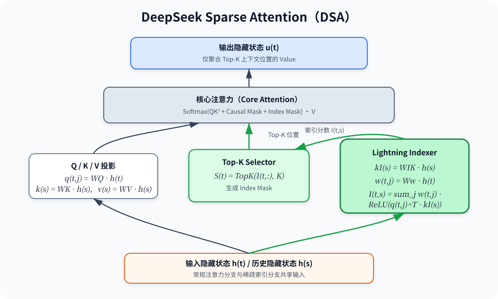
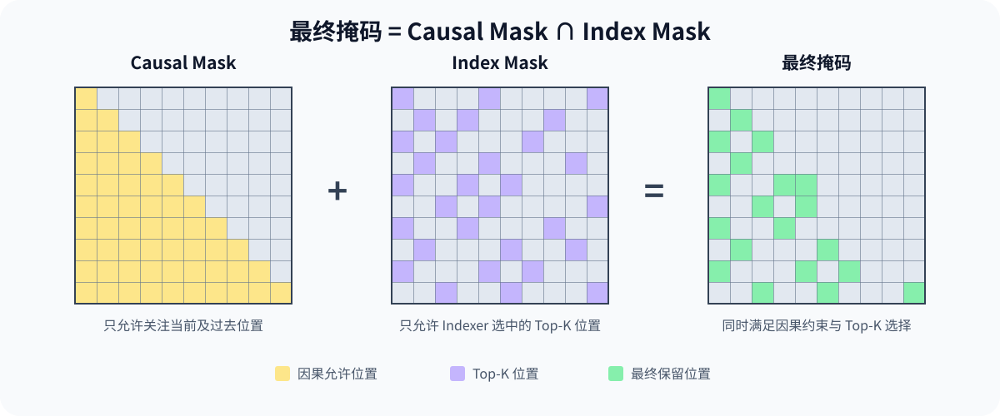

# DSA（DeepSeek Sparse Attention）

DSA（DeepSeek Sparse Attention）通过一个轻量级索引器预测每个 Query 最相关的 Key，随后仅在 Top-K 位置上执行核心注意力。它由两个组件组成：

1. **Lightning Indexer**：计算 Query 与历史 Token 的索引分数。
2. **Top-K Selector**：选择得分最高的 Token，并构造稀疏注意力掩码。



> 上图根据原始资料重新整理，并按照本目录中的实现简化了 MLA 相关细节。

## 1. 结构

### 1.1 Lightning Indexer

第 $l$ 层中，Query 位置 $t$ 与 Key 位置 $s$ 的索引分数为：

$$
I_{t,s}^{l}
=
\sum_{j=1}^{H^{l}}
w_{t,j}^{l}
\cdot
\operatorname{ReLU}
\left(
\left(\mathbf q_{t,j}^{l}\right)^{\mathsf T}
\mathbf k_{s}^{l}
\right).
$$

其中：

- $H^l$：第 $l$ 层的注意力头数。
- $\mathbf q_{t,j}^{l}$：位置 $t$ 上第 $j$ 个注意力头的 Query。
- $\mathbf k_s^l$：位置 $s$ 的单头索引 Key。
- $w_{t,j}^l$：位置 $t$ 对第 $j$ 个注意力头的可学习聚合权重。
- $I_{t,s}^l$：Indexer 对位置对 $(t,s)$ 计算出的相关性分数。

#### 索引 Key

$\mathbf k_s^l$ 由位置 $s$ 的隐藏状态 $\mathbf h_s^l$ 经过线性映射得到。它只有一个头，其维度与单个注意力头的维度一致：

```python
self.wk = nn.Linear(self.hidden_size, self.head_dim)
key_states = self.wk(hidden_states)
```

#### Query

$\mathbf q_{t,j}^{l}$ 直接使用当前 Token 的 `query_states`。DSA 的 MLA 实现会从低维 Query $q_r$ 恢复出用于索引的 Query；本仓库基于普通 Qwen2 Attention，没有使用 MLA，因此不需要这一步升维操作。

#### 注意力头权重

$w_{t,j}^l$ 用于为不同注意力头赋予不同权重，由 $\mathbf h_t^l$ 经过线性映射得到：

```python
self.weights_proj = nn.Linear(self.hidden_size, self.n_heads)

# [batch_size, seq_len, num_heads]
weights = self.weights_proj(hidden_states) * self.n_heads ** -0.5
```

#### 索引分数

首先计算每个 Query 头与单头索引 Key 的相关性，再使用 $w_{t,j}^l$ 聚合所有注意力头：

```python
# query_states: [batch_size, num_heads, seq_len, head_dim]
# key_states:   [batch_size, 1, seq_len, head_dim]
# attn_scores:  [batch_size, num_heads, seq_len, seq_len]
attn_scores = query_states @ key_states.transpose(2, 3)
attn_scores = F.relu(attn_scores, inplace=False)

# weights:      [batch_size, num_heads, seq_len, 1]
attn_scores = weights.transpose(1, 2).unsqueeze(-1) * attn_scores

# [batch_size, 1, seq_len, seq_len]
attn_scores = attn_scores.sum(dim=1, keepdim=True)
```

### 1.2 Top-K Selector

对位置 $t$，Top-K Selector 根据 $I_{t,s}$ 选择得分最高的 $K$ 个历史 Token：

$$
S_t = \operatorname{TopK}\left(I_{t,:}, K\right),
$$

$$
\mathbf u_t
=
\operatorname{Attn}
\left(
\mathbf h_t,
\left\{\mathbf c_s \mid s \in S_t\right\}
\right).
$$

代码输出的是被选 Token 在序列维度上的索引：

```python
topk_indices = attn_scores.topk(
    min(self.index_topk, key_states.shape[2]),
    dim=-1,
)[1]
```

#### 构造稀疏掩码

获得 `topk_indices` 后，构造 Index Mask：

- 被选位置的值为 $0$。
- 未被选位置的值为 $-\infty$。
- Index Mask 与 Causal Mask 相加，得到最终掩码。



```python
index_mask = torch.full(
    (bsz, 1, seqlen, seqlen),
    float("-inf"),
    device=hidden_states.device,
).scatter(-1, topk_indices, 0)

index_mask = index_mask + attention_mask
attn_weights = attn_weights + index_mask
attn_weights = attn_weights.softmax(dim=-1, dtype=attn_weights.dtype)
```

Softmax 后，未选择或不满足因果约束的位置变为 $0$，只保留同时满足以下两个条件的位置：

1. 位于当前 Token 之前或当前位置；
2. 被 Lightning Indexer 选入 Top-K。

> **实现说明：** Top-K 会让注意力结果在语义上变得稀疏。要真正降低计算和显存复杂度，还需要配合稀疏 Kernel，避免预先构造完整的 $L \times L$ 分数矩阵。本仓库当前仍会计算完整注意力分数和稠密 Mask，因此主要用于验证算法流程。

## 2. 训练

原始方案从 DeepSeek-V3.1-Terminus 的基础检查点开始持续预训练，再进行后训练，得到 DeepSeek-V3.2-Exp。

### 2.1 持续预训练

持续预训练分为两个阶段，训练数据分布与 DeepSeek-V3.1-Terminus 的 128K 长上下文扩展数据保持一致。

#### 阶段一：Dense Warm-up Stage

冻结 Lightning Indexer 以外的所有模型参数，将 Indexer 输出与主注意力分布对齐。

主注意力分数首先在注意力头维度上聚合：

```text
[batch_size, num_heads, seq_len, seq_len]
                     ↓ sum over heads
[batch_size, 1,         seq_len, seq_len]
```

随后沿 Key 序列维度进行 L1 归一化，得到目标分布 $p_{t,:}$。Indexer 使用 KL 散度逼近主注意力分布：

$$
\mathcal L^l
=
\sum_t
D_{\mathrm{KL}}
\left(
p_{t,:}
\;\Vert\;
\operatorname{Softmax}\left(I_{t,:}\right)
\right).
$$

本仓库对应实现位于 [`warmup_train.py`](./warmup_train.py)：

- 冻结名称中不包含 `indexer` 的参数；
- 使用完整主注意力分布作为蒸馏目标；
- 只用 KL Loss 更新 Lightning Indexer。

#### 阶段二：Sparse Training Stage

解除参数冻结，同时优化 Indexer 和主模型。此时，KL 散度只在集合 $S_t$ 中的 Top-K Token 上计算：

$$
\mathcal L^l
=
\sum_t
D_{\mathrm{KL}}
\left(
p_{t,S_t}
\;\Vert\;
\operatorname{Softmax}\left(I_{t,S_t}\right)
\right).
$$

训练目标的职责划分为：

- Lightning Indexer 主要由 KL 散度优化；
- 主模型主要由语言建模损失（交叉熵损失）优化。

本仓库在 [`train.py`](./train.py) 中将两项损失直接相加：

$$
\mathcal L_{\mathrm{total}}
=
\mathcal L_{\mathrm{CE}}
+
\mathcal L_{\mathrm{KL}}.
$$

### 2.2 后训练

后训练所使用的数据和流程与 DeepSeek-V3.1-Terminus 保持一致，主要包括专家蒸馏和混合强化学习训练。

#### 专家蒸馏

针对不同任务训练领域专家模型。所有专家模型均从 DeepSeek-V3.2 Base 微调而来。除写作和通用问答外，还覆盖五个专用领域：

- 数学；
- 竞赛编程；
- 通用逻辑推理；
- 智能编码；
- 智能搜索。

每个专家模型都通过大规模强化学习（RL）训练。训练完成后，由专家模型生成领域特定数据，再用于训练 DeepSeek-V3.2-Exp。

#### 混合强化学习训练

混合强化学习训练用于强化推理能力和进行偏好对齐，采用分组相对策略优化（GRPO）。
