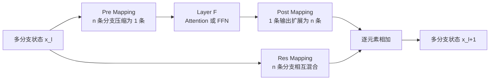

# mHC：Manifold-Constrained Hyper-Connections

mHC（Manifold-Constrained Hyper-Connections，流形约束超连接）是在 Hyper-Connections（HC）基础上加入流形约束的残差连接方式。它把单条残差流扩展为 $n$ 条并行残差流，并通过可学习的映射控制：

- 多条残差流如何聚合成子层输入；
- 子层输出如何写回多条残差流；
- 多条残差流之间如何交换信息。

本文使用以下符号：

- $B$：batch size；
- $L$：序列长度；
- $n$：残差流（分支）数量；
- $C$：每条残差流的隐藏维度，对应代码中的 `dim`；
- $\boldsymbol{x}_l\in\mathbb{R}^{B\times L\times n\times C}$：第 $l$ 层的多分支隐藏状态；
- $\mathcal{F}(\cdot,\mathcal{W}_l)$：第 $l$ 个 Attention 或 FFN 子层。

## 1. 从标准残差连接到 mHC

### 1.1 标准残差连接

标准残差连接只有一条残差流。跨越多层后，可以写成：

$$
\boldsymbol{x}_L
=
\boldsymbol{x}_l
+
\sum_{i=l}^{L-1}\mathcal{F}(\boldsymbol{x}_i,\mathcal{W}_i).
$$

在单层中，它对应：

$$
\boldsymbol{x}_{l+1}
=
\boldsymbol{x}_l
+
\mathcal{F}(\boldsymbol{x}_l,\mathcal{W}_l).
$$

### 1.2 Hyper-Connections（HC）

HC 将单条残差流扩展为 $n$ 条残差流，并额外引入三个可学习的映射矩阵：

$$
\boldsymbol{x}_{l+1}
=
\mathcal{H}_l^{\mathrm{res}}\boldsymbol{x}_l
+
\left(\mathcal{H}_l^{\mathrm{post}}\right)^{\!\top}
\mathcal{F}\!\left(
\mathcal{H}_l^{\mathrm{pre}}\boldsymbol{x}_l,
\mathcal{W}_l
\right).
$$

### 1.3 Manifold-Constrained HC（mHC）

mHC 保留 HC 的整体计算结构，但对三个映射施加不同约束：

- $\mathcal{H}^{\mathrm{pre}}$ 经过 Sigmoid，元素位于 $(0,1)$；
- $\mathcal{H}^{\mathrm{post}}$ 经过两倍 Sigmoid，元素位于 $(0,2)$；
- $\mathcal{H}^{\mathrm{res}}$ 经过 Sinkhorn-Knopp 迭代，被约束为近似双随机矩阵。

整体数据流如下：



## 2. 三个映射矩阵的作用

| 映射 | 形状 | 作用 |
| --- | --- | --- |
| $\mathcal{H}_l^{\mathrm{pre}}$ | $1\times n$ | 将 $n$ 条残差分支压缩为一条分支，使子层输入仍为 $C$ 维。 |
| $\mathcal{H}_l^{\mathrm{post}}$ | $n\times 1$（代码中存为长度 $n$ 的向量） | 将单条子层输出扩展到 $n$ 条分支，使输出形状与多分支残差流一致。 |
| $\mathcal{H}_l^{\mathrm{res}}$ | $n\times n$ | 混合不同残差分支，让各分支之间交换信息。 |

## 3. 如何生成三个映射矩阵

### 3.1 HC 的生成方式

HC 首先对隐藏状态进行 RMSNorm：

$$
\widetilde{\boldsymbol{x}}_i
=
\operatorname{RMSNorm}(\boldsymbol{x}_i).
$$

然后使用三组独立参数生成映射：

$$
\begin{aligned}
\mathcal{H}_i^{\mathrm{pre}}
&=
\alpha_i^{\mathrm{pre}}
\tanh\!\left(\theta_i^{\mathrm{pre}}\widetilde{\boldsymbol{x}}_i\right)
+b_i^{\mathrm{pre}},\\
\mathcal{H}_i^{\mathrm{post}}
&=
\alpha_i^{\mathrm{post}}
\tanh\!\left(\theta_i^{\mathrm{post}}\widetilde{\boldsymbol{x}}_i\right)
+b_i^{\mathrm{post}},\\
\mathcal{H}_i^{\mathrm{res}}
&=
\alpha_i^{\mathrm{res}}
\tanh\!\left(\theta_i^{\mathrm{res}}\widetilde{\boldsymbol{x}}_i\right)
+b_i^{\mathrm{res}}.
\end{aligned}
$$

### 3.2 mHC 的生成方式

mHC 同样先做 RMS 归一化，但使用线性投影生成三个映射的预激活值：

$$
\widetilde{\boldsymbol{x}}_i
=
\operatorname{RMSNorm}(\boldsymbol{x}_i),
$$

$$
\begin{aligned}
\widetilde{\mathcal{H}}_i^{\mathrm{pre}}
&=
\alpha_i^{\mathrm{pre}}
\left(\widetilde{\boldsymbol{x}}_i\varphi_i^{\mathrm{pre}}\right)
+b_i^{\mathrm{pre}},\\
\widetilde{\mathcal{H}}_i^{\mathrm{post}}
&=
\alpha_i^{\mathrm{post}}
\left(\widetilde{\boldsymbol{x}}_i\varphi_i^{\mathrm{post}}\right)
+b_i^{\mathrm{post}},\\
\widetilde{\mathcal{H}}_i^{\mathrm{res}}
&=
\alpha_i^{\mathrm{res}}
\operatorname{mat}\!\left(
\widetilde{\boldsymbol{x}}_i\varphi_i^{\mathrm{res}}
\right)
+b_i^{\mathrm{res}}.
\end{aligned}
$$

其中，$\operatorname{mat}(\cdot)$ 将长度为 $n^2$ 的向量恢复为 $n\times n$ 矩阵。

## 4. 参数形状与初始化

将每个 token 的 $n$ 条残差流展平后，有：

$$
\boldsymbol{x}_i^{\mathrm{flat}}\in\mathbb{R}^{nC}.
$$

三组投影矩阵可以分别定义：

$$
\varphi_i^{\mathrm{pre}},\varphi_i^{\mathrm{post}}
\in\mathbb{R}^{nC\times n},
\qquad
\varphi_i^{\mathrm{res}}
\in\mathbb{R}^{nC\times n^2}.
$$

```python
phi_pre = nn.Linear(nc, n, bias=False)
phi_post = nn.Linear(nc, n, bias=False)
phi_res = nn.Linear(nc, n * n, bias=False)
```

也可以把它们合并成一个大矩阵，投影后再切分：

```python
phi = nn.Linear(nc, n * n + 2 * n, bias=False)
```

偏置的形状为：

$$
b_i^{\mathrm{pre}},b_i^{\mathrm{post}}\in\mathbb{R}^{1\times n},
\qquad
b_i^{\mathrm{res}}\in\mathbb{R}^{1\times n^2}.
$$

它们同样可以分别初始化：

```python
b_pre = nn.Parameter(torch.zeros(n))
b_post = nn.Parameter(torch.zeros(n))
b_res = nn.Parameter(torch.zeros(n * n))
```

或者合并后再切分：

```python
b = nn.Parameter(torch.zeros(n * n + 2 * n))
```

三个缩放因子 $\alpha_i^{\mathrm{pre}}$、$\alpha_i^{\mathrm{post}}$ 和 $\alpha_i^{\mathrm{res}}$ 均为标量，初始值设为 $0.01$：

```python
a_pre = nn.Parameter(torch.ones(1) * 0.01)
a_post = nn.Parameter(torch.ones(1) * 0.01)
a_res = nn.Parameter(torch.ones(1) * 0.01)
```

也可以合并为一个长度为 3 的参数：

```python
a = nn.Parameter(torch.ones(3) * 0.01)
```

合并实现中的主要参数形状如下：

| 参数或中间量 | 数据类型 | 形状或含义 |
| --- | --- | --- |
| $\varphi_l$ | `float32` | $[nC,\,n^2+2n]$ |
| $\widetilde{\boldsymbol{x}}_l$ | `bfloat16` | $[1,\,nC]$ |
| $\alpha_l^{\mathrm{pre}},\alpha_l^{\mathrm{post}},\alpha_l^{\mathrm{res}}$ | `float32` | 三个标量 |
| $b_l$ | `float32` | $[1,\,n^2+2n]$ |
| 三组映射的预激活值 | `float32` | $\widetilde{\boldsymbol{x}}_l\varphi_l$ |

## 5. 合并投影的计算过程

输入隐藏状态的形状为 `[B, L, n, C]`。先展平最后两个维度：

```python
B, L, N, D = hidden_states.shape
hidden_states_flatten = hidden_states.flatten(2)  # [B, L, n*C]
```

一次线性投影得到三个映射的预激活值：

```python
H = phi(hidden_states_flatten)  # [B, L, n*n + 2*n]
```

计算 RMS 缩放量：

```python
r = hidden_states_flatten.norm(dim=-1, keepdim=True) / math.sqrt(nc)
# [B, L, 1]
```

其依据是：

$$
\operatorname{RMS}(\boldsymbol{x})
=
\sqrt{\frac{1}{d}\lVert\boldsymbol{x}\rVert_2^2}
=
\frac{\lVert\boldsymbol{x}\rVert_2}{\sqrt{d}},
\qquad d=nC.
$$

因此，乘以 $1/r$ 就实现了 RMS 归一化中的尺度归一化；相关的可学习缩放可以合并到相邻可学习参数中。

将投影结果切分，并分别应用缩放和偏置：

```python
H_pre = (1 / r) * H[:, :, :n] * a[0] + b[:n]
H_post = (1 / r) * H[:, :, n:2*n] * a[1] + b[n:2*n]
H_res = (1 / r) * H[:, :, 2*n:] * a[2] + b[2*n:]
```

对应的整体计算可以写为：

$$
\left[
\widetilde{\mathcal{H}}_l^{\mathrm{pre}},
\widetilde{\mathcal{H}}_l^{\mathrm{post}},
\widetilde{\mathcal{H}}_l^{\mathrm{res}}
\right]
=
\frac{1}{r}
\left[
\alpha_l^{\mathrm{pre}}\widehat{\mathcal{H}}_l^{\mathrm{pre}},
\alpha_l^{\mathrm{post}}\widehat{\mathcal{H}}_l^{\mathrm{post}},
\alpha_l^{\mathrm{res}}\widehat{\mathcal{H}}_l^{\mathrm{res}}
\right]
+b_l.
$$

## 6. 对三个映射施加约束

三个映射的后处理方式不同：

$$
\begin{aligned}
\mathcal{H}_l^{\mathrm{pre}}
&=\sigma\!\left(\widetilde{\mathcal{H}}_l^{\mathrm{pre}}\right),\\
\mathcal{H}_l^{\mathrm{post}}
&=2\sigma\!\left(\widetilde{\mathcal{H}}_l^{\mathrm{post}}\right),\\
\mathcal{H}_l^{\mathrm{res}}
&=\operatorname{Sinkhorn\text{-}Knopp}\!\left(
\widetilde{\mathcal{H}}_l^{\mathrm{res}}
\right).
\end{aligned}
$$

代码实现如下：

```python
H_pre = torch.sigmoid(H_pre)             # [B, L, n]
H_post = 2 * torch.sigmoid(H_post)        # [B, L, n]
H_res = H_res.reshape(B, L, n, n)         # [B, L, n, n]
H_res = sinkhorn_knopp(H_res)
```

Sinkhorn-Knopp 通过交替进行行归一化和列归一化，使 $\mathcal{H}^{\mathrm{res}}$ 近似满足：

$$
\mathcal{H}_{ij}^{\mathrm{res}}\geq 0,
\qquad
\sum_j\mathcal{H}_{ij}^{\mathrm{res}}=1,
\qquad
\sum_i\mathcal{H}_{ij}^{\mathrm{res}}=1.
$$

也就是说，$\mathcal{H}^{\mathrm{res}}$ 是一个近似双随机矩阵。

## 7. 三个映射如何参与前向传播

mHC 的单个子层仍然遵循：

$$
\boldsymbol{x}_{l+1}
=
\mathcal{H}_l^{\mathrm{res}}\boldsymbol{x}_l
+
\left(\mathcal{H}_l^{\mathrm{post}}\right)^{\!\top}
\mathcal{F}\!\left(
\mathcal{H}_l^{\mathrm{pre}}\boldsymbol{x}_l,
\mathcal{W}_l
\right).
$$

具体分为四步。

### 7.1 Pre Mapping：压缩多条分支

```python
H_pre = H_pre.unsqueeze(dim=2)       # [B, L, 1, n]
h_pre = torch.matmul(H_pre, hidden_states)
# [B, L, 1, n] @ [B, L, n, C] -> [B, L, 1, C]
```

得到的 `h_pre` 去掉长度为 1 的分支维度后，可以直接送入 Attention 或 FFN：

```python
h_out = layer(h_pre.squeeze(-2))     # [B, L, C]
```

### 7.2 Res Mapping：混合残差分支

```python
h_res = torch.matmul(H_res, hidden_states)
# [B, L, n, n] @ [B, L, n, C] -> [B, L, n, C]
```

### 7.3 Post Mapping：展开子层输出

```python
h_post = torch.matmul(
    H_post.unsqueeze(-1),            # [B, L, n, 1]
    h_out.unsqueeze(-2),             # [B, L, 1, C]
)
# -> [B, L, n, C]
```

### 7.4 与残差路径相加

```python
output = h_res + h_post              # [B, L, n, C]
```

至此，一次完整的 mHC 子层计算完成。

## 8. 集成到 DecoderLayer

一个 Decoder 层包含 Attention 和 FFN 两个子层，因此分别配置一套 mHC 参数：

```python
class DecoderLayer(nn.Module):
    def __init__(self, dim, n_heads, layer_id, n=4):
        super().__init__()

        self.attn_mhc = mHC(dim=dim, n=n, layer_id=layer_id)
        self.ffn_mhc = mHC(dim=dim, n=n, layer_id=layer_id)

        self.attention = MultiheadAttention(
            embed_dim=dim,
            num_heads=n_heads,
            bias=False,
            batch_first=True,
        )
        self.ffn = FFN(dim=dim, hidden_dim=4 * dim)

    def forward(self, hidden_states):
        # Attention 子层
        h_pre, h_res, H_post = self.attn_mhc.width_connection(
            hidden_states
        )
        attn_output, _ = self.attention(
            h_pre.squeeze(-2),
            h_pre.squeeze(-2),
            h_pre.squeeze(-2),
        )
        hidden_states = self.attn_mhc.depth_connection(
            h_res, attn_output, H_post
        )

        # FFN 子层
        h_pre, h_res, H_post = self.ffn_mhc.width_connection(
            hidden_states
        )
        ffn_output = self.ffn(h_pre.squeeze(-2))
        hidden_states = self.ffn_mhc.depth_connection(
            h_res, ffn_output, H_post
        )

        return hidden_states
```

每个子层的输入和输出都保持 `[B, L, n, C]`，因此可以继续堆叠多个 Decoder 层。

## 9. 堆叠为完整模型

Embedding 最初只产生一条隐藏状态，需要先将它扩展为 $n$ 条残差流。经过所有 Decoder 层后，再对分支维度求平均，恢复为普通的 `[B, L, C]` 隐藏状态：

```python
class LLM(nn.Module):
    def __init__(self, vocab_size, dim, n_heads, num_layers, n=4):
        super().__init__()
        self.n = n
        self.embedding = nn.Embedding(vocab_size, dim)
        self.layers = nn.ModuleList([
            DecoderLayer(
                dim=dim,
                n_heads=n_heads,
                layer_id=i,
                n=n,
            )
            for i in range(num_layers)
        ])
        self.output_layer = nn.Linear(dim, vocab_size)

    def forward(self, input_ids):
        hidden_states = self.embedding(input_ids)       # [B, L, C]
        hidden_states = hidden_states.unsqueeze(2).expand(
            -1, -1, self.n, -1
        )                                               # [B, L, n, C]

        for layer in self.layers:
            hidden_states = layer(hidden_states)        # [B, L, n, C]

        hidden_states = hidden_states.mean(dim=2)       # [B, L, C]
        output = self.output_layer(hidden_states)       # [B, L, vocab_size]
        return output
```

最终的数据流为：

```text
input_ids
  -> Embedding                         [B, L, C]
  -> 扩展为 n 条残差流                 [B, L, n, C]
  -> 多层 DecoderLayer                 [B, L, n, C]
  -> 对 n 条残差流取平均               [B, L, C]
  -> Vocabulary Projection             [B, L, vocab_size]
```

相关实现见 [`mHC.ipynb`](./mHC.ipynb)。
