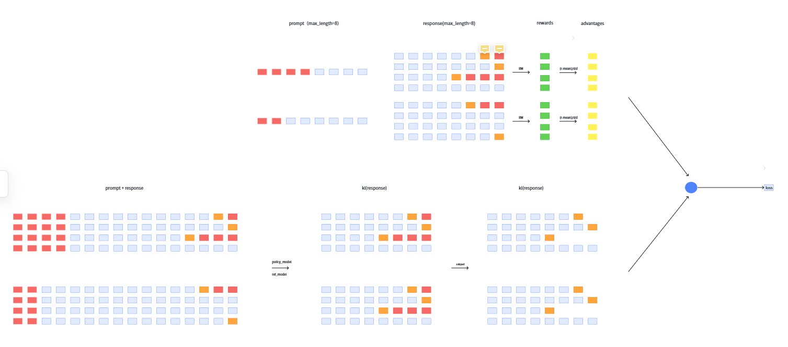
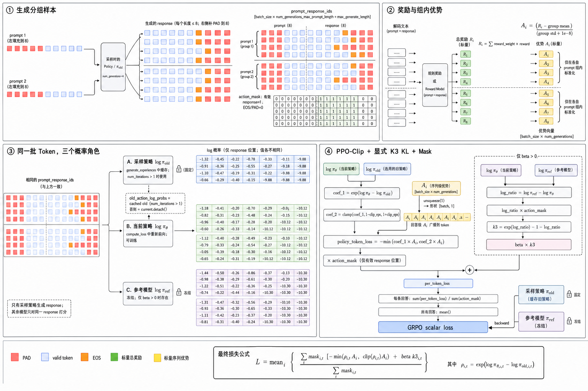
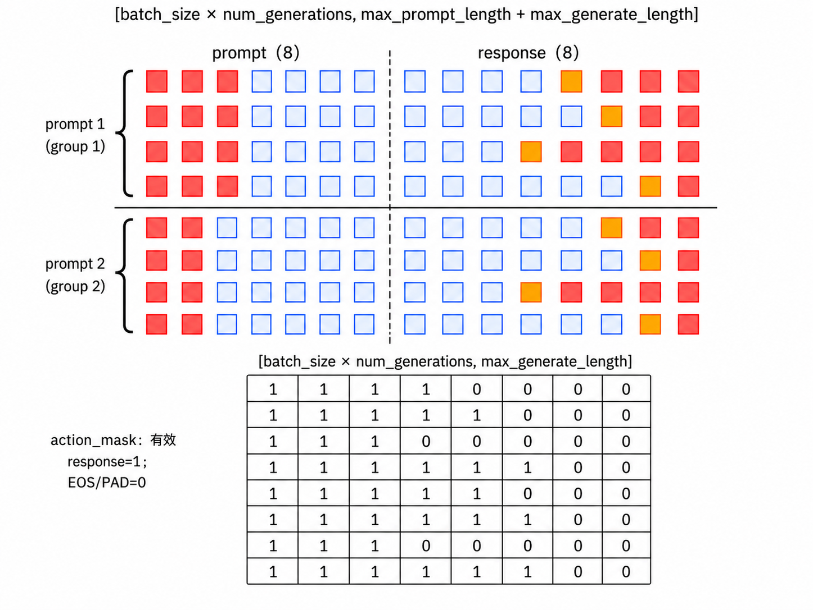

# GRPO Note：从 PPO 到 GRPO

## 1. 核心结论

GRPO（Group Relative Policy Optimization）保留了 PPO 的 clipped surrogate objective，但不再训练 Value/Critic 模型，而是对同一个问题生成一组回答，用**组内相对奖励**估计优势。

可以把它理解为：

> **GRPO = PPO 风格的裁剪更新 + 组内相对优势 − 可选的参考模型 KL 约束。**

最大的工程收益是省去 Critic/Value Model 的训练和显存占用；代价是每个 prompt 必须生成多个回答，训练信号依赖组内回答具有足够的差异。

在本文讨论的 PPO/GRPO 实现中，KL 约束进入训练的路径也不同：

- **PPO：KL 惩罚先加入 reward，再通过 TD/GAE 集成进 advantage。**
- **GRPO：KL 不参与组内 advantage，而是作为独立项显式加入 loss。**

---

## 2. 符号约定

### 2.1 问题、回答与 token

| 符号 | 含义 |
| --- | --- |
| $q$ | 一条具体的输入问题（prompt） |
| $O$ | 模型完整输出的随机变量或所有可能回答构成的输出空间 |
| $o_i=(o_{i,1},\ldots,o_{i,\lvert o_i\rvert})$ | 针对问题 $q$ 实际采样到的第 $i$ 条完整回答 |
| $\lvert o_i\rvert$ | 第 $i$ 条回答包含的有效 completion token 数 |
| $o_{i,t}$ | 第 $i$ 条回答的第 $t$ 个 token |
| $o_{i,<t}=(o_{i,1},\ldots,o_{i,t-1})$ | 生成第 $t$ 个 token 之前的回答前缀 |
| $G$ | 同一道题采样的回答数量（group size） |
| $R_i$ | 第 $i$ 条完整回答获得的序列级奖励 |
| $\widehat A_i$ | 由同组奖励标准化得到的第 $i$ 条回答的相对优势 |

大写 $O$ 和小写 $o_i$ 的区别是：

- $O$ 表示“可能生成什么”的随机输出或输出空间；
- $o_i$ 表示从该分布中实际采样得到的一条具体回答。

例如，下面的写法表示对同一个问题独立采样 $G$ 条回答：

$$
o_i\overset{\mathrm{i.i.d.}}{\sim}
\pi_{\mathrm{old}}(\cdot\mid q),
\qquad i=1,\ldots,G.
$$

有些公式也写成 $\pi_{\mathrm{old}}(O\mid q)$，但
$\pi_{\mathrm{old}}(\cdot\mid q)$ 更清楚：这里描述的是完整回答的条件分布，
而不是某一条名为 $O$ 的具体回答。

### 2.2 三个策略模型

| 符号 | 是否更新 | 作用 |
| --- | --- | --- |
| $\pi_\theta$ | 是 | 当前正在训练、参与反向传播的策略模型 |
| $\pi_{\mathrm{old}}$ | 一个 rollout 周期内冻结 | 生成训练回答，并作为 PPO/GRPO 重要性比率的分母 |
| $\pi_{\mathrm{ref}}$ | 始终冻结 | 约束当前策略不要偏离初始模型过远；仅在启用 KL 惩罚时需要 |

必须区分 $\pi_{\mathrm{old}}$ 和 $\pi_{\mathrm{ref}}$：

- $\pi_{\mathrm{old}}$ 是当前策略在采样前保存的快照，会随训练周期更新；
- $\pi_{\mathrm{ref}}$ 通常是训练开始时保存的初始/SFT 模型，训练期间保持不变；
- 二者在训练刚开始时可能参数相同，但承担的算法职责不同。

### 2.3 优化相关符号

| 符号 | 含义 |
| --- | --- |
| $\rho_{i,t}(\theta)$ | 当前策略与旧策略对已采样 token 给出的概率之比 |
| $\epsilon$ | PPO/GRPO 的裁剪半径，裁剪区间为 $[1-\epsilon,1+\epsilon]$ |
| $\beta$ | KL 惩罚强度；$\beta=0$ 表示不使用参考模型 KL 约束 |
| $D_{\mathrm{KL}}$ 或 $k_3$ | 当前策略相对参考策略的 KL 偏离度或其逐 token 估计 |
| $\varepsilon_{\mathrm{num}}$ | 防止标准差为零的数值稳定项，不是裁剪半径 $\epsilon$ |

### 2.4 两类概率比率不要混用

PPO/GRPO 策略目标使用的是**当前策略与旧策略**之间的重要性采样比率：

$$
\rho_{i,t}(\theta)
=
\frac{\pi_\theta(o_{i,t}\mid q,o_{i,<t})}
{\pi_{\mathrm{old}}(o_{i,t}\mid q,o_{i,<t})}
$$

它回答的是：

> 对同一个已采样 token，当前策略给出的概率相对采样时提高或降低了多少？

后文估计 KL 时还会出现**参考策略与当前策略**之间的比率：

$$
r_{i,t}^{\mathrm{KL}}
=
\frac{\pi_{\mathrm{ref}}(o_{i,t}\mid q,o_{i,<t})}
{\pi_\theta(o_{i,t}\mid q,o_{i,<t})}.
$$

二者的用途和分母完全不同：

| 比率 | 比较对象 | 主要用途 |
| --- | --- | --- |
| $\rho_{i,t}=\pi_\theta/\pi_{\mathrm{old}}$ | 当前策略 vs. 旧策略 | PPO/GRPO surrogate objective 与裁剪 |
| $r_{i,t}^{\mathrm{KL}}=\pi_{\mathrm{ref}}/\pi_\theta$ | 参考策略 vs. 当前策略 | 估计当前策略偏离参考策略的程度 |

记忆方法：

> **old 管“这批数据是谁采的”，ref 管“模型不要偏离谁太远”。**

---

## 3. PPO 优化目标

PPO 的 clipped surrogate objective 可以写成：

$$
J_{\mathrm{PPO}}(\theta)
=
\mathbb{E}_{q\sim P(Q),\,o\sim\pi_{\mathrm{old}}(O\mid q)}
\left[
\frac{1}{|o|}\sum_{t=1}^{|o|}
\min\left(
\rho_t(\theta)A_t,
\operatorname{clip}\!\left(\rho_t(\theta),1-\epsilon,1+\epsilon\right)A_t
\right)
\right].
$$

其中：

- $\rho_t=1$：当前策略与采样时的旧策略对该 token 给出的概率相同。
- $A_t>0$：这个动作好，希望提高它的概率。
- $A_t<0$：这个动作差，希望降低它的概率。
- `clip` 防止一次更新让策略变化太大。

例如，旧策略生成某 token 的概率为 $0.2$，当前策略变为 $0.3$：

$$
\rho_t=\frac{0.3}{0.2}=1.5.
$$

若 $\epsilon=0.2$，裁剪区间为 $[0.8,1.2]$。当 $A_t>0$ 时，目标最多采用 $1.2A_t$，不会继续奖励从 $1.2$ 增长到 $1.5$ 的部分。

### 3.1 PPO 的优势估计：GAE

PPO 通常训练一个 Value/Critic 模型 $V_\phi(s_t)$，并通过 GAE（Generalized Advantage Estimation）计算优势：

$$
\delta_t
=
r_t+\gamma V_\phi(s_{t+1})-V_\phi(s_t),
$$

$$
\hat A_t^{\mathrm{GAE}}
=
\sum_{l=0}^{T-t-1}(\gamma\lambda)^l\delta_{t+l}.
$$

因此，PPO 的优势是由奖励和 Value Model 的估计共同得到的，通常是 token/time-step 粒度。

---

## 4. GRPO 优化目标

对每个问题 $q$，先用旧策略采样 $G$ 个回答：

$$
\{o_i\}_{i=1}^{G}\sim\pi_{\mathrm{old}}(O\mid q).
$$

GRPO 的目标可以整理为：

$$
\begin{aligned}
J_{\mathrm{GRPO}}(\theta)
=
\mathbb{E}\Bigg[
\frac{1}{G}\sum_{i=1}^{G}
\frac{1}{|o_i|}\sum_{t=1}^{|o_i|}
\Bigg(&
\min\left(
\rho_{i,t}(\theta)\hat A_{i,t},
\operatorname{clip}\!\left(\rho_{i,t}(\theta),1-\epsilon,1+\epsilon\right)\hat A_{i,t}
\right)\\
&-\beta D_{\mathrm{KL}}^{(i,t)}
\Bigg)
\Bigg].
\end{aligned}
$$

和 PPO 相比，裁剪部分基本相同，关键区别在于优势 $\hat A_{i,t}$ 的来源。

### 4.1 GRPO 的组内相对优势

设同一道题的 $G$ 个回答分别得到奖励 $R_1,\ldots,R_G$，则：

$$
\mu_R=\frac{1}{G}\sum_{j=1}^{G}R_j,
$$

$$
\sigma_R=\operatorname{std}(R_1,\ldots,R_G),
$$

$$
\hat A_i
=
\frac{R_i-\mu_R}{\sigma_R+\varepsilon_{\mathrm{num}}}.
$$

在当前的 outcome-level 实现中，同一回答的所有 token 共用同一个优势：

$$
\hat A_{i,t}=\hat A_i.
$$

- 奖励高于组内平均值：$\hat A_i>0$，提高该回答 token 的概率。
- 奖励低于组内平均值：$\hat A_i<0$，降低该回答 token 的概率。
- 奖励等于组内平均值：$\hat A_i\approx0$，几乎不产生策略梯度。

### 4.2 数值例子

假设同一道数学题生成 4 个回答，总奖励为：

$$
[3.5,\ 1.5,\ 1.0,\ 0.0].
$$

使用 PyTorch 默认的样本标准差：

$$
\mu_R=1.5,\qquad \sigma_R\approx1.472,
$$

因此：

$$
\hat A\approx[1.359,\ 0,\ -0.340,\ -1.019].
$$

第一个回答会被明显鼓励，第三、第四个回答会被抑制。GRPO 比较的是**同一道题内部的相对好坏**，而不是直接比较不同题目的绝对奖励。

若组内回答完全相同、奖励也完全相同，则 $R_i-\mu_R=0$，所有优势都会接近 0。因此生成阶段必须有足够的采样多样性。

---

## 5. PPO 与 GRPO 的主要差异

### 5.1 模型组成

| 模型/组件 | PPO（典型 RLHF） | GRPO |
| --- | --- | --- |
| Policy/Actor | 必需 | 必需 |
| Value/Critic | 必需，用于估计优势 | 不需要 |
| 奖励来源 | 奖励模型或规则奖励 | 奖励模型或规则奖励 |
| Reference Model | RLHF 中通常使用 | $\beta>0$ 时使用；$\beta=0$ 时可省略 |

PPO 常被概括为“策略模型 + 价值模型 + 奖励模型 + 参考模型”。GRPO 删除的是价值模型；奖励模型也不一定是神经网络，本目录就是用规则函数提供奖励。

#### 5.1.1 PPO 四个模型如何初始化

在典型的 RLHF-PPO 流程中，四个模型通常按下表初始化：

| 模型角色 | 常见初始化来源 | PPO 阶段状态 |
| --- | --- | --- |
| Actor / Policy Model | 经过监督微调的 SFT checkpoint | 训练、更新 |
| Reference Model | PPO 开始前 Actor/SFT 权重的冻结副本 | 冻结 |
| Reward Model | 基础模型或 SFT 模型经过人类偏好数据训练后的 checkpoint | 冻结 |
| Critic / Value Model | 常从 Reward Model 或 SFT/Actor checkpoint 初始化，并使用 Value Head | 训练、更新 |

初始化关系可以概括为：

```text
Pretrained Model
       |
       v
    SFT Model --------------------+---------------------+
       |                          |                     |
       |                          v                     v
       |                    Actor / Policy       Reference Model
       |                       (训练)                (冻结)
       |
       +--> Preference Training --> Reward Model ------+
                                      (冻结)            |
                                                        v
                                              Critic / Value Model
                                                    (训练)
```

这个图表示常见的数据来源关系，不表示 Critic 必须由 Reward Model 创建。Critic 还有从 SFT/Actor 初始化的常见路线。

##### Actor / Policy Model

Actor 一般直接加载 SFT 模型：

```text
预训练模型 -> 监督微调（SFT）-> PPO Actor
```

SFT 先让模型学会遵循指令和正确的回答格式，PPO 再根据 reward/advantage 调整生成策略。PPO 阶段会更新 Actor 参数。

##### Reference Model

Reference Model 通常是 PPO 训练开始前 Actor 的冻结副本：

$$
\pi_{\mathrm{ref}}
\leftarrow
\operatorname{deepcopy}(\pi_{\mathrm{actor}}^{\mathrm{initial}}).
$$

因此训练刚开始时：

$$
\pi_\theta=\pi_{\mathrm{ref}},
\qquad
D_{\mathrm{KL}}(\pi_\theta\|\pi_{\mathrm{ref}})\approx0.
$$

随后只有 Actor 更新，Reference 保持不变。它的作用是提供一个稳定锚点，防止 Actor 为了追求奖励而过度偏离 SFT 模型。

##### Reward Model

Reward Model 通常经过偏好学习得到：

```text
预训练模型或 SFT 模型
          |
          v
chosen / rejected 人类偏好数据
          |
          v
     Reward Model
```

它读取问题和完整回答，输出一个标量质量分数：

$$
R(q,o)\in\mathbb R.
$$

PPO 阶段只用 Reward Model 打分，不更新其参数。Reward Model 也可以被规则奖励、验证器或多个奖励函数的组合替代。

##### Critic / Value Model

Critic 预测回答每个前缀状态的期望未来回报：

$$
V_\phi(q,o_{<t}).
$$

常见初始化方式有两种：

1. **从 Reward Model 初始化**：复用已经学过“回答质量判断”的语言模型 backbone 和标量预测能力，再训练为逐 token Value Model。
2. **从 SFT/Actor 初始化**：复制 SFT 模型的 backbone，并添加 Value Head；新添加的 head 通常需要单独初始化和训练。

从 Reward Model 初始化在很多 RLHF 工程中较常见，但不是 PPO 算法的强制要求。无论从哪里初始化，Critic 都会在 PPO 阶段更新，用 KL-adjusted return 拟合 value target，并为 GAE 提供 $V_\phi(s_t)$。

##### 一个 Qwen 初始化例子

假设基础模型使用 Qwen2.5-1.5B：

```text
Actor     = 数学/指令 SFT 后的 Qwen2.5-1.5B
Reference = Actor 初始权重的冻结副本
Reward    = 使用 chosen/rejected 偏好数据训练的 Qwen 奖励模型
Critic    = Reward checkpoint 或 SFT checkpoint + Value Head
```

训练期间：

- 更新：Actor、Critic。
- 冻结：Reward Model、Reference Model。

“PPO 有四个模型”描述的是四个**逻辑角色**。它们可以采用相同的基础模型架构和 tokenizer，但 checkpoint、输出 head、训练目标以及是否更新并不相同；某些实现还会让 Actor 与 Critic 共享部分 backbone，以降低显存占用。

### 5.2 优势估计

| 方法 | 优势来源 | 是否需要 Critic |
| --- | --- | --- |
| PPO | 通常使用 Value Model + GAE | 是 |
| GRPO | 同一 prompt 下多个回答的组内标准化奖励 | 否 |

### 5.3 KL 的放置位置

本文采用下面这套 PPO/GRPO 对比方式：

```text
PPO : KL -> shaped reward -> TD error -> GAE advantage -> clipped policy loss
GRPO: task reward -> group advantage --------------------> clipped policy loss
      reference KL --------------------------------------> explicit KL loss
```

也就是说，PPO 只有一条汇合后的训练信号；GRPO 则保留“策略奖励”和“参考模型约束”两条相对独立的路径。

#### 5.3.1 PPO：KL 加入奖励，并集成在优势中

设 rollout 策略相对于参考模型的逐 token KL 估计为：

$$
k_{1,t}
=
\log
\frac{\pi_{\mathrm{rollout}}(o_t\mid q,o_{<t})}
{\pi_{\mathrm{ref}}(o_t\mid q,o_{<t})}.
$$

先构造包含 KL 惩罚的 shaped reward：

$$
\tilde r_t
=
r_t^{\mathrm{task}}-\beta k_{1,t}.
$$

在 LLM 的 RLHF 训练中，任务/奖励模型分数通常主要放在回答末尾，而每个 token 都可以有 KL 惩罚。例如：

$$
r_t^{\mathrm{task}}
=
\begin{cases}
0, & t<T,\\
R(o), & t=T.
\end{cases}
$$

随后，Critic 和 GAE 使用的已经是 $\tilde r_t$：

$$
\delta_t^{\mathrm{KL}}
=
\tilde r_t
+\gamma V_\phi(s_{t+1})
-V_\phi(s_t),
$$

$$
\hat A_t^{\mathrm{PPO}}
=
\sum_{l=0}^{T-t-1}
(\gamma\lambda)^l
\delta_{t+l}^{\mathrm{KL}}.
$$

最后 PPO policy loss 仍然只写成 clipped objective：

$$
L_{\mathrm{PPO}}
=
-\mathbb E_t\left[
\min\left(
\rho_t\hat A_t^{\mathrm{PPO}},
\operatorname{clip}(\rho_t,1-\epsilon,1+\epsilon)
\hat A_t^{\mathrm{PPO}}
\right)
\right].
$$

公式中虽然没有再写一个独立的 $+\beta D_{\mathrm{KL}}$，但 KL 已经通过
$\tilde r_t\rightarrow\delta_t\rightarrow\hat A_t$ 集成到了优势里。因此，KL 会同时影响：

- Critic/Value Model 的回报拟合目标；
- Actor/Policy 的优势大小和更新方向。

**数值例子：**假设三个 token 的 $k_1$ 为 $[0.1,0.2,0.0]$，$\beta=0.1$，末尾任务奖励为 $2.0$，忽略折扣时：

$$
\tilde r=[-0.01,-0.02,2.0],
$$

$$
\sum_t\tilde r_t=2.0-0.1\times(0.1+0.2)=1.97.
$$

GAE 和 Critic 看到的是 KL 调整后的回报 $1.97$，而不是原始任务奖励 $2.0$。

#### 5.3.2 GRPO：KL 显式加入损失函数

GRPO 先只根据任务/规则/奖励模型分数计算组内优势：

$$
\hat A_i^{\mathrm{GRPO}}
=
\frac{R_i-\operatorname{mean}(R_1,\ldots,R_G)}
{\operatorname{std}(R_1,\ldots,R_G)+\varepsilon_{\mathrm{num}}}.
$$

这里的 $R_i$ 不包含参考模型 KL。然后在每个 token 的 loss 中单独加入 $k_3$：

$$
L_{i,t}^{\mathrm{GRPO}}
=
-\min\left(
\rho_{i,t}\hat A_i,
\operatorname{clip}(\rho_{i,t},1-\epsilon,1+\epsilon)\hat A_i
\right)
+\beta k_{3,i,t}.
$$

因此：

- $\hat A_i$ 只回答“这个回答在同组中相对好不好”；
- $\beta k_{3,i,t}$ 单独回答“当前策略在这个 token 上偏离参考模型多远”。

例如某个回答的组内优势为 $1.2$，某 token 的 $k_3=0.3$，$\beta=0.1$。策略部分仍使用优势 $1.2$，KL 则额外贡献：

$$
\beta k_3=0.1\times0.3=0.03
$$

的 loss 惩罚；$k_3$ 不会被减进奖励，也不会重新改变组内优势 $1.2$。

#### 5.3.3 两种路径对比

| 对比项 | PPO | GRPO |
| --- | --- | --- |
| KL 放置位置 | 加入 shaped reward | 显式加入 loss |
| 常用估计 | $k_1$ | $k_3$ |
| KL 是否进入 advantage | 是，经 TD/GAE 集成 | 否 |
| 是否影响 Critic 目标 | 是 | 没有 Critic |
| 策略约束方式 | 通过 KL-adjusted advantage 间接影响 | 通过 $+\beta k_3$ 直接影响 |

这正是本文需要记住的实现差异：

> **PPO 把 KL 融入 reward，最终集成进 advantage；GRPO 保持 group advantage 只描述任务奖励，并把 KL 作为显式 loss 项。**
> 不过，这不是 PPO 与 GRPO 的定义性区别。不同库可以把 KL 放在 reward 中，也可以直接放在 loss 中。真正的核心区别仍然是：**PPO 依赖 Critic/GAE，GRPO 使用组内相对奖励。**

---

## 6. KL 散度的三种单样本估计

令：

- $q(x)=\pi_\theta(x)$：当前策略；
- $p(x)=\pi_{\mathrm{ref}}(x)$：参考策略；
- 样本 $x\sim q$；
- $r=\dfrac{p(x)}{q(x)}$。

目标是估计：

$$
D_{\mathrm{KL}}(q\|p)
=
\mathbb E_{x\sim q}\left[\log\frac{q(x)}{p(x)}\right].
$$

### 6.1 $k_1$：直接 log-ratio

$$
k_1
=
\log\frac{q(x)}{p(x)}
=
-\log r.
$$

- 对 $D_{\mathrm{KL}}(q\|p)$ 无偏。
- 单个样本可能为负，方差通常较大。
- 放入 reward shaping 时实现简单。

### 6.2 $k_2$：平方 log-ratio

$$
k_2
=
\frac{1}{2}\left(\log\frac{p(x)}{q(x)}\right)^2
=
\frac{1}{2}(\log r)^2.
$$

- 始终非负。
- 一般是有偏估计，但当两个分布接近时是良好的局部二阶近似。

### 6.3 $k_3$：低方差非负估计

$$
k_3
=(r-1)-\log r.
$$

- 因为 $r-1-\log r\ge0$，所以每个样本都非负。
- 在 $x\sim q$ 时，$\mathbb E_q[r-1]=0$，因此它与 $k_1$ 具有相同的 KL 期望。
- 相比 $k_1$ 更适合直接作为 loss 中的稳定惩罚项。

### 6.4 用两个候选 token 举例

#### 0.75 和 0.25 是什么

假设模型在某个生成位置只考虑候选 token A 和 B。模型先输出 logits，再通过 softmax 转换为概率：

$$
P(x_i)
=
\frac{e^{z_i}}{\sum_j e^{z_j}}.
$$

假设当前策略和参考策略的概率分布为：

| Token | 当前策略 $q(x)$ | 参考策略 $p(x)$ |
| --- | ---: | ---: |
| A | 0.75 | 0.50 |
| B | 0.25 | 0.50 |

其中：

$$
q(A)=0.75,\qquad q(B)=0.25,
$$

表示当前策略有 75% 的概率生成 A、25% 的概率生成 B，并且：

$$
q(A)+q(B)=0.75+0.25=1.
$$

参考策略则有：

$$
p(A)=0.5,\qquad p(B)=0.5.
$$

因此，当前策略相比参考策略更加偏爱 A。在真实大语言模型中，候选不是两个，而是整个词表，例如：

```text
“北京”  0.40
“上海”  0.25
“中国”  0.15
“深圳”  0.10
其他    0.10
```

KL 散度衡量的就是当前策略的整个 token 概率分布，相比参考策略发生了多大变化。

#### 先计算真实 KL

$$
\begin{aligned}
D_{\mathrm{KL}}(q\|p)
&=
q(A)\log\frac{q(A)}{p(A)}
+q(B)\log\frac{q(B)}{p(B)}\\
&=
0.75\log\frac{0.75}{0.5}
+0.25\log\frac{0.25}{0.5}\\
&\approx0.131.
\end{aligned}
$$

真实 KL 需要遍历整个分布。但训练时通常只拿到了实际采样出的 token，所以才需要 $k_1$、$k_2$、$k_3$ 这样的单样本估计。

#### 当当前策略采样到 A

因为样本来自当前策略，所以采到 A 的概率是 0.75。此时：

$$
r_A
=
\frac{p(A)}{q(A)}
=
\frac{0.5}{0.75}
=
\frac23.
$$

三种估计分别是：

$$
k_1(A)
=
-\log\frac23
\approx0.405,
$$

$$
k_2(A)
=
\frac12\left(\log\frac23\right)^2
\approx0.082,
$$

$$
k_3(A)
=
\left(\frac23-1\right)-\log\frac23
\approx0.072.
$$

当前策略生成 A 的概率高于参考策略，因此这个样本的 $k_1$ 为正。

#### 当当前策略采样到 B

采到 B 的概率是 0.25。此时：

$$
r_B
=
\frac{p(B)}{q(B)}
=
\frac{0.5}{0.25}
=
2.
$$

三种估计分别是：

$$
k_1(B)
=
-\log2
\approx-0.693,
$$

$$
k_2(B)
=
\frac12(\log2)^2
\approx0.240,
$$

$$
k_3(B)
=
(2-1)-\log2
\approx0.307.
$$

$k_1(B)$ 是负数，因为当前策略生成 B 的概率低于参考策略。它只表示这一个样本对 KL 的估计为负，不表示完整 KL 为负。

#### 对所有可能的采样结果求期望

样本由当前策略 $q$ 产生，因此要分别用 0.75 和 0.25 对 A、B 的估计加权。

对于 $k_1$：

$$
\begin{aligned}
\mathbb E_q[k_1]
&=
0.75\times0.405
+0.25\times(-0.693)\\
&\approx0.131.
\end{aligned}
$$

它与真实 KL 相等，所以 $k_1$ 是无偏估计，但单样本可能为负。

对于 $k_2$：

$$
\mathbb E_q[k_2]
=
0.75\times0.082
+0.25\times0.240
\approx0.122.
$$

它不完全等于真实 KL 的 0.131，所以通常是有偏估计。

对于 $k_3$：

$$
\begin{aligned}
\mathbb E_q[k_3]
&=
0.75\times0.072
+0.25\times0.307\\
&\approx0.131.
\end{aligned}
$$

$k_3$ 的期望同样等于真实 KL，而且 A、B 两种情况下都非负。

总结如下：

| 估计 | 单样本是否可能为负 | 该例中的期望 | 特点 |
| --- | --- | ---: | --- |
| $k_1$ | 是 | 0.131 | 无偏，但单样本方差较大 |
| $k_2$ | 否 | 0.122 | 非负，但通常有偏 |
| $k_3$ | 否 | 0.131 | 非负且无偏，适合显式加入 loss |

如果当前策略与参考策略完全相同，那么每个 token 都满足：

$$
r=1,
\qquad
k_1=k_2=k_3=0.
$$

### 6.5 “无偏，但单样本方差较大”是什么意思

无偏性和方差描述的是估计量的两个不同方面：

- **无偏**：无限次采样后的平均值等于真实 KL。
- **方差**：每次单独采样得到的估计值，在真实 KL 周围波动多大。

对于：

$$
k_1(x)
=
\log\frac{q(x)}{p(x)},
$$

它的方差定义为：

$$
\operatorname{Var}_q[k_1]
=
\mathbb E_{x\sim q}[k_1(x)^2]
-
\left(\mathbb E_{x\sim q}[k_1(x)]\right)^2.
$$

这里的方差不是“token 概率自身的方差”，而是：反复从当前策略 $q$ 采样 token 时，不同样本给出的 KL 估计值有多不稳定。

#### 继续使用 A/B 的例子

前面已经得到：

| Token | 当前策略/采样概率 $q(x)$ | 参考策略概率 $p(x)$ | $k_1(x)=\log\frac{q(x)}{p(x)}$ | 真实 KL 均值 |
| --- | ---: | ---: | ---: | ---: |
| A | 0.75 | 0.50 | 0.405 | 0.131 |
| B | 0.25 | 0.50 | -0.693 | 0.131 |

也就是说，单次采样可能得到 $0.405$，也可能得到 $-0.693$，二者相差：

$$
0.405-(-0.693)=1.098.
$$

虽然多次采样的平均值最终会趋近真实 KL 的 $0.131$，但是单次结果可能离它很远。

#### 为什么方差要乘 0.75 和 0.25

令随机变量：

$$
K=k_1(X),\qquad X\sim q.
$$

因为 $X$ 是从当前策略 $q$ 采样的，所以：

$$
P(X=A)=q(A)=0.75,
\qquad
P(X=B)=q(B)=0.25.
$$

离散随机变量的方差定义为“到均值的平方距离的期望”：

$$
\operatorname{Var}(K)
=
\mathbb E[(K-\mu)^2]
=
\sum_xP(X=x)\bigl(k_1(x)-\mu\bigr)^2,
$$

其中：

$$
\mu
=
\mathbb E[K]
=
D_{\mathrm{KL}}(q\|p)
\approx0.131.
$$

可以把它理解为重复采样 100 次：

- 大约 75 次采到 A，每次 $k_1=0.405$；
- 大约 25 次采到 B，每次 $k_1=-0.693$。

于是 100 个估计值到均值 $0.131$ 的平均平方距离约为：

$$
\frac{
75(0.405-0.131)^2
+25(-0.693-0.131)^2
}{100}.
$$

把分子、分母同时除以 100，就得到权重 0.75 和 0.25：

$$
\begin{aligned}
\operatorname{Var}_q[k_1]
&=
0.75(0.405-0.131)^2\\
&\quad+
0.25(-0.693-0.131)^2\\
&\approx0.226.
\end{aligned}
$$

逐项来看：

$$
\underbrace{0.75(0.405-0.131)^2}_{\text{A 的贡献，约 }0.056}
+
\underbrace{0.25(-0.693-0.131)^2}_{\text{B 的贡献，约 }0.170}
\approx0.226.
$$

这里使用 $q(A)=0.75$ 和 $q(B)=0.25$ 作为权重，而不是 $p(A)$ 和 $p(B)$，原因是样本来自 $q$。参考概率 $p(x)$ 用来计算 $k_1(x)=\log(q(x)/p(x))$，但不决定 A、B 在这批 rollout 中出现的频率。

对应的标准差为：

$$
\operatorname{Std}_q[k_1]
=
\sqrt{0.226}
\approx0.476.
$$

方差使用了平方，所以它的量纲也是原估计量的平方；再开平方得到标准差，便能恢复到和 $k_1$、KL 相同的尺度，方便直接比较。

标准差 $0.476$ 明显大于真实 KL $0.131$。因此，当训练只使用少量采样 token 时，KL reward 和梯度会比较嘈杂；采样数量增多后，样本均值才会逐渐稳定。

#### $k_1$ 的波动来自哪里

因为：

$$
k_1(x)
=
\log\frac{q(x)}{p(x)},
$$

所以不同 token 的概率比会直接决定单样本值：

- $q(x)\gg p(x)$：$k_1$ 是幅度较大的正数；
- $q(x)\ll p(x)$：$k_1$ 是幅度较大的负数；
- $q(x)\approx p(x)$：$k_1$ 接近 0。

大语言模型的词表很大，不同 token 在当前模型和参考模型下的概率比可能相差很多。尤其当尾部的低概率 token 偶尔被采样到时，可能产生绝对值很大的 log-ratio，从而形成离群估计并增大方差。

#### 为什么 $k_3$ 通常更稳定

$k_3$ 可以写成：

$$
k_3
=(r-1)-\log r
=
k_1+(r-1).
$$

其中 $r-1$ 的期望为 0：

$$
\begin{aligned}
\mathbb E_q[r-1]
&=
\sum_xq(x)
\left(\frac{p(x)}{q(x)}-1\right)\\
&=
\sum_xp(x)-\sum_xq(x)\\
&=0.
\end{aligned}
$$

所以把 $r-1$ 加到 $k_1$ 上不会改变期望，但它可以作为一个**零期望控制变量（control variate）**抵消波动：

- 当 $r<1$ 时，$k_1=-\log r>0$，而 $r-1<0$；
- 当 $r>1$ 时，$k_1=-\log r<0$，而 $r-1>0$。

在当前 A/B 例子中：

| Token | $k_1$ | $k_3$ |
| --- | ---: | ---: |
| A | 0.405 | 0.072 |
| B | -0.693 | 0.307 |

$k_3$ 的方差为：

$$
\begin{aligned}
\operatorname{Var}_q[k_3]
&=
0.75(0.072-0.131)^2\\
&\quad+
0.25(0.307-0.131)^2\\
&\approx0.010.
\end{aligned}
$$

因此，本例中：

$$
\operatorname{Var}_q[k_1]\approx0.226,
\qquad
\operatorname{Var}_q[k_3]\approx0.010.
$$

$k_1$ 与 $k_3$ 的期望都是 $0.131$，但 $k_3$ 的单样本值更集中，并且始终非负。这就是 $k_3$ 常被称为“低方差、非负 KL 估计”的原因。

---

## 7. 与本目录代码的对应关系

### 7.1 组内采样

[`train.py`](./train.py) 的 `generate_samples` 将同一个 prompt 复制 `num_generations` 份，生成一个 group：

```python
inputs = self.tokenizer([input_text] * self.args.num_generations, ...)
```

必须确认生成配置启用了 `do_sample=True`，否则同组回答可能相同，组内优势会退化为 0。

### 7.2 组内优势

`generate_experiences` 中：

```python
mean_group_rewards = rewards.mean()
std_group_rewards = rewards.std()
advantages = (rewards - mean_group_rewards) / (std_group_rewards + 1e-8)
```

这里的 `advantages` 形状是 `[num_generations]`，每条回答只有一个句子级优势。

### 7.3 PPO/GRPO 重要性比率

`compute_loss` 中：

```python
coef_1 = torch.exp(action_log_probs - old_action_log_probs)
coef_2 = torch.clamp(coef_1, 1 - clip_eps, 1 + clip_eps)
```

即：

$$
\texttt{coef\_1}
=
\exp(\log\pi_\theta-\log\pi_{\mathrm{old}})
=
\frac{\pi_\theta}{\pi_{\mathrm{old}}}
=
\rho.
$$

### 7.4 $k_3$ KL 惩罚

代码中：

```python
log_ratio = ref_action_log_probs - action_log_probs
k3 = log_ratio.exp() - 1 - log_ratio
```

因为：

$$
\texttt{log\_ratio}
=
\log\pi_{\mathrm{ref}}-\log\pi_\theta
=
\log r,
$$

所以：

$$
\texttt{k3}
=
e^{\log r}-1-\log r
=
(r-1)-\log r.
$$

训练代码最终最小化：

$$
L
=
-L_{\mathrm{clip}}+\beta k_3.
$$

当前默认 `beta = 0.0`，因此不会创建参考模型，KL 分支也不会执行。将 `beta` 设置为正数后，才会启用 `ref_model` 和 $k_3$ 惩罚。

### 7.5 自回归模型的 Logits 与目标 Token 如何对齐

`get_action_log_probs` 中最容易产生疑问的是下面三步：

```python
log_probs = F.log_softmax(logits[:, :-1, :], dim=-1)
log_probs_labels = log_probs.gather(
    dim=-1,
    index=input_ids[:, 1:].unsqueeze(-1),
)
action_log_probs = log_probs_labels.squeeze(-1)[:, -num_actions:]
```

#### `[:, :-1, :]` 不是把数值减 1

假设 `logits` 的形状为：

```text
[batch_size * num_generations, 完整序列长度, 词表大小]
```

切片：

```python
logits[:, :-1, :]
```

三个维度分别表示：

```text
:       取第一个维度中的全部回答
:-1     取序列开头到倒数第二个位置，不包含最后一个位置
:       取词表中的全部 token
```

所以 `:-1` 表示“去掉最后一个序列位置”，不是将 logits 的数值减去 1。

例如原始形状为：

```text
[8, 512, 151936]
```

切片后的形状为：

```text
[8, 511, 151936]
```

#### 为什么要去掉最后一个 Logits 位置

自回归语言模型当前位置的 logits 用来预测下一个 token，而不是预测当前位置已经输入的 token。

例如完整序列为：

```text
[序列开始标记, 我, 爱, 你]
```

预测关系是：

| Logits 位置 | 模型已经看到的内容 | 要预测的下一个 token |
| ---: | --- | --- |
| 0 | `序列开始标记` | `我` |
| 1 | `序列开始标记, 我` | `爱` |
| 2 | `序列开始标记, 我, 爱` | `你` |
| 3 | `序列开始标记, 我, 爱, 你` | 输入序列中没有对应标签 |

最后一个位置的 logits 想预测“你”之后的 token，但当前 `input_ids` 中没有这个 token 可以作为监督目标，所以需要将最后一个 logits 位置删除：

```python
logits[:, :-1, :]
```

#### 为什么目标 Token 要去掉第一个位置

输入序列是：

```text
[序列开始标记, 我, 爱, 你]
```

真正需要被预测的目标序列是：

```text
[我, 爱, 你]
```

因此目标 token 使用：

```python
input_ids[:, 1:]
```

即去掉输入中的第一个 token。这样预测位置和目标 token 就能一一对齐：

| 保留的 Logits | 对应目标 |
| --- | --- |
| `logits[:, 0, :]` | `我` |
| `logits[:, 1, :]` | `爱` |
| `logits[:, 2, :]` | `你` |

如果不做这种错位对齐，而是让当前位置的 logits 对应当前位置的 token，就相当于要求模型预测一个已经作为输入看到的 token，不符合自回归语言模型的下一个 token 预测方式。

#### 使用 Token ID 举例

假设 token ID 为：

```text
序列开始标记 = 0
我             = 5
爱             = 8
你             = 2
```

输入为：

```python
input_ids = [[0, 5, 8, 2]]
```

原始 logits 的形状为：

```text
[1, 4, 词表大小]
```

去掉最后一个预测位置：

```python
logits[:, :-1, :]
```

得到：

```text
[1, 3, 词表大小]
```

目标 token 去掉第一个输入位置：

```python
input_ids[:, 1:]
```

得到：

```python
[[5, 8, 2]]
```

再增加一个长度为 1 的词表索引维度：

```python
input_ids[:, 1:].unsqueeze(-1)
```

得到：

```text
[
    [
        [5],
        [8],
        [2],
    ]
]
```

它的形状为：

```text
[1, 3, 1]
```

#### `gather` 在做什么

`log_softmax` 得到的是每个序列位置对整个词表的对数概率分布。假设词表有 151936 个 token，那么每个位置都有 151936 个候选对数概率。

代码：

```python
log_probs.gather(
    dim=-1,
    index=input_ids[:, 1:].unsqueeze(-1),
)
```

会在最后一个词表维度中，取出实际目标 token 对应的那一个值：

```text
位置 0：取 token ID 5，也就是“我”的对数概率
位置 1：取 token ID 8，也就是“爱”的对数概率
位置 2：取 token ID 2，也就是“你”的对数概率
```

张量形状从：

```text
[batch_size * num_generations, 完整序列长度 - 1, 词表大小]
```

变为：

```text
[batch_size * num_generations, 完整序列长度 - 1, 1]
```

执行：

```python
squeeze(-1)
```

后，最后一个长度为 1 的维度被删除。

#### Prompt 与 Response 的完整对齐例子

假设固定的 prompt 区域为：

```text
[序列开始标记, 问题 token 1, 问题 token 2]
```

固定的 response 区域为：

```text
[答案 token, EOS, PAD]
```

完整输入是：

```text
[序列开始标记, 问题 token 1, 问题 token 2, 答案 token, EOS, PAD]
```

错位对齐关系为：

| 保留的 Logits 位置 | 对应目标 token |
| ---: | --- |
| 0 | `问题 token 1` |
| 1 | `问题 token 2` |
| 2 | `答案 token` |
| 3 | `EOS` |
| 4 | `PAD` |
| 5 | 被删除，因为没有下一个目标 token |

因此：

```python
logits[:, :-1, :]
```

保留位置 0 到 4，而：

```python
input_ids[:, 1:]
```

产生与之对齐的目标：

```text
[问题 token 1, 问题 token 2, 答案 token, EOS, PAD]
```

#### 为什么最后还要截取 `-num_actions`

完成错位对齐和 `gather` 后，得到的对数概率仍然同时包含 prompt 与 response：

```text
[
    问题 token 1 的对数概率,
    问题 token 2 的对数概率,
    答案 token 的对数概率,
    EOS 的对数概率,
    PAD 的对数概率,
]
```

假设：

```python
num_actions = max_generate_length = 3
```

执行：

```python
log_probs_labels.squeeze(-1)[:, -num_actions:]
```

会取最后 3 个位置：

```text
[答案 token 的对数概率, EOS 的对数概率, PAD 的对数概率]
```

它们正好与固定宽度的 response 区域对应。这里的 `num_actions` 表示 response 张量的固定宽度，不是某条回答的实际有效长度。

随后再通过：

```python
action_mask
```

屏蔽 EOS 和 PAD：

```text
response token：1
EOS：            0
PAD：            0
```

最终只有实际回答 token 的对数概率参与 GRPO loss。

完整处理过程可以概括为：

```text
完整 input_ids
    ↓
删除最后一个 logits 位置
    ↓
删除第一个目标 token 位置
    ↓
让每个预测位置与下一个 token 对齐
    ↓
使用 gather 取出实际目标 token 的对数概率
    ↓
截取最后 max_generate_length 个 response 位置
    ↓
使用 action_mask 屏蔽 EOS 和 PAD
```

### 7.6 `generate_experiences`：把生成结果整理成 GRPO 训练经验

`generate_experiences` 本身不执行反向传播，也不更新参数。它负责把一批原始题目转换成 `compute_loss` 可以直接使用的经验张量。

完整流程是：

```text
一批 Prompt
    ↓
每个 Prompt 生成 num_generations 条回答
    ↓
保存采样策略和参考模型对同一批回答的对数概率
    ↓
使用多个规则函数或 Reward Model 为回答打分
    ↓
按照 reward_weights 对多个奖励加权求和
    ↓
在每个 Prompt 自己的回答组内计算相对优势
    ↓
将不同 Prompt 的结果沿第一个维度拼接
    ↓
返回 GRPO loss 所需的经验字典
```

#### 输入例子

假设 DataLoader 给出的 batch 是：

```python
inputs = {
    "prompt": [
        "2 + 3 等于多少？",
        "7 - 4 等于多少？",
    ],
    "answer": [
        "5",
        "3",
    ],
}
```

训练配置为：

```text
batch_size = 2
num_generations = 4
max_prompt_length = 8
max_generate_length = 6
```

含义是：

- 当前 batch 有 2 道题；
- 每道题生成 4 个候选回答；
- prompt 被左填充或截断到 8 个 token 位置；
- response 最多占 6 个 token 位置。

#### 第一步：生成每道题的一组回答

```python
self.model.eval()
samples_list = self.generate_samples(inputs)
```

`samples_list` 的长度等于当前 batch 中的题目数量：

```text
samples_list
├── 第一道题对应的 4 个回答
└── 第二道题对应的 4 个回答
```

每个 `Samples` 对象保存一整组回答：

| 字段 | 示例形状 | 含义 |
| --- | --- | --- |
| `prompt_response_ids` | `[4, 14]` | 8 个 prompt 位置和 6 个 response 位置 |
| `response_ids` | `[4, 6]` | 只包含固定宽度的 response 区域 |
| `attention_mask` | `[4, 14]` | 屏蔽完整序列中的 PAD |
| `action_mask` | `[4, 6]` | 只标记实际回答 token |
| `response_length` | `[4]` | 4 条回答各自的有效 token 数 |

这里的 14 来自：

$$
14
=
\texttt{max\_prompt\_length}
+
\texttt{max\_generate\_length}
=
8+6.
$$

#### 第二步：创建跨 Prompt 的暂存列表

```python
batch_prompt_response_ids = []
batch_attention_mask = []
batch_action_mask = []
batch_advantages = []
batch_old_action_log_probs = []
batch_ref_action_log_probs = []
```

函数必须先逐题计算组内优势，不能一开始就把所有回答混在一起。每处理完一道题，就把该题的张量追加到对应列表，最后再统一拼接。

#### 第三步：逐个 Prompt 处理

```python
for samples in samples_list:
```

每次循环只处理一道题和它对应的 `num_generations` 条回答：

```python
prompt_response_ids = samples.prompt_response_ids
response_ids = samples.response_ids
answer = samples.answer
attention_mask = samples.attention_mask
action_mask = samples.action_mask
num_actions = samples.num_actions
prompt = samples.prompt
```

| 变量 | 含义 |
| --- | --- |
| `prompt_response_ids` | prompt 和 response 拼接后的 token |
| `response_ids` | 固定宽度的回答区域 |
| `answer` | 当前题目的标准答案 |
| `attention_mask` | 完整序列的注意力掩码 |
| `action_mask` | response 有效 token 的 loss 掩码 |
| `num_actions` | response 张量的固定宽度 |
| `prompt` | 当前题目的原始文本 |

#### 第四步：在无梯度模式下收集经验

```python
with torch.no_grad():
```

这个阶段只负责采样、打分和保存概率，不需要建立反向传播计算图。关闭梯度可以降低显存消耗。

真正需要梯度的当前策略前向计算会在后面的 `compute_loss` 中重新执行。

#### 第五步：保存采样策略的 Token 对数概率

```python
old_action_log_probs = self.get_action_log_probs(
    self.model,
    prompt_response_ids,
    attention_mask,
    num_actions,
)
```

此时的 `self.model` 是生成这些回答时的策略。一旦模型开始更新，这些缓存的概率就代表：

$$
\log\pi_{\mathrm{old}}(o_t\mid q,o_{<t}).
$$

示例形状为：

```text
[num_generations, max_generate_length]
= [4, 6]
```

它们用于后续计算近端策略优化的重要性比率：

$$
\rho_t
=
\exp\left(
\log\pi_\theta(o_t)
-
\log\pi_{\mathrm{old}}(o_t)
\right).
$$

当 `num_iterations > 1`、同一批经验被重复训练时，当前策略会发生变化，因此必须保留采样时的旧策略概率作为固定分母。

#### 第六步：可选地保存参考模型概率

```python
if self.ref_model:
    ref_action_log_probs = self.get_action_log_probs(
        self.ref_model,
        prompt_response_ids,
        attention_mask,
        num_actions,
    )
```

Reference Model 不会重新生成回答。它与旧策略接收完全相同的：

```text
prompt_response_ids
attention_mask
num_actions
```

区别只是模型权重不同。它返回：

$$
\log\pi_{\mathrm{ref}}(o_t\mid q,o_{<t}),
$$

供后面的 $k_3$ KL 惩罚使用。

当：

```python
beta = 0
```

时不会创建 `ref_model`，最终返回的 `ref_action_log_probs` 也是 `None`。

#### 第七步：建立奖励矩阵

```python
rewards_per_func = torch.zeros(
    len(self.reward_funcs),
    self.args.num_generations,
    device=self.args.device,
)
```

假设有 4 个奖励函数和 4 条回答，奖励矩阵形状为：

```text
[奖励函数数量, 回答数量]
= [4, 4]
```

矩阵结构是：

```text
                   回答1  回答2  回答3  回答4
正确性奖励
数字形式奖励
完整格式奖励
标签完整度奖励
```

#### 第八步：把 Token 解码成文本

```python
response_texts = self.tokenizer.batch_decode(
    response_ids,
    skip_special_tokens=True,
)
prompt_texts = [prompt] * len(response_texts)
prompt_response_texts = [
    prompt + response
    for prompt, response in zip(prompt_texts, response_texts)
]
```

例如 4 条回答可能被解码为：

```python
response_texts = [
    "<think>\n2+3=5\n</think>\n<answer>\n5\n</answer>\n",
    "<think>\n2+3=6\n</think>\n<answer>\n6\n</answer>\n",
    "<think>\n2+3=五\n</think>\n<answer>\n五\n</answer>\n",
    "不知道",
]
```

规则奖励函数分别接收 prompt、response 和标准答案；神经网络 Reward Model 通常接收完整的 `prompt + response`。

#### 第九步：支持神经网络奖励模型和规则奖励函数

如果奖励来源是一个 `PreTrainedModel`：

```python
reward_model_inputs = reward_tokenizer(
    prompt_response_texts,
    return_tensors="pt",
    padding=True,
)
rewards_per_func[i] = reward_func(
    **reward_model_inputs.to(self.args.device)
).logits.squeeze(-1)
```

Reward Model 为每条完整回答输出一个标量分数。

如果奖励来源是普通 Python 函数：

```python
answers = [answer] * len(prompt_texts)
output_reward_func = reward_func(
    prompts=prompt_texts,
    responses=response_texts,
    answers=answers,
)
```

同一道题的标准答案会被复制 `num_generations` 次，分别与每条候选回答比较。

如果某个规则奖励返回 `None`，代码会把它转换成 `torch.nan`。需要注意：`NaN` 会继续传播到总奖励、均值、标准差和优势；正式训练通常应该在这里过滤或替换异常奖励。

#### 第十步：多个奖励加权求和

如果没有配置权重：

```python
self.args.reward_weights = [1.0] * len(self.reward_funcs)
```

假设四种奖励得到：

$$
\texttt{rewards\_per\_func}
=
\begin{bmatrix}
2.0 & 0.0 & 0.0 & 0.0\\
0.5 & 0.5 & 0.0 & 0.0\\
0.5 & 0.5 & 0.5 & 0.0\\
0.5 & 0.5 & 0.5 & 0.0
\end{bmatrix}.
$$

每一行先乘该奖励函数的权重：

```python
rewards = rewards_per_func * torch.tensor(
    self.args.reward_weights,
    dtype=torch.float32,
    device=rewards_per_func.device,
).unsqueeze(1)
```

然后沿奖励函数维度求和：

```python
rewards = rewards.sum(dim=0)
```

得到每条回答的总奖励：

$$
[3.5,\ 1.5,\ 1.0,\ 0.0].
$$

#### 第十一步：计算组内相对优势

```python
mean_group_rewards = rewards.mean()
std_group_rewards = rewards.std()
advantages = (
    rewards - mean_group_rewards
) / (
    std_group_rewards + 1e-8
)
```

上面奖励的均值为：

$$
\operatorname{mean}=1.5,
$$

PyTorch 默认样本标准差约为：

$$
\operatorname{std}\approx1.472.
$$

所以优势为：

$$
[1.359,\ 0,\ -0.340,\ -1.019].
$$

| 回答 | 总奖励 | 优势 | 对策略更新的作用 |
| --- | ---: | ---: | --- |
| 回答1 | 3.5 | 1.359 | 提高该回答 token 的概率 |
| 回答2 | 1.5 | 0 | 几乎不产生更新 |
| 回答3 | 1.0 | -0.340 | 降低该回答 token 的概率 |
| 回答4 | 0.0 | -1.019 | 更明显地降低生成概率 |

这一步必须在每一道题自己的回答组中完成。不同 prompt 的回答不能混在一起计算均值和标准差。

同一回答只有一个句子级优势；后面的 `compute_loss` 会通过：

```python
advantages.unsqueeze(1)
```

把它广播到该回答的全部 response token 位置。

#### 第十二步：沿回答维度拼接不同 Prompt

假设 batch 中有 2 道题，每道题生成 4 个回答：

```text
batch_prompt_response_ids
├── 第一道题：[4, 14]
└── 第二道题：[4, 14]
```

执行：

```python
torch.cat(batch_prompt_response_ids, dim=0)
```

得到：

```text
[8, 14]
```

第一维的 8 来自：

$$
\texttt{batch\_size}
\times
\texttt{num\_generations}
=
2\times4.
$$

需要先完成组内优势计算再拼接；拼接以后，张量中不再单独保留“第几个 prompt group”的维度。

#### 最终返回值

```python
return {
    "prompt_response_ids": ...,
    "attention_mask": ...,
    "action_mask": ...,
    "old_action_log_probs": ...,
    "ref_action_log_probs": ...,
    "advantages": ...,
}
```

在当前数值例子中：

| 返回值 | 最终形状 | 后续用途 |
| --- | --- | --- |
| `prompt_response_ids` | `[8, 14]` | 当前策略重新计算 token 概率 |
| `attention_mask` | `[8, 14]` | 屏蔽完整序列中的 PAD |
| `action_mask` | `[8, 6]` | 只让有效 response token 参与 loss |
| `old_action_log_probs` | `[8, 6]` | 计算当前策略与旧策略的重要性比率 |
| `ref_action_log_probs` | `[8, 6]` 或 `None` | 计算可选的 $k_3$ KL 惩罚 |
| `advantages` | `[8]` | 每条回答对应的句子级优势 |

`generate_experiences` 可以概括为：

> 用采样策略生成回答，保存旧策略和参考模型对同一批回答的概率，用多个奖励来源为回答打分，将奖励转换为组内相对优势，最后整理成 GRPO loss 所需的固定形状张量。

#### 代码注释写法

函数内部下面这种独立字符串：

```python
"""
计算策略模型输出 token 的概率
"""
```

不是普通注释，而是一个没有被使用的字符串表达式。作为代码分段说明时，更推荐写成：

```python
# 计算采样策略对已生成 token 的对数概率
```

只有位于模块、类或函数开头的字符串才会成为对应对象的正式 docstring。

### 7.7 `compute_loss`：把 GRPO 目标函数转换成可反向传播的损失

`generate_experiences` 负责生成回答、计算奖励和保存旧策略概率；`compute_loss` 则使用这些经验重新计算当前策略概率，并得到一个标量 loss。

#### 从最大化目标到最小化损失

GRPO 论文中的目标通常写成最大化形式：

$$
\begin{aligned}
J_{\mathrm{GRPO}}(\theta)
=
\mathbb E\Bigg[
\frac{1}{G}
\sum_{i=1}^{G}
\frac{1}{|O_i|}
\sum_{t=1}^{|O_i|}
\Bigg(
&\min\left(
\rho_{i,t}\hat A_i,
\operatorname{clip}(\rho_{i,t},1-\epsilon,1+\epsilon)\hat A_i
\right)\\
&-\beta D_{\mathrm{KL},i,t}
\Bigg)
\Bigg].
\end{aligned}
$$

其中：

$$
\rho_{i,t}
=
\frac{
\pi_\theta(o_{i,t}\mid q,o_{i,<t})
}{
\pi_{\mathrm{old}}(o_{i,t}\mid q,o_{i,<t})
}.
$$

PyTorch 优化器默认执行梯度下降，因此代码需要最小化负目标：

$$
L_{\mathrm{GRPO}}
=
-J_{\mathrm{GRPO}}.
$$

所以逐 token 损失写成：

$$
L_{i,t}
=
-\min\left(
\rho_{i,t}\hat A_i,
\operatorname{clip}(\rho_{i,t},1-\epsilon,1+\epsilon)\hat A_i
\right)
+\beta k_{3,i,t}.
$$

论文目标中的策略收益前面是正号、KL 前面是负号；转换成需要最小化的 loss 后，策略收益前面变为负号，KL 惩罚前面变为正号。

#### 输入张量

```python
prompt_response_ids = inputs["prompt_response_ids"]
attention_mask = inputs["attention_mask"]
action_mask = inputs["action_mask"]
num_actions = action_mask.size(1)
```

假设：

```text
batch_size = 2
num_generations = 4
max_generate_length = 6
```

那么当前 batch 一共有 8 条回答。主要输入形状为：

| 张量 | 形状 | 含义 |
| --- | --- | --- |
| `prompt_response_ids` | `[8, 完整序列长度]` | prompt 与 response 拼接后的 token |
| `attention_mask` | `[8, 完整序列长度]` | 完整序列的注意力掩码 |
| `action_mask` | `[8, 6]` | response 有效 token 的 loss 掩码 |
| `advantages` | `[8]` | 每条回答的句子级优势 |
| `old_action_log_probs` | `[8, 6]` | 采样策略的逐 token 对数概率 |
| `ref_action_log_probs` | `[8, 6]` 或 `None` | 参考模型的逐 token 对数概率 |

`num_actions` 等于 response 张量的固定宽度：

```text
num_actions = max_generate_length = 6
```

#### 第一步：当前策略对同一批回答重新打分

```python
action_log_probs = self.get_action_log_probs(
    model,
    prompt_response_ids,
    attention_mask,
    num_actions,
)
```

这一步计算：

$$
\log\pi_\theta(o_{i,t}\mid q,o_{i,<t}).
$$

当前 Policy 不会重新生成回答，而是通过 teacher forcing 对采样策略已经生成的同一批 `prompt_response_ids` 计算概率。

结果形状为：

```text
[batch_size * num_generations, max_generate_length]
```

#### 第二步：计算可选的 $k_3$ KL 惩罚

当：

```python
self.args.beta != 0.0
```

时执行：

```python
ref_action_log_probs = inputs["ref_action_log_probs"]
log_ratio = ref_action_log_probs - action_log_probs
log_ratio = log_ratio * action_mask
k3 = log_ratio.exp() - 1 - log_ratio
```

因为：

$$
\begin{aligned}
\texttt{log\_ratio}
&=
\log\pi_{\mathrm{ref}}
-
\log\pi_\theta\\
&=
\log
\frac{\pi_{\mathrm{ref}}}{\pi_\theta},
\end{aligned}
$$

定义：

$$
r
=
\frac{\pi_{\mathrm{ref}}}{\pi_\theta},
$$

则：

$$
\texttt{log\_ratio}=\log r.
$$

代码中的：

$$
\begin{aligned}
k_3
&=
e^{\texttt{log\_ratio}}
-1
-\texttt{log\_ratio}\\
&=
e^{\log r}-1-\log r\\
&=
(r-1)-\log r.
\end{aligned}
$$

由于：

$$
r-1-\log r\ge0,
$$

每个 token 的 $k_3$ 都非负。

在计算 $k_3$ 前，代码先执行：

```python
log_ratio = log_ratio * action_mask
```

无效位置的 `log_ratio` 会变成 0，因此：

$$
k_3=e^0-1-0=0.
$$

EOS 和 PAD 不会贡献 KL loss。

#### 第三步：取出回答级优势

```python
advantages = inputs["advantages"]
```

假设 8 条回答的优势是：

```text
[1.359, 0, -0.340, -1.019, 0.8, 0.2, -0.4, -0.6]
```

形状为：

```text
[batch_size * num_generations]
```

公式有时写成 $\hat A_{i,t}$，但当前 outcome-level 实现中，同一条回答的所有 token 共用一个优势：

$$
\hat A_{i,t}=\hat A_i.
$$

#### 第四步：确定旧策略概率

```python
old_action_log_probs = (
    inputs["old_action_log_probs"]
    if self.args.num_iterations > 1
    else action_log_probs.detach()
)
```

当一批经验会被重复训练多轮时：

```python
num_iterations > 1
```

必须使用采样阶段缓存的：

$$
\log\pi_{\mathrm{old}}.
$$

经过一次参数更新以后，当前策略已经变化，而旧策略概率必须保持固定，才能正确计算重要性比率。

当：

```python
num_iterations == 1
```

时，代码使用：

```python
action_log_probs.detach()
```

作为旧策略概率。`detach()` 后：

- 数值与当前策略对数概率相同；
- 不允许梯度通过旧策略分母传播。

因此前向数值上：

$$
\log\pi_\theta-\log\pi_{\mathrm{old}}=0,
$$

$$
\rho=e^0=1.
$$

虽然比率的数值为 1，但梯度仍然可以通过当前策略的分子传播。

#### 第五步：计算重要性比率

```python
coef_1 = torch.exp(
    action_log_probs
    - old_action_log_probs
)
```

对应：

$$
\begin{aligned}
\texttt{coef\_1}
&=
\exp\left(
\log\pi_\theta
-
\log\pi_{\mathrm{old}}
\right)\\
&=
\frac{\pi_\theta}{\pi_{\mathrm{old}}}\\
&=
\rho.
\end{aligned}
$$

例如：

$$
\pi_{\mathrm{old}}(o_t)=0.2,
\qquad
\pi_\theta(o_t)=0.3,
$$

则：

$$
\rho
=
\frac{0.3}{0.2}
=
1.5.
$$

`coef_1` 的形状为：

```text
[batch_size * num_generations, max_generate_length]
```

#### 第六步：裁剪重要性比率

```python
coef_2 = torch.clamp(
    coef_1,
    1 - self.args.clip_eps,
    1 + self.args.clip_eps,
)
```

当：

```python
clip_eps = 0.2
```

时，裁剪区间为：

$$
[0.8,1.2].
$$

| 原始重要性比率 | 裁剪结果 |
| ---: | ---: |
| 0.5 | 0.8 |
| 0.9 | 0.9 |
| 1.1 | 1.1 |
| 1.5 | 1.2 |

裁剪用于限制当前策略相对采样策略在一次训练中的变化幅度。

#### 第七步：将回答优势广播到每个 Token

```python
advantages.unsqueeze(1)
```

把优势形状从：

```text
[batch_size * num_generations]
```

变成：

```text
[batch_size * num_generations, 1]
```

随后 PyTorch 会自动把它广播到 `max_generate_length` 个 response 位置。

例如某条回答的优势为：

$$
\hat A_i=1.359,
$$

response 固定宽度为 6，广播效果相当于：

```text
[1.359, 1.359, 1.359, 1.359, 1.359, 1.359]
```

后续只有 `action_mask=1` 的有效回答 token 会保留这些值。

#### 第八步：计算未裁剪和裁剪后的策略目标

```python
per_token_loss1 = coef_1 * advantages.unsqueeze(1)
per_token_loss2 = coef_2 * advantages.unsqueeze(1)
```

分别对应：

$$
\rho_{i,t}\hat A_i,
$$

以及：

$$
\operatorname{clip}(\rho_{i,t},1-\epsilon,1+\epsilon)\hat A_i.
$$

代码随后执行：

```python
per_token_loss = -torch.min(
    per_token_loss1,
    per_token_loss2,
)
```

对应：

$$
-\min\left(
\rho_{i,t}\hat A_i,
\operatorname{clip}(\rho_{i,t},1-\epsilon,1+\epsilon)\hat A_i
\right).
$$

负号来自“代码最小化 loss，而公式最大化目标”。

##### 正优势例子

假设：

$$
\hat A_i=1,
\qquad
\rho=1.5,
\qquad
\operatorname{clip}(\rho)=1.2.
$$

那么：

$$
\rho\hat A_i=1.5,
$$

$$
\operatorname{clip}(\rho)\hat A_i=1.2.
$$

取较小值：

$$
\min(1.5,1.2)=1.2.
$$

对应 loss：

$$
-1.2.
$$

这表示好回答的概率已经增长过多，超出 1.2 的部分不再获得额外收益。

##### 负优势例子

假设：

$$
\hat A_i=-1,
\qquad
\rho=0.5,
\qquad
\operatorname{clip}(\rho)=0.8.
$$

那么：

$$
\rho\hat A_i=-0.5,
$$

$$
\operatorname{clip}(\rho)\hat A_i=-0.8.
$$

取较小值：

$$
\min(-0.5,-0.8)=-0.8.
$$

对应 loss：

$$
0.8.
$$

这会限制坏回答的概率在一次更新中下降得过快。

#### 第九步：使用 `action_mask` 屏蔽无效位置

```python
per_token_loss = per_token_loss * action_mask
```

假设固定 response 宽度为 6，但只有 3 个有效 token：

```text
response_ids:
[token 1, token 2, token 3, EOS, PAD, PAD]

action_mask:
[1,       1,       1,       0,   0,   0]
```

相乘后：

```text
[token 1 loss, token 2 loss, token 3 loss, 0, 0, 0]
```

因此 EOS 和 PAD 不会进入 Policy loss。

#### 第十步：显式加入 KL 惩罚

```python
if self.args.beta != 0.0:
    per_token_loss = (
        per_token_loss
        + self.args.beta * k3
    )
```

对应：

$$
L_{i,t}
=
-L_{\mathrm{clip},i,t}
+\beta k_{3,i,t}.
$$

最大化公式中的：

$$
L_{\mathrm{clip}}-\beta D_{\mathrm{KL}}
$$

与代码最小化的：

$$
-L_{\mathrm{clip}}+\beta k_3
$$

符号完全对应。

#### 第十一步：先对每条回答的有效 Token 求平均

```python
loss = (
    per_token_loss.sum(dim=1)
    / action_mask.sum(dim=1)
)
```

对应公式：

$$
\frac{1}{|O_i|}
\sum_{t=1}^{|O_i|}
L_{i,t}.
$$

例如：

```text
回答 1 的有效 token loss：[0.2, 0.3]
回答 2 的有效 token loss：[0.1, 0.2, 0.3, 0.4]
```

如果直接求和：

```text
回答 1：0.5
回答 2：1.0
```

长回答会仅仅因为 token 更多而贡献更大的 loss。

按有效长度平均后：

```text
回答 1：0.5 / 2 = 0.25
回答 2：1.0 / 4 = 0.25
```

这样每条回答在最终平均中具有相同权重。

如果某条回答没有任何有效 action：

```python
action_mask.sum(dim=1) == 0
```

这里会除以 0 并产生 `NaN`。正式训练通常应提前过滤空回答或对分母设置最小值。

#### 第十二步：对所有回答求平均

```python
loss = loss.mean()
```

前一步得到：

```text
[batch_size * num_generations]
```

中的每条回答平均 loss。再次求平均后得到一个标量。

当每个 prompt 都生成相同数量的回答时，对所有回答直接求平均等价于：

1. 对每个 prompt 的 `num_generations` 条回答求平均；
2. 再对 batch 中的所有 prompt 求平均。

这对应公式中的：

$$
\mathbb E_q
\left[
\frac{1}{G}
\sum_{i=1}^{G}
\cdots
\right].
$$

#### 完整数值例子

假设某条回答有 3 个有效 token：

```text
action_mask = [1, 1, 1, 0, 0]
```

回答优势为：

$$
\hat A=1.
$$

三个有效 token 的重要性比率为：

$$
\rho=[1.5,1.0,0.8].
$$

裁剪后：

$$
\operatorname{clip}(\rho)
=
[1.2,1.0,0.8].
$$

由于优势为正，裁剪策略目标为：

$$
\min(\rho\hat A,\operatorname{clip}(\rho)\hat A)
=
[1.2,1.0,0.8].
$$

策略 loss 是：

$$
[-1.2,-1.0,-0.8].
$$

假设三个 token 的 $k_3$ 为：

$$
[0.02,0.01,0.03],
$$

并且：

$$
\beta=0.1.
$$

加入 KL 惩罚：

$$
\begin{aligned}
L_{\mathrm{token}}
&=
[-1.2,-1.0,-0.8]
+
0.1[0.02,0.01,0.03]\\
&=
[-1.198,-0.999,-0.797].
\end{aligned}
$$

按有效长度平均：

$$
\frac{-1.198-0.999-0.797}{3}
\approx-0.998.
$$

这个数值就是该回答对最终 batch loss 的贡献。

#### 数学公式与代码对应表

| 数学量 | 代码变量或表达式 |
| --- | --- |
| $\log\pi_\theta(o_{i,t})$ | `action_log_probs` |
| $\log\pi_{\mathrm{old}}(o_{i,t})$ | `old_action_log_probs` |
| $\rho_{i,t}$ | `coef_1` |
| $\operatorname{clip}(\rho_{i,t})$ | `coef_2` |
| $\hat A_i$ | `advantages` |
| $\rho_{i,t}\hat A_i$ | `per_token_loss1` |
| $\operatorname{clip}(\rho_{i,t})\hat A_i$ | `per_token_loss2` |
| $-\min(\cdot,\cdot)$ | `-torch.min(...)` |
| $k_{3,i,t}$ | `k3` |
| $\beta k_{3,i,t}$ | `self.args.beta * k3` |
| 有效 response token | `action_mask` |
| $\frac{1}{|O_i|}\sum_t$ | `sum(dim=1) / action_mask.sum(dim=1)` |
| 对全部回答和 prompt 求期望 | `loss.mean()` |

#### 当前默认配置的重要细节

当前代码默认：

```python
num_iterations = 1
```

因此：

```python
old_action_log_probs = action_log_probs.detach()
```

前向计算中的重要性比率恒为：

$$
\rho=1.
$$

这种情况下裁剪通常不会真正触发，训练更接近使用组内标准化优势的单轮策略梯度更新。

当：

```python
num_iterations > 1
```

时，同一批经验会被复用。第一次参数更新以后，当前策略与缓存的旧策略产生差异：

$$
\pi_\theta\ne\pi_{\mathrm{old}},
$$

重要性比率不再恒为 1，PPO clip 才会真正限制后续更新幅度。

#### 代码注释写法

函数内部下面这种字符串：

```python
"""
当前模型的概率分布
"""
```

不是普通代码注释。作为分段说明时应改写为：

```python
# 计算当前策略对已生成 token 的对数概率
```

---

## 8. 一句话记忆

- **PPO**：Critic 用 GAE 判断每一步比预期好多少。
- **GRPO**：同一道题的其它回答充当 baseline，判断当前回答在组内有多好。
- **PPO clip**：限制当前策略相对旧策略的更新幅度。
- **Reference KL**：限制当前策略相对参考模型漂移得过远。
- **$k_3$**：$(r-1)-\log r$，非负、稳定，并与代码实现直接对应。



这个图 的 左下方不对，应该是 只有 上面的 policy 的 输出 经过 policy model 和 ref model





代码里也是如此：
```
old_action_log_probs = self.get_action_log_probs(
    self.model,
    prompt_response_ids,
    attention_mask,
    num_actions,
)

ref_action_log_probs = self.get_action_log_probs(
    self.ref_model,
    prompt_response_ids,
    attention_mask,
    num_actions,
)
```
这里两次调用传入的是完全相同的：
```
prompt_response_ids
attention_mask
num_actions
```
区别仅仅是模型：
self.model      当前策略
self.ref_model  冻结参考策略
