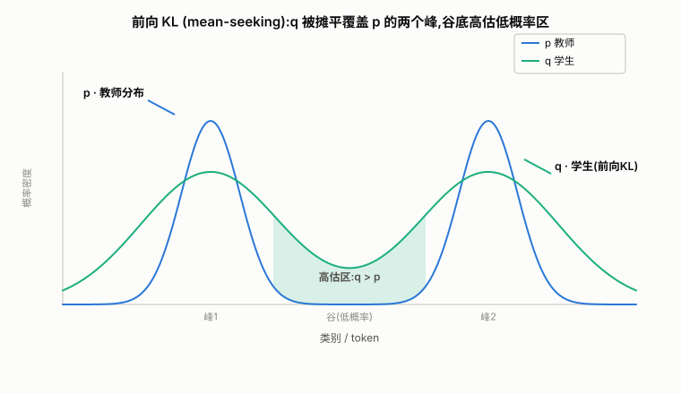

# 知识蒸馏学习笔记

> 本文件记录 LLM 知识蒸馏学习过程中的关键问答与推导。项目主文档见 [README.md](README.md)，相关代码在 [utils.py](utils.py)（`compute_fkl` / `compute_rkl` / `compute_skewed_*`）。


正向KL散度与反向KL散度 https://zhuanlan.zhihu.com/p/684801999

## 目录

- [一、前向 KL 为什么会"高估低概率位置"](#一前向-kl-为什么会高估低概率位置)
- [二、`compute_fkl` 代码逐行解析](#二compute_fkl-代码逐行解析)
- [三、温度蒸馏的 T² 补偿](#三温度蒸馏的-t-补偿)

---

## 一、前向 KL 为什么会"高估低概率位置"

### 背景问题

MiniLLM 论文提到：前向 KL 散度可能会使学生模型高估教师模型中概率较低的位置。结合公式：

```
KL(p‖q) = Σ_x  p(x) · log( p(x) / q(x) )
                └────┬────┘
              每一项的"权重"
```

p 为教师分布，q 为学生分布。论文的论证是：当 p 增大时，为使 KL 小，q 也需增大；但当 p→0 时，无论 q 取何值该项都很小，起不到优化 q 的效果，从而可能使 q 高估 p 中概率低的位置。下面拆解这句话。

### KL 越小越好

在蒸馏训练中，KL 散度作为**损失函数**，目标是**最小化**它（越小代表 q 越逼近 p）。训练意义上：**KL 越小越好**。

但要分清：KL 数值小只是"q 拟合 p 拟合得好"，不直接等于"学生模型最终性能好"。这里讨论的是 q 在某些位置**拟合方式有偏差**，属于拟合偏差问题，不是 KL 数值大小的问题。

### 拆解：权重不对称导致的不对称约束

关键在于每一项前面都乘了权重 `p(x)`，导致对不同位置的约束力度不对称。

**第一层——p 大的地方 → 强约束**
当 `p(x)` 很大时该项权重很大。若 `q(x)` 没跟上（比 p 小很多），`log(p/q)` 会很大，被大权重 `p(x)` 放大 → 整个 KL 飙升。所以优化器会拼命让这些位置的 q 跟上 p。

**第二层——p 小的地方 → 几乎无约束**
当 `p(x)→0` 时，权重 `p(x)→0`，整项 `p(x)·log(p(x)/q(x))→0`，对总 KL 的贡献近乎为零，于是优化器对这些位置的 `q(x)` 基本不管。

> 纠正原文一处不严谨表述："无论 q 取任何值，KL 都比较小" 应理解为"对 q 几乎没有梯度约束"，而非"KL 小"。严格地说，`p(x)·log(p/q)` 是 `0·∞` 不定式：当 `p(x)=0` 时按约定 `0·log0=0`；当 `p(x)` 是很小的正数时该项确实可忽略。

**第三层——为什么"无约束"会变成"高估"**
这是最关键的一跳。单看第二层只会得出"q 在低概率区随便取值"，但为什么会"高估"（`q(x)>p(x)`）？因为 q 是**全局耦合**的概率分布（softmax 参数化，所有位置之和=1），不可能在 p 高处认真拟合、又在 p 低处精确归零。三因素叠加：

1. q 在 p 高处被强约束着堆足概率质量；
2. q 在 p 低处又没人管；
3. q 分布有"平滑性"和"总和=1"约束，概率质量得从某些地方匀出来。

结果：q 在 p 低的那些位置容易堆出比 p 更多的概率质量 → `q(x)>p(x)` → 高估了 p 中概率低的位置。

### 直觉例子：双峰分布

假设教师 p 是双峰分布（两个高峰，中间一个低概率的"谷"）：



> 蓝线 p = 教师（尖双峰）；绿线 q = 学生（前向 KL 拟合）。q 被摊平以同时覆盖两个峰，故峰处略低于 p（质量被匀走），谷底反而高于 p（绿色阴影区）——即"高估低概率位置"。

- 前向 KL 要求 q **同时覆盖 p 的所有高峰**（任何一峰没覆盖，那个 `p(x)>0` 处的 `log(p/q)→∞` 会把 KL 顶爆）。
- 但 q 是受限/平滑的分布，没法在两峰处尖耸、又在谷处精确归零，只能"摊平"着覆盖。
- 于是谷处（p 小）`q(x)>p(x)` = 高估低概率位置。

这正是"前向 KL 是 **mean-seeking**（均值搜索），更倾向于拟合多峰"的含义（见 [README.md](README.md) 配图 `fkl.png`）。

### 那为什么不用反向 KL

MiniLLM 的核心动机在此。反向 KL 把 q 和 p 换位置：

```
KL(q‖p) = Σ_x  q(x) · log( q(x) / p(x) )
                └────┬────┘
               权重是 q,不是 p
```

它变成 **mode-seeking**（众数搜索）：q 必须躲开 p 低的地方（否则 `q(x)·log(q/p)` 在 p 小处会很大），所以 q 会收缩到 p 的某个高峰上，不再高估低概率区。

但反向 KL 也有自己的坑（高方差、梯度不稳、可能只锁定一个峰丢掉其他峰），所以 MiniLLM 用了策略梯度 + 长尾修正等技巧稳定训练。

> **一句话总结**：前向 KL 对 p 大处强约束、对 p 小处无约束，叠加 q 分布的全局平滑性，使 q 容易在 p 的低概率区堆出过多概率质量，即"高估 p 中概率低的位置"。

---

## 二、`compute_fkl` 代码逐行解析

> 代码见 [utils.py](utils.py) 的 `compute_fkl`。它计算前向 KL `KL(p‖q)`（p=教师、q=学生），对每个 token 算一个 KL 值，屏蔽 padding，再按样本聚合。

### 函数签名与张量形状

```python
def compute_fkl(logits, teacher_logits, target, padding_id, reduction="sum", temp=1.0):
    # logits / teacher_logits: [batch, seq_len, vocab]
    # target:                   [batch, seq_len]   用于定位 padding
    # reduction: "sum" 按样本求和 / "mean" 按真实 token 平均
```

### 逐段解释

**① 温度缩放** `logits / temp`
除以温度 T（>1）让 softmax 变平滑，把"教师把极小概率也给出来"的**暗知识**（dark knowledge，类间相对大小）放大，学生才能学到。T=1 时退化为普通软标签。

**② 算 p、q、log p、log q**
用 `log_softmax` 而非 `log(softmax(...))`，是为**数值稳定**（避免 log(0)）。`dtype=torch.float32` 是因为 bf16/fp16 下 `log_softmax` 在尾部小概率区会丢精度甚至产生 NaN，蒸馏场景必须升精度算。

**③ 核心公式** `teacher_probs * (teacher_log_probs - log_probs)`
展开即 `p·(log p - log q) = p·log(p/q)`，对 vocab 维求和即 `KL(p‖q)`。手写展开而非调用 `torch.distributions.kl`，更省显存、可控。

**④ `kl.sum(-1)`** → `[batch, seq_len]`，每个 token 一个 KL 值。

**⑤ padding 屏蔽** `pad_mask = target.eq(padding_id)` + `masked_fill_`
padding 不是真实 token，其 KL 不该算进损失，置 0。下划线 `masked_fill_` 是**原地**操作（对比同文件 rkl 用的非原地 `masked_fill`，功能等价但省显存）。

**⑥ reduction**
- `sum`：seq 维求和 → `[batch]`，每样本一个标量（长样本 loss 自然更大）。
- `mean`：除以 `(~pad_mask).sum(dim=1)`（真实 token 数）→ 按 token 平均，长样本不被过度惩罚。

### 数值例子（单 token，vocab=4）

教师 logits = `[2.0, 1.0, 0.5, -1.0]`，学生 logits = `[1.0, 1.0, 1.0, 1.0]`，T=1：

| | token0 | token1 | token2 | token3 |
|---|---|---|---|---|
| 教师 p | 0.6095 | 0.2242 | 0.1360 | 0.0303 |
| 学生 q | 0.25 | 0.25 | 0.25 | 0.25 |

逐项 `p·(log p - log q)` 求和：

```
token0: 0.6095 × (log0.6095 − log0.25) = 0.6095 × 0.8907  = +0.5428
token1: 0.2242 × (log0.2242 − log0.25) = 0.2242 × (-0.1098)= -0.0246
token2: 0.1360 × (log0.1360 − log0.25) = 0.1360 × (-0.6091)= -0.0828
token3: 0.0303 × (log0.0303 − log0.25) = 0.0303 × (-2.1096)= -0.0640
                                                       求和 ≈ 0.3719
```

代码验证（用标准库 `math` 复现逻辑）：`KL=0.3719`，学生=教师时 `KL=0`，与手算一致。

> 注意 token3：教师只给 0.0303 概率，学生却给了 0.25——学生在教师低概率处放了过多质量，正是第一节讨论的"高估低概率位置"，学生未训练好时尤其明显。

### 张量形状流转（batch=2, seq=3, vocab=4, padding_id=0）

```
target = [[5, 7, 0],      ← 样本0: 2个真实token + 1个padding
          [5, 0, 0]]      ← 样本1: 1个真实token + 2个padding

步骤                        形状            说明
─────────────────────────────────────────────────────────
logits / teacher_logits     [2, 3, 4]       输入
log_softmax(logits)         [2, 3, 4]       log q
teacher_probs               [2, 3, 4]       p
kl = p*(log p - log q)      [2, 3, 4]       逐元素
kl.sum(-1)                  [2, 3]          每个 token 一个 KL  [t0,t1,t2]
                                                              [t0,t1,t2]
pad_mask = target.eq(0)     [2, 3] bool     [[F,F,T],[F,T,T]]
masked_fill_ → 置0          [2, 3]          padding 位的 KL 变 0
                            ↓
reduction="sum":
  kl.sum(dim=1)             [2]             [t0+t1,  t0]   ← 样本0含2token,样本1含1token

reduction="mean":
  kl.sum(dim=1)/真实token数  [2]            [(t0+t1)/2,  t0/1]
                                           ← 按各自真实 token 数平均
```

`mean` 让长短样本处在同一量级，训练更稳；`sum` 让长样本贡献更大 loss（等价按 token 加权）。

### 注意事项

1. **`dtype=torch.float32`**：教师分布尾部常有小概率，bf16/fp16 下 `log_softmax` 会截断为 0 再取 log → NaN。强制升 float32 是标准做法。
2. **`masked_fill_` vs `masked_fill`**：本函数用原地版本省显存，同文件 `compute_rkl` 用非原地版本，功能等价，建议统一风格。
3. **缺少 `T²` 补偿**：见第三节。
4. **前向 ↔ 反向对照**（串联上下文）：
   - `compute_fkl`：`teacher_probs * (teacher_log_probs - log_probs)` = `KL(p‖q)` **前向**，mean-seeking，高估低概率处。
   - `compute_rkl`：`probs * (log_probs - teacher_log_probs)` = `KL(q‖p)` **反向**，mode-seeking，规避高估但梯度不稳。
   - `compute_skewed_*`：GKD 思路，按 `skew_lambda` 混合 p、q 后再算 KL，缓解 student-teacher mismatch 导致的训练不稳。

---

## 三、温度蒸馏的 T² 补偿

### 问题

`compute_fkl` 里做了 `logits / temp`（温度软化），但返回的 KL **没乘 `T²`**。严格温度蒸馏的损失应写作 `T² · KL(p_T ‖ q_T)`。这一节解释：为什么是 `T²`、什么时候无所谓、什么时候必须补。

### 为什么梯度缩 `1/T²`（二分类推导）

设学生 logit 差 `b`，教师 logit 差 `a`，温度 `T`。软交叉熵损失对 `b` 求导：

```
L = -p·log σ(b/T) - (1-p)·log σ(-b/T),   p=σ(a/T), q=σ(b/T)

∂L/∂b = (1/T) · (q - p)
         └─┬─┘   └─┬──┘
      第一层 1/T   第二层: q-p 本身也随 T 缩小
```

**第一层 `1/T`**：损失通过 `b/T` 依赖 `b`，链式法则天然带来一个 `1/T`。

**第二层 `q-p` 也缩 `~1/T`**：`q-p = σ(b/T) - σ(a/T)`。sigmoid 的斜率 `σ'(x)` 在温度下被 `1/T` 拉平，所以误差信号 `q-p` 本身也比 T=1 时小约 `1/T` 量级。

两层相乘 → 梯度量级 ~ `1/T²`。这正是 Hinton 原文 "the magnitudes of the gradients produced by the soft targets scale as 1/T²" 的由来。

### 数值验证（a=3, b=0）

| T | grad | 相对 T=1 | 1/T | 1/T² |
|---|---|---|---|---|
| 1 | -0.45257 | 1.0000 | 1.0000 | 1.0000 |
| 2 | -0.15879 | 0.3509 | 0.5000 | 0.2500 |
| 4 | -0.04479 | 0.0990 | 0.2500 | 0.0625 |
| 8 | -0.01158 | 0.0256 | 0.1250 | 0.0156 |

T 越大，相对量级越接近 `1/T²`（T=8 时 0.0256 ≈ 1/64=0.0156，比 1/T=0.125 贴近得多）。

### "不改变优化方向"的含义

若训练时**只有蒸馏 loss**（无 CE），乘不乘 `T²` 区别只是把整个 loss/梯度乘了个常数 `1/T²`：

- **SGD**：梯度整体乘常数 → 更新方向不变，只是步长变了，用学习率可抵消。
- **Adam**：Adam 会除以梯度二阶矩做归一化，常数缩放被 `m/√v` 抵消，更新几乎完全不变。

所以单独用 `compute_fkl` 当主损失时，缺 `T²` **无关紧要**，优化轨迹本质不变。

### "和 CE 加权时系数含义受影响"——核心问题

实际蒸馏 loss 几乎总是软硬目标加权：

```
L = CE + α · KL_T            ← 代码现状(没乘 T²), KL_T 梯度量级 ≈ CE 的 1/T²
L = CE + α · T² · KL_T       ← Hinton 标准形式
```

`α` 是设定的"软目标占多大权重"。但没乘 `T²` 时，软目标**实际**贡献的梯度量级是 `α · (1/T²) · |CE梯度|`。你以为 `α=1.0` 是"软硬各半"，但 `T=4` 时软目标实际只占 `1/16`，几乎不起作用。

设 CE 特征梯度量级为 `G`，`T=4`：

| 写法 | 软目标梯度实际量级 | α=1.0 时软:硬 |
|---|---|---|
| 代码现状（没乘 T²） | `α · G/16` | 1:16 → 软目标被淹没 |
| 补 T²：`CE + α·T²·fkl` | `α·16·G/16 = α·G` | 1:1 → 真正各半 |
| 不补 T² 但 α 调成 16 | `16·G/16 = G` | 1:1 → 等价上一行 |

"系数含义受影响" =：`α` 这个超参的实际效果被 `1/T²` 隐式打折。你以为在调软硬比例，实际调出的是 `α/T²`；温度一变，`α` 的语义就漂移。Hinton 强调乘 `T²`，就是为了让 `α` 的含义不随 `T` 变化。

### 结论与建议

- 若训练脚本**只用** `compute_fkl`（纯蒸馏）→ 没问题，无所谓补不补。
- 若是 `CE + α · compute_fkl(temp=T)` 加权 → `α` 实际效果被 `1/T²` 打折。要么把 `α` 调大 ~`T²` 倍，要么改 loss 为 `CE + α·(T**2)·compute_fkl(...)`。

> 待办：检查训练脚本实际是纯蒸馏还是 `CE+α·KL` 加权、`temp` 与 `α` 如何传入，从而判断此 `T²` 缺失在本项目里的实际影响。
