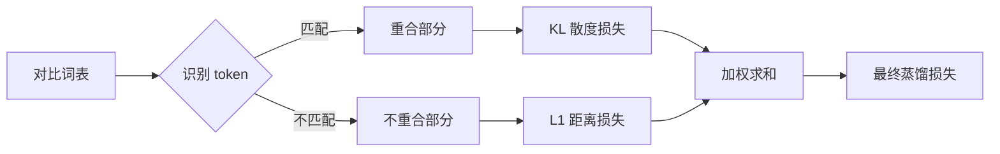
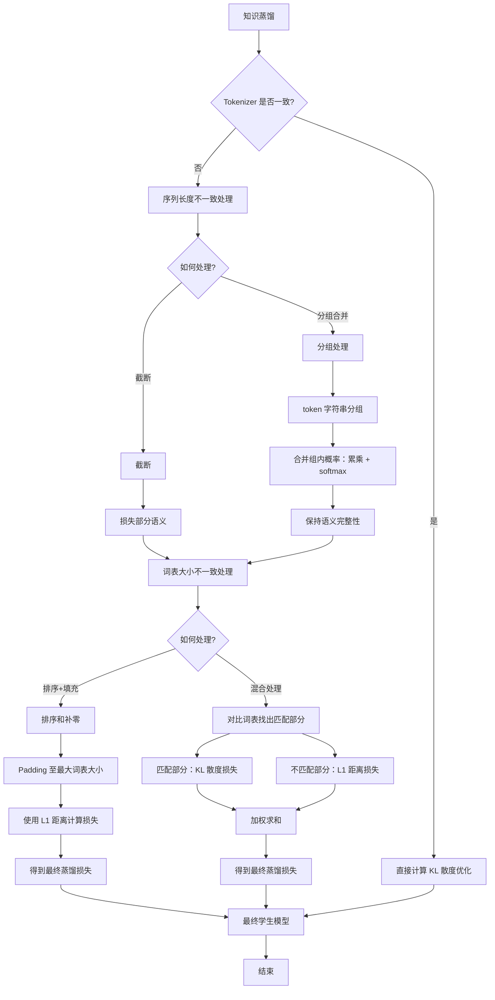

# Cross Tokenizer Distillation

## 🎯 两种主要蒸馏方法

### 📝 Text Distillation（黑盒蒸馏）

- **工作原理**

教师模型生成数据微调学生模型，对教师模型和学生模型的词表没有任何限制。本质是微调，将教师模型的输出作为真实标签，通过交叉熵损失进行优化。

### 🔍 Logits Distillation（白盒蒸馏）

- **工作原理**：对齐学生模型和教师模型的输出概率分布。

---

## 📊 Tokenizer 一致的情况

Tokenizer 一致时，教师模型和学生模型对于同一序列进行分词之后得到的 token ids 长度是一致的，且词表大小也是一致的。两个模型输出的 `logits[bs, seq_len, vocal_size]` 形状也是一致的，转换成概率分布之后即可通过 KL 散度进行对齐优化。

---

## ⚠️ Tokenizer 不一致的情况

当 Tokenizer 不一致时，对于同样的一条序列，经过两个 Tokenizer 编码之后得到的 token id 是不一致的，长度也不一致，并且词表大小也是不一致的。

参考如下表格：

| 模型 | 输入 | 分词结果 | 解码结果 | 词表大小 |
| --- | --- | --- | --- | ---: |
| Qwen2.5 | 偷星九月333 | `[101329, 77419, 99609, 9754, 18, 18, 18]` | `['偷', '星', '九', '月', '3', '3', '3']` | 151643 |
| GLM4 | 偷星九月333 | `[101379, 98978, 114687, 121577]` | `['偷', '星', '九月', '333']` | 151329 |

这两个不一致导致了两个模型输出的 logits 形状不同，无法直接通过 KL 散度进行优化对齐。

针对这两个问题如何进行处理呢？

### 🛠️ 序列长度不一致的处理

#### 方法一：截断处理

截断是最简单的做法，获取两者 token ids 长度的较小者作为截断长度，对原始序列进行截断。

```python
min_length = min(len(student_token_ids), len(teacher_token_ids))
student_aligned = student_probs[:min_length, :]
teacher_aligned = teacher_probs[:min_length, :]
```

截断之后：

- 🟡 Qwen2.5：`[101329, 77419, 99609, 9754]` → `['偷', '星', '九', '月']`
- 🟡 GLM4：`[101379, 98978, 114687, 121577]` → `['偷', '星', '九月', '333']`

这样会损失一部分语义，某些情况下语义损失会更严重。

#### 方法二：分组合并 🎯

分组合并的处理方式就是按照 token（不是 token id，而是 token str）进行 token id 的分组。因为 token str 是固定的，按照 token str 进行分组合并最终得到的长度也是固定的。

进行分组之后可得到如下结果：

- 🟢 Qwen2.5：`[[101329], [77419], [99609, 9754], [18, 18, 18]]`
- 🟢 GLM4：`[[101379], [98978], [114687], [121577]]`

对应关系：

```text
组1：[101329]        ↔ [101379]   # '偷'
组2：[77419]         ↔ [98978]    # '星'
组3：[99609, 9754]   ↔ [114687]   # '九月'
组4：[18, 18, 18]    ↔ [121577]   # '333'
```

有些组内是一个 token，有些组内不止一个 token，每个 token 都有一个概率分布，如何处理它们的概率呢？

一个简单的做法就是将组内 token 的概率进行累乘，累乘之后需要进行 softmax，因为需要保证其仍然是一个概率分布。

这样，我们在序列长度维度就实现了对齐。

---

## 📉 词表大小不一致的处理

针对词表大小不一致的情况有如下处理方法：

### 方法一：排序填充法

先在第三个维度（词表维度，这一维度是词表中每个词的概率）按照概率大小进行降序排序。

然后对第三个维度进行 padding，padding 长度取较大词表的长度，填充值为 0。

最后使用 L1 距离衡量二者差异。

```python
student_sorted = student_aligned.sort(dim=-1, descending=True).values
teacher_sorted = teacher_aligned.sort(dim=-1, descending=True).values

student_vocab_size = student_sorted.size(-1)
teacher_vocab_size = teacher_sorted.size(-1)
max_vocab_size = max(student_vocab_size, teacher_vocab_size)

if student_vocab_size < max_vocab_size:
    student_sorted = F.pad(
        student_sorted,
        (0, max_vocab_size - student_vocab_size),
    )
if teacher_vocab_size < max_vocab_size:
    teacher_sorted = F.pad(
        teacher_sorted,
        (0, max_vocab_size - teacher_vocab_size),
    )

aligned_loss = F.l1_loss(
    student_sorted,
    teacher_sorted,
    reduction="sum",
)
```

#### 为什么先排序再计算 `l1_loss`？

**未匹配到的 token 没有自然的对应关系，计算其 KL 散度意义不大，所以先对概率进行排序。实际上是在比较两个分布的总体形状，而不是逐个对应。**

---

这段方法的核心是：当学生和教师词表中的 token 没有一一对应关系时，不比较具体 token，而比较两个概率分布的整体形状。

假设某个序列位置上：

```python
student_aligned = [[0.10, 0.60, 0.05, 0.25]]
teacher_aligned = [[0.02, 0.55, 0.01, 0.30, 0.08, 0.04]]
```

学生词表大小为 4，教师词表大小为 6。由于两边 token id 和 token 语义不一致，不能直接比较：

```text
学生第 1 个 token 的概率 0.10
教师第 1 个 token 的概率 0.02
```

这两个位置可能对应完全不同的 token。

### 第一步：按概率从大到小排序

```python
student_sorted = [0.60, 0.25, 0.10, 0.05]
teacher_sorted = [0.55, 0.30, 0.08, 0.04, 0.02, 0.01]
```

排序后：

- 第 1 位表示分布中概率最大的 token；
- 第 2 位表示概率第二大的 token；
- 后续位置依此类推。

因此，比较的是“最大概率、第二大概率……”的形状，而不是具体 token。

### 第二步：对较短的学生分布补零

教师词表有 6 个位置，学生词表只有 4 个位置：

```python
student_sorted = [0.60, 0.25, 0.10, 0.05, 0.00, 0.00]
teacher_sorted = [0.55, 0.30, 0.08, 0.04, 0.02, 0.01]
```

对应代码：

```python
student_sorted = F.pad(
    student_sorted,
    (0, 6 - 4),
)
```

补零后，两边的形状都变成 `[1, 6]`，可以进行逐元素比较。

### 第三步：计算 L1 距离

```python
aligned_loss = (
    abs(0.60 - 0.55)
    + abs(0.25 - 0.30)
    + abs(0.10 - 0.08)
    + abs(0.05 - 0.04)
    + abs(0.00 - 0.02)
    + abs(0.00 - 0.01)
)
```

结果为：

```text
0.05 + 0.05 + 0.02 + 0.01 + 0.02 + 0.01 = 0.16
```

因此，该位置的 L1 损失是：

```python
aligned_loss = 0.16
```

如果输入是多个序列位置，例如形状为：

```text
student_aligned: [seq_len, student_vocab_size]
teacher_aligned: [seq_len, teacher_vocab_size]
```

那么 `reduction="sum"` 会把所有序列位置和所有排序后的概率位置的差异全部加起来。

### 为什么不能直接使用 KL 散度？

KL 散度要求两个分布的每个维度具有相同含义。例如：

```text
P = [“猫”, “狗”, “鸟”]
Q = [“猫”, “狗”, “鸟”]
```

此时可以计算 KL。

但跨 tokenizer 时可能是：

```text
学生词表：[“猫”, “狗”, “鸟”]
教师词表：[“猫”, “小狗”, “飞鸟”, “汽车”]
```

两边的第一个、第二个位置不一定代表相同 token。直接计算 KL 会把没有语义对应关系的概率强行放在一起比较。

排序后则变成：

```text
学生：[最大概率, 第二大概率, 第三大概率, ...]
教师：[最大概率, 第二大概率, 第三大概率, ...]
```

此时比较的是两个概率分布的整体形状：

- 两边都集中在少数 token 上：损失较小；
- 一边很尖锐，另一边很平均：损失较大。

这种方法的代价是丢失了 token 的具体语义，只能判断概率分布的形状是否相似。因此它适合处理无法建立 token 映射的 unmatched 部分，而不适合替代有明确 token 对应关系时的 KL 散度。

---

这个排序的目的，是把“没有语义对应关系的 token 维度”转换成“概率排名维度”，从而可以比较两个分布的整体形状。

假设学生和教师的 token 顺序完全不同：

```text
学生概率：[0.60, 0.25, 0.10, 0.05]
教师概率：[0.10, 0.05, 0.60, 0.25]
```

这两个分布其实包含完全相同的概率集合，只是 token 的位置不同。

如果不排序，直接计算 L1：

```text
|0.60 - 0.10|
+ |0.25 - 0.05|
+ |0.10 - 0.60|
+ |0.05 - 0.25|
= 1.40
```

损失会很大，但这只是因为 token 排列顺序不同。

排序后：

```text
学生：[0.60, 0.25, 0.10, 0.05]
教师：[0.60, 0.25, 0.10, 0.05]
```

L1 损失为：

```text
0
```

这说明排序的作用是：

- 第 1 个位置比较两个分布的最大概率；
- 第 2 个位置比较两个分布的第二大概率；
- 第 3 个位置比较两个分布的第三大概率；
- 不再比较具体 token id。

也就是说，它把：

```text
token id -> 概率
```

转换成：

```text
概率排名 -> 概率值
```

这样就能比较：

```text
学生分布是否和教师分布一样尖锐？
学生和教师的高概率区域是否相似？
两边的概率质量是否集中在相同数量的 token 上？
```

但要注意：排序会丢失 token 的具体语义。例如学生的最大概率 token 是“猫”，教师的最大概率 token 是“汽车”，排序后它们仍然会被放在同一个位置比较。

因此：

- 有明确 token 对应关系的部分：使用 KL 散度；
- 没有 token 对应关系的部分：排序后使用 L1，比较概率分布的总体形状。

所以，排序不是为了恢复 token 的语义对应，而是为了消除不同词表中 token 排列顺序带来的干扰。

### 方法二：混合处理法 🎯

对比教师模型和学生模型的词表，找出两个词表中一致的部分（token 对应的文本一致即可，不考虑 token id 是否一致）。

对于两个词表中重合的部分（match）使用 KL 散度计算损失；对于不重合的部分（unmatch）使用 sort + pad 的方式，通过 L1 距离计算损失；最后对两部分损失进行加权，得到最终的蒸馏损失。

处理流程：



---

混合处理法的核心思想是：

> 能明确知道两个 token 表示相同文本时，直接比较它们；无法知道对应关系时，只比较概率分布形状。

下面只看一个已经完成序列对齐的位置。

## 1. 两个模型的词表

学生模型词表：

| token | student id |
|---|---:|
| 猫 | 0 |
| 狗 | 1 |
| 跑 | 2 |
| 红 | 3 |
| `<unk>` | 4 |

教师模型词表：

| token | teacher id |
|---|---:|
| 猫 | 10 |
| 狗 | 11 |
| 鸟 | 12 |
| 跑 | 13 |
| 蓝 | 14 |

虽然 token id 不同，但通过 token 文本可以找到匹配关系：

```text
教师 10（猫） -> 学生 0（猫）
教师 11（狗） -> 学生 1（狗）
教师 13（跑） -> 学生 2（跑）
```

因此：

```text
match   = 猫、狗、跑
unmatch = 学生侧：红、<unk>
          教师侧：鸟、蓝
```

## 2. 模型输出的概率

学生模型输出：

```text
猫       狗       跑       红       <unk>
0.50    0.20    0.10    0.15     0.05
```

教师模型输出：

```text
猫       狗       鸟       跑       蓝
0.45    0.25    0.10    0.10    0.10
```

## 3. matched 部分使用 KL 散度

只取文本相同的 token，并按照对应关系排列：

```text
学生 matched：[猫 0.50, 狗 0.20, 跑 0.10]
教师 matched：[猫 0.45, 狗 0.25, 跑 0.10]
```

因为我们知道：

```text
学生的“猫” ↔ 教师的“猫”
学生的“狗” ↔ 教师的“狗”
学生的“跑” ↔ 教师的“跑”
```

所以可以使用 KL 散度比较：

```python
matched_loss = KL(teacher_matched, student_matched)
```

严格计算时，通常需要先对 matched 子分布重新归一化。例如：

```text
学生：[0.50, 0.20, 0.10] / 0.80
     = [0.625, 0.25, 0.125]

教师：[0.45, 0.25, 0.10] / 0.80
     = [0.5625, 0.3125, 0.125]
```

这部分 KL 约为：

```text
0.0105
```

## 4. unmatched 部分使用排序 + padding + L1

不匹配的 token 没有自然对应关系：

```text
学生 unmatched：[红 0.15, <unk> 0.05]
教师 unmatched：[鸟 0.10, 蓝 0.10]
```

不能认为：

```text
学生的“红” ↔ 教师的“鸟”
学生的“<unk>” ↔ 教师的“蓝”
```

因此先忽略 token 身份，只保留概率形状：

```text
学生排序后：[0.15, 0.05]
教师排序后：[0.10, 0.10]
```

两个长度相同，不需要 padding。

然后计算 L1：

```text
unmatched_loss
= |0.15 - 0.10| + |0.05 - 0.10|
= 0.05 + 0.05
= 0.10
```

## 5. 对两部分损失加权

教师词表大小为 5，其中有 3 个 token 可以匹配，因此可以设置：

```text
matched_weight   = 3 / 5 = 0.6
unmatched_weight = 1 - 0.6 = 0.4
```

最终损失：

```text
total_loss
= 0.6 * matched_loss
+ 0.4 * unmatched_loss

= 0.6 * 0.0105
+ 0.4 * 0.10
≈ 0.0463
```

对应流程就是：

```text
词表匹配
   ├── token 文本相同
   │      └── KL 散度
   │
   └── token 文本不同
          └── 排序 + padding + L1

两部分损失
   └── 加权求和
          └── 最终蒸馏损失
```

这样做的好处是：

- matched 部分保留了明确的 token 语义信息；
- unmatched 部分避免强行建立错误的 token 对应关系；
- 两种损失结合后，同时利用了语义对应和概率分布形状信息。

## Tokenizer/词表不一致时的知识蒸馏流程



---