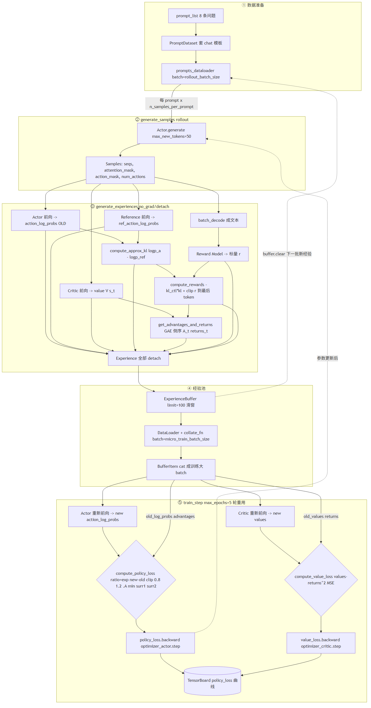

# PPO 学习笔记：从公式、图片到代码

> 配套源码：[`ppo_train.py`](./ppo_train.py)  
> 数据流图：[`ppo_flow.png`](./ppo_flow.png)  
> 训练曲线：[`ppo.png`](./ppo.png)

这份笔记解释本目录代码实际执行的 PPO，而不只是介绍抽象算法。先记住一句话：

> 用旧 Actor 生成回答并计算 advantage；新 Actor 提高好动作的概率、降低坏动作的
> 概率，但通过 PPO clip 限制一次更新的幅度。

---

## 0. 符号表（先看这个，后面公式都靠它）

### 0.1 三个策略（最易混）

| 符号 | 是谁 | 会不会变 | 用在哪 |
|---|---|---|---|
| $\pi_\theta$ | **当前** Actor（参数 $\theta$） | 会，训练中每步更新 | train_step 里重新前向得到的"NEW" |
| $\pi_{old}$ | **采样时刻**的 Actor 快照 | 不变（detach 固定） | PPO ratio 的分母；KL 的一端 |
| $\pi_{ref}$ | **冻结**的参考模型（初始模型） | 不变 | KL 的另一端，防止 Actor 漂移过远 |

> 关键区分：**KL 比较 $\pi_{old}$ vs $\pi_{ref}$**（采样 Actor vs 参考模型）；
> **PPO ratio 比较 $\pi_\theta$ vs $\pi_{old}$**（新 Actor vs 采样 Actor）。
> 在 `generate_experiences` 里 $\pi_\theta=\pi_{old}$（还没更新），所以 KL 用 $\pi_\theta$ 写也对；
> 到 `train_step` 里 $\pi_\theta$ 已更新，$\pi_{old}$ 仍是快照——ratio 就来自这一对。

### 0.2 三个奖励（粒度不同）

| 符号 | 是什么 | code 变量 | 形状 |
|---|---|---|---|
| $R$ | RM 对**整条回复**打的一个标量分 | `r` | `[B, 1]` |
| $r_t$ | **逐 token 奖励** = KL 罚 + 末 token 加 $R$ | `rewards` | `[B, num_actions]` |
| $k_t$ | 逐 token 近似 KL $=\log\pi_{old}-\log\pi_{ref}$ | `kl` | `[B, num_actions]` |

> $r_t = -\beta k_t + \mathbf{1}[t=T]\,\text{clip}(R,-c,c)$：每个 token 都背 KL 罚，只有最后一个真实 token 额外加 RM 分。

### 0.3 价值/优势/回报

| 符号 | 是什么 | code 变量 |
|---|---|---|
| $V(s_t)$ 或 $V_t$ | Critic 估计的状态价值（参数 $\phi$） | `values` / `old_values` |
| $\delta_t$ | TD 误差 $=r_t+\gamma V_{t+1}-V_t$ | `delta` |
| $A_t$ | GAE 优势 $=\delta_t+\gamma\lambda A_{t+1}$ | `advantages` |
| $G_t$ | 目标回报 $=A_t+V_t$（Critic 的拟合目标） | `returns` |

### 0.4 超参符号 ↔ 代码

| 符号 | 含义 | code |
|---|---|---|
| $\gamma$ | 折扣因子 | `gamma`（代码 0.1） |
| $\lambda$ | GAE 平滑因子 | `lambd`（代码 0.2） |
| $\beta$ | KL 罚系数 | `kl_ctl`（代码 0.1） |
| $c$ | RM 分数 clip 范围 | `clip_reward_value`（代码 0.2） |
| $\epsilon$ | PPO ratio clip 范围 | `clip_eps`（代码 0.2，区间 $[1-\epsilon,1+\epsilon]=[0.8,1.2]$） |
| $\rho_t$ | **PPO 概率比** $=\pi_\theta/\pi_{old}=\exp(\log\pi_\theta-\log\pi_{old})$ | `ratio` |

> 注意：$\rho_t$（概率比）和 $r_t$（奖励）是**两回事**，本文用 $\rho$ 专指概率比，把 $r$ 让给奖励，避免混淆。

### 0.5 其它

| 符号 | 含义 |
|---|---|
| $s_t$ | 状态 = prompt + 已生成前缀 |
| $a_t$ | 动作 = 下一个 token |
| $T$ | response 的最后一个有效 token 位置 |
| $m_{b,t}$ | `action_mask`（response 段有效 token 为 1） |
| $\mathcal H$ | 策略熵（鼓励探索；本代码未用） |
| $c_v, c_e$ | value loss / entropy 的权重（教科书 PPO；本代码未合并） |

---

## 1. 把语言模型生成看成强化学习

- 状态 $s_t$：prompt 加上已生成的前缀。
- 动作 $a_t$：下一个 token。
- 策略 $\pi_\theta(a_t\mid s_t)$：Actor 给下一个 token 的概率。
- 轨迹 $\tau$：一条完整 response。
- 奖励 $R(x,y)$：Reward Model 对完整回答给出的偏好分数。

代码使用四个模型：

| 模型 | 数学角色 | 输出 | 是否更新 |
|---|---|---|---|
| Actor | $\pi_\theta$ | token 概率 | 是 |
| Reference | $\pi_{ref}$ | 原始模型的 token 概率 | 否 |
| Reward Model | $R(x,y)$ | 完整回答的标量分数 | 否 |
| Critic | $V_\phi(s_t)$ | 每个生成位置的价值 | 是 |

Actor 回答“接下来生成什么”，Critic 估计“从当前状态出发，未来能得到多少收益”；
Reference 是防止策略漂移过远的锚点，Reward Model 是结果裁判。

**一个具体例子**（prompt = "1+1等于多少？"，回答 = "答案是2"）：

```text
t   状态 s_t（prompt+已生成前缀）            动作 a_t（下一个 token）
0   "1+1等于多少？"                           "答"
1   "1+1等于多少？答"                          "案"
2   "1+1等于多少？答案"                        "是"
3   "1+1等于多少？答案是"                      "2"
    ↑ 每步 Actor 给出 token 概率 π(a_t|s_t)，每步 Critic 给出价值 V(s_t)，
      整条回答结束后 RM 给一个标量分 R（比如 0.8，表示"这个回答不错"）。
```

所以一个"动作"就是生成一个 token，一条"轨迹"就是一整条 response。

---

## 2. 代码完整数据流



流程图对应五步：

1. `PromptDataset` 把问题包装成聊天模板。
2. `generate_samples` 用 Actor 生成 response，形成 rollout。
3. `generate_experiences` 计算旧策略概率、参考概率、价值、奖励、advantage 和 return。
4. `ExperienceBuffer` 保存、打乱经验。
5. `train_step` 重新前向 Actor/Critic，用 PPO loss 更新参数。

最重要的时间关系是：

```text
采样时的 Actor                    训练中的 Actor
      │                                │
      └─ old_action_log_probs          └─ new action_log_probs
                    \                  /
                     ratio = exp(new - old)
```

`old_action_log_probs` 在 `generate_experiences` 中用 `no_grad` 计算并 `detach`；
`new action_log_probs` 在 `train_step` 中重新计算，会随参数更新而改变。

### 2.1 `generate_samples` 的左填充与 response 掩码

`generate_samples` 把 `seqs` 构造成固定形状 `[B, max_length+max_new_tokens]`，里面混着三样东西：

```text
[  prompt(左填充)  |  response 真实生成  |  生成结束后补的 pad  ]
   ↑ 0~255              ↑ 256~305(最多50)        ↑ 凑满 306 的尾巴
```

#### 左填充由两处配合完成

**① 设置"左填充"方向 —— 在 `__main__` 里**：

```python
# decoder-only 模型批量生成通常使用左 padding，确保真实 prompt 末尾对齐。
actor_tokenizer.padding_side = "left"
```

这一句只改 tokenizer 的一个属性：`padding_side = "left"`。它本身不产生任何填充，只是告诉 tokenizer"以后填充时把 pad 加在左边"。这是"配置"，还没"执行"。

**② 真正执行填充 —— 在 `generate_samples` 里**：

```python
inputs = actor_tokenizer(
    prompts,
    padding="max_length",     # ← 触发填充：补到 max_length=256
    max_length=max_length,
    truncation=True,           # 超长就截断
    return_tensors="pt",
)
input_ids = inputs["input_ids"]   # [B, 256]，短 prompt 左侧补 pad_token_id
```

这里 `padding="max_length"` + `max_length=256` 才**真正把每条 prompt 补到 256**。因为前面设了 `padding_side="left"`，所以补的 `pad_token_id` 加在**左边**，真实 token 紧贴右侧。

**配合起来看（玩具例子）**：假设 `max_length=4`、`pad_token_id=0`，prompt `"1+1等于多少？"` tokenize 成 `[5, 6]`（只有 2 个 token）：

```text
设了 padding_side='left' 后，tokenizer(..., padding='max_length', max_length=4) 得到：

input_ids = [0, 0, 5, 6]     ← 左边补 2 个 pad，真实 token [5,6] 在右侧
            ↑  ↑   ↑  ↑
          pad pad  p0 p1

若不设（默认 'right'）→ [5, 6, 0, 0]，真实 token 在左、pad 在右。
```

**为什么 decoder-only 模型必须左填充**：批量生成时所有 prompt 拼成一个矩阵喂给模型，**最后一位（位置 255）是"下一个该生成的 token"的起始位置**。

- 左填充：真实 prompt 末尾对齐到**右侧**（位置 255 处）→ 所有样本的"生成起点"在矩阵同一列，`generate` 能从同一位置开始往后生成。
- 右填充：真实 prompt 末尾参差不齐地散在各列 → 生成起点列对不齐，批量生成会出错。

所以注释那句 *"确保真实 prompt 末尾对齐"* 就是这个意思：左填充让所有 prompt 的真实结尾都落在矩阵最右列，方便批量自回归生成。

**小结**：

| 步骤 | 位置 | 作用 |
|---|---|---|
| `actor_tokenizer.padding_side = "left"` | `__main__` | 配置填充方向为左（不产生填充） |
| `actor_tokenizer(prompts, padding="max_length", max_length=max_length, ...)` | `generate_samples` | 真正执行填充，把每条 prompt 补到 256，pad 在左 |

两者缺一不可：只设 `padding_side` 不调用填充没用；只调填充不设方向则默认右填充，批量生成会出问题。

#### 切出 response 段并构造 `action_mask`

`seqs` 形状固定 `[B, 306]`，但"真实生成"和"尾部 pad"都落在最后 50 列里，光看 `seqs` 分不出来（模型可能第 3 个 token 就遇到 EOS，剩下全 pad）。所以：

```python
# 从 input_ids.size(1)=256 开始都是 response
ans = seqs[:, input_ids.size(1):]                    # [B, 50]  只取 response 段（含 pad）
action_mask = ans.ne(pad_token_id).to(dtype=torch.long)  # [B, 50]  真实 token=1，pad=0
```

- `ans`：把 prompt 砍掉，只留 response 区域（固定 50 列宽）。
- `action_mask`：在 response 区域内标"真实 token=1、pad=0"，后续 loss 只在标 1 的位置算。

#### 玩具例子（`max_length=4`, `max_new_tokens=6`, `pad=0`, `eos=2`）

prompt `"1+1等于多少？"` tokenize 成 `[5,6]`，左填充补到 4；Actor 生成 `"答案2"` 后 EOS，剩下补 pad；拼成 `4+6=10`：

```text
seqs:  [0, 0, 5, 6, 10, 11, 12, 2, 0, 0]
索引:    0  1  2  3   4   5   6  7  8  9
         \__prompt/   \____response____/
```

切 response 段：

```text
ans = seqs[:, 4:] = [10, 11, 12, 2, 0, 0]      # 长度 6 = max_new_tokens
```

逐元素判断 `!= pad(0)`：

```text
ans:           [10, 11, 12, 2, 0, 0]
!= 0?          [ 1,  1,  1, 1, 0, 0]
action_mask =  [ 1,  1,  1, 1, 0, 0]
```

- `10/11/12` 真实生成的字 → 1
- `2` 是 EOS，`2 != 0` → **也算 1**（本代码把 EOS 当真实生成的 token，loss 覆盖它）
- 尾部 `0` 是 pad → 0

#### 几个量的关系（容易混）

| 量 | 值（本例） | 含义 | 怎么算的 |
|---|---|---|---|
| `ans` | `[10,11,12,2,0,0]` | response 区域（含 pad） | `seqs[:, 4:]` |
| `action_mask` | `[1,1,1,1,0,0]` | response 区域内真实 token 标 1 | `ans.ne(pad)` |
| `num_actions` | 6 | response 区域**宽度**（固定=max_new_tokens） | `action_mask.size(1)` |
| `response_length` | 4 | 每条**真实生成**的 token 数（含 EOS） | `action_mask.sum(-1)` |

注意 `num_actions=6` 是**区域宽度**，不是真实 token 数；它用来在 `generate_experiences` 里做切片 `[:, -num_actions:]` 取 log_probs 的最后 50 列。真实 token 数是 `response_length=4`。

#### `attention_mask` vs `action_mask`

```text
seqs:           [0, 0, 5, 6, 10, 11, 12, 2, 0, 0]
attention_mask: [0, 0, 1, 1,  1,  1,  1, 1, 0, 0]   ← 整条序列非 pad，长度 10
action_mask:                      [1, 1, 1, 1, 0, 0]   ← 只 response 段，长度 6
```

- `attention_mask` 喂给模型前向，告诉模型"整条里哪些位置是真实 token"（prompt 的 pad 也标 0）。
- `action_mask` 喂给 loss，告诉"**只在 response 的真实 token 上算损失**"，prompt 段和 response 的 pad 都不参与 loss。

### 2.2 `seqs` 是 tokenize 之后的整数 token id 张量

`generate_experiences` 里 `seqs = samples.seqs` 拿到的是 **tokenizer 之后的 token id 序列**（一个整数张量 `torch.LongTensor`），不是字符串。它一路都是整数 id，从来不会变回字符串——除非主动 decode。

#### 完整链条（从字符串到 seqs）

以 prompt `"1+1等于多少？"` 为例，配置 `max_length=4, max_new_tokens=6`：

```text
① 原始字符串
   "1+1等于多少？"

② PromptDataset 套 chat 模板              ← 还是字符串
   "<|im_start|>user\n1+1等于多少？<|im_end|>\n<|im_start|>assistant\n"

③ generate_samples 里 actor_tokenizer(...)  ← 这一步才 tokenize
   inputs['input_ids'] = [151644, 872, ...]  ← 变成整数 token id，左填充补到 256
                                                形状 [B, 256]

④ model.generate(input_ids, ...)            ← 自回归追加生成的 token id
   seqs = [prompt 的 id ...] + [生成的 a0,a1,...]  ← 仍然是整数 id
                                                形状 [B, 306]

⑤ 存进 Samples.seqs                         ← 就是上面那个整数张量

⑥ generate_experiences 里 seqs = samples.seqs  ← 读出来的就是 ④ 的整数 id
```

`seqs` 长这样（玩具数字）：

```text
seqs = [0, 0, 5, 6, 10, 11, 12, 2, 0, 0]
        ↑  ↑   ↑  ↑   ↑   ↑   ↑  ↑  ↑  ↑
       pad pad p0 p1  a0  a1  a2 eos pad pad
```

每个元素是一个**整数 token id**（词表里的下标），不是字、也不是字符串。

#### 反证：需要字符串时反而要"解码回去"

`generate_experiences` 里把 seqs 喂给 Reward Model 之前，因为 RM 吃的是文本，必须 **decode** 回字符串：

```python
seq_texts = actor_tokenizer.batch_decode(seqs, skip_special_tokens=True)
# seq_texts = ["1+1等于多少？答案是2"]   ← 从整数 id 解码回字符串
reward_model_inputs = reward_tokenizer(seq_texts, ...)   # RM 自己再 tokenize 一次
```

`batch_decode` 这个动作本身就说明 `seqs` 是 token id——只有 id 才需要"解码"成文本。而且注意 RM 用的是**另一个 tokenizer**（`reward_tokenizer`，DeBERTa 的），和 Actor 的 tokenizer 词表不同，所以必须先 decode 成通用字符串、再用 RM 的 tokenizer 重新编码。

#### 哪些量是 id、哪些是字符串

| 变量 | 类型 | 阶段 |
|---|---|---|
| `prompts`（原始/PromptDataset） | 字符串 | 输入 |
| `input_ids` | 整数 id 张量 `[B, 256]` | tokenize 后 |
| `seqs` | 整数 id 张量 `[B, 306]` | generate 后（= input_ids + 生成 id） |
| `seq_texts` | 字符串 list | `batch_decode(seqs)` 后，喂给 RM |
| `action_mask` / `attention_mask` | 0/1 张量 | 由 `seqs.ne(pad)` 构造 |

> 一句话：`seqs` 是 tokenize 之后、并拼上了生成结果的 **整数 token id 张量**；Actor/Reference/Critic 都直接吃整数 id 做前向，只有喂给 Reward Model 时才 decode 回字符串。

---

## 3. token 与 log probability 的错位

假设 prompt 有 3 个 token，response 有 2 个 token：

```text
位置                 0    1    2    3    4
seqs                [p0,  p1,  p2,  a0,  a1]
模型位置预测的下一个词  p1   p2   a0   a1
```

代码先对齐“当前位置预测下一个 token”：

```python
log_probs = F.log_softmax(logits[:, :-1, :], dim=-1)
log_probs_labels = log_probs.gather(
    dim=-1,
    index=seqs[:, 1:].unsqueeze(-1),
)
action_log_probs = log_probs_labels.squeeze(-1)[:, -num_actions:]
```

- `logits[:, :-1]` 去掉最后一个没有标签的位置；
- `seqs[:, 1:]` 去掉第一个 token；
- `gather` 从词表中取出实际生成 token 的 log probability；
- 最后只保留 response 对应的 $a_0,a_1$。

形状示例：`batch=2`、总长度 `306`、response 区域 `50` 时：

```text
logits                 [2, 306, vocab_size]
logits[:, :-1]         [2, 305, vocab_size]
log_probs_labels       [2, 305, 1]
action_log_probs       [2,  50]
action_mask            [2,  50]
```

`action_mask=0` 的位置是生成结束后的 padding，不参与 loss。

---

## 4. KL 惩罚与逐 token 奖励

### 4.1 采样动作上的近似 KL

`compute_approx_kl` 计算：

$$
k_t=\log\pi_{old}(a_t\mid s_t)-\log\pi_{ref}(a_t\mid s_t)
$$

它不是遍历词表求和的精确 KL，而是只在实际采样 token 上计算的 Monte Carlo 估计。

```text
Actor 对 token“2”的 logp      = -0.30
Reference 对 token“2”的 logp  = -0.40
k_t = -0.30 - (-0.40)         =  0.10
```

$k_t>0$ 表示 Actor 比 Reference 更偏好这个 token。`compute_rewards` 将它变成逐 token 奖励 $r_t$（= code 的 `rewards`，见符号表 0.2）：

$$
r_t=-\beta k_t
+\mathbf 1[t=T]\operatorname{clip}(R,-c,c)
$$

其中 $\beta=$ `kl_ctl=0.1`，$c=$ `clip_reward_value=0.2`，$R$ 是 RM 对整条回复打的标量分。意思是：**每个 token 都背一份 KL 罚 $-\beta k_t$，只有最后一个有效 token（$t=T$）额外加 clip 后的 RM 分**。

完整例子：

```text
有效 token                    ["2", "。"]
k_t                           [0.10, 0.20]
-0.1 * k_t                   [-0.01, -0.02]
Reward Model 分数              0.80
clip(0.80, -0.20, 0.20)        0.20
最终逐 token 奖励              [-0.01,  0.18]
```

直觉是：每个 token 都要为偏离 Reference 付费，回答结束时由 Reward Model 统一结算。

### 4.2 `compute_rewards` 的逐步执行与切片详解

`compute_rewards` 把 RM 的**一个标量分**（整条回复一个）展开成**逐 token 奖励**：每个 response token 先背一个 KL 罚，再把 RM 分数只加到最后一个真实生成的 token 上。

#### 输入两类奖励信号，来源和粒度都不同

| 输入 | 形状 | 含义 | 粒度 |
|---|---|---|---|
| `kl` | `[B, num_actions]` | 逐 token 的近似 KL $=\log\pi_{old}-\log\pi_{ref}$ | 每个 token 一个 |
| `r` | `[B, 1]` | RM 对整条回复打的标量分 | 整条一个 |

输出 `rewards` 是 `[B, num_actions]` 的逐 token 奖励。合成规则：

1. 每个 token 都背 KL 罚：`rewards = -kl_ctl * kl`，逐 token，偏离参考模型越远罚越多。
2. RM 标量分只加到最后一个**有效** token：因为 RM 是"结果奖励"，回复结束才结算；用 `action_mask` 定位最后一个非 pad 位置。
3. `r` 先 clip 到 `[-0.2, 0.2]`：防止极端 reward 主导训练。

#### 逐步走 docstring 的例子（B=1）

`KL=[0.1, 0.2, 0.0]`，`r=0.8`，`kl_ctl=0.1`，`clip_reward_value=0.2`，`action_mask=[1,1,0]`。

**第 1 步：每个 token 背 KL 罚**

```python
kl_divergence_estimate = -0.1 * [0.1, 0.2, 0.0] = [-0.01, -0.02, 0.0]
rewards = [-0.01, -0.02, 0.0]
```

（位置 2 的 `kl=0`，因为前面 `compute_approx_kl` 用 `action_mask` 把 pad 位置清零了。）

**第 2 步：定位最后一个有效 token**

```python
ends = action_mask.sum(1) = [1,1,0].sum() = 2   # 有 2 个有效 token，在位置 0、1
```

`action_mask=[1,1,0]` 表示位置 0、1 是真实生成的 token，位置 2 是 pad。`ends=2` 是"有效 token 数"，也是有效段的右边界（1-based）。

**第 3 步：clip RM 分数**

```python
reward_clip = clamp(0.8, -0.2, 0.2) = 0.2
```

**第 4 步：把 RM 分数加到最后一个有效 token**

```python
rewards[j, :ends[j]][-1] += reward_clip[j, 0]
#       ↑ 切片       ↑ 取末位
```

拆开看这个最绕的切片：

```text
rewards[j]           = [-0.01, -0.02, 0.0]   # 整条，长度 3
rewards[j, :ends=2]   = [-0.01, -0.02]        # 截到有效段前 2 个
[..., -1]             = -0.02                  # 有效段的最后一个 = 位置 1
+= 0.2                → 0.18
```

最终：

```text
rewards = [-0.01, -0.02+0.2, 0.0] = [-0.01, 0.18, 0.0]
```

**语义**：前 1 个有效 token 只有 KL 罚（-0.01），最后一个有效 token 同时背 KL 罚 + RM 结算分（-0.02 + 0.2 = 0.18），pad 位置恒为 0。

#### 为什么是"最后一个有效 token"而不是"最后一个位置"

response 段（`max_new_tokens=50` 固定）长这样：

```text
位置:    0   1   2   ...  k   k+1 ... 49
token:  a0  a1  a2      eos  pad    pad
mask:    1   1   1       1    0      0
```

模型可能第 `k` 个就 EOS 了，后面 `k+1..49` 全是 pad。RM 分数应该加在**位置 k（EOS，最后一个真实 token）**，而不是位置 49（pad）。`[:ends[j]][-1]` 这个切片正是"跳过尾部 pad、找到最后一个真实 token"：

- `ends[j]` = 真实 token 数 = k+1
- `[:ends[j]]` = 前 k+1 个 = `[a0, ..., eos]`
- `[-1]` = `eos`，即最后一个真实 token ✅

若直接写 `rewards[j, -1]`，会把分加到位置 49 的 pad 上，语义就错了。

#### B=2 的例子（两条 response 长度不同）

设 `num_actions=3`，`kl_ctl=0.1`，`clip=0.2`：

```text
样本0: kl=[0.10, 0.20, 0.00], action_mask=[1,1,0], r=0.8
样本1: kl=[0.05, 0.00, 0.00], action_mask=[1,1,1], r=-0.5
```

样本 0（前面已算）：`rewards = [-0.01, 0.18, 0.0]`

样本 1：

```text
kl_div = -0.1 * [0.05, 0.00, 0.00] = [-0.005, 0.0, 0.0]
ends = [1,1,1].sum() = 3                      # 全部 3 个都有效
reward_clip = clamp(-0.5, -0.2, 0.2) = -0.2    # 负分被 clip 到 -0.2
rewards[1, :3][-1] = rewards[1, 2] += -0.2     # 位置 2（最后一个）
→ rewards[1] = [-0.005, 0.0, -0.2]
```

对比两条：

```text
样本0: [-0.01,  0.18,  0.0 ]   ← RM 分加到位置1（eos 在位置1，位置2 是 pad）
样本1: [-0.005, 0.0, -0.2 ]   ← RM 分加到位置2（eos 在位置2，无 pad）
```

样本 1 的 `action_mask=[1,1,1]`（生成了 3 个 token，没提前结束），RM 分落在最后一个位置 2；样本 0 提前结束，RM 分落在位置 1。**两条 response 长度不同，但各自都把结算分加到了"自己的最后一个真实 token"上。**

#### 参数对照

| 参数 | shape/类型 | 含义 + 在函数里的作用 |
|---|---|---|
| `kl` | `[B, num_actions]` | 逐 token 近似 KL，乘 `-kl_ctl` 成每个 token 的罚分 |
| `r` | `[B, 1]` | RM 标量结果奖励，clip 后只加到最后一个真实 token |
| `action_mask` | `[B, num_actions]` | 标有效 token，`.sum(1)` 定位最后一个真实 token 位置 |
| `kl_ctl` | float=0.1 | KL 罚系数 $\beta$ |
| `clip_reward_value` | float=0.2 | `r` 的 clip 范围 $c$ |

> 一句话：`compute_rewards` 把 RM 的单个标量分**分配**成逐 token 奖励——每个 token 拿一份 KL 罚（`-kl_ctl*kl`），只有最后一个真实生成 token 额外拿 clip 后的 RM 分（`[:ends[j]][-1]`，结果奖励在终止时结算），这样 GAE 才有逐 token 的 $r_t$ 可递推。

---

## 5. Critic、TD error 与 GAE

`Critic` 用线性 value head 把 hidden state 映射成标量：

$$
V(s_t)=W_vh_t+b_v
$$

一步 TD 误差是（$r_t$ 见符号表 0.2，即逐 token 奖励）：

$$
\delta_t=r_t+\gamma V(s_{t+1})-V(s_t)
$$

它衡量"实际奖励 + 未来价值"与 Critic 原预测 $V(s_t)$ 之间的差异。GAE 从右向左递推（$A_t$ 即 GAE 优势，符号表 0.3）：

$$
A_t=\delta_t+\gamma\lambda A_{t+1}
$$

展开为：

$$
A_t=\delta_t+(\gamma\lambda)\delta_{t+1}
+(\gamma\lambda)^2\delta_{t+2}+\cdots
$$

- $\lambda$ 小：更依赖 Critic，方差较小、偏差较大；
- $\lambda$ 大：更多使用后续奖励，偏差较小、方差较大；
- Critic 的训练目标为 $G_t=A_t+V(s_t)$。

### 5.1 `num_actions`：response 区域宽度与 Critic 切片

`Critic.forward(..., num_actions)` 里的 `num_actions` 是 **response 区域的宽度 = `max_new_tokens`**（真实配置 50，玩具例 6）。在 RL 框架里，Actor 每生成一个 token 就是"做了一个动作"，所以 response 有多少个 token 位就有多少个 action → `num_actions`。

**它从哪来**（在 `generate_samples` 里设定）：

```python
ans = seqs[:, input_ids.size(1):]          # response 区域，宽 = max_new_tokens = 50
action_mask = ans.ne(pad_token_id)         # [B, 50]
num_actions = action_mask.size(1)          # = 50  ← 取的是"区域宽度"，不是真实生成数
```

注意它取的是 `action_mask.size(1)`（第 1 维大小 = 50），**不是** `action_mask.sum()`（真实生成的 token 数）。所以哪怕模型只生成 4 个 token 就 EOS 了，`num_actions` 仍然是 50（整个 response 区域宽度）。

**它在 Critic 里干什么**：Critic 会对 `seqs` 的**每一个位置**都算一个 $V(s_t)$（306 个位置全算），但我们只关心 response 段。`num_actions` 就是用来做这个切片：

```python
values = value_model_output.squeeze(-1)[:, :-1][:, -num_actions:]
#                                              ↑ 只留最后 num_actions=50 个 = response 段
```

**玩具例子**（`B=1, prompt=4, response 区域=6, num_actions=6`），`seqs` 长 10（prompt 4 + response 6）：

```text
seqs:  [0, 0, 5, 6, 10, 11, 12, 2, 0, 0]
索引:    0  1  2  3   4   5   6  7  8  9
         \__prompt/   \____response____/  ← 这 6 列就是 num_actions=6
```

Critic.forward 逐步走：

```text
base_model(seqs) → hidden_state    [1, 10, H]     # 10 个位置都有 hidden
value_head       →                 [1, 10, 1]     # 每位置一个标量价值
squeeze(-1)      →                 [1, 10]        # V(s_t) for all 10 positions
[:, :-1]         →                 [1, 9]         # 丢最后一位，对齐"位置 t 的状态评价 t+1 token"
[:, -num_actions=6] →              [1, 6]         # 只留最后 6 个 = response 段价值
```

最终 `value = [v0, v1, v2, v3, v4, v5]`，6 个标量，对应 response 区域的 6 个位置。

**与 `action_log_probs` / `action_mask` 的逐位对齐**：三者都是 `[B, num_actions]`，且**逐位置对应同一个 response token**：

```text
response 位置:        0     1     2     3     4     5
实际 token:          10    11    12     2    pad   pad   (答/案/2/eos/pad/pad)
action_log_probs:  logp  logp  logp  logp   —     —     ← Actor 生成每个 token 的 logp
value:              v0    v1    v2    v3    v4    v5     ← Critic 估计"生成该 token 前的状态价值"
action_mask:         1     1     1     1     0     0     ← 只在前 4 个（含 eos）算 loss
```

- `value[i]` = $V(s_t)$：**生成第 $i$ 个 response token 之前**那个状态的价值（Critic 回答"从这步开始，未来能拿多少收益"）。
- `action_log_probs[i]` = Actor 生成第 $i$ 个 response token 的 log 概率。
- `action_mask[i]` = 该位置是否真实 token（pad 位为 0，loss 不算）。

三者长度都是 `num_actions`，靠 `[:, -num_actions:]` 切出来，所以天然对齐。GAE 递推、policy loss、value loss 都建立在这个对齐上。

**为什么是"区域宽度"而不是"真实生成数"**：`seqs` 是定长矩阵 `[B, 306]`，response 段固定占最后 50 列。Critic/Actor 前向后要切出"最后 50 列"才能拿到 response 段——这个"50"就是 `num_actions`。它是**切片长度**，必须是固定的区域宽度，不能随每条样本生成多寡而变（否则 batch 里不同样本切出来长度不一，没法堆成矩阵）。至于"真实生成了几个"由 `response_length`（=`action_mask.sum(-1)`，每条一个标量）记录，和 `num_actions`（标量，所有样本共用 50）是两个不同的量。

> 一句话：`num_actions` = response 区域宽度 = `max_new_tokens`，是"动作数"（每个生成的 token 是一个动作）；在 Critic 里用 `[:, -num_actions:]` 把全位置价值切片成只留 response 段，使 `value` 与 `action_log_probs`、`action_mask` 逐位对齐成 `[B, num_actions]`。

### 5.2 按本代码超参数计算一次

沿用奖励 `[-0.01, 0.18]`，假设：

```text
values = [0.05, 0.10]
gamma  = 0.10
lambda = 0.20
```

最后一步之后没有未来状态：

$$
\delta_1=0.18+0.1\times0-0.10=0.08,\qquad A_1=0.08
$$

第一步：

$$
\delta_0=-0.01+0.1\times0.10-0.05=-0.05
$$

$$
A_0=-0.05+0.1\times0.2\times0.08=-0.0484
$$

因此：

$$
returns=A+V=[0.0016,0.18]
$$

第一个动作 advantage 为负，应降低其概率；第二个为正，应提高其概率。代码中的
$\gamma=0.1,\lambda=0.2$ 很小，末尾奖励向前传播得很弱，只是演示配置。

### 5.3 `get_advantages_and_returns` 代码逐行与三个机制

本函数从 response **末端倒着往前**递推 GAE，算出每个 token 的优势 $A_t$ 和目标回报 $G_t$。先固定记号（也是代码顶部注释块的规范写法，注意 $\delta_t$ 与 $A_t$ 的区分）：

```text
δ(t) = R(t) + gam*V(t+1) - V(t)            # TD 误差
A(t) = δ(t) + gam*lam*A(t+1)               # GAE 优势 = δ + γλ·A(t+1)
G(t) = A(t) + V(t)                         # 目标回报 = 优势 + 价值
# 边界：A(T+1)=0, V(T+1)=0  →  A(T)=R(T)-V(T)（终点倒推起点）
```

> 这里的 `R(t)` 是**逐 token 奖励 $r_t$**（符号表 0.2，code 的 `rewards`），不是 RM 标量 $R$；`gam`/`lam` 即 $\gamma$/$\lambda$。代码注释用 `R(t)/gam/lam` 是贴近变量名，本笔记正文统一用 $r_t/\gamma/\lambda$。

- $A_t>0$ → 动作比预期好，Actor 提高其概率；$A_t<0$ → 比预期差，降低概率。
- $G_t$ → Critic 的"标准答案"，让 $V(s_t)$ 逼近 $G_t$。

#### 代码逐行 + docstring 例子（`γ=1, λ=1`，2 个 token）

`rewards=[0, 1]`，`values=[0.2, 0.4]`。

```python
lastgaelam = 0                  # A_{t+1} 初值 = A_2 = 0（终点之后）
advantages_reversed = []        # 收集器，按倒序存
response_length = rewards.size(1)   # = 2
```

第 1 次循环 `t=1`（最后一个 token，倒序先算）：

```python
nextvalues = 0.0                                    # 终点，未来价值=0
delta = r_1 + γ·0 − V_1 = 1 + 0 − 0.4 = 0.6         # δ_1
lastgaelam = δ_1 + γ·λ·A_2 = 0.6 + 0 = 0.6          # A_1
advantages_reversed.append(0.6)   # [A_1]
```

第 2 次循环 `t=0`（往前一步）：

```python
nextvalues = values[:, 1] = 0.4                      # 取下一步的 V
delta = r_0 + γ·0.4 − V_0 = 0 + 0.4 − 0.2 = 0.2      # δ_0
lastgaelam = δ_0 + γ·λ·A_1 = 0.2 + 1·1·0.6 = 0.8     # A_0
advantages_reversed.append(0.8)   # [A_1, A_0]
```

翻转 + stack：

```python
advantages_reversed[::-1] = [A_0, A_1]               # 倒序存的，翻回正序
advantages = torch.stack(..., dim=1) → [0.8, 0.6]    # [B, 2]
returns = advantages + values = [0.8+0.2, 0.6+0.4] = [1.0, 1.0]
```

> 5.2 节是用真实配置 `γ=0.1,λ=0.2` 算的；本节用 `γ=1,λ=1` 的简化例子，便于看清递推本身。

#### 机制 1：倒序计算 + 正序存储

递推必须从后往前（算 $A_t$ 要先知道 $A_{t+1}$），但循环 `append` 按计算顺序存成 `[A_1, A_0]`。最终张量要按时间正序 `[A_0, A_1]`，所以 `[::-1]` 翻一下再 `stack(dim=1)` 拼成 `[B, T]`。一句话：**倒序计算、正序存储**。

#### 机制 2：`action_mask` 清零自动处理变长 response

```python
if action_mask is not None:
    values = action_mask * values     # pad 位置 V 清零
    rewards = action_mask * rewards   # pad 位置 r 清零
```

response 段定长（`num_actions=50`），但实际可能只生成 3 个就 EOS，后面是 pad。这段清零让**尾部 pad 自动变成"终点"**。以 `action_mask=[1,1,0]`、`values=[v0,v1,0]`、`rewards=[r0,r1,0]` 为例：

```text
t=2(pad):    nextvalues=0;          δ=0+γ·0−0=0;            A_2=0
t=1(末有效): nextvalues=values[:,2]=0; δ=r1+γ·0−v1;   A_1=δ   ← pad 的 V=0 正好当"终点未来价值"
t=0:         nextvalues=values[:,1]=v1; δ=r0+γ·v1−v0;  A_0=δ+γλ·A_1
```

关键：**最后一个有效 token 的 `nextvalues` 指向第一个 pad（V=0）**，正好满足"终点未来价值=0"。所以不用单独判断"每条样本在哪结束"，靠 mask 清零就自动处理变长。前提是 `action_mask` 为"前缀连续 1、后缀连续 0"（真实 token 在前、pad 在后）——本代码 response 结构保证这一点。

#### 机制 3：`detach` 隔离 Actor / Critic 梯度

```python
return advantages.detach(), returns
```

`advantages.detach()` 切断梯度：更新 Actor 时 advantage 是**固定目标**，不能让 Actor 的 loss 反传去改 Critic（Critic 有自己的 value_loss 在更新）。`returns` 同样来自采样时刻、作为 Critic value_loss 的固定目标。两者各管各的梯度，互不串扰。

#### 放回 `train_step` 看用途

- `advantages` → `compute_policy_loss(...advantages...)`：Actor 判断"这个 token 该鼓励还是抑制"。
- `returns` → `compute_value_loss(values, ..., returns, ...)`：Critic 当回归目标，让 $V(s_t)$ 逼近 $G_t$。

两者都来自采样时刻、已 detach，作为"旧策略"的固定信号。

> 一句话：`get_advantages_and_returns` 从 response 末端倒推 GAE——先用 $\delta_t=r_t+\gamma V_{t+1}-V_t$ 算 TD 误差，再 $A_t=\delta_t+\gamma\lambda A_{t+1}$ 累积成优势，最后 $G_t=A_t+V_t$ 得到 Critic 目标回报；靠 `action_mask` 清零自动处理变长 response、靠倒序计算+正序存储拼张量、靠 `detach` 隔离 Actor/Critic 梯度。

---

## 6. PPO 公式与代码逐项对应

### 6.1 从 RLHF 总目标到 token 奖励

带 KL 约束的语言模型 RLHF 目标通常写成：

$$
J_{RLHF}(\theta)
=\mathbb E_{x\sim D,\,y\sim\pi_\theta(\cdot\mid x)}
\left[
R(x,y)-\beta\log\frac{\pi_\theta(y\mid x)}{\pi_{ref}(y\mid x)}
\right]
$$

因为一段回答的概率是所有生成 token 条件概率的乘积：

$$
\pi_\theta(y\mid x)=\prod_{t=1}^{T}\pi_\theta(a_t\mid s_t)
$$

所以序列 log-ratio 可以拆成逐 token 求和：

$$
\log\frac{\pi_\theta(y\mid x)}{\pi_{ref}(y\mid x)}
=\sum_{t=1}^{T}
\left[
\log\pi_\theta(a_t\mid s_t)-\log\pi_{ref}(a_t\mid s_t)
\right]
$$

这正是代码把 KL 惩罚分配到每个 response token 的依据：

```python
# compute_approx_kl
log_ratio = log_probs.float() - ref_log_probs.float()

# compute_rewards
rewards = -kl_ctl * log_ratio
rewards[j, :ends[j]][-1] += reward_clip[j, 0]
```

因此，本代码没有把 Reference KL 写成单独的 loss，而是先将它放进逐 token 奖励 $r_t$（符号表 0.2）：

$$
r_t=-\beta k_t+\mathbf 1[t=T]\operatorname{clip}(R,-c,c)
$$

再由 GAE 把这个 $r_t$ 转换成 advantage $A_t$，最终间接影响 Actor 更新。

### 6.2 从 policy gradient 到 PPO surrogate

最基本的 policy gradient 希望最大化：

$$
J_{PG}(\theta)=\mathbb E_t
\left[\log\pi_\theta(a_t\mid s_t)A_t\right]
$$

$A_t>0$ 时，提高动作概率会增大目标；$A_t<0$ 时，降低动作概率会增大目标。但当前
训练数据由 rollout 时的旧策略 $\pi_{old}$ 产生，一批数据还会被重复使用五轮，因此
PPO 使用 importance ratio（记 $\rho_t$，见符号表 0.4）修正新旧策略差异：

$$
\rho_t=\frac{\pi_\theta(a_t\mid s_t)}
{\pi_{old}(a_t\mid s_t)}
=\exp(\log\pi_\theta-\log\pi_{old})
$$

代码直接利用 log probability 做减法，再取指数，数值上比先求概率再相除更稳定：

```python
ratio = (log_probs - old_log_probs).exp()
```

注意这里比较 **new Actor 与 rollout 时的 old Actor**；前面的 KL 比较
**rollout Actor 与固定 Reference**。两者虽然都出现 log-ratio，但作用完全不同。

### 6.3 PPO clipped objective

PPO clipped objective（$\rho_t$=概率比，$A_t$=优势，$\epsilon$=clip 范围，均见符号表 0.4/0.3）：

$$
L^{CLIP}=\mathbb E_t\left[
\min\left(\rho_t A_t,
\operatorname{clip}(\rho_t,1-\epsilon,1+\epsilon)A_t\right)
\right]
$$

代码最小化 loss，所以使用 $\mathcal L_{policy}=-L^{CLIP}$。默认
$\epsilon=0.2$，clip 区间为 `[0.8,1.2]`。

它与 `compute_policy_loss` 每一行严格对应：

```python
ratio = (log_probs - old_log_probs).exp()                 # ρ_t
surr1 = ratio * advantages                                # ρ_t A_t
surr2 = ratio.clamp(1.0-clip_eps, 1.0+clip_eps) * advantages
loss = -torch.min(surr1, surr2)                           # 负号：改成最小化
```

若有 padding，代码实际优化的是按每条回答有效 token 数归一化后的 batch 均值（$m_{b,t}$=`action_mask`，$\ell_{b,t}$=上述逐 token clipped loss）：

$$
\mathcal L_{policy}
=\frac{1}{B}\sum_{b=1}^{B}
\frac{\sum_t m_{b,t}\ell_{b,t}}{\sum_t m_{b,t}}
$$

这样长度较长的回答不会仅因为 token 更多而自动获得更大的 loss 权重。

### 6.4 正 advantage：限制概率提高幅度

```text
old_logp=-1.0, new_logp=-0.7
ratio=exp(0.3)≈1.35, A=2.0
surr1=1.35×2=2.70
surr2=1.20×2=2.40
```

取较小的 `2.40`。虽然这是好动作，但概率增加超过 20% 的部分不再带来目标收益。

### 6.5 负 advantage：限制概率降低幅度

当 `ratio=0.60, A=-2`：

```text
surr1=0.60×(-2)=-1.20
surr2=0.80×(-2)=-1.60
min=-1.60，loss=1.60
```

这会惩罚策略一次把坏动作的概率降得过狠。PPO clip 是一种近似 trust region，让同一批
旧经验能够被重复优化若干轮。

用分段直觉总结：

| advantage | ratio 的危险方向 | clip 的作用 |
|---|---|---|
| $A_t>0$ | ratio 太大，即好动作概率暴涨 | 上限截到 $1+\epsilon$ |
| $A_t<0$ | ratio 太小，即坏动作概率暴跌 | 下限截到 $1-\epsilon$ |

这里的 `min` 必不可少。尤其 $A_t<0$ 时，乘以负数会改变大小关系；不能简单理解成
“无论何时都把 ratio 截断后乘 advantage”。

### 6.6 一般 PPO 总目标与本代码的差异

教科书中经常把 PPO 写成一个联合目标：

$$
\max_{\theta,\phi}\quad
L^{CLIP}(\theta)-c_vL_V(\phi)+c_e\mathcal H(\pi_\theta)
$$

等价的最小化形式是：

$$
\mathcal L_{total}
=\mathcal L_{policy}+c_v\mathcal L_{value}-c_e\mathcal H
$$

- $\mathcal H$ 是策略熵，鼓励探索；
- $c_v$ 和 $c_e$ 控制 value loss 与 entropy bonus 的权重；
- RLHF 还常通过奖励或额外项加入 Reference KL。

本代码没有构造一个 `total_loss`：

```python
policy_loss.backward()
optimizer_actor.step()

value_loss.backward()
optimizer_critic.step()
```

Actor 和 Critic 分开反向、分开 step；没有 entropy bonus；Reference KL 已进入
`compute_rewards`。所以不要在日志里把 `policy_loss + value_loss` 当作本代码真实优化的
总损失。

---

## 7. Critic 的 value loss

当前代码实际使用普通 MSE：

$$
\mathcal L_V=\mathbb E_t[(V_\phi(s_t)-G_t)^2]
$$

若 Critic 预测 `0.4`，GAE return 是 `1.0`，该位置的损失为：

$$
(0.4-1.0)^2=0.36
$$

### 7.1 代码支持但当前没有启用的 value clipping

若传入 `clip_eps`，函数先限制新价值相对旧价值的变化：

$$
V_t^{clip}=V_t^{old}
+\operatorname{clip}(V_t-V_t^{old},-\epsilon_v,+\epsilon_v)
$$

然后取两个平方误差中较大的一个：

$$
L_V^{clip}
=\mathbb E_t\left[
\max\left(
(V_t-G_t)^2,
(V_t^{clip}-G_t)^2
\right)
\right]
$$

对应代码：

```python
values_clipped = old_values + (values-old_values).clamp(-clip_eps, clip_eps)
surr1 = (values_clipped - returns) ** 2
surr2 = (values - returns) ** 2
loss = torch.max(surr1, surr2)
```

取较大误差是一种保守更新：Critic 不能通过越过 clip 边界来获得虚假的更小 loss。
不过 `train_step` 调用 `compute_value_loss(values, old_values, returns, action_mask)` 时没有
传 `clip_eps`，所以当前实际执行的仍是普通 MSE。`action_mask` 同样排除 padding。

---

## 8. 一次 train_step 更新什么

`train_step` 是 PPO 的参数更新函数：在同一批**旧经验**上，分别更新一次 Actor 和 Critic。核心是 **OLD（采样时刻快照，已 detach）vs NEW（当前参数重新前向，带梯度）** 的对比。

### 8.1 它干两件事

| | Actor 更新 | Critic 更新 |
|---|---|---|
| 重新前向 | `actor_model(seqs)` → NEW log_probs | `critic_model(seqs)` → NEW values |
| 对比 OLD | `old_action_log_probs`（采样快照） | `old_values`（采样快照） |
| 算损失 | `compute_policy_loss`（PPO clip） | `compute_value_loss`（MSE） |
| 目标信号 | `advantages`（固定） | `returns`（固定） |
| 反传+步进 | `optimizer_actor` | `optimizer_critic` |

OLD 量（`old_action_log_probs`、`old_values`、`advantages`、`returns`）来自采样时刻、已 detach，是固定靶子；NEW 量是当前参数重新前向算出来、带梯度。PPO 的 `ratio = exp(NEW - OLD)` 就来自这一对。

### 8.2 例子（N=1, num_actions=2，便于手算）

假设采样时刻存下的快照：

```text
old_action_log_probs = [-1.0, -0.5]   # OLD log π_old(a|s)
advantages           = [ 0.8,  0.6]   # GAE 优势（正→好动作）
old_values           = [ 0.2,  0.4]   # OLD V(s)
returns              = [ 1.0,  1.0]   # Critic 目标 G_t
action_mask          = [ 1,    1  ]   # 两个 token 都有效
```

#### ① Actor 更新

`actor_model.train()` 后重新前向，假设当前参数给出的 NEW log_probs（因为 advantage 为正，训练在提高这些好动作的概率，所以 logp 变大）：

```text
action_log_probs = [-0.7, -0.4]        # NEW（比 OLD 大，概率被提高）
```

进 `compute_policy_loss`：

```text
ratio = exp(NEW - OLD) = [exp(-0.7+1.0), exp(-0.4+0.5)] = [exp(0.3), exp(0.1)] ≈ [1.35, 1.105]
surr1 = ratio * adv = [1.35*0.8, 1.105*0.6] = [1.080, 0.663]   # 不裁剪
surr2 = clip(ratio,0.8,1.2) * adv:
        token0: ratio=1.35 → 裁到 1.2 → 1.2*0.8 = 0.960
        token1: ratio=1.105 在 [0.8,1.2] 内不变 → 1.105*0.6 = 0.663
        surr2 = [0.960, 0.663]
loss_t = -min(surr1, surr2) = [-0.960, -0.663]   # 取较小者再取负
policy_loss = mean = (-0.960 + -0.663)/2 = -0.8115   # 标量（负数）
```

- token0：`ratio=1.35` 超过 `1.2`，被 **clip 砍掉**——好动作虽然该鼓励，但概率一次涨超过 20% 的部分不计入收益，防止步子太大。
- token1：`ratio=1.105` 在范围内，正常鼓励。

`policy_loss.backward()` 算 Actor 参数梯度，`optimizer_actor.step()` 更新。**最小化负 loss = 最大化 PPO 目标**。

```python
writer.add_scalar("policy_loss", -0.8115, steps)   # 记曲线
```

#### ② Critic 更新

`critic_model.train()` 后重新前向，假设当前 Critic 给的 NEW values（比 OLD 更靠近 returns 了）：

```text
values = [0.3, 0.45]                   # NEW V(s)
```

进 `compute_value_loss`（本代码没传 `clip_eps`，走普通 MSE 分支）：

```text
loss_t = (values - returns)^2 = [(0.3-1.0)^2, (0.45-1.0)^2] = [0.49, 0.3025]
value_loss = mean = (0.49 + 0.3025)/2 = 0.3963   # 标量（正数）
```

`value_loss.backward()` + `optimizer_critic.step()` 让 Critic 的 $V(s_t)$ 往 `returns=[1.0,1.0]` 靠。

```python
writer.add_scalar("value_loss", 0.3963, steps)   # 记曲线
```

### 8.3 为什么 OLD vs NEW

`ratio = exp(NEW - OLD)` 是 PPO 的关键。采样时的 Actor 是 $\pi_{old}$（OLD），当前 Actor 是 $\pi_\theta$（NEW）。一批经验被重复训练 `max_epochs=5` 轮：

- 第 1 轮：NEW ≈ OLD → ratio ≈ 1，正常更新。
- 第 2~5 轮：参数已变，NEW 偏离 OLD → ratio 偏离 1，但 clip 把它限制在 `[0.8, 1.2]`，防止策略离旧策略过远。

这就是"采一批经验、反复训 5 轮还安全"的来源——每轮都靠 OLD 快照校正。

### 8.4 为什么 Actor / Critic 分开 backward+step

```python
policy_loss.backward(); optimizer_actor.step()   # 先 Actor
...
value_loss.backward();  optimizer_critic.step()  # 再 Critic
```

不是合成 `total_loss = policy_loss + value_loss` 一起反传。原因：

1. 两个 loss 的梯度尺度、学习需求不同，分开调更稳。
2. 本代码 Actor/Critic **共享 backbone**（`Critic(actor_model.base_model)`），若合成一个 loss 一次 backward，两个优化器会争抢同一组 backbone 梯度；分开 backward+step 让各自的 optimizer（各自维护 Adam 动量）依次作用——虽不完美（梯度仍会互相影响），但至少清晰。这也是第 10 节"关键限制"里点出的工程简化点。

### 8.5 shape 全程（N=4 实际训练 batch）

```text
Actor:
  sequences            [4, 306]
  logits               [4, 306, V]  → [:, :-1] → [4, 305, V]
  action_log_probs     [4, 50]      NEW  (= [:, -num_actions=50:])
  old_action_log_probs [4, 50]      OLD  快照
  advantages           [4, 50]
  policy_loss          标量
Critic:
  values               [4, 50]      NEW
  old_values           [4, 50]      OLD  快照
  returns              [4, 50]
  value_loss           标量
```

同一批 rollout 会被训练 `max_epochs=5` 次。clip 用来防止 Actor 在这五轮中离产生数据的旧策略太远。

> 一句话：`train_step` 在同一批旧经验上做两次更新——Actor 重新前向得 NEW log_probs，与 OLD 快照算 `ratio`、乘 `advantages` 走 PPO clip 损失更新策略；Critic 重新前向得 NEW values，与 `returns` 算 MSE 更新价值函数；OLD/advantages/returns 都是采样时刻的固定靶，靠 `ratio=exp(NEW-OLD)` 做 on-policy 校正，两条损失分开 backward+step（本代码共享 backbone 下的简化做法）。

---

## 9. 结合训练曲线解释代码


### 9.1 `episodes` 与 `max_epochs` 的区别

这两个超参数控制的是**两层嵌套循环**，一个管"外层把整个 prompt 数据集跑几遍"，一个管"内层一批经验重用几遍"。先看嵌套结构：

```python
for episode in range(episodes):              # ① 外层：整个 prompt 数据集遍历几遍
    for rand_prompts in prompts_dataloader:  #   每次取 rollout_batch_size 条 prompt
        samples     = generate_samples(...)  #   采样
        experiences = generate_experiences(...)  # 算经验 → 入 buffer
        for epoch in range(max_epochs):      # ② 内层：这同一批经验重用几遍
            for experience in dataloader:    #     从 buffer 切 mini-batch
                train_step(experience, steps)#     更新 Actor/Critic
        buffer.clear()                       #   清池，下一批 prompt 重新采样
```

| | `episodes` | `max_epochs` |
|---|---|---|
| 所在循环层 | 最外层 | 内层 |
| 控制什么 | **整个 prompt 数据集**从头到尾跑几遍 | **同一批 rollout 经验**被反复训练几遍 |
| 何时重新采样 | 每个 episode 开始换新 prompt | 同一批经验期间不采样，只重用 |
| PPO 语义 | 总训练"大轮"数 | PPO 的"经验重用"次数（on-policy 的近似） |
| 配套动作 | — | 重用完后 `buffer.clear()` |

一句话区分：

- **`episodes`**：把 prompt 数据集**整个**吃几遍（外层大循环），`3` = 跑 3 趟。
- **`max_epochs`**：采来的一批经验**原地重用**几遍（内层小循环），`5` = 一批经验训 5 次才丢。

**为什么 PPO 需要 `max_epochs > 1`**：纯 on-policy 采一次用一次太浪费（采样比训练贵得多）。PPO 靠 clip 机制保证：即使一批经验训了 5 遍，每遍里 $r_t=\pi_\theta/\pi_{old}$ 都被限制在 $[0.8,1.2]$，策略不会一步跳太远，所以"旧经验重用几遍"是安全的。这也是第 6.5 节所说"PPO clip 是一种近似 trust region，让同一批旧经验能够被重复优化若干轮"的具体含义——`max_epochs` 调太大，clip 也救不回来，策略会离旧策略过远。

> 两层循环叠加产生的总 step 数见小节 9.3"为什么总共约 60 step"。

### 9.2 三个 batch size 的对照

代码里有三个名字带 batch 的超参：`rollout_batch_size`、`micro_rollout_batch_size`、`micro_train_batch_size`。本质上这是把**逻辑 batch 和物理 batch 分开** —— 前者管"一次 rollout 处理多少条数据"，后两者管"显卡一次实际喂多少条进模型"。分的原因纯粹是**显存**。

先给一张总览表，再逐个讲清。

| 超参 | 阶段 | 数的单位 | 实际序列数 / step | 受什么驱动 |
|---|---|---|---|---|
| `rollout_batch_size=8` | 逻辑 | prompt | 8 prompt × 2 = 16 rollout | 想要多少经验、数据多样性 |
| `micro_rollout_batch_size=2` | rollout 物理 | 序列 | 2（×4 模型前向，`no_grad`） | 显存（4 模型同时前向） |
| `micro_train_batch_size=2` | 训练物理 | **buffer item** | 2 item × 2 序列 = **4**（Actor+Critic 前向+反传） | 显存（反向更耗） |

#### 9.2.1 `rollout_batch_size` 与 `micro_rollout_batch_size` 的本质

| | `rollout_batch_size=8` | `micro_rollout_batch_size=2` |
|---|---|---|
| 性质 | 逻辑 batch | 物理 batch |
| 决定什么 | 一轮 rollout 处理多少条 prompt → 经验池里有多少经验、数据多样性 | 显卡一次实际前向多少条序列 |
| 受什么约束 | 想要多少经验、策略更新的统计样本量 | GPU 显存上限 |
| 谁用它 | `prompts_dataloader`（取 prompt） | `generate_samples` / `generate_experiences` 的切片循环 |

#### 9.2.2 为什么不能合并成一个

`generate_experiences` 里要对**每条序列**同时跑 4 个模型的前向：

```
Actor + Reference + Critic + Reward Model，序列长 306
```

一条序列的显存 ≈ 4 × (306 × hidden × 层数 × 激活)。**batch 翻倍，显存峰值就翻倍**。

- 如果 `rollout_batch_size=8` 直接一次全喂进 4 个模型 → 显存爆掉。
- 拆成 `micro_rollout_batch_size=2` → 8 条分 4 次跑，每次显存只要 2 条的量，跑完把结果收集起来，最终经验池里还是 8 条对应的全部经验。

逻辑上想要 8 条的数据量（统计意义），物理上显卡只放得下 2 条（显存限制），于是分 4 次跑、聚合结果，等价于 8 条的逻辑 batch。

#### 9.2.3 代码里怎么体现

`generate_samples`（采样）和 `generate_experiences`（算经验）都是按 `micro_rollout_batch_size` 切片循环：

```python
# generate_samples：8 prompts × n_samples=2 = 16 条 rollout
# 全程以 B=micro_rollout_batch_size=2, max_length=256, max_new_tokens=50 为例。
all_prompts = sum([[prompt]*n_samples_per_prompt for prompt in prompts], [])  # 16 条字符串
for i in range(0, len(all_prompts), micro_rollout_batch_size):  # ← 物理切片，步长 2
    prompts = all_prompts[i:i+micro_rollout_batch_size]          # 2 条字符串
    inputs = actor_tokenizer(prompts, padding='max_length',       # input_ids: [2, 256]
                             max_length=256, truncation=True,
                             return_tensors='pt')
    seqs = model.generate(**inputs, max_new_tokens=50, ...)      # seqs: [2, 306] = prompt 256 + response 50
    attention_mask = seqs.ne(pad_token_id)                      # [2, 306]
    ans = seqs[:, input_ids.size(1):]                            # [2, 50]  只取 response 段
    action_mask = ans.ne(pad_token_id)                          # [2, 50]
    ...
```

`generate_experiences` 再对每个 `Samples`（含 2 条）逐个跑 4 个模型：

```python
for samples in samples_list:        # 8 个 Samples，每个 batch 维=2
    seqs = samples.seqs                              # [2, 306]
    attention_mask = samples.attention_mask          # [2, 306]
    action_mask = samples.action_mask                # [2, 50]
    num_actions = samples.num_actions               # 50
    with torch.no_grad():
        output = actor_model(seqs, attention_mask=attention_mask)
        # output.logits: [2, 306, V]；→ action_log_probs: [2, 50]
        ref_output = ref_model(seqs, attention_mask=attention_mask)
        # → ref_action_log_probs: [2, 50]
        value = critic_model(seqs, attention_mask, num_actions)   # value: [2, 50]
        seq_texts = actor_tokenizer.batch_decode(seqs, ...)       # list[str]，长度 2
        reward_model_inputs = reward_tokenizer(seq_texts, ...)    # input_ids: [2, T]
        r = reward_model(**reward_model_inputs).logits            # r: [2, 1]  标量奖励
    # → kl/rewards/advantages/returns 都是 [2, 50]
```

> 注意四模型前向里，`Actor/Reference/Critic` 都吃完整 `seqs [2,306]`，但最终都**只取 response 段 `[2,50]`** 参与后续计算（靠 `[:, -num_actions]` 切片）；`Reward Model` 则解码成文本后吃变长 `[2,T]`，输出标量 `[2,1]`。

**峰值显存永远只占 2 条序列 × 4 模型，而不是 8 条**。这就是注释里"调小可降低峰值显存"的含义。

#### 9.2.4 类比：监督学习里的梯度累积

和训练大模型时 `batch_size=32` 装不下、用 `micro_batch=8` 分 4 次跑是同一套思路：

- 逻辑上想要 32 的 batch（统计意义），
- 物理上显卡只放得下 8（显存限制），
- → 分 4 次跑，聚合结果，等价于 32 的逻辑 batch。

这里 `rollout_batch_size` ↔ 32（逻辑），`micro_rollout_batch_size` ↔ 8（物理）。

#### 9.2.5 代价

不是免费的：micro-batch 越小，GPU 利用率越低、kernel 启动开销越多 → 训练更慢。所以工程上是"**在不爆显存的前提下，尽量调大 `micro_rollout_batch_size`**"。

#### 9.2.6 训练阶段还有一个独立的 micro batch

```python
micro_train_batch_size = 2   # train_step 里用
```

训练阶段要**反传梯度**（比前向更耗显存，反向要保留前向激活，显存约 2 倍前向），所以它有自己更小的物理 batch。它和 rollout 阶段的 `micro_rollout_batch_size` 是**两码事**，对比：

| | rollout 阶段 | 训练阶段 |
|---|---|---|
| 物理 batch | `micro_rollout_batch_size` | `micro_train_batch_size` |
| 干什么 | 采样+算经验（Actor/Ref/Critic/RM 四模型**前向**） | `train_step`（Actor/Critic 两模型**前向+反传**） |
| 是否要梯度 | `torch.no_grad()`（不要） | 要 `.backward()`（要） |
| 显存压力 | 前向 ×4 模型 | 前向+反向 ×2 模型，反向约 2 倍前向 |

**最容易踩的坑**：`micro_train_batch_size` 数的是 **buffer item**，不是序列。因为经验是"先按 `micro_rollout_batch_size` 分块生成、再丢进 buffer 打乱重组"的，一个 item 天然包着 `micro_rollout_batch_size` 条序列：

```
generate_samples / generate_experiences
   → 每个 Samples/Experience 的 batch 维 = micro_rollout_batch_size = 2（序列）
buffer.append(experiences)
   → 每个 Experience 存成 1 个 buffer item（dict），每个 item 含 2 条序列
DataLoader(batch_size=micro_train_batch_size=2)  ← 取 2 个 item
collate_fn: torch.cat(dim=0)                    ← 2 item × 2 序列 = 4 条
```

所以**一次 `train_step` 实际训练 4 条序列，不是 2 条**。这也解释了为什么注释专门写 `# DataLoader 一次读取多少个 buffer item` —— 名字虽叫 batch_size，但单位是 item 而非序列。

#### 9.2.7 一句话总结

- `rollout_batch_size` 是"**我想要多少数据**"（受统计/多样性需求驱动，尽量大）。
- `micro_rollout_batch_size` 是"**显卡一次能吃多少数据**"（受显存驱动，"刚好不爆显存"）。
- `micro_train_batch_size` 同样受显存驱动，但作用在训练阶段、且数的是 item（实际序列数 = 它 × `micro_rollout_batch_size`）。

三者分开，是为了**显存不爆的前提下尽量多用数据**。

> 三个 batch 叠加产生的总 step 数见下一小节 9.3"为什么总共约 60 step"。

### 9.3 为什么总共约 60 step

```text
8 个 prompt / rollout_batch_size=8    → 每个 episode 1 个 prompt batch
每个 prompt 生成 2 条                 → 共 16 条回答
micro_rollout_batch_size=2            → buffer 有 8 个 item
micro_train_batch_size=2              → 每个 epoch 有 4 个 train_step
max_epochs=5                          → 每批 rollout 有 20 step
episodes=3                            → 总计 60 step
```

所以新 rollout 的边界大约是 step `0、20、40`。

- `value_loss` 开头接近 100，说明随机 value head 与 return 相差很大；随后快速下降，
  表示 Critic 正在拟合当前 rollout。
- step 40 的 value loss 小峰值和 policy loss 跳升，恰好对应第三批新 rollout。新回答
  改变了 reward、advantage 与 return 的分布，两个损失都可能突然变化。
- policy loss 后半段不趋近 0 不一定是失败。它受 advantage 的尺度、符号和新采样数据
  影响，不能像监督学习交叉熵那样单独判断效果。

更完整的 PPO 监控还应包括：平均 Reward Model 分数、平均 KL、clip fraction、
advantage 均值/标准差、response 长度和验证集偏好胜率。

---

## 10. 这份教学实现的关键限制

1. **Actor/Critic 共享骨干**：`Critic(actor_model.base_model)` 使两个 optimizer 都更新
   同一组 base 参数，并分别维护 Adam 状态，policy 与 value 梯度可能互相干扰。
2. **回答未必有多样性**：`generate` 没显式传 `do_sample=True`、`temperature` 或
   `top_p`。若模型的 generation config 也没开启采样，复制两次 prompt 可能得到相同
   回答，不能真正增加探索。
3. **Reference 只是逻辑冻结**：它在 `torch.no_grad()` 中运行，但没有显式调用
   `requires_grad_(False)`。
4. **pad/EOS 风险**：若 `pad_token_id == eos_token_id`，用
   `seqs.ne(pad_token_id)` 构造 mask 可能把真实 EOS 当 padding；空 action mask 还可能
   造成 loss 除零。
5. **Reward Model 输出假设**：`reward_clip[j,0]` 假定 logits 是 `[batch,1]`；若模型
   输出两分类 logits，需要先明确怎样转换成偏好分数。
6. **超参数仅用于演示**：`gamma=0.1`、`lambda=0.2`、reward clip `0.2` 不能直接当作
   通用配置。

---

## 11. 公式—代码速查

| 概念 | 公式 | 函数 |
|---|---|---|
| RLHF 目标 | $\mathbb E[R-\beta\log(\pi_\theta/\pi_{ref})]$ | 由 reward、KL 与 PPO 共同实现 |
| 近似 KL | $\log\pi_{old}-\log\pi_{ref}$ | `compute_approx_kl` |
| 逐 token 奖励 $r_t$ | $-\beta k_t+\mathbf1[t=T]\operatorname{clip}(R,-c,c)$ | `compute_rewards` |
| TD error | $\delta_t=r_t+\gamma V_{t+1}-V_t$ | `get_advantages_and_returns` |
| GAE | $A_t=\delta_t+\gamma\lambda A_{t+1}$ | `get_advantages_and_returns` |
| return | $G_t=A_t+V_t$ | `get_advantages_and_returns` |
| PPO ratio | $\rho_t=\exp(\log\pi_\theta-\log\pi_{old})$ | `compute_policy_loss` |
| policy loss | $-\min(\rho_tA_t,\operatorname{clip}(\rho_t)A_t)$ | `compute_policy_loss` |
| value loss | $(V_t-G_t)^2$ | `compute_value_loss` |
| value clipping | $\max((V_t-G_t)^2,(V_t^{clip}-G_t)^2)$ | 函数支持，当前调用未启用 |
| 标准总损失 | $L_\pi+c_vL_V-c_e\mathcal H$ | 本代码没有合并计算 |

最后应能清楚区分三组量：

1. `Actor vs Reference` 产生 KL 奖励惩罚；
2. `new Actor vs old Actor` 产生 PPO ratio；
3. `Critic value vs GAE return` 产生 value loss。

它们分别负责：不要偏离原模型太远、不要一次更新太猛、学会预测未来收益。
