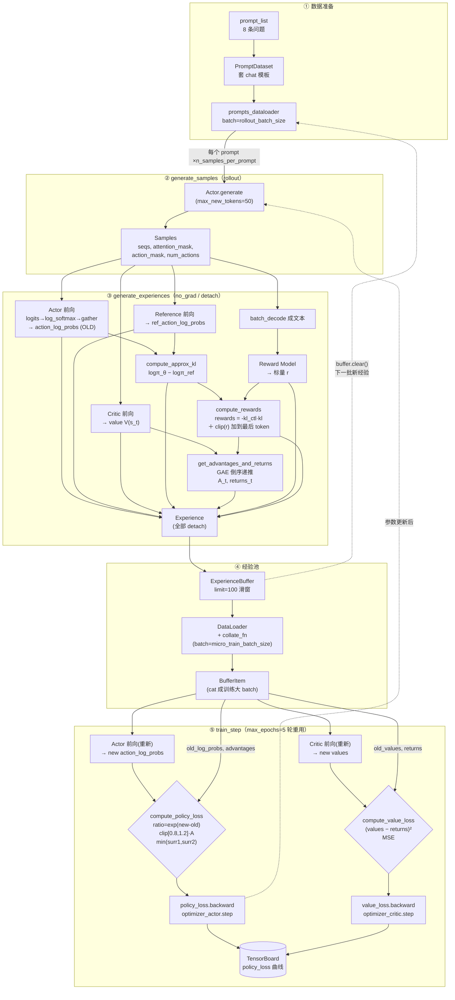
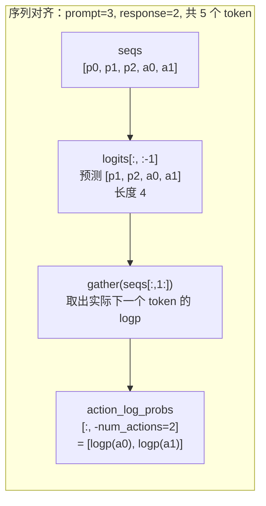
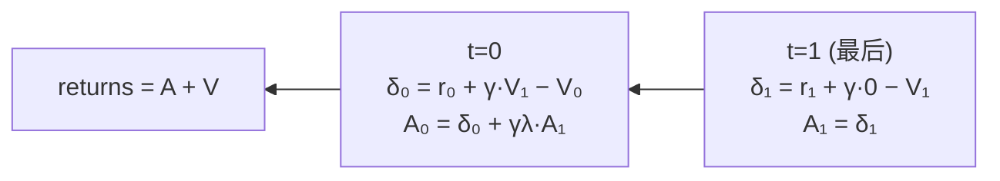

# PPO-RLHF 数据流架构图

> 配套代码：`ppo_train.py`。下图按代码实际执行顺序绘制，标注了每个函数、关键张量形状与四个模型的角色。

## 总体流程图（主循环）



## 张量对齐细节（最易错点）



## GAE 递推（倒序）



## 四个模型的角色对照

| 模型 | 输入 | 输出 | 是否更新 | 在流程中的位置 |
|---|---|---|---|---|
| **Actor** | seqs | token 概率分布 | ✅ PPO clip 更新 | ②生成 ③算old_logp ⑤算new_logp |
| **Reference** | seqs | token 概率分布 | ❌ 冻结 | ③算 ref_logp → KL 约束 |
| **Reward Model** | 解码文本 | 标量 r | ❌ 冻结 | ③打结果奖励分 |
| **Critic** | seqs | V(s_t) per token | ✅ MSE 更新 | ③算value ⑤算new_value |

## 关键设计点

1. **on-policy 校正**：`old_*`（采样时 detach 的快照）做分母，`new_*`（`train_step` 里重新前向）做分子 → PPO 的 `ratio`。
2. **经验重用**：一批 rollout 训 `max_epochs=5` 轮，靠 clip 防止策略离旧策略过远。
3. **KL 罚 vs KL 损失**：本代码把 KL 当作**逐 token 奖励惩罚**（`compute_rewards`），而非额外的损失项 —— 这是 InstructGPT 式方案。
4. **左填充**：`padding_side='left'` 保证 prompt 末尾紧贴、pad 在开头，生成位置对齐。
5. **结果奖励只给末 token**：`reward_clip` 只加到 response 最后一个有效 token，符合"回复结束才结算"的语义。
```
