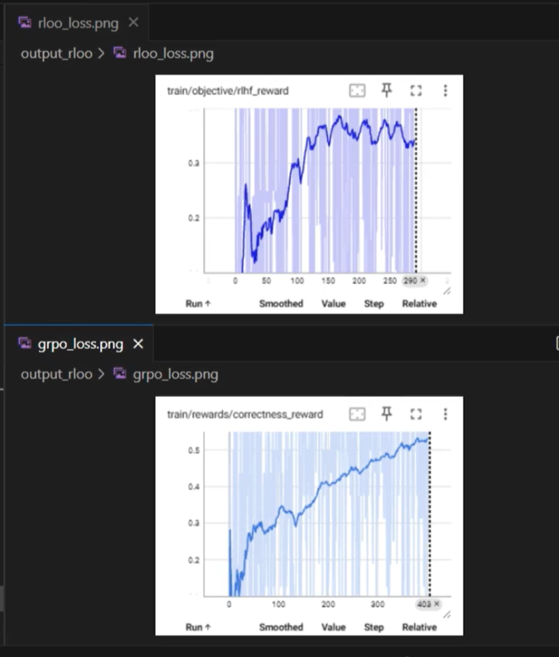

# RLOO 项目与策略梯度算法笔记

## 1. 项目概览

`rloo` 是一个使用 TRL 实现在线强化学习训练的实验项目，目标是在中文 GSM8K 数学题上训练 Qwen Instruct 模型。

项目主要由两部分组成：

- `data_process.ipynb`：把中文 GSM8K 数据整理成聊天 prompt 和标准答案。
- `train_rloo.py`：使用 LoRA、RLOO 奖励估计和 PPO-style policy loss 训练语言模型。

整体流程可以概括为：

```text
中文数学题
    ↓
构造 system/user 对话 prompt
    ↓
当前策略对同一 prompt 采样 K 个回答
    ↓
计算答案奖励和 KL 惩罚
    ↓
RLOO leave-one-out baseline
    ↓
计算 advantage
    ↓
PPO clipped policy loss
    ↓
更新 LoRA 参数
```

---

## 2. 策略梯度基础

策略梯度可以统一写成：

$$
\nabla J(\theta)
=
\mathbb{E}_{\tau\sim\pi_\theta}
\left[
\sum_{t=0}^{T}
\Psi_t\nabla\log\pi_\theta(a_t\mid s_t)
\right]
$$

其中 `Ψ_t` 是用于衡量当前动作好坏的权重，可以采用不同形式：

1. 轨迹累计奖励：

   $$
   \Psi_t=\sum_{t'=0}^{\infty}r_{t'}
   $$

2. 折扣回报：

   $$
   \Psi_t=\sum_{t'=t}^{\infty}\gamma^{t'-t}r_{t'}
   $$

3. 减去 baseline 的回报：

   $$
   \Psi_t=\sum_{t'=t}^{\infty}\gamma^{t'-t}r_{t'}-b(s_t)
   $$

4. 动作价值函数：`Q^π(s_t, a_t)`。
5. 优势函数：`A^π(s_t, a_t)`。
6. TD error：

   $$
   r_t+\gamma V^\pi(s_{t+1})-V^\pi(s_t)
   $$

baseline 的作用是降低梯度方差。只要 baseline 不依赖于当前实际采样的动作，就不会改变策略梯度的期望方向。

---

## 3. REINFORCE

最基本的 REINFORCE 使用采样回报直接优化：

$$
L_{\text{REINFORCE}}
=
-A\log\pi_\theta(a\mid s)
$$

如果没有 baseline，不同样本的奖励差异可能很大，训练梯度方差较高。因此常见做法是：

$$
A=R-b
$$

其中 `b` 可以是 batch 内奖励均值、状态价值函数，或者其他不依赖当前动作的估计量。

在这类语言模型任务中，完整回答通常可以看作一个 action，而回答中的 token 是该 action 的组成部分。

---

## 4. RLOO 算法

### 4.1 Leave-One-Out baseline

RLOO（REINFORCE Leave-One-Out）对于同一个 prompt 采样 `K` 个回答：

$$
a_1,a_2,\ldots,a_K
$$

第 `k` 个回答的 baseline 不使用自己的奖励，而使用其余 `K-1` 个回答的平均奖励：

$$
b(s,a_k)
=
\frac{1}{K-1}
\sum_{i\ne k}R(s,a_i)
$$

优势为：

$$
A(s,a_k)=R(s,a_k)-b(s,a_k)
$$

这样可以在不训练 value model 的情况下，利用同一个 prompt 的多个采样结果降低方差。

### 4.2 项目中的实现

在 [train_rloo.py](./train_rloo.py) 中，每个 prompt 被重复 `rloo_k` 次：

```python
queries = queries.repeat(args.rloo_k, 1)
answers = answers * args.rloo_k
```

训练配置中：

```python
rloo_k = 4
```

也就是每道题生成 4 个回答。奖励计算完成后，代码将奖励 reshape 成：

```python
rlhf_reward = rlhf_reward.reshape(args.rloo_k, -1)
baseline = (rlhf_reward.sum(0) - rlhf_reward) / (args.rloo_k - 1)
advantages = rlhf_reward - baseline
advantages = advantages.flatten()
```

数学上对应：

```text
baseline[k] = (所有回答奖励之和 - reward[k]) / (K - 1)
advantage[k] = reward[k] - baseline[k]
```

### 4.3 RLOO 与 token 的关系

RLOO 通常把完整回答看作一个 action，而不是把每个 token 独立视为一个 action。对于 sequence-level reward，一个回答的 advantage 会作用到该回答的所有 token log probability 上：

$$
\log\pi_\theta(a\mid s)
=
\sum_t\log\pi_\theta(a_t\mid s,a_{<t})
$$

这意味着一个回答的整体好坏会影响该回答中所有 token 的策略梯度。

---

## 5. 项目中的奖励和 KL 惩罚

### 5.1 正确性奖励

项目的奖励函数是：

```python
def extract_answer(text):
    answer = text.split("<answer>")[-1]
    answer = answer.split("</answer>")[0]
    return answer.strip()

def correctness_reward(prompts=None, completions=None, answer=None, **kwargs):
    responses = [extract_answer(completion) for completion in completions]
    return [1 if str(response) == str(ans) else -1
            for response, ans in zip(responses, answer)]
```

模型需要输出 `<answer>...</answer>`，代码提取标签中的内容，并与数据集中的 `answer_only` 做字符串精确比较：

- 正确：`+1`
- 错误：`-1`

因此，`72` 和 `72.0`、带额外单位的答案、格式不完整的答案，都可能被判为错误。

### 5.2 Sequence-level KL

策略模型和 reference policy 分别计算生成序列的 log probability：

$$
\mathrm{KL}_{\text{estimate}}
=
\sum_t
\left(
\log\pi_{\text{old}}(a_t\mid s_t)
-
\log\pi_{\text{ref}}(a_t\mid s_t)
\right)
$$

项目的 sequence-level 分支为：

```python
sequence_kl = kl.sum(1)
non_score_reward = -args.kl_coef * sequence_kl
rlhf_reward = non_score_reward + scores
```

最终奖励由两部分组成：

```text
最终奖励 = 答案奖励 - KL 系数 × 序列 KL
```

KL 项用于限制策略不要过度偏离 reference policy。

### 5.3 Token-level KL 分支

如果启用 `token_level_kl`，代码会将 KL 惩罚保留到 token 级别，并把正确性奖励放置到最后一个有效 token：

```python
kl_reward = -args.kl_coef * kl
last_reward.scatter_(
    dim=1,
    index=eos_indices,
    src=scores.reshape(-1, 1).to(kl.dtype),
)
reward = last_reward + kl_reward
rlhf_reward = reward.sum(1)
```

因此：

- sequence-level KL：整个序列先汇总 KL，再与序列奖励相加；
- token-level KL：每个 token 都有 KL 惩罚，正确性奖励放在序列末尾。

主程序没有显式设置 `token_level_kl=True`，实际使用哪种模式取决于当前 TRL 版本中 `RLOOConfig` 的默认值。

---

## 6. PPO loss 与 REINFORCE loss

### 6.1 序列概率比

项目先把新旧策略的 token log probability 分别求和：

```python
new_logprobs = new_logprobs.sum(1)
mb_logprobs = mb_logprobs.sum(1)
logprobs_diff = new_logprobs - mb_logprobs
ratio = torch.exp(logprobs_diff)
```

对应：

$$
r
=
\frac{\pi_\theta(a\mid s)}
{\pi_{\text{old}}(a\mid s)}
=
\exp\left(
\log\pi_\theta(a\mid s)-
\log\pi_{\text{old}}(a\mid s)
\right)
$$

### 6.2 PPO clipped loss

代码使用：

```python
pg_losses = -mb_advantage * ratio
pg_losses2 = -mb_advantage * torch.clamp(
    ratio,
    1.0 - args.cliprange,
    1.0 + args.cliprange,
)
pg_loss = torch.max(pg_losses, pg_losses2).mean()
```

其作用是限制一次更新中策略变化幅度过大：

$$
L_{\text{PPO}}
=
-\min\left(
rA,
\operatorname{clip}(r,1-\epsilon,1+\epsilon)A
\right)
$$

### 6.3 与 REINFORCE 的关系

代码中保留了 REINFORCE loss 的替代写法：

```python
# pg_losses = -new_logprobs * mb_advantage
# pg_loss = pg_losses.mean()
```

当新旧策略相同、`ratio=1` 且没有触发 clipping 时：

$$
\nabla\left(-rA\right)
\approx
\nabla\left(-A\log\pi_\theta(a\mid s)\right)
$$

因此图片中的小实验可以观察到两者的梯度相同。

但两者并不总是等价：

- 策略更新后 `ratio` 不再等于 1；
- ratio 超出 clipping 范围后，PPO 会截断梯度；
- 多个 PPO epoch 会让当前策略逐渐偏离采样时的旧策略。

所以该项目准确地说是：

```text
RLOO advantage + PPO clipped policy optimization
```

而不是纯 REINFORCE。

---

## 7. ReMax 与 RLOO 的区别

ReMax 也是从 REINFORCE 派生出来的方法，但 baseline 和奖励分配方式不同。

### 7.1 Baseline

| 方法 | baseline 来源 |
|---|---|
| REINFORCE | batch 平均奖励或 value model |
| RLOO | 同一 prompt 的其他 `K-1` 个随机回答的平均奖励 |
| ReMax | greedy decoding（`do_sample=False`）回答的奖励 |

RLOO 依赖多次随机采样，ReMax 依赖一次确定性 greedy 采样。

### 7.2 奖励分配

ReMax 通常按照 token 位置计算 return，把序列奖励和 token-level KL 一起反向累积，靠近末尾的 token 得到的奖励信号通常更强，前面的 token 通过折扣逐渐衰减。

RLOO 更倾向于把完整回答作为整体 action，序列级 advantage 作用于整条回答的 token log probability。项目的 sequence-level KL 分支正是这种实现方式。

---

## 8. `train_rloo.py` 的执行链路

### 模型和 LoRA

```python
model = AutoModelForCausalLM.from_pretrained(
    "Qwen2.5-7B-Instruct",
    torch_dtype=torch.bfloat16,
)
```

LoRA 应用于：

```python
["q_proj", "k_proj", "v_proj", "o_proj",
 "gate_proj", "up_proj", "down_proj"]
```

### 采样

```python
query_responses, logitss = batch_generation(...)
```

使用采样生成，最大生成长度为 `response_length=200`。

### 旧策略和 reference policy

- `logprobs`：采样时策略的 log probability，作为 old policy。
- `ref_logprobs`：reference policy 的 log probability，用于 KL 惩罚。
- `new_logprobs`：参数更新时当前策略重新计算的 log probability。

### 优化

每轮更新包括：

1. 生成回答和奖励；
2. 计算 RLOO advantage；
3. 多个 PPO epoch；
4. minibatch / microbatch 前向计算；
5. 反向传播和 optimizer step；
6. 记录训练指标并保存 checkpoint。

---

## 9. 当前项目需要注意的问题

### 数据路径不一致

Notebook 写入：

```text
./data_gsm8k/gsm8k_train.parquet
```

训练脚本读取：

```python
datasets.load_dataset("./data")["train"]
```

两者需要统一，否则数据预处理完成后训练脚本可能找不到数据。

### TRL API 版本问题

当前代码使用旧版接口：

```python
config=training_args
policy=model
ref_policy=...
reward_model=...
```

新版 TRL 通常使用：

```python
args=training_args
model=model
reward_funcs=...
```

同时，`rloo_k`、`cliprange`、`num_ppo_epochs`、`token_level_kl` 等参数在不同 TRL 版本中的名称和语义也可能不同。

### Batch 维度

代码把 prompt 重复 `rloo_k` 次，但 PPO shuffle 使用的是 `args.local_batch_size`：

```python
queries = queries.repeat(args.rloo_k, 1)
b_inds = np.random.permutation(args.local_batch_size)
```

需要确认父类 `RLOOTrainer` 对 `local_batch_size` 的定义是否已经包含 `rloo_k`。建议运行时检查：

```python
print("responses:", responses.shape[0])
print("local_batch_size:", args.local_batch_size)
print("rloo_k:", args.rloo_k)
```

并确保 reshape、RLOO 分组和 PPO 索引使用的是同一批样本。

### 参考模型显存

```python
ref_policy = copy.deepcopy(model)
```

这会额外复制完整模型。对于 7B 模型，可能造成较大的显存压力。

### 奖励函数过于严格

当前是字符串精确匹配，没有进行数字归一化、单位清理或数学表达式解析。训练初期模型很难稳定输出完全符合要求的 `<answer>` 标签。

### 训练日志

```python
print(f"模型输出：{completions[0]}")
```

该打印会在训练过程中反复输出完整模型回答，可能严重增加日志量。

---

## 10. 一句话总结

这个项目实现的是：

> 对每个数学题采样多个回答，用 RLOO leave-one-out baseline 计算低方差 advantage，再结合 reference policy 的 KL 惩罚，最后使用 PPO clipped loss 更新 LoRA 参数。

它与图片中的理论关系是：

```text
策略梯度
  → REINFORCE
  → RLOO baseline
  → sequence-level reward / KL
  → PPO-style clipped loss
```


---

这张图讲的是“策略梯度方法中，如何选择每个动作对应的奖励权重”。它是理解 REINFORCE、RLOO、PPO 等算法的基础。

## 1. 策略梯度总公式

图片中的公式是：

$$
\nabla J(\theta)
=
\mathbb{E}_{\tau\sim\pi_\theta}
\left[
\sum_{t=0}^{T}
\Psi_t
\nabla\log\pi_\theta(a_t|s_t)
\right]
$$

其中：

- $J(\theta)$：当前策略的期望收益；
- $\theta$：策略模型的参数；
- $\pi_\theta(a_t|s_t)$：在状态 $s_t$ 下选择动作 $a_t$ 的概率；
- $\log\pi_\theta(a_t|s_t)$：该动作的 log probability；
- $\tau$：一条完整轨迹：

  $$
  \tau=(s_0,a_0,r_0,s_1,a_1,r_1,\ldots)
  $$

- $\mathbb{E}_{\tau\sim\pi_\theta}$：从当前策略采样很多条轨迹，然后求平均；
- $\Psi_t$：第 $t$ 个动作对应的“奖励权重”。

这个公式的直觉是：

> 如果某个动作最终带来了较高收益，就增加它的概率；如果带来了较低收益，就降低它的概率。

因为：

$$
\nabla \log \pi_\theta(a_t|s_t)
$$

表示“如何调整参数，才能提高这个动作的概率”。

当 $\Psi_t>0$ 时，梯度会提高该动作的概率；当 $\Psi_t<0$ 时，梯度会降低该动作的概率。

---

## 2. 一个简单例子

假设模型正在回答一道数学题：

```text
问题：2 + 2 = ?
```

模型生成两个 token：

```text
4 <eos>
```

可以把每个 token 看作一个动作：

```text
状态 s0：开始回答
动作 a0：生成 token “4”

状态 s1：已经生成 “4”
动作 a1：生成 token “<eos>”
```

假设最终答案正确，奖励为：

$$
R=1
$$

那么策略梯度会倾向于提高：

```text
在 s0 状态下生成 “4” 的概率
在 s1 状态下生成 “<eos>” 的概率
```

如果最终答案错误，奖励为：

$$
R=-1
$$

那么就会降低对应 token 序列的概率。

在语言模型中，通常先计算整个回答的 log probability：

$$
\log \pi_\theta(a|s)
=
\sum_t \log\pi_\theta(a_t|s,a_{<t})
$$

然后让整个回答的 advantage 作用到这条回答的所有 token 上。

---

## 3. 图片中的 $\Psi_t$ 有哪些实现方式

图片列出了 6 种常见选择。

### 3.1 轨迹累计奖励

图片中的第一种形式是：

$$
\Psi_t=\sum_{t'=0}^{\infty}r_{t'}
$$

它表示整条轨迹从开始到结束的奖励总和。

假设一条轨迹的奖励是：

```text
r0 = 0
r1 = 0
r2 = 10
```

那么整条轨迹的累计奖励是：

$$
0+0+10=10
$$

如果采用这种方式，那么 $t=0,t=1,t=2$ 的动作都可能使用同一个权重：

$$
\Psi_0=\Psi_1=\Psi_2=10
$$

优点是实现非常简单。

缺点是信用分配比较粗糙。例如：

```text
第一个动作其实与最终成功无关
```

但它仍然会被分配到奖励 10，因此方差比较大。

这是一种典型的 Monte Carlo 方法。

---

### 3.2 从当前时刻开始的折扣回报

第二种形式是：

$$
\Psi_t
=
\sum_{t'=t}^{\infty}
\gamma^{t'-t}r_{t'}
$$

其中 $\gamma$ 是折扣因子，通常取：

```text
0.9、0.99、0.999
```

它只计算当前动作之后的奖励，而且距离越远的奖励权重越小。

例如：

```text
r0 = 0
r1 = 0
r2 = 10
γ = 0.9
```

对于 $t=0$：

$$
\Psi_0
=
0+\gamma\cdot0+\gamma^2\cdot10
=
0.9^2\times10
=
8.1
$$

对于 $t=1$：

$$
\Psi_1
=
0+\gamma\cdot10
=
9
$$

对于 $t=2$：

$$
\Psi_2=10
$$

因此：

```text
越接近最终奖励的动作，获得的回报越大；
越早的动作，奖励经过更多次折扣。
```

这比把整条轨迹奖励完全复制给每个动作更合理。

---

### 3.3 减去 baseline 的回报

第三种形式是：

$$
\Psi_t
=
\sum_{t'=t}^{\infty}
\gamma^{t'-t}r_{t'}
-
b(s_t)
$$

这里的 $b(s_t)$ 是当前状态下的 baseline。

baseline 的作用不是改变奖励方向，而是降低方差。

例如，某个状态下模型通常都能得到 8 分：

```text
当前动作得到 9 分
状态平均水平是 8 分
```

那么真正有意义的信息不是“得到 9 分”，而是：

```text
这个动作比当前状态的平均表现高 1 分
```

所以：

$$
\Psi_t=9-8=1
$$

如果某个动作只得到 5 分：

$$
\Psi_t=5-8=-3
$$

就说明这个动作比正常水平差，应当降低它的概率。

### 为什么减 baseline 不会改变期望梯度？

只要 baseline 只依赖状态 $s$，不依赖当前动作 $a$，就有：

$$
\mathbb{E}_{a\sim\pi}
[
b(s)\nabla\log\pi(a|s)
]
=0
$$

推导如下：

$$
\begin{aligned}
\mathbb{E}_{a\sim\pi}
[
b(s)\nabla\log\pi(a|s)
]
&=
b(s)\sum_a\pi(a|s)\nabla\log\pi(a|s)\\
&=
b(s)\sum_a\nabla\pi(a|s)\\
&=
b(s)\nabla\sum_a\pi(a|s)\\
&=
b(s)\nabla1\\
&=0
\end{aligned}
$$

因此 baseline 可以降低方差，却不会改变策略梯度的期望方向。

---

### 3.4 动作价值函数 $Q^\pi(s_t,a_t)$

第四种形式使用：

$$
\Psi_t=Q^\pi(s_t,a_t)
$$

动作价值函数的含义是：

> 在状态 $s_t$ 下执行动作 $a_t$，之后继续按照策略 $\pi$ 行动，最终能够获得的期望回报。

例如，在一道数学题中：

```text
状态：已经完成推理，准备输出最终答案
动作 A：输出 42
动作 B：输出 43
```

如果标准答案是 42，那么：

$$
Q(s,\text{输出42})=1
$$

$$
Q(s,\text{输出43})=-1
$$

因此策略会提高输出 42 的概率，降低输出 43 的概率。

需要注意，$Q$ 不仅表示当前动作的即时奖励，还包括后续所有动作的预期收益。

---

### 3.5 优势函数 $A^\pi(s_t,a_t)$

第五种形式使用：

$$
\Psi_t=A^\pi(s_t,a_t)
$$

优势函数定义为：

$$
A^\pi(s,a)
=
Q^\pi(s,a)-V^\pi(s)
$$

其中：

- $Q^\pi(s,a)$：执行某个具体动作后的期望回报；
- $V^\pi(s)$：在状态 $s$ 下按照当前策略随机行动的平均期望回报。

例如：

```text
当前状态 s 下，策略平均可以得到 6 分
动作 a 执行后可以得到 9 分
```

那么：

$$
V(s)=6
$$

$$
Q(s,a)=9
$$

$$
A(s,a)=9-6=3
$$

表示这个动作比当前策略在该状态下的平均表现好 3 分。

如果：

$$
Q(s,a)<V(s)
$$

则：

$$
A(s,a)<0
$$

说明这个动作比平均水平差，应该降低概率。

优势函数比直接使用回报更有意义，因为它衡量的是：

> 这个动作相对于当前状态平均水平到底好多少。

---

### 3.6 TD error

第六种形式是：

$$
\delta_t
=
r_t+\gamma V^\pi(s_{t+1})-V^\pi(s_t)
$$

图片中第二项的符号看起来像 $\lambda$，但标准的一步 TD error 通常使用折扣因子 $\gamma$。如果确实写的是 $\lambda$，则需要结合上下文判断；在 GAE 中，$\lambda$ 通常用于多个 TD error 的加权，而不是直接替代 $\gamma$。

TD error 的含义是：

```text
实际得到的即时奖励
+ 下一状态的估计价值
- 当前状态的估计价值
```

继续使用上面的例子：

```text
当前状态价值 V(s0) = 6
执行动作后得到即时奖励 r0 = 0
下一状态价值 V(s1) = 10
γ = 0.9
```

则：

$$
\delta_0
=
0+0.9\times10-6
=
3
$$

这个结果表示：

```text
这次动作带来的实际结果，比当前状态原本预计的价值高 3 分。
```

如果 TD error 为正，说明结果比预期好；如果为负，说明结果比预期差。

TD error 的优势是不用等整条轨迹结束就可以更新，但它依赖 value function 的估计质量。

---

## 4. 这几种方法之间的关系

可以把它们理解成不同精度、不同方差的奖励估计方法：

| 方法 | 特点 |
|---|---|
| 轨迹累计奖励 | 最简单，但信用分配粗糙，方差较大 |
| 折扣回报 | 只看当前及未来奖励，远期奖励影响减小 |
| 减 baseline | 降低方差 |
| Q 函数 | 估计状态-动作组合的期望回报 |
| Advantage | 衡量动作相对平均水平的好坏 |
| TD error | 单步估计，计算快，但依赖 value function |

在实际强化学习中，通常希望同时做到：

```text
奖励估计准确
梯度方差较小
计算成本可接受
```

因此常见方法会组合这些思想，例如：

- REINFORCE + baseline
- Actor-Critic
- GAE
- PPO
- RLOO

---

## 5. 与 `rloo/train_rloo.py` 的对应关系

在你的项目中，图片中的 $\Psi_t$ 主要对应代码中的：

```python
advantages
```

项目首先计算序列奖励：

```python
rlhf_reward = non_score_reward + scores
```

其中：

```text
scores        = 答案正确性奖励
non_score_reward = KL 惩罚
```

然后使用 RLOO 计算 baseline：

```python
rlhf_reward = rlhf_reward.reshape(args.rloo_k, -1)

baseline = (
    rlhf_reward.sum(0) - rlhf_reward
) / (args.rloo_k - 1)

advantages = rlhf_reward - baseline
```

所以在这个项目里：

$$
\Psi_t
\approx
A_{\text{RLOO}}
$$

之后，代码把整个回答的 token log probability 加起来，并使用 PPO loss 更新策略。

也就是说，这个项目的训练逻辑是：

```text
使用完整回答的奖励
    ↓
用同一个 prompt 的其他回答计算 baseline
    ↓
得到 RLOO advantage
    ↓
将 advantage 作用于回答的 token log probability
    ↓
通过 PPO-style loss 更新模型
```

一句话总结这张图：

> 策略梯度公式的关键，不是固定使用哪一种奖励，而是如何构造 $\Psi_t$。REINFORCE 使用回报，Actor-Critic 使用 advantage 或 TD error，RLOO 使用同一 prompt 的其他采样结果构造 leave-one-out advantage。

---

这张图片主要解释了三件事：

1. 传统 REINFORCE 为什么需要 baseline；
2. RLOO 如何使用同一个 prompt 的其他回答构造 baseline；
3. RLOO 如何把完整回答当作一个 action，并结合序列级 KL 惩罚计算最终奖励。

---

## 1. REINFORCE 为什么需要 baseline

最基础的 REINFORCE 策略梯度可以写成：

$$
\nabla J(\theta)
=
\mathbb{E}
\left[
R(\tau)
\sum_t\nabla\log\pi_\theta(a_t|s_t)
\right]
$$

这里直接使用整条轨迹的奖励 $R(\tau)$。

例如，模型回答 4 道题，得到奖励：

```text
[1, 1, -1, -1]
```

如果直接使用奖励：

- 正确答案对应的动作：提高概率；
- 错误答案对应的动作：降低概率。

但是，不同 batch 的奖励分布可能差异很大。

例如：

```text
Batch A：[1, 1, 1, 1]
Batch B：[-1, -1, -1, -1]
```

Batch A 可能只是题目简单，Batch B 可能只是题目困难。直接使用奖励会让梯度受到整体奖励水平影响，造成较大的方差。

因此 REINFORCE 会引入 baseline：

$$
A=R-b
$$

其中：

- $R$：当前样本实际获得的奖励；
- $b$：对当前奖励的参考值；
- $A$：中心化后的奖励，也可以理解为 advantage。

如果：

```text
当前奖励 R = 8
baseline b = 6
```

那么：

$$
A=8-6=2
$$

说明当前动作比平均水平好 2 分。

如果：

```text
当前奖励 R = 5
baseline b = 6
```

那么：

$$
A=5-6=-1
$$

说明当前动作比平均水平差，应当降低它的概率。

---

## 2. REINFORCE 中的 batch 平均 baseline

图片中说：

> 在 REINFORCE 中，使用一个 batch 内奖励的移动平均值作为 baseline。

例如一个 batch 中有 4 条样本：

```text
奖励：[1, 1, -1, -1]
```

batch 平均奖励是：

$$
b=\frac{1+1-1-1}{4}=0
$$

于是 advantage 是：

```text
[1, 1, -1, -1]
```

这比直接使用奖励更稳定一些，因为奖励被中心化了。

但是，这种 baseline 仍然有一个问题：batch 中的样本可能来自不同 prompt。

例如：

```text
题目 A：2 + 2 = ?
题目 B：一个复杂的多步数学题
```

即使模型对题目 A 和题目 B 都得到奖励 1，它们的难度也完全不同。使用整个 batch 的平均奖励作为 baseline，不能很好地反映“当前回答相对于同一道题的其他回答表现如何”。

这就是 RLOO 想解决的问题。

---

## 3. RLOO 的核心思想

RLOO 对同一个 prompt 采样多个回答。

例如 prompt 是：

```text
小明有 3 个苹果，又买了 2 个，一共有多少个？
```

当前策略对这个 prompt 采样 4 个回答：

```text
a1：5       奖励 1
a2：5       奖励 1
a3：6       奖励 -1
a4：5       奖励 1
```

这里：

```text
K = 4
```

RLOO 不使用整个 batch 的奖励均值，而是对每个回答使用其他回答的平均奖励作为 baseline。

公式是：

$$
b(s,a_k)
=
\frac{1}{K-1}
\sum_{i=1,i\ne k}^{K}R(s,a_i)
$$

注意：计算第 $k$ 个回答的 baseline 时，不包含它自己的奖励。

---

## 4. RLOO 数值例子

假设同一个 prompt 的 4 个回答奖励为：

$$
R_1=1,\quad R_2=1,\quad R_3=-1,\quad R_4=1
$$

### 第一个回答

第一个回答的 baseline 不包含自己：

$$
b_1
=
\frac{R_2+R_3+R_4}{3}
=
\frac{1-1+1}{3}
=
\frac13
$$

因此：

$$
A_1=R_1-b_1
=
1-\frac13
=
\frac23
$$

### 第二个回答

$$
b_2
=
\frac{R_1+R_3+R_4}{3}
=
\frac{1-1+1}{3}
=
\frac13
$$

$$
A_2=1-\frac13=\frac23
$$

### 第三个回答

第三个回答是错误的：

$$
b_3
=
\frac{R_1+R_2+R_4}{3}
=
\frac{1+1+1}{3}
=
1
$$

$$
A_3=-1-1=-2
$$

这个回答不仅是负奖励，而且比同一个 prompt 的其他回答差很多，所以得到较大的负 advantage。

### 第四个回答

$$
b_4
=
\frac{R_1+R_2+R_3}{3}
=
\frac{1+1-1}{3}
=
\frac13
$$

$$
A_4=1-\frac13=\frac23
$$

最终 advantage 是：

```text
[0.667, 0.667, -2.0, 0.667]
```

这会产生如下训练信号：

```text
a1、a2、a4：提高概率
a3：明显降低概率
```

---

## 5. 为什么 RLOO 比 batch 平均更合理

RLOO 的 baseline 是“同一道题的其他答案平均奖励”。

因此它回答的是：

> 对于这个 prompt，当前回答是否比模型对同一道题的其他回答更好？

而普通 REINFORCE 的 batch baseline 回答的是：

> 当前回答是否比整个 batch 的平均回答更好？

对于语言模型数学训练，RLOO 通常更合理，因为同一个 prompt 的多个回答具有相同的问题难度和相同的参考答案。

---

## 6. RLOO 的一个重要性质

如果同一个 prompt 的所有回答奖励都相同，例如：

```text
[1, 1, 1, 1]
```

那么每个回答的 baseline 都是 1：

$$
b_k=1
$$

因此：

$$
A_k=1-1=0
$$

所有 advantage 都为 0，当前这组样本不会产生策略更新。

这符合 RLOO 的思想：

> 如果模型对同一个问题生成的所有回答表现一样，就没有相对偏好的信息可以学习。

RLOO 主要学习的是同一 prompt 内不同回答之间的相对优劣。

---

## 7. RLOO 如何对应到项目代码

在 [train_rloo.py](/data2/home/jiapeng2/code/LLM/llm_related/rloo/train_rloo.py) 中，代码首先把每个 prompt 重复 `rloo_k` 次：

```python
queries = queries.repeat(args.rloo_k, 1)
answers = answers * args.rloo_k
```

配置中：

```python
rloo_k = 4
```

表示每个 prompt 生成 4 个回答。

得到奖励后，代码执行：

```python
rlhf_reward = rlhf_reward.reshape(args.rloo_k, -1)

baseline = (
    rlhf_reward.sum(0) - rlhf_reward
) / (args.rloo_k - 1)

advantages = rlhf_reward - baseline
```

这正是 RLOO 公式的向量化实现：

```text
baseline[k]
= (同一 prompt 的所有奖励之和 - 当前回答奖励) / (K - 1)

advantage[k]
= 当前回答奖励 - baseline[k]
```

---

## 8. RLOO 为什么说“一个序列是一个 action”

在传统强化学习中，可能会把每一步都看作一个 action：

```text
a0、a1、a2、a3
```

但在语言模型中，一条回答本身通常被看作一个完整 action：

```text
a = [token1, token2, token3, ..., tokenT]
```

当然，语言模型的序列概率仍然会按 token 分解：

$$
\pi_\theta(a|s)
=
\prod_{t=1}^{T}
\pi_\theta(a_t|s,a_{<t})
$$

取对数后：

$$
\log\pi_\theta(a|s)
=
\sum_{t=1}^{T}
\log\pi_\theta(a_t|s,a_{<t})
$$

所以 RLOO 的完整回答 advantage 会作用到：

$$
\sum_t\log\pi_\theta(a_t|s,a_{<t})
$$

上。

这就是图片中所说的：

> 一个序列的优势或奖励会分配给该序列中的每个 token。

但这里要注意：

“所有 token 使用相同 advantage”并不是说：

```text
所有 token 的概率相同
```

而是说：

```text
所有 token 的梯度权重使用同一个序列级 advantage
```

例如回答：

```text
“答案是 5”
```

如果这个回答的 advantage 是 $+2$，那么：

```text
“答案”
“是”
“5”
```

对应的 log probability 梯度都会乘以 $+2$。

如果 advantage 是 $-2$，这些 token 的概率都会受到降低方向的更新。

这种方式实现简单，但信用分配比较粗糙：模型不知道到底是哪个 token 导致了错误。

---

## 9. RLOO 中的 KL 惩罚

图片最后给出的代码是：

```python
sequence_kl = kl.sum(1)
non_score_reward = -args.kl_coef * sequence_kl
rlhf_reward = non_score_reward + scores
```

这里的 `scores` 是任务奖励，例如答案正确性奖励。

`kl` 是当前策略和 reference policy 之间的 log probability 差：

```python
kl = logprobs - ref_logprobs
```

然后对整个回答的 token 求和：

$$
\text{sequence\_kl}
=
\sum_t
\left(
\log\pi_{\text{old}}(a_t|s_t)
-
\log\pi_{\text{ref}}(a_t|s_t)
\right)
$$

KL 惩罚为：

$$
\text{non\_score\_reward}
=
-\beta\cdot \text{sequence\_kl}
$$

最终奖励为：

$$
R_{\text{final}}
=
R_{\text{task}}
-
\beta\cdot\text{KL}
$$

其中：

- $R_{\text{task}}$：任务奖励；
- $\beta$：KL 系数；
- KL：当前策略和 reference policy 的偏离程度。

---

## 10. KL 惩罚的直观例子

假设有两个回答：

```text
回答 A：答案正确，任务奖励 1，KL = 0.5
回答 B：答案正确，任务奖励 1，KL = 3.0
```

设：

```text
kl_coef = 0.1
```

那么：

对于回答 A：

$$
R_A=1-0.1\times0.5=0.95
$$

对于回答 B：

$$
R_B=1-0.1\times3.0=0.7
$$

虽然两个回答都是正确的，但回答 B 偏离 reference policy 更多，所以最终奖励更低。

这可以防止模型为了追求任务奖励而产生过度激进的策略变化。

最终目标不是简单地：

```text
只要答案正确就行
```

而是：

```text
答案正确，同时尽量不要偏离原始模型太远
```

---

## 11. 一个完整的 RLOO 例子

假设某个 prompt 生成 4 个回答：

| 回答 | 任务奖励 | 序列 KL | `kl_coef` | 最终奖励 |
|---|---:|---:|---:|---:|
| $a_1$ | 1 | 0.2 | 0.1 | 0.98 |
| $a_2$ | 1 | 0.5 | 0.1 | 0.95 |
| $a_3$ | -1 | 0.1 | 0.1 | -1.01 |
| $a_4$ | 1 | 0.3 | 0.1 | 0.97 |

计算 $a_1$ 的 baseline：

$$
b_1
=
\frac{0.95-1.01+0.97}{3}
=
0.3033
$$

所以：

$$
A_1=0.98-0.3033=0.6767
$$

计算 $a_3$ 的 baseline：

$$
b_3
=
\frac{0.98+0.95+0.97}{3}
=
0.9667
$$

所以：

$$
A_3=-1.01-0.9667=-1.9767
$$

结果是：

```text
a1：正 advantage，提高概率
a2：正 advantage，提高概率
a3：强负 advantage，明显降低概率
a4：正 advantage，提高概率
```

这体现了 RLOO 的两个特点：

1. 奖励不仅考虑答案是否正确，还考虑 KL 偏离；
2. 当前回答是与同一个 prompt 的其他回答比较，而不是与整个 batch 比较。

---

## 12. 与项目实现的最终对应关系

项目中对应关系如下：

```text
图片中的 R(s, a_k)
        ↓
rlhf_reward = correctness_reward + KL reward

图片中的 b(s, a_k)
        ↓
(batched_rewards_sum - current_reward) / (K - 1)

图片中的 A(s, a_k)
        ↓
advantages = rlhf_reward - baseline

图片中的序列 action
        ↓
完整回答的 response token 序列

图片中的序列级奖励
        ↓
sequence_kl + scores

图片中的策略更新
        ↓
PPO clipped policy loss
```

因此，这张图片描述的项目算法可以总结为：

$$
\boxed{
\text{RLOO}
=
\text{序列级任务奖励}
+
\text{序列级 KL 惩罚}
+
\text{Leave-One-Out baseline}
}
$$

项目最终使用的不是最原始的 REINFORCE loss，而是：

$$
\boxed{
\text{RLOO advantage}
+
\text{PPO-style policy loss}
}
$$

---

这张图的核心结论是：

> TRL 中的 RLOO 虽然使用 RLOO 方法计算 advantage，但策略更新部分没有直接使用 REINFORCE loss，而是使用了 PPO-style loss。

需要注意：RLOO 和 PPO 解决的是不同问题。

- RLOO：主要负责如何计算 baseline 和 advantage；
- PPO：主要负责如何根据 advantage 稳定地更新策略。

因此它们可以组合使用：

```text
RLOO advantage + PPO policy loss
```

---

## 1. REINFORCE loss

图片中的 REINFORCE loss 是：

```python
pg_losses = -new_logprobs * mb_advantage
pg_loss = pg_losses.mean()
```

对应数学公式：

$$
L_{\text{REINFORCE}}
=
-A\log\pi_\theta(a|s)
$$

其中：

- $A$：advantage；
- $\pi_\theta(a|s)$：当前策略选择动作 $a$ 的概率；
- $\log\pi_\theta(a|s)$：动作概率的对数。

为什么前面有负号？

因为强化学习的目标是最大化：

$$
A\log\pi_\theta(a|s)
$$

而 PyTorch 中优化器默认是最小化 loss，所以写成：

$$
L=-A\log\pi_\theta(a|s)
$$

---

## 2. REINFORCE 的直观含义

假设模型在某个状态下生成了一个回答：

```text
回答：5
```

这个回答是正确的，因此：

$$
A=+2
$$

假设当前模型给这个回答的概率是：

$$
\pi_\theta(a|s)=0.4
$$

那么：

$$
\log\pi_\theta(a|s)=\log 0.4
$$

REINFORCE loss 是：

$$
L=-2\log 0.4
$$

训练会推动模型提高这个动作的概率。

如果回答是错误的，假设：

$$
A=-2
$$

那么：

$$
L=-(-2)\log\pi_\theta(a|s)
=
2\log\pi_\theta(a|s)
$$

优化器会倾向于降低这个错误动作的概率。

所以：

```text
A > 0：提高动作概率
A < 0：降低动作概率
```

---

## 3. 图片中的 PPO loss

图片中的 PPO 代码是：

```python
pg_losses = -mb_advantage * ratio

pg_losses2 = -mb_advantage * torch.clamp(
    ratio,
    1.0 - args.cliprange,
    1.0 + args.cliprange
)

pg_loss_max = torch.max(pg_losses, pg_losses2)
pg_loss = pg_loss_max.mean()
```

其中：

$$
r=
\frac{\pi_\theta(a|s)}
{\pi_{\text{old}}(a|s)}
$$

代码中的 `ratio` 就是这个新旧策略概率比。

项目中对应的代码是：

```python
new_logprobs = new_logprobs.sum(1)
mb_logprobs = mb_logprobs.sum(1)

logprobs_diff = new_logprobs - mb_logprobs
ratio = torch.exp(logprobs_diff)
```

因为：

$$
\exp(\log\pi_\theta-\log\pi_{\text{old}})
=
\frac{\pi_\theta}{\pi_{\text{old}}}
$$

所以代码中的 `ratio` 就是 PPO 的重要性采样比率。

---

## 4. 为什么 PPO 需要 ratio

假设某次采样是由旧策略生成的。

旧策略认为某个回答的概率是：

$$
\pi_{\text{old}}(a|s)=0.4
$$

更新后当前策略认为这个回答的概率是：

$$
\pi_\theta(a|s)=0.6
$$

那么：

$$
r=
\frac{0.6}{0.4}=1.5
$$

说明当前策略把这个回答的概率提高了 50%。

如果这个回答的 advantage 是正的：

$$
A=1
$$

说明这个回答比较好，提高它的概率是正确方向。

但是，如果不限制，模型可能一次性把概率从 0.4 提高到 0.95，导致策略变化过于激进。

PPO 的作用就是限制这种变化。

---

## 5. PPO clipping

假设：

```python
cliprange = 0.2
```

那么 ratio 会被限制在：

$$
[1-0.2,\;1+0.2]
=
[0.8,\;1.2]
$$

如果：

$$
r=1.1
$$

那么：

$$
\operatorname{clip}(r,0.8,1.2)=1.1
$$

没有触发裁剪。

如果：

$$
r=1.5
$$

那么：

$$
\operatorname{clip}(r,0.8,1.2)=1.2
$$

PPO 不再按照 1.5 计算，而只按照 1.2 计算。

对于正 advantage $A=1$：

```text
未裁剪目标：1.5 × 1 = 1.5
裁剪目标：1.2 × 1 = 1.2
```

最终使用更保守的 1.2。

这就实现了：

> 即使某个好回答的概率大幅提高，也限制单次更新的收益，避免策略变化太大。

---

## 6. 为什么代码使用 `torch.max`

标准 PPO 通常写成最大化目标：

$$
L^{\text{CLIP}}
=
\min
\left(
rA,
\operatorname{clip}(r,1-\epsilon,1+\epsilon)A
\right)
$$

但 PyTorch 优化器通常最小化 loss，所以代码使用负号：

```python
pg_losses = -A * ratio
pg_losses2 = -A * clipped_ratio
```

于是：

$$
-\min(x,y)=\max(-x,-y)
$$

因此代码：

```python
pg_loss_max = torch.max(pg_losses, pg_losses2)
```

等价于标准 PPO 公式中的：

```text
取未裁剪目标和裁剪目标的最小值
```

只是由于训练框架采用最小化 loss，所以形式变成了 `torch.max`。

---

## 7. 图片中的实验代码

图片中的核心实验是：

```python
action = LongTensor([1])
advantage = Tensor([1.0])
logits = Tensor([[1.0, 2.0, 1.0, 1.0]])
logits.requires_grad = True
```

这里有 4 个候选动作，它们的 logits 是：

```text
动作 0：1.0
动作 1：2.0
动作 2：1.0
动作 3：1.0
```

选择的动作是：

```python
action = 1
```

也就是第 2 个动作。

`advantage=1.0` 表示：

```text
这个动作比平均水平好
```

---

## 8. 从 logits 得到概率

代码：

```python
all_logprob = F.log_softmax(logits, dim=-1)
```

先通过 softmax 得到概率。

对于：

$$
[1,2,1,1]
$$

softmax 概率大约是：

```text
动作 0：0.1749
动作 1：0.4754
动作 2：0.1749
动作 3：0.1749
```

动作 1 的概率最高，因为它的 logit 是 2。

动作 1 的 log probability 约为：

$$
\log(0.4754)\approx -0.743
$$

---

## 9. `gather` 的作用

代码：

```python
action.unsqueeze(-1)
```

会把：

```text
[1]
```

变成：

```text
[[1]]
```

然后：

```python
gather(
    all_logprob,
    1,
    action.unsqueeze(-1)
).squeeze(-1)
```

作用是：

> 从 4 个动作的 log probability 中，只取出实际执行的动作 1 的 log probability。

例如：

```text
所有 log probability：
[-1.743, -0.743, -1.743, -1.743]
```

`gather` 之后只保留：

```text
-0.743
```

---

## 10. 为什么 `old_logprob` 要放在 `no_grad()` 中

代码是：

```python
with no_grad():
    old_logprob = gather(
        all_logprob,
        1,
        action.unsqueeze(-1)
    ).squeeze(-1)
```

这样做是为了让 `old_logprob` 不参与反向传播。

在 PPO 中：

- `old_logprob`：采样时旧策略的概率，应当固定；
- `logprob`：当前策略的概率，需要参与梯度计算。

如果 `old_logprob` 也参与梯度，那么：

$$
\log\pi_\theta-\log\pi_{\text{old}}
$$

中的两部分可能同时变化，导致 ratio 的梯度被抵消，无法正确更新。

所以 PPO 必须把 old policy 当作常量。

---

## 11. on-policy 情况下为什么两种梯度相同

代码中：

```python
old_logprob = logprob.detach()
```

实际上旧策略和当前策略使用的是同一组 logits，只是 old logprob 被 detach 了。

因此：

$$
\log\pi_\theta=\log\pi_{\text{old}}
$$

所以：

$$
r
=
\exp(\log\pi_\theta-\log\pi_{\text{old}})
=
\exp(0)
=
1
$$

图片中的 PPO 部分实际上是：

```python
ppo_loss = (ratio * advantage).mean()
```

因为：

```text
ratio = 1
advantage = 1
```

所以目标值为 1。

但是它的梯度不是 0，因为 `old_logprob` 被当作常数：

$$
\frac{\partial r}{\partial\theta}
=
\frac{\partial}{\partial\theta}
\exp(\log\pi_\theta-\text{constant})
$$

当 ratio=1 时：

$$
\frac{\partial r}{\partial\theta}
=
\frac{\partial\log\pi_\theta}{\partial\theta}
$$

而 REINFORCE 的目标是：

$$
\log\pi_\theta\cdot A
$$

当 $A=1$ 时：

$$
\frac{\partial}{\partial\theta}
(\log\pi_\theta A)
=
\frac{\partial\log\pi_\theta}{\partial\theta}
$$

因此两者的梯度相同。

---

## 12. 梯度数值为什么是这个结果

对于 softmax，动作 1 的 log probability 对各个 logits 的梯度为：

$$
\frac{\partial\log p_i}{\partial z_j}
=
\mathbf{1}[i=j]-p_j
$$

动作 1 的概率约为：

```text
p = [0.1749, 0.4754, 0.1749, 0.1749]
```

所以：

```text
对 logit 0 的梯度：-0.1749
对 logit 1 的梯度： 1 - 0.4754 = 0.5246
对 logit 2 的梯度：-0.1749
对 logit 3 的梯度：-0.1749
```

于是得到：

```text
[-0.1749, 0.5246, -0.1749, -0.1749]
```

这正是图片中打印的梯度。

含义是：

```text
动作 1 的 logit 梯度为正，会被提高；
其他动作的 logit 梯度为负，相对会被降低。
```

因此模型会增加动作 1 的概率。

---

## 13. REINFORCE 代码为什么得到相同梯度

第二部分代码是：

```python
reinforce_loss = logprob2 * advantage
reinforce_loss.mean().backward()
```

这里没有 `ratio`，直接对：

$$
\log\pi_\theta(a|s)\cdot A
$$

求梯度。

因为前面设置：

```python
advantage = 1.0
```

所以梯度就是：

$$
\nabla\log\pi_\theta(a|s)
$$

而 PPO 在 on-policy、ratio=1、没有 clipping 的情况下，也会得到：

$$
\nabla\log\pi_\theta(a|s)
$$

因此两个梯度相同。

---

## 14. 这并不意味着 PPO 和 REINFORCE 永远相同

图片中的实验只说明：

```text
on-policy + ratio=1 + 没有 clipping
```

时，两者梯度相同。

一旦当前策略和旧策略不同，情况就会变化。

例如：

```text
旧策略概率：0.4
当前策略概率：0.6
优势：A=1
```

那么：

$$
r=\frac{0.6}{0.4}=1.5
$$

REINFORCE 的梯度系数是：

$$
A=1
$$

PPO 未裁剪时的梯度系数是：

$$
rA=1.5
$$

如果 `cliprange=0.2`，PPO 会将 ratio 限制为：

$$
1.2
$$

于是 PPO 的有效梯度系数最多约为：

$$
1.2A=1.2
$$

所以：

```text
REINFORCE：始终按 A 更新
PPO：按 ratio × A 更新，并且会进行裁剪
```

这就是 PPO 比 REINFORCE 更保守的地方。

---

## 15. 图片代码与项目代码的区别

图片中的 PPO 示例是简化版：

```python
ppo_loss = (ratio * advantage).mean()
```

它没有展示 clipping。

而 `rloo/train_rloo.py` 使用的是完整的 PPO-style loss：

```python
pg_losses = -mb_advantage * ratio

pg_losses2 = -mb_advantage * torch.clamp(
    ratio,
    1.0 - args.cliprange,
    1.0 + args.cliprange
)

pg_loss_max = torch.max(pg_losses, pg_losses2)
pg_loss = pg_loss_max.mean()
```

项目中的完整过程是：

```text
RLOO 负责计算 advantage
        ↓
计算新旧策略的序列 log probability
        ↓
得到 sequence-level ratio
        ↓
PPO clipping
        ↓
更新模型
```

对于语言模型，项目先将整条回答的 token log probability 求和：

```python
new_logprobs = new_logprobs.sum(1)
mb_logprobs = mb_logprobs.sum(1)
```

因此项目使用的是序列级 ratio：

$$
r
=
\exp
\left(
\sum_t\log\pi_\theta(a_t|s_t)
-
\sum_t\log\pi_{\text{old}}(a_t|s_t)
\right)
$$

而不是单独对每个 token 计算 PPO ratio。

---

## 16. 一个完整的语言模型例子

假设模型生成回答：

```text
答案是 5
```

它由 3 个 token 组成：

```text
token1：答案
token2：是
token3：5
```

假设：

```text
RLOO advantage = 2
旧策略序列概率 = 0.20
新策略序列概率 = 0.30
```

则：

$$
r=\frac{0.30}{0.20}=1.5
$$

如果 `cliprange=0.2`：

$$
\operatorname{clip}(r)=1.2
$$

PPO 使用的有效 ratio 不超过 1.2。

这意味着：

```text
这个回答是好回答，所以模型应该提高它的概率；
但即使概率提升很多，也不能一次更新得过于激进。
```

在 sequence-level advantage 设置下，`答案`、`是`、`5` 这三个 token 会共享同一个序列级 advantage。

---

## 17. 这张图的最终结论

图片中的实验说明：

$$
\boxed{
\text{on-policy 时，未裁剪 PPO 的梯度与 REINFORCE 梯度相同}
}
$$

但完整 PPO 比 REINFORCE 多了两个机制：

1. 使用旧策略和当前策略的概率比；
2. 使用 clipping 限制策略变化幅度。

因此更准确的说法是：

```text
REINFORCE 是最基础的策略梯度目标；
PPO 是带重要性采样比率和 clipping 的稳定版本；
RLOO 可以负责计算 advantage；
TRL 中的 RLOO 实现可以进一步使用 PPO loss 更新策略。
```

对应你的项目：

```text
RLOO：计算同一 prompt 内的 leave-one-out advantage
PPO：根据 advantage 和 ratio 更新语言模型
KL：限制当前策略偏离 reference policy
LoRA：只更新少量可训练参数
```
---

这三行代码是在计算 RLOO 的 leave-one-out advantage：

```python
rlhf_reward = rlhf_reward.reshape(args.rloo_k, -1)
baseline = (rlhf_reward.sum(0) - rlhf_reward) / (args.rloo_k - 1)
advantages = rlhf_reward - baseline
```

核心含义是：

> 对同一个 prompt 生成的多个回答进行比较。某个回答的 baseline 等于同一个 prompt 的其他回答的平均奖励，advantage 等于当前回答奖励减去这个 baseline。

---

## 1. `rlhf_reward` 原来的形状

假设：

```python
args.rloo_k = 4
```

表示每个 prompt 生成 4 个回答。

如果一个 batch 有：

```text
B = 2 个 prompt
K = 4 个回答 / prompt
```

那么总共有：

```text
B × K = 8 条回答
```

在前面代码中：

```python
queries = queries.repeat(args.rloo_k, 1)
```

如果原始 prompt 是：

```text
[prompt_1, prompt_2]
```

重复后大致变成：

```text
[
    prompt_1, prompt_2,   # 第 1 次采样
    prompt_1, prompt_2,   # 第 2 次采样
    prompt_1, prompt_2,   # 第 3 次采样
    prompt_1, prompt_2    # 第 4 次采样
]
```

对应的奖励可能是：

```python
rlhf_reward = [1, 0, 0, 2, -1, 1, 1, 1]
```

可以按块理解为：

```text
第 1 次采样：[prompt_1 的奖励 1, prompt_2 的奖励 0]
第 2 次采样：[prompt_1 的奖励 0, prompt_2 的奖励 2]
第 3 次采样：[prompt_1 的奖励 -1, prompt_2 的奖励 1]
第 4 次采样：[prompt_1 的奖励 1, prompt_2 的奖励 1]
```

---

## 2. `reshape(args.rloo_k, -1)`

执行：

```python
rlhf_reward = rlhf_reward.reshape(args.rloo_k, -1)
```

由于：

```python
args.rloo_k = 4
```

因此：

```python
rlhf_reward.shape
```

从：

```text
[8]
```

变成：

```text
[4, 2]
```

具体结果是：

$$
\text{rlhf\_reward}
=
\begin{bmatrix}
1 & 0\\
0 & 2\\
-1 & 1\\
1 & 1
\end{bmatrix}
$$

可以把它理解成一个表格：

| 采样次数 | prompt_1 | prompt_2 |
|---|---:|---:|
| 第 1 个回答 | 1 | 0 |
| 第 2 个回答 | 0 | 2 |
| 第 3 个回答 | -1 | 1 |
| 第 4 个回答 | 1 | 1 |

这里：

- 行数 `4`：同一个 prompt 的 4 个回答；
- 列数 `2`：batch 中的 2 个 prompt。

因此，`reshape` 的前提是：奖励的原始排列顺序必须和 prompt 重复顺序一致。

---

## 3. `rlhf_reward.sum(0)`

代码：

```python
rlhf_reward.sum(0)
```

`sum(0)` 表示沿第 0 维求和，也就是把同一个 prompt 的 4 个回答奖励加起来。

对 `prompt_1`：

$$
1+0+(-1)+1=1
$$

对 `prompt_2`：

$$
0+2+1+1=4
$$

所以：

```python
rlhf_reward.sum(0)
```

得到：

```text
[1, 4]
```

含义是：

```text
prompt_1 的 4 个奖励总和 = 1
prompt_2 的 4 个奖励总和 = 4
```

---

## 4. baseline 的计算

代码：

```python
baseline = (
    rlhf_reward.sum(0) - rlhf_reward
) / (args.rloo_k - 1)
```

公式是：

$$
b_i
=
\frac{\sum_{j=1}^{K}R_j-R_i}{K-1}
$$

也就是：

```text
baseline = 其他回答奖励之和 / 其他回答数量
```

当前回答自己的奖励会被排除。

---

## 5. 计算 prompt_1 的 baseline

prompt_1 的 4 个奖励是：

```text
[1, 0, -1, 1]
```

总和是：

```text
1
```

### 第 1 个回答

当前奖励是 1，排除自己后：

```text
其他奖励：[0, -1, 1]
```

因此：

$$
b_{1,1}
=
\frac{0-1+1}{3}
=
0
$$

### 第 2 个回答

当前奖励是 0，其他奖励是：

```text
[1, -1, 1]
```

因此：

$$
b_{1,2}
=
\frac{1-1+1}{3}
=
\frac13
$$

### 第 3 个回答

当前奖励是 -1，其他奖励是：

```text
[1, 0, 1]
```

因此：

$$
b_{1,3}
=
\frac{1+0+1}{3}
=
\frac23
$$

### 第 4 个回答

当前奖励是 1，其他奖励是：

```text
[1, 0, -1]
```

因此：

$$
b_{1,4}
=
\frac{1+0-1}{3}
=
0
$$

所以 prompt_1 的 baseline 是：

```text
[0, 0.3333, 0.6667, 0]
```

---

## 6. 计算 prompt_2 的 baseline

prompt_2 的 4 个奖励是：

```text
[0, 2, 1, 1]
```

总和是：

```text
4
```

### 第 1 个回答

当前奖励是 0：

$$
b_{2,1}
=
\frac{4-0}{3}
=
\frac43
$$

### 第 2 个回答

当前奖励是 2：

$$
b_{2,2}
=
\frac{4-2}{3}
=
\frac23
$$

### 第 3 个回答

当前奖励是 1：

$$
b_{2,3}
=
\frac{4-1}{3}
=
1
$$

### 第 4 个回答

当前奖励也是 1：

$$
b_{2,4}
=
\frac{4-1}{3}
=
1
$$

因此 prompt_2 的 baseline 是：

```text
[1.3333, 0.6667, 1.0, 1.0]
```

---

## 7. `advantages = rlhf_reward - baseline`

最后一行：

```python
advantages = rlhf_reward - baseline
```

公式是：

$$
A_i=R_i-b_i
$$

也就是：

```text
当前回答的奖励 - 其他回答的平均奖励
```

完整结果如下。

原始奖励矩阵：

$$
R=
\begin{bmatrix}
1 & 0\\
0 & 2\\
-1 & 1\\
1 & 1
\end{bmatrix}
$$

baseline 矩阵：

$$
B=
\begin{bmatrix}
0 & 1.3333\\
0.3333 & 0.6667\\
0.6667 & 1\\
0 & 1
\end{bmatrix}
$$

相减得到 advantage：

$$
A=R-B
$$

$$
A=
\begin{bmatrix}
1 & -1.3333\\
-0.3333 & 1.3333\\
-1.6667 & 0\\
1 & 0
\end{bmatrix}
$$

表格形式：

| 采样次数 | prompt_1 reward | prompt_1 advantage | prompt_2 reward | prompt_2 advantage |
|---|---:|---:|---:|---:|
| 第 1 个回答 | 1 | 1.0000 | 0 | -1.3333 |
| 第 2 个回答 | 0 | -0.3333 | 2 | 1.3333 |
| 第 3 个回答 | -1 | -1.6667 | 1 | 0 |
| 第 4 个回答 | 1 | 1.0000 | 1 | 0 |

---

## 8. 如何理解 advantage 的正负

对于 `prompt_1`：

```text
奖励：[1, 0, -1, 1]
```

第 3 个回答奖励是 -1，而其他回答平均是：

```text
(1 + 0 + 1) / 3 = 0.667
```

因此：

$$
A=-1-0.667=-1.667
$$

说明这个回答比同一个 prompt 的其他回答差很多，训练时会明显降低它的概率。

第 1 个回答奖励是 1，而其他回答平均是：

```text
(0 - 1 + 1) / 3 = 0
```

因此：

$$
A=1-0=1
$$

说明它明显优于其他回答，训练时会提高它的概率。

对于 `prompt_2`：

```text
奖励：[0, 2, 1, 1]
```

第 2 个回答奖励为 2，其他回答平均为：

```text
(0 + 1 + 1) / 3 = 0.667
```

因此：

$$
A=2-0.667=1.333
$$

它是这个 prompt 下最好的回答，因此会获得较强的正向训练信号。

---

## 9. 为什么同一个 prompt 的 advantage 总和为 0

对于每一个 prompt，RLOO advantage 的总和都是 0。

例如 prompt_1：

```text
[1, -0.3333, -1.6667, 1]
```

相加：

$$
1-0.3333-1.6667+1=0
$$

这是 RLOO 的一个重要性质：

```text
有些回答得到正 advantage；
有些回答得到负 advantage；
整体保持中心化。
```

这样可以降低梯度方差，避免整批样本都只产生同一个方向的更新。

---

## 10. 为什么要除以 `args.rloo_k - 1`

代码是：

```python
baseline = (...) / (args.rloo_k - 1)
```

因为当前回答自己被排除了，只剩下：

```text
K - 1 个其他回答
```

例如：

```python
rloo_k = 4
```

当前回答的 baseline 就是其他 3 个回答的平均奖励，因此除以：

```text
4 - 1 = 3
```

如果错误地除以 `K`，就不再是 leave-one-out 平均值。

---

## 11. 代码中的向量化等价写法

这三行代码等价于下面的循环：

```python
for sample_idx in range(args.rloo_k):
    current_reward = rlhf_reward[sample_idx]
    other_reward_sum = rlhf_reward.sum(0) - current_reward
    baseline[sample_idx] = other_reward_sum / (args.rloo_k - 1)
    advantages[sample_idx] = current_reward - baseline[sample_idx]
```

当前代码使用矩阵运算，一次计算所有回答，因此效率更高。

---

## 12. `flatten()` 后的顺序

在项目后面通常还会执行：

```python
advantages = advantages.flatten()
```

例如前面的 advantage 矩阵：

```text
[
    [1.0, -1.3333],
    [-0.3333, 1.3333],
    [-1.6667, 0.0],
    [1.0, 0.0]
]
```

flatten 后变成：

```text
[
    1.0,
    -1.3333,
    -0.3333,
    1.3333,
    -1.6667,
    0.0,
    1.0,
    0.0
]
```

它必须与：

```python
responses
query_responses
logprobs
```

的样本顺序保持一致，否则某个回答可能会错误地使用另一个回答的 advantage。

一句话总结：

```text
reshape：把扁平奖励重新分组为 [K 个回答, B 个 prompt]

sum(0)：计算每个 prompt 的 K 个回答奖励总和

sum - current：排除当前回答自己的奖励

除以 K-1：得到其他回答的平均奖励，也就是 baseline

reward - baseline：得到 RLOO advantage
```

最终公式是：

$$
\boxed{
A_i
=
R_i-
\frac{\sum_{j\ne i}R_j}{K-1}
}
$$

其中 $A_i>0$ 表示当前回答优于同一 prompt 的其他回答，$A_i<0$ 表示当前回答较差。


