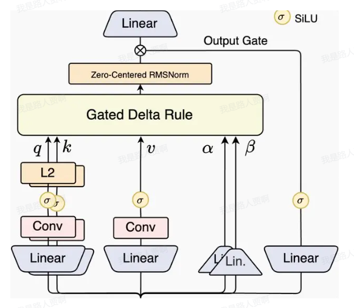

# Qwen3-Next：线性注意力与 Gated DeltaNet

> 根据图片内容整理。本文先回顾 Softmax Attention 的计算复杂度，再推导 Linear Attention、DeltaNet 和 Gated DeltaNet，最后结合项目代码说明 Qwen3-Next 中线性注意力模块的计算流程。

> 直接 看 obsidian 的 笔记


## 1. 符号约定

设序列长度为 $n$，每个向量的维度为 $d$：

$$
q_i,k_i,v_i,o_i\in\mathbb{R}^{d\times 1}
$$

其中 $q_i,k_i,v_i,o_i$ 均为列向量。将各位置的向量堆叠成矩阵：

$$
Q=[q_1,q_2,\cdots,q_n]^\mathrm{T}\in\mathbb{R}^{n\times d}
$$

$$
K=[k_1,k_2,\cdots,k_n]^\mathrm{T}\in\mathbb{R}^{n\times d}
$$

$$
V=[v_1,v_2,\cdots,v_n]^\mathrm{T}\in\mathbb{R}^{n\times d}
$$

$$
O=[o_1,o_2,\cdots,o_n]^\mathrm{T}\in\mathbb{R}^{n\times d}
$$

## 2. Softmax Attention

### 2.1 双向注意力与单向注意力

双向注意力常用于 BERT、Encoder 等模型：

$$
O=\operatorname{softmax}\left(\frac{QK^\mathrm{T}}{\sqrt{d_k}}\right)V
$$

单向注意力常用于 GPT、Decoder 等自回归模型，需要增加因果 Mask 矩阵 $M$：

$$
O=\operatorname{softmax}\left(\frac{QK^\mathrm{T}}{\sqrt{d_k}}+\log M\right)V
$$

### 2.2 计算复杂度

为了方便分析，暂时忽略 Softmax 和缩放因子 $\sqrt{d_k}$。

#### 先计算 $QK^\mathrm{T}$

$$
QK^\mathrm{T}:(n,d)\times(d,n),
$$

计算量为：

$$
O(n^2d)
$$

令 $A=QK^\mathrm{T}$，继续计算：

$$
AV:(n,n)\times(n,d),
$$

计算量仍为：

$$
O(n^2d)
$$

#### 先计算 $K^\mathrm{T}V$

$$
K^\mathrm{T}V:(d,n)\times(n,d),
$$

计算量为：

$$
O(nd^2)
$$

令 $B=K^\mathrm{T}V$，继续计算：

$$
QB:(n,d)\times(d,d),
$$

计算量仍为：

$$
O(nd^2)
$$

因此：

- 先计算 $QK^\mathrm{T}$ 时，复杂度为 $O(n^2d)$；
- 先计算 $K^\mathrm{T}V$ 时，复杂度为 $O(nd^2)$。

在长序列场景下通常有 $n\gg d$，所以先计算 $K^\mathrm{T}V$ 的复杂度明显更低。但是 Softmax 的存在破坏了矩阵乘法结合律，无法直接交换计算顺序。这使得标准 Softmax Attention 在长序列上的计算和显存开销都很高。

一个自然的问题是：能否不使用 Softmax 计算注意力？

## 3. Linear Attention

### 3.1 线性注意力的由来

早期的一些线性注意力使用其他核函数近似 Softmax：

$$
\operatorname{Attn}=\varphi(Q)\varphi(K)^\mathrm{T}V
$$

Softmax Attention 还会进行归一化。为了实现归一化，$K^\mathrm{T}q$ 通常需要符合某些约束，这会给 $Q$、$K$ 加上一些额外激活函数或归一化操作。

但后来的一些线性注意力工作发现，即使没有归一化，甚至不对 $Q$、$K$ 使用额外激活函数，模型仍然能够工作。**因此可以直接移除 Softmax**，得到：

双向注意力：

$$
O=(QK^\mathrm{T})V
$$

单向注意力：

$$
O=(QK^\mathrm{T}\odot M)V
$$

对于双向注意力，因为没有 Mask，可以利用矩阵乘法结合律交换计算顺序，从而降低复杂度。**对于单向注意力，由于因果 Mask $M$ 的存在，无法直接交换整个矩阵的计算顺序，需要改写成递推形式**。

### 3.2 单向线性注意力的递推形式

第 $t$ 个位置的输出为：

$$
o_t=\sum_{j=1}^{t}v_j(k_j^\mathrm{T}q_t)
$$

利用矩阵乘法结合律：

$$
o_t=\sum_{j=1}^{t}(v_jk_j^\mathrm{T})q_t
$$

$$
o_t=\left(\sum_{j=1}^{t}v_jk_j^\mathrm{T}\right)q_t
$$

定义状态矩阵：

$$
S_t=\sum_{j=1}^{t}v_jk_j^\mathrm{T}
$$

于是：

$$
o_t=S_tq_t
$$

状态可以递推更新：

$$
S_t=S_{t-1}+v_tk_t^\mathrm{T}
$$

这种形式可以看成以 $S_t$ 为状态的线性 RNN。$S_t$ 是历史 $v$ 和 $k$ 的外积之和，保存了历史信息。推理时只需维护固定大小的 $d\times d$ 状态矩阵，无需保存全部历史 KV 对，空间复杂度由 $O(nd)$ 变为 $O(d^2)$；当 $n\gg d$ 时更有优势。

因此每生成一个 token，只需要执行：
读取旧状态 S_(t-1)
        ↓
加入当前外积 v_t k_t^T
        ↓
得到新状态 S_t
        ↓
计算输出 S_t q_t
假设：
\[
v_t\in\mathbb{R}^{d_v},
\qquad
k_t,q_t\in\mathbb{R}^{d_k}
\]那么：
\[
S_t\in\mathbb{R}^{d_v\times d_k}
\]它的大小只取决于 head 维度，与序列长度 \(t\) 无关。如果 \(d_v=d_k=d\)，就是固定的 \(d\times d\) 矩阵。
例如 \(d=128\)：
序列长度 1,000：状态大小仍是 \(128\times128\)；
序列长度 100,000：状态大小仍是 \(128\times128\)。
而普通 KV Cache 的大小则从 \(1000\times128\) 增长到 \(100000\times128\)。
需要注意：这里的“保存了所有历史信息”不是无损保存。所有历史 KV 都被压缩到固定矩阵 \(S_t\) 中，无法再还原单独的 \(k_j,v_j\)。随着序列变长，不同 token 的信息会发生叠加和干扰。这也是朴素线性注意力通常弱于 Softmax Attention，以及 DeltaNet/Gated DeltaNet 要引入“删除旧知识、写入新知识”和遗忘门机制的原因。

## 4. 遗忘机制与 DeltaNet

### 4.1 为什么需要遗忘

固定大小的状态矩阵无法无损保存无限长的历史。当序列很长时，每个 token 的信息占比会越来越小，这也是朴素线性注意力能力较弱的原因之一。

一种改进方式是在加入新 token 时，遗忘一部分不重要的历史信息，即除旧迎新。

可以使用静态衰减因子 $\gamma\in[0,1]$：

$$
S_t=\gamma S_{t-1}+v_tk_t^\mathrm{T}
$$

也可以使用与输入相关的衰减因子：

$$
S_t=\gamma_tS_{t-1}+v_tk_t^\mathrm{T}
$$

还可以使用遗忘矩阵或门控矩阵 $G_t$：

$$
S_t=G_t\odot S_{t-1}+v_tk_t^\mathrm{T}
$$

### 4.2 线性注意力的优化目标

状态矩阵 $S_t$ 保存历史信息。给定当前输入 $k_t$，希望从 $S_t$ 中读取到最相关的 $v_t$，并让输出无限接近真实的 $v_t$。

可以把 $K,V$ 看作训练样本对：

$$
(k_1,v_1),(k_2,v_2),\cdots,(k_t,v_t)
$$

优化目标为：

$$
S_tk_t=v_t
$$

使用均方误差作为损失：

$$
\mathcal{L}_t(S)=\frac{1}{2}\lVert Sk_t-v_t\rVert^2
$$

使用梯度下降更新状态矩阵：

$$
S_t=S_{t-1}-\eta_t\nabla\mathcal{L}_t(S_{t-1})
$$

梯度为：

$$
\nabla\mathcal{L}_t(S_{t-1})=(S_{t-1}k_t-v_t)k_t^\mathrm{T}
$$

所以：

$$
S_t=S_{t-1}-\eta_t(S_{t-1}k_t-v_t)k_t^\mathrm{T}
$$

将学习率 $\eta_t$ 记为 $\beta_t$：

$$
\begin{aligned}
S_t
&=S_{t-1}-\beta_t(S_{t-1}k_t-v_t)k_t^\mathrm{T}\\
&=S_{t-1}-\beta_tS_{t-1}k_tk_t^\mathrm{T}+\beta_tv_tk_t^\mathrm{T}\\
&=S_{t-1}(I-\beta_tk_tk_t^\mathrm{T})+\beta_tv_tk_t^\mathrm{T}
\end{aligned}
$$

其中：

- $S_{t-1}k_t$ 是模型对当前 key 的旧知识；
- $v_tk_t^\mathrm{T}$ 是需要补充的新知识；
- 整个更新过程先删除旧知识，再加入新知识，因此称为 **DeltaNet**。

### 4.3 Gated DeltaNet

在 DeltaNet 的基础上增加遗忘门 $\alpha_t$：

$$
\begin{aligned}
S_t
&=\alpha_tS_{t-1}(I-\beta_tk_tk_t^\mathrm{T})+\beta_tv_tk_t^\mathrm{T}\\
&=\alpha_tS_{t-1}+(v_t-\alpha_tS_{t-1}k_t)\beta_tk_t^\mathrm{T}
\end{aligned}
$$

这就是 Qwen3-Next 使用的 Gated DeltaNet 形式。

另一种写法是把门控作用到旧状态上：

$$
S_t=\alpha_tS_{t-1}-\beta_t(S_{t-1}k_t-v_t)k_t^\mathrm{T}
$$

它与前面引入的遗忘形式相呼应：

$$
S_t=G_t\odot S_{t-1}+v_tk_t^\mathrm{T}
$$

### 4.4 朴素线性注意力的另一种损失解释

最初线性注意力对应的目标也可以写成内积损失：

$$
\mathcal{L}_t(S)=-v_t^\mathrm{T}(Sk_t)
$$

该目标优化模型预测的 $v_t$ 与真实 $v_t$ 的相似性。此时梯度下降更新为： 

$$
\begin{aligned}
S_t
&=S_{t-1}-\eta_t(-v_tk_t^\mathrm{T})\\
&=S_{t-1}+\eta_tv_tk_t^\mathrm{T}
\end{aligned}
$$

即恢复为标准线性注意力的累加更新。

## 5. Qwen3-Next 中的 Gated DeltaNet




$$
\begin{aligned}
S_t
&=\alpha_tS_{t-1}(I-\beta_tk_tk_t^\mathrm{T})+\beta_tv_tk_t^\mathrm{T}\\
&=\alpha_tS_{t-1}+(v_t-\alpha_tS_{t-1}k_t)\beta_tk_t^\mathrm{T}
\end{aligned}
$$


### 

5.1 模块结构

图片中的模块可以概括为以下数据流：

1. 输入经过线性投影，得到 $q,k,v,z,\alpha,\beta$；
2. $q,k,v$ 经过一维因果卷积和 SiLU 激活；
3. 对 $q,k$ 做 L2 归一化；
4. 使用 $q,k,v,\alpha,\beta$ 执行 Gated Delta Rule；
5. 注意力输出经过 Zero-Centered RMSNorm；
6. $z$ 经过 SiLU，作为输出门控；
7. 归一化后的注意力输出与门控逐元素相乘；
8. 最后经过线性投影得到模块输出。

下面结合项目实现逐步说明各张量维度的变化。

### 5.2 第一步：投影得到 $Q,K,V,Z,\alpha,\beta$

```python
self.hidden_size = config.hidden_size
self.num_v_heads = config.linear_num_value_heads
self.num_k_heads = config.linear_num_key_heads
self.head_k_dim = config.linear_key_head_dim
self.head_v_dim = config.linear_value_head_dim
self.key_dim = self.head_k_dim * self.num_k_heads
self.value_dim = self.head_v_dim * self.num_v_heads

projection_size_qkvz = self.key_dim * 2 + self.value_dim * 2
projection_size_ba = self.num_v_heads * 2

self.in_proj_qkvz = nn.Linear(
    self.hidden_size, projection_size_qkvz, bias=False
)
self.in_proj_ba = nn.Linear(
    self.hidden_size, projection_size_ba, bias=False
)

# [batch, seq_len, key_dim * 2 + value_dim * 2]
projected_states_qkvz = self.in_proj_qkvz(hidden_states)

# [batch, seq_len, num_v_heads * 2]
projected_states_ba = self.in_proj_ba(hidden_states)

query, key, value, z = torch.split(
    projected_states_qkvz,
    [self.key_dim, self.key_dim, self.value_dim, self.value_dim],
    dim=-1,
)

b, a = torch.split(
    projected_states_ba,
    [self.num_v_heads, self.num_v_heads],
    dim=-1,
)
```

### 5.3 第二步：拼接 $Q,K,V$ 并执行一维卷积

训练阶段拥有完整序列，可以直接对整个序列执行卷积：

```python
# [batch, seq_len, key_dim * 2 + value_dim]
mixed_qkv = torch.cat([query, key, value], dim=-1)

# Conv1d 的序列维位于最后一维
mixed_qkv = mixed_qkv.transpose(1, 2)
mixed_qkv = F.silu(self.conv1d(mixed_qkv)[:, :, :seq_len])

# 转回 [batch, seq_len, key_dim * 2 + value_dim]
mixed_qkv = mixed_qkv.transpose(1, 2)
```

卷积用于弥补线性化后表达能力的下降。

推理阶段分为 Prefill 和逐 token Generate。Prefill 类似训练，但需要缓存卷积状态：

```python
conv_state = F.pad(
    mixed_qkv,
    (self.conv_kernel_size - mixed_qkv.shape[-1], 0),
)
cache_params.conv_states[self.layer_idx] = conv_state
mixed_qkv = F.silu(self.conv1d(mixed_qkv)[:, :, :seq_len])
```

Generate 阶段可以使用固定长度的因果卷积状态：

```python
def torch_causal_conv1d_update(
    hidden_states,
    conv_state,
    weight,
    bias=None,
):
    _, hidden_size, seq_len = hidden_states.shape
    state_len = conv_state.shape[-1]

    hidden_states_new = torch.cat(
        [conv_state, hidden_states], dim=-1
    ).to(weight.dtype)
    conv_state.copy_(hidden_states_new[:, :, -state_len:])

    out = F.conv1d(
        hidden_states_new,
        weight.unsqueeze(1),
        bias,
        padding=0,
        groups=hidden_size,
    )
    out = F.silu(out[:, :, -seq_len:])
    return out.to(hidden_states.dtype)

conv_state = cache_params.conv_states[self.layer_idx]
mixed_qkv = torch_causal_conv1d_update(
    mixed_qkv,
    conv_state,
    self.conv1d.weight.squeeze(1),
    self.conv1d.bias,
)
```

图片还给出了直接拼接历史卷积序列的实现方式：

```python
conv_state = cache_params.conv_states[self.layer_idx]
conv_state = torch.cat([conv_state, mixed_qkv], dim=-1)
state_len = conv_state.shape[-1]

mixed_qkv = F.silu(
    self.conv1d(conv_state)[:, :, state_len - 1 : state_len]
)
cache_params.conv_states[self.layer_idx] = conv_state
```

### 5.4 第三步：重新拆分 $Q,K,V$

```python
query, key, value = torch.split(
    mixed_qkv,
    [self.key_dim, self.key_dim, self.value_dim],
    dim=-1,
)

query = query.reshape(
    batch_size, seq_len, -1, self.head_k_dim
)
key = key.reshape(
    batch_size, seq_len, -1, self.head_k_dim
)
value = value.reshape(
    batch_size, seq_len, -1, self.head_v_dim
)
```

这时各张量形状为：

```text
query: [batch, seq_len, num_k_heads, head_k_dim]
key:   [batch, seq_len, num_k_heads, head_k_dim]
value: [batch, seq_len, num_v_heads, head_v_dim]
```

当 value head 数多于 key head 数时，采用类似 GQA 的方式复制 $Q,K$，使 head 数保持一致：

```python
if self.num_v_heads // self.num_k_heads > 1:
    repeat = self.num_v_heads // self.num_k_heads
    query = query.repeat_interleave(repeat, dim=2)
    key = key.repeat_interleave(repeat, dim=2)
```

复制后统一使用 `num_v_heads` 参与后续计算。

### 5.5 第四步：计算更新强度 $\beta$

```python
beta = b.sigmoid()
```

Sigmoid 将 $\beta$ 限制在 $0$ 到 $1$ 之间，用于控制 Delta Rule 更新新旧知识的强度。

### 5.6 第五步：计算遗忘门 $g$

```python
self.dt_bias = nn.Parameter(torch.ones(self.num_v_heads))

A = torch.empty(self.num_v_heads).uniform_(0, 16)
self.A_log = nn.Parameter(torch.log(A))

g = -self.A_log.float().exp() * F.softplus(
    a.float() + self.dt_bias
)
```

这是对遗忘门的一种参数化方式，并不是唯一实现。递推时会使用 $\exp(g)$ 作为衰减门，对应公式中的 $\alpha_t$。

### 5.7 第六步：对 $Q,K$ 做 L2 归一化

```python
query = l2norm(query, dim=-1, eps=1e-6)
key = l2norm(key, dim=-1, eps=1e-6)

# query, key: [batch, num_heads, seq_len, head_k_dim]
# value:      [batch, num_heads, seq_len, head_v_dim]
# beta, g:    [batch, num_heads, seq_len]
query = query.transpose(1, 2).contiguous().to(torch.float32)
key = key.transpose(1, 2).contiguous().to(torch.float32)
value = value.transpose(1, 2).contiguous().to(torch.float32)
beta = beta.transpose(1, 2).contiguous().to(torch.float32)
g = g.transpose(1, 2).contiguous().to(torch.float32)
```

### 5.8 第七步：执行 Gated DeltaNet 递推

```python
core_attn_out = torch.zeros(
    batch_size,
    num_heads,
    sequence_length,
    head_v_dim,
).to(value)

recurrent_state = None
if cache_params is not None:
    recurrent_state = cache_params.recurrent_states[self.layer_idx]

if recurrent_state is None:
    last_recurrent_state = torch.zeros(
        batch_size,
        num_heads,
        head_k_dim,
        head_v_dim,
    ).to(value)
else:
    last_recurrent_state = recurrent_state.to(value)

for i in range(sequence_length):
    q_t = query[:, :, i]
    k_t = key[:, :, i]
    v_t = value[:, :, i]
    g_t = g[:, :, i].exp().unsqueeze(-1).unsqueeze(-1)
    beta_t = beta[:, :, i].unsqueeze(-1)

    last_recurrent_state = last_recurrent_state * g_t
    kv_mem = (
        last_recurrent_state * k_t.unsqueeze(-1)
    ).sum(dim=-2)
    delta = (v_t - kv_mem) * beta_t
    last_recurrent_state = (
        last_recurrent_state
        + k_t.unsqueeze(-1) * delta.unsqueeze(-2)
    )
    core_attn_out[:, :, i] = (
        last_recurrent_state * q_t.unsqueeze(-1)
    ).sum(dim=-2)

core_attn_out = core_attn_out.transpose(1, 2).contiguous()
core_attn_out = core_attn_out.reshape(
    batch_size, sequence_length, -1
)

if cache_params is not None:
    cache_params.recurrent_states[
        self.layer_idx
    ] = last_recurrent_state
```

对应的核心公式为：

g_t 就是公式里的
$\alpha_t$
$$
S_t=\alpha_tS_{t-1}+(v_t-\alpha_tS_{t-1}k_t)\beta_tk_t^\mathrm{T}
$$

代码与公式的对应关系如下：

- `last_recurrent_state * g_t`：计算 $\alpha_tS_{t-1}$，对历史信息施加遗忘门；
- `kv_mem`：计算 $\alpha_tS_{t-1}k_t$，表示模型对当前 key 的旧知识；
- `delta = (v_t - kv_mem) * beta_t`：计算 $(v_t-\alpha_tS_{t-1}k_t)\beta_t$，删除旧知识并提取需要加入的新知识；
- `last_recurrent_state += ...`：得到新的状态矩阵 $S_t$；
- 状态与 `q_t` 相乘：计算 $o_t=S_tq_t$，得到当前位置的注意力输出。

上述逐 token 循环适合推理和训练阶段的原理演示，但训练或 Prefill 阶段无法充分发挥 GPU 并行效率。实际优化时可以：

- 把输入序列切分成多个固定长度的 chunk，不足长度的部分进行 padding；
- chunk 内并行、chunk 间累加，提高计算并行性。

本文实现主要用于说明线性注意力的核心原理，因此训练和推理统一使用循环递推，没有进一步实现 chunk 并行。

### 5.9 第八步：归一化注意力输出

```python
core_attn_out = self.norm(core_attn_out)
```

### 5.10 第九步：计算输出门控

```python
z = F.silu(z)
```

### 5.11 第十步：应用门控并进行输出投影

```python
core_attn_out = core_attn_out * z
output = self.out_proj(core_attn_out)
```

最终完成一次 Gated DeltaNet 线性注意力计算。

## 6. Gated Attention（Softmax Attention）

### 6.1 核心思想

相比传统 Softmax Attention，Gated Attention 在注意力输出上增加了门控机制。输入向量经过额外的线性映射得到与 $Q$ 形状相同的门控矩阵 $Z$，经过 Sigmoid 激活后，与注意力结果逐元素相乘。

整体数据流为：

1. 输入分别投影成 $Q,K,V,Z$；
2. 对 $Q,K$ 做 Zero-Centered RMSNorm；
3. 对 $Q,K$ 的部分维度应用 RoPE；
4. 计算 Scaled Dot Product Attention；
5. 对 $Z$ 做 Sigmoid 激活，得到输出门；
6. 将注意力结果与输出门逐元素相乘；
7. 经过输出线性层得到最终结果。

可以简写为：

$$
O=W_o\left(\operatorname{Attention}(Q,K,V)\odot\sigma(Z)\right)
$$

### 6.2 第一步：线性映射得到 $Q,K,V,Z$

`hidden_states` 分别经过四个线性映射。其中 $Q$ 和 $Z$ 的形状相同：

```python
q = self.q_proj(hidden_states)
k = self.k_proj(hidden_states)
v = self.v_proj(hidden_states)
z = self.gate_proj(hidden_states)
```

### 6.3 第二步：变换成多头注意力形状

```python
q = q.view(b, q.shape[1], self.num_heads, self.head_dim)
k = k.view(
    b,
    k.shape[1],
    self.num_key_value_heads,
    self.head_dim,
)
v = v.view(
    b,
    v.shape[1],
    self.num_key_value_heads,
    self.head_dim,
)
```

此时张量形状为：

```text
q: [batch, seq_len, num_heads, head_dim]
k: [batch, seq_len, num_key_value_heads, head_dim]
v: [batch, seq_len, num_key_value_heads, head_dim]
```

### 6.4 第三步：标准化 $Q,K$ 并加入旋转位置编码

```python
q = self.q_norm(q)
k = self.k_norm(k)
q, k = self.rotary_emb(q, k)
```

Qwen3-Next 只对 $Q,K$ 的部分维度应用旋转位置编码，即 Partial RoPE。当前项目代码对完整的 head 维度应用 RoPE，没有实现 Partial RoPE。

### 6.5 第四步：Repeat KV

在 GQA 中，$Q$ 的多个 head 共享一个 KV head。执行注意力计算前，需要在 head 维度复制 $K,V$，使它们的 head 数与 $Q$ 一致：

```python
k = repeat_kv(k, self.num_key_value_groups)
v = repeat_kv(v, self.num_key_value_groups)
```

### 6.6 第五步：计算注意力

```python
output = F.scaled_dot_product_attention(
    q,
    k,
    v,
    attn_mask=attn_mask,
)
output = output.transpose(1, 2).contiguous().view(b, s, -1)
```

输出形状恢复为：

```text
[batch, seq_len, hidden_size]
```

### 6.7 第六步：添加输出门控

```python
z = z.sigmoid()
output = output * z
output = self.o_proj(output)
```

门控矩阵 $Z$ 可以根据当前输入动态控制各维度注意力输出的保留程度。

## 7. RMSNorm 与 Zero-Centered RMSNorm

从普通 RMSNorm 到 Zero-Centered RMSNorm，主要区别是缩放权重的参数化和初始化方式不同。

### 7.1 普通 RMSNorm

普通 RMSNorm 的缩放权重 $w$ 初始化为 1，计算完 RMS 归一化后直接乘以 $w$：

$$
\operatorname{RMSNorm}(x)
=\frac{x}{\sqrt{\frac{1}{d}\sum_{i=1}^{d}x_i^2+\epsilon}}\cdot w
$$

```python
class RMSNorm(nn.Module):
    def __init__(self, hidden_size, eps=1e-6):
        super().__init__()
        # 普通 RMSNorm：权重初始化为 1
        self.weight = nn.Parameter(torch.ones(hidden_size))
        self.variance_epsilon = eps

    def forward(self, hidden_states):
        hidden_states = hidden_states.float()
        variance = hidden_states.pow(2).mean(-1, keepdim=True)
        hidden_states = hidden_states * torch.rsqrt(
            variance + self.variance_epsilon
        )
        return self.weight * hidden_states.float()
```

### 7.2 Zero-Centered RMSNorm

Zero-Centered RMSNorm 将权重 $w$ 初始化为 0，归一化结果乘以 $1+w$：

$$
\operatorname{ZeroCenteredRMSNorm}(x)
=\frac{x}{\sqrt{\frac{1}{d}\sum_{i=1}^{d}x_i^2+\epsilon}}\cdot(1+w)
$$

```python
class ZeroCenteredRMSNorm(nn.Module):
    def __init__(self, hidden_size, eps=1e-6):
        super().__init__()
        # Zero-Centered RMSNorm：权重初始化为 0
        self.weight = nn.Parameter(torch.zeros(hidden_size))
        self.variance_epsilon = eps

    def forward(self, hidden_states):
        hidden_states = hidden_states.float()
        variance = hidden_states.pow(2).mean(-1, keepdim=True)
        hidden_states = hidden_states * torch.rsqrt(
            variance + self.variance_epsilon
        )
        return (1 + self.weight) * hidden_states.float()
```

这种参数化使模型在训练初期近似一个没有可学习缩放参数的纯归一化操作，有助于稳定梯度传播，降低梯度爆炸或消失的风险。

> 当前项目中的 `RMSNorm` 权重初始化为 1，并直接乘以 `weight`，因此实现的是普通 RMSNorm，不是 Zero-Centered RMSNorm。

## 8. Qwen3-Next-80B-A3B-Instruct 模型架构

图片列出的主要架构参数如下。

### 8.1 总体参数

- 总参数量：80B；
- 每个 token 的激活参数量：3B；
- Decoder 层数：48；
- Gated Attention 与 Gated DeltaNet 的层数比例为 $1:3$；
- 隐藏维度：2048。

### 8.2 Gated Attention

- Query head 数：16；
- KV head 数：2；
- head 维度：256；
- RoPE 旋转位置嵌入维度：64。

### 8.3 Gated DeltaNet

- Value head 数：32；
- Query/Key head 数：16；
- head 维度：128。

### 8.4 混合专家

- 专家总数：512；
- 每个 token 激活的专家数：10；
- 共享专家数：1。

## 9. 从 Qwen3-Next 到 Kimi Linear

Kimi Linear 将 Qwen3-Next 的 Gated DeltaNet（GDN）替换为 Kimi Delta Attention（KDA）。两者的整体结构相似，都包含输入投影、卷积、L2 归一化、Delta Rule、RMSNorm、输出门控和输出投影；主要区别集中在遗忘门的粒度、门控结构和位置编码方式上。

> 本节采用状态矩阵 $S_t\in\mathbb{R}^{d_k\times d_v}$ 的记法，与前文 $S_t\in\mathbb{R}^{d_v\times d_k}$ 的记法互为转置，因此外积顺序和矩阵乘法方向也相应转置，但两者表达的是同一个递推过程。

### 9.1 GDN 与 KDA 的状态更新

#### Gated DeltaNet

使用 $d_k\times d_v$ 状态矩阵记法时，GDN 的更新公式为：

$$
S_t
=\alpha_t\left(I-\beta_tk_tk_t^\mathrm{T}\right)S_{t-1}
+\beta_tk_tv_t^\mathrm{T}
$$

输出为：

$$
o_t=W_o\left(
\operatorname{Sigmoid}(Wx_t)
\odot
\operatorname{RMSNorm}\left(
\operatorname{GDN}(q_t,k_t,v_t,\alpha_t,\beta_t)
\right)
\right)
$$

#### Kimi Delta Attention

KDA 的更新公式为：

$$
S_t
=\left(I-\beta_tk_tk_t^\mathrm{T}\right)
\operatorname{Diag}(\alpha_t)S_{t-1}
+\beta_tk_tv_t^\mathrm{T}
$$

输出门使用低秩投影：

$$
o_t=W_o\left(
\operatorname{Sigmoid}(W_{g_{down}}W_{g_{up}}x_t)
\odot
\operatorname{RMSNorm}\left(
\operatorname{KDA}(q_t,k_t,v_t,\alpha_t,\beta_t)
\right)
\right)
$$

KDA 针对 Gated DeltaNet 的主要改进在门控矩阵上：

- GDN 使用 **head-wise** 遗忘机制：每个 head 的所有 key 维度共享一个衰减因子，粒度较粗；
- **KDA 使用 **channel-wise** 遗忘机制：每个 head 的不同 key 维度拥有不同的衰减因子，控制粒度更细**。

### 9.2 GDN 的遗忘门形状

GDN 通过一个线性层为每个 head 生成一个门控值：

```python
in_proj_a = nn.Linear(hidden_size, num_heads, bias=False)

# [batch, seq_len, num_heads]
a = in_proj_a(hidden_states)
g = a
```

在时刻 $t$：

```text
g_t: [batch, num_heads]
S_t: [batch, num_heads, head_k_dim, head_v_dim]
```

为与状态矩阵逐元素相乘，需要增加两个维度：

```python
g_t = g_t.unsqueeze(-1).unsqueeze(-1)

# g_t:
# [batch, num_heads, 1, 1]
```

相乘时，门控值会同时广播到 `head_k_dim` 和 `head_v_dim`：

```text
[batch, num_heads, 1, 1]
    ×
[batch, num_heads, head_k_dim, head_v_dim]
```

因此，同一个 head 内的所有状态维度共享同一个遗忘因子。

### 9.3 KDA 的遗忘门形状

KDA 为每个 key channel 生成独立门控值。图片中的简化实现忽略了原论文先降维再升维的步骤，直接使用一个线性投影：

```python
in_proj_a = nn.Linear(hidden_size, key_dim, bias=False)

# [batch, seq_len, key_dim]
a = in_proj_a(hidden_states)

# [batch, seq_len, num_heads, head_k_dim]
a = a.reshape(batch_size, seq_len, num_heads, -1)
g = a
```

在时刻 $t$：

```text
g_t: [batch, num_heads, head_k_dim]
S_t: [batch, num_heads, head_k_dim, head_v_dim]
```

只需在最后增加一个维度：

```python
g_t = g_t.unsqueeze(-1)

# g_t:
# [batch, num_heads, head_k_dim, 1]
```

相乘时只在 `head_v_dim` 上广播：

```text
[batch, num_heads, head_k_dim, 1]
    ×
[batch, num_heads, head_k_dim, head_v_dim]
```

这样，同一个 head 的不同 key channel 可以具有不同的衰减因子，实现更细粒度的门控。

### 9.4 位置编码

位置编码方面：

- Qwen3-Next 的 Gated Attention/MLA 对 $Q,K$ 的部分维度应用 RoPE，引入显式位置信息；
- Kimi Linear 去掉了 MLA 中的 RoPE 部分，只依赖线性注意力递推本身携带的位置关系。

RoPE 这类乘法位置编码可以通过广义注意力形式表示：

$$
s_{t,i}
=q_t^\mathrm{T}
\left(\prod_{j=i+1}^{t}R_j\right)k_i
$$

带有门控 Delta Rule 的线性注意力也可以得到类似的乘法位置关系：

$$
o_t
=\sum_{i=1}^{t}
\left[
q_t^\mathrm{T}
\left(
\prod_{j=i+1}^{t}
A_j\left(I-\beta_jk_jk_j^\mathrm{T}\right)
\right)k_i
\right]v_i
$$

GDN/KDA 可以被解释为一种乘法位置编码。它的状态转移矩阵依赖数据，放松了 RoPE 施加的正交性约束，可能具有更强的表达能力。因此 Kimi Linear 去掉了 MLA 中显式的 RoPE，使用 KDA 自身的数据依赖位置关系区分不同位置。

### 9.5 归一化差异

- Qwen3-Next 使用 Zero-Centered RMSNorm；
- Kimi Linear 使用普通 RMSNorm。

### 9.6 混合比例与整体结构

- Qwen3-Next 和 Kimi Linear 都按 $3:1$ 的比例混合线性注意力与 Softmax Attention；
- 两者都采用 MoE 架构。
