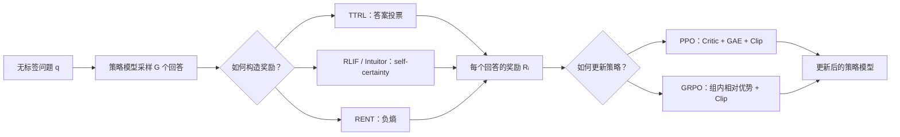

# 无监督强化学习笔记：PPO、GRPO 与 TTRL、RLIF、RENT

## 0. 先记住最重要的结论

在大语言模型强化学习中，可以把训练拆成两个相对独立的问题：

1. **奖励从哪里来？**  
   TTRL、RLIF（具体实例 Intuitor）和 RENT 给出了三种不依赖人工标注正确答案的奖励构造方式。
2. **拿到奖励后，怎样更新模型？**  
   PPO、GRPO 是策略优化算法，负责根据奖励增大“好回答”的生成概率、减小“差回答”的生成概率。

因此，更准确的关系是：

> **TTRL / Intuitor / RENT 负责“打分”，PPO / GRPO 负责“根据分数学习”。**

例如，可以把 TTRL 的投票奖励交给 GRPO，也可以把 RLIF 中 Intuitor 的 self-certainty 奖励交给 GRPO。奖励函数和优化算法不是同一层概念。

---

## 1. 把 LLM 生成过程看成强化学习

给定问题 $q$，模型逐个生成 token：

$$
y=(y_1,y_2,\ldots,y_T),\qquad
y_t\sim\pi_\theta(\cdot\mid q,y_{<t})
$$

可以对应到强化学习中的概念：

| 强化学习概念 | 在 LLM 中的含义 |
| --- | --- |
| 状态 $s_t$ | 问题 $q$ 加上已经生成的前缀 $y_{<t}$ |
| 动作 $a_t$ | 下一个 token $y_t$ |
| 策略 $\pi_\theta$ | LLM 给出的下一个 token 概率分布 |
| 轨迹 | 一条完整回答 $y$ |
| 奖励 $R(q,y)$ | 对整条回答质量的打分 |

传统 RLVR（Reinforcement Learning with Verifiable Rewards）可以直接用标准答案或代码测试用例打分：

$$
R(q,y)=
\begin{cases}
1,& \operatorname{answer}(y)=y_{\text{gold}}\\
0,& \text{其他}
\end{cases}
$$

在本文讨论的“既没有 $y_{\text{gold}}$、也不使用外部验证器”的设置下，就需要从模型自身的采样结果或内部概率分布中构造奖励。TTRL、RLIF 和 RENT 研究的正是这个问题。

> 这里的“无监督”是指强化学习阶段不使用人工标注答案或外部验证器，并不表示模型从来没有见过有监督数据。预训练模型本身已经包含了从大规模语料中获得的知识先验。

---

## 2. PPO 与 GRPO：负责“怎样学习”

### 2.1 PPO

PPO（Proximal Policy Optimization）是一种策略梯度算法。它通常需要：

- Actor：正在训练的语言模型；
- Critic / Value Model：估计当前状态未来能获得多大回报；
- GAE：根据奖励和 Value 估计优势 $A_t$；
- Clip：限制新旧策略一次更新得过大。

PPO 的核心裁剪目标可以简写为：

$$
J_{\text{PPO}}(\theta)
=
\mathbb E_t\left[
\min\left(
\rho_t(\theta)A_t,\,
\operatorname{clip}(\rho_t(\theta),1-\epsilon,1+\epsilon)A_t
\right)
\right]
$$

其中：

$$
\rho_t(\theta)
=
\frac{\pi_\theta(y_t\mid q,y_{<t})}
{\pi_{\text{old}}(y_t\mid q,y_{<t})}
$$

- $A_t>0$：提高这个 token 的概率；
- $A_t<0$：降低这个 token 的概率；
- Clip：防止模型因为一次奖励就发生剧烈变化。

### 2.2 GRPO

GRPO（Group Relative Policy Optimization）保留了 PPO 风格的策略比率和裁剪，但不训练 Critic。它对同一个问题采样一组回答，然后用**组内相对奖励**估计优势。

假设同一道题的 $G$ 个回答得到奖励：

$$
R_1,R_2,\ldots,R_G
$$

常见的组内标准化优势为：

$$
A_i
=
\frac{R_i-\operatorname{mean}(R_1,\ldots,R_G)}
{\operatorname{std}(R_1,\ldots,R_G)+\varepsilon}
$$

于是：

- 奖励高于组平均值的回答，$A_i>0$，生成概率上升；
- 奖励低于组平均值的回答，$A_i<0$，生成概率下降；
- 如果一组回答的奖励完全一样，标准化后没有有效的相对优势，学习信号很弱或为零。

### 2.3 两者对比

| 维度 | PPO | GRPO |
| --- | --- | --- |
| 是否属于策略优化算法 | 是 | 是 |
| 是否负责定义“正确答案” | 否 | 否 |
| 优势如何得到 | Critic + TD / GAE | 同题多回答的组内相对奖励 |
| 是否需要 Critic | 通常需要 | 不需要 |
| 每个问题是否必须多次采样 | 不一定 | 通常需要 |
| 共同点 | 都让正优势回答更可能出现，让负优势回答更不可能出现，并限制更新幅度 | |

---

## 3. TTRL：用多次采样的投票结果构造伪奖励

TTRL（Test-Time Reinforcement Learning）的核心思想是：

> 没有标准答案时，让模型对同一道题回答多次，把出现次数最多的答案暂时当作伪标签。

### 3.1 流程

给定一个无标签问题 $q$：

1. 从当前或旧策略中采样 $G$ 个回答：

   $$
   y_1,\ldots,y_G\sim\pi_{\text{old}}(\cdot\mid q)
   $$

2. 从每个回答中抽取最终答案 $a_i=\operatorname{answer}(y_i)$。
3. 选择出现次数最多的答案：

   $$
   \hat a
   =
   \arg\max_a\sum_{i=1}^{G}\mathbf 1[a_i=a]
   $$

4. 用伪标签 $\hat a$ 给每条回答打分：

   $$
   R_i^{\text{TTRL}}
   =
   \mathbf 1[a_i=\hat a]
   $$

5. 将奖励交给 PPO、GRPO 等算法更新模型。

严格来说，“超过一半”才叫绝对多数（majority）；TTRL 实际常用的是“票数最多者”，即相对多数或众数（plurality / mode）。论文和资料中经常把它宽泛地称为 majority voting。

### 3.2 例子：投票答案恰好正确

问题：

> 一个班有 12 名男生和 8 名女生，一共有多少人？

模型采样 8 次，抽取出的最终答案为：

$$
[20,20,19,20,18,20,21,20]
$$

票数最多的是 $20$，所以：

$$
\hat a=20
$$

TTRL 奖励为：

$$
[1,1,0,1,0,1,0,1]
$$

这会鼓励答案为 20 的五条推理轨迹，抑制其他轨迹。虽然训练时没有读取标准答案，但模型已有知识使多数采样集中到了正确答案上。

### 3.3 例子：投票答案错误，但仍有部分有效信号

假设模型的 8 个采样答案是：

$$
[1,1,2,2,2,4,5,6]
$$

出现次数最多的是 $2$，因此伪标签和估计奖励为：

$$
\hat a=2
$$

$$
\hat R=[0,0,1,1,1,0,0,0]
$$

但假设真实答案其实是 $3$，真实奖励应当是：

$$
R_{\text{true}}=[0,0,0,0,0,0,0,0]
$$

逐项比较估计奖励和真实奖励，有 5 个位置一致：

$$
\text{Reward Hit Rate}=\frac{5}{8}=62.5\%
$$

这里要注意：

- 三个答案 2 得到了**错误的正奖励**；
- 其余五个答案得到了**正确的零奖励（负类标签）**；这里的“负类”表示“不奖励”，并不是奖励值小于 0；
- “奖励命中率 62.5%”不表示伪标签有 62.5% 的概率正确，只表示 8 个二元奖励中有 5 个与真实奖励一致；
- 由于这一组中没有答案 3，基于真实答案的奖励全部为 0。对 GRPO 而言，整组奖励相同，组内优势为 0，几乎没有学习信号；
- TTRL 却会把答案 2 当作正例，因此可能把模型推向一个“自信但错误”的模式。

对 TTRL 奖励做 GRPO 标准化，可以更直观看到更新方向。该组奖励的均值为：

$$
\mu_R=\frac{3}{8}=0.375
$$

采用总体标准差时：

$$
\sigma_R
=
\sqrt{\frac{3(1-0.375)^2+5(0-0.375)^2}{8}}
\approx 0.484
$$

所以：

$$
A(R=1)\approx\frac{1-0.375}{0.484}=1.29
$$

$$
A(R=0)\approx\frac{0-0.375}{0.484}=-0.77
$$

GRPO 会明显增加三个“答案为 2”的回答的概率，并降低另外五个回答的概率。这说明：**优化算法忠实地优化给定奖励，但无法判断奖励本身是否可靠。**

### 3.4 TTRL 为什么可能有效

- 预训练模型不是随机模型，本身已经具有一定正确率；
- 如果正确答案已经是模型输出分布中概率最大的答案，并且各次采样近似独立，增加采样数会让众数估计更稳定；反过来，如果错误答案的概率最高，更多采样也可能更稳定地选错；
- 即使投票答案偶尔错误，大量样本上的正确或部分正确奖励仍可能提供净正向梯度；
- 每次更新后重新采样，伪标签也会随模型能力变化。

### 3.5 局限

- 适合数学题、选择题等“最终答案容易抽取和比较”的任务；
- 多数模型可能一起犯同一种系统性错误；
- 一旦错误答案占据多数，训练可能进一步强化它；
- 采样不够多、温度太低或答案归一化不可靠，都会影响投票质量；
- 开放式写作有许多语义相同但表述不同的答案，字符串投票不适用。

---

## 4. RLIF：用模型内部信号奖励模型

RLIF（Reinforcement Learning from Internal Feedback）是一个比具体奖励公式更大的范式：

> 不依赖人工答案或外部验证器，而是从模型自己的内部状态、概率分布或计算过程中产生奖励。

截图中介绍的具体方法是 RLIF 的一个实例 **Intuitor**。它使用 self-certainty（自我确定性）作为唯一奖励。

### 4.1 Self-certainty 的定义

在生成第 $t$ 个 token 时，模型对词表 $V$ 给出概率分布：

$$
p_t(v)=\pi_\theta(v\mid q,y_{<t})
$$

令 $U(v)=1/|V|$ 为词表上的均匀分布。单个位置的 self-certainty 是：

$$
\operatorname{SC}_t
=D_{\mathrm{KL}}(U\Vert p_t)
=
\sum_{v\in V}\frac{1}{|V|}
\log\frac{1/|V|}{p_t(v)}
$$

整条回答的奖励通常对有效 token 取平均：

$$
R^{\text{Intuitor}}(q,y)
=
\frac{1}{T}
\sum_{t=1}^{T}
D_{\mathrm{KL}}(U\Vert p_t)
$$

- 如果 $p_t$ 接近均匀分布，模型不知道下一个 token 应该是什么，self-certainty 小；
- 如果 $p_t$ 很尖锐，少数 token 概率高、其余 token 概率低，self-certainty 大；
- 优化时奖励 self-certainty 较高的完整回答。

### 4.2 一个四词表的数值例子

为了方便计算，假设词表只有 4 个 token：

$$
V=\{A,B,C,D\},\qquad U=[0.25,0.25,0.25,0.25]
$$

模型在某一步的分布为：

$$
p=[0.7,0.1,0.1,0.1]
$$

则：

$$
\begin{aligned}
D_{\mathrm{KL}}(U\Vert p)
&=
\frac14\left[
\log\frac{0.25}{0.7}
+3\log\frac{0.25}{0.1}
\right]\\
&\approx 0.430
\end{aligned}
$$

如果模型更加确定：

$$
p'=[0.97,0.01,0.01,0.01]
$$

则：

$$
D_{\mathrm{KL}}(U\Vert p')\approx2.075
$$

因为 $2.075>0.430$，Intuitor 会认为第二个分布更加“自信”。

### 4.3 如何与 GRPO 结合

对同一道题生成多个回答，分别计算：

$$
\operatorname{SC}_1,\ldots,\operatorname{SC}_G
$$

再把它们当作 GRPO 的组内奖励：

$$
A_i
=
\frac{\operatorname{SC}_i-\mu_{\operatorname{SC}}}
{\sigma_{\operatorname{SC}}+\varepsilon}
$$

于是 GRPO 增加高 self-certainty 回答的概率，降低低 self-certainty 回答的概率。整个过程不需要判断最终答案是否匹配标准答案。

### 4.4 两种 KL 不要混淆

RLIF / Intuitor 训练中可能同时看到两种完全不同的 KL：

1. **构造奖励的 KL**

   $$
   D_{\mathrm{KL}}(U\Vert p_t)
   $$

   它衡量 token 分布相对均匀分布有多尖锐，越大通常奖励越高。

2. **约束策略漂移的 KL**

   $$
   D_{\mathrm{KL}}(\pi_\theta\Vert\pi_{\text{ref}})
   $$

   它限制训练模型不要偏离参考模型太远，通常作为惩罚项：

   $$
   J(\theta)
   =
   \mathbb E[R(q,y)]
   -\beta D_{\mathrm{KL}}(\pi_\theta\Vert\pi_{\text{ref}})
   $$

前者回答“这条输出有多自信”，后者回答“新模型偏离原模型有多远”。

### 4.5 优点与风险

优点：

- 不要求答案可以被字符串匹配；
- 奖励是连续值，比 TTRL 的 0/1 信号更密集；
- 可以利用整条生成轨迹中的 token 分布，而不只看最终答案。

风险：

- 自信不等于正确，模型可能非常确定地犯错；
- 必须访问模型完整的 token 概率或 logits，只有文本 API 时通常无法计算；
- 固定的内部打分模型可能被策略钻空子，产生 reward hacking；
- 持续鼓励尖锐分布会降低探索能力，训练过久可能发生模式坍缩。

---

## 5. RENT：把负熵作为奖励

RENT（Reinforcement Learning via Entropy Minimization）也奖励模型的内部置信度，但使用的是**负熵**。

### 5.1 熵奖励

模型在第 $t$ 步的 token 分布熵为：

$$
H(p_t)
=
-\sum_{v\in V}p_t(v)\log p_t(v)
$$

对完整回答取平均，并把负熵作为奖励：

$$
R^{\text{RENT}}(q,y)
=
-\frac{1}{T}\sum_{t=1}^{T}H(p_t)
$$

因为优化算法要最大化奖励：

- 分布越平坦，熵越大，负熵越小，奖励越差；
- 分布越尖锐，熵越小，负熵越接近 0，奖励越高。

### 5.2 数值例子

继续使用四词表。若：

$$
p=[0.7,0.1,0.1,0.1]
$$

则：

$$
\begin{aligned}
H(p)
&=
-\left(0.7\log0.7+3\times0.1\log0.1\right)\\
&\approx0.940
\end{aligned}
$$

所以 RENT 奖励为：

$$
R=-H(p)\approx-0.940
$$

若模型非常不确定，输出均匀分布：

$$
p_{\text{uniform}}=[0.25,0.25,0.25,0.25]
$$

则：

$$
H(p_{\text{uniform}})=\log4\approx1.386,\qquad R\approx-1.386
$$

若模型非常确定：

$$
p_{\text{sharp}}=[0.97,0.01,0.01,0.01]
$$

则：

$$
H(p_{\text{sharp}})\approx0.168,\qquad R\approx-0.168
$$

比较三个奖励：

$$
-0.168>-0.940>-1.386
$$

因此 RENT 最奖励尖锐分布，最不奖励均匀分布。

> 奖励为负数并不表示算法有问题。强化学习关心的是奖励的相对大小，$-0.168$ 仍然比 $-1.386$ 更好。

### 5.3 RENT 与 RLIF / Intuitor 的区别

两者都利用模型的内部概率分布，也都在鼓励模型变得更确定，但公式不同：

| 维度 | Intuitor（RLIF 实例） | RENT |
| --- | --- | --- |
| 奖励核心 | $D_{\mathrm{KL}}(U\Vert p)$ | $-H(p)$ |
| 展开形式 | $\sum_v U(v)\log\frac{U(v)}{p(v)}$ | $\sum_v p(v)\log p(v)$ |
| 对词表项的加权 | 每个词表项由 $U(v)=1/\lvert V\rvert$ 等权处理 | 按模型自身概率 $p(v)$ 加权 |
| 共同点 | 分布更尖锐时，奖励通常更高 | 分布更尖锐时，奖励通常更高 |
| 是否需要标准答案 | 否 | 否 |
| 是否需要访问 logits | 是 | 是 |

需要特别注意：

$$
D_{\mathrm{KL}}(U\Vert p)
\neq
-H(p)+C
$$

因此它们不是只差一个常数的同一个奖励。KL 的方向不同，导致它们对低概率 token 和分布覆盖方式的敏感程度不同。

---

## 6. 三种奖励信号的统一比较

| 方法 | 奖励依据 | 奖励粒度 | 是否多次采样 | 适合场景 | 主要风险 |
| --- | --- | --- | --- | --- | --- |
| TTRL | 多个最终答案的投票结果 | 通常是回答级 0/1 | 必须 | 数学、选择题、答案可归一化任务 | 错误共识被反复强化 |
| RLIF / Intuitor | $D_{\mathrm{KL}}(U\Vert p_t)$ self-certainty | token 分数聚合成回答级连续值 | 与 GRPO 结合时需要 | 无标准答案、但能访问 logits 的任务 | 自信但错误、奖励投机 |
| RENT | 平均 token 负熵 $-H(p_t)$ | token 分数聚合成回答级连续值 | 与 GRPO 结合时需要 | 广泛的生成和推理任务 | 过度变尖、探索下降、模式坍缩 |

它们可以统一写成：

$$
q
\xrightarrow{\pi_{\text{old}}\text{ 采样}}
\{y_i\}_{i=1}^{G}
\xrightarrow{\text{奖励函数}}
\{R_i\}_{i=1}^{G}
\xrightarrow{\text{PPO / GRPO}}
\pi_\theta
$$

区别只在中间的奖励函数：

$$
R_i=
\begin{cases}
\mathbf 1[\operatorname{answer}(y_i)=\hat a],
& \text{TTRL}\\[4pt]
\frac1{T_i}\sum_tD_{\mathrm{KL}}(U\Vert p_{i,t}),
& \text{Intuitor}\\[4pt]
-\frac1{T_i}\sum_tH(p_{i,t}),
& \text{RENT}
\end{cases}
$$

---

## 7. 为什么训练到后期容易发生“熵坍缩”

三种方法都可能形成正反馈循环：

1. 某类回答当前稍微更常见或更自信；
2. 它获得更高奖励；
3. PPO / GRPO 增加这类回答的概率；
4. 下一轮它更常见、更自信；
5. 其他可能正确但概率较低的推理路径逐渐消失。

TTRL 的表现是“多数答案越来越占优势”；Intuitor 和 RENT 的表现是“token 分布越来越尖锐”。如果训练适度，模型可能巩固已有的正确知识；如果训练过度，模型会丧失探索能力，并可能稳定地输出同一种错误。

常见缓解方式包括：

- 控制训练步数并监控验证集准确率与生成多样性；
- 保留相对参考模型的 KL 惩罚；
- 使用适当的采样温度和组大小；
- 过滤奖励方差为零的组；
- 混入少量可验证奖励、工具验证或高质量标注；
- 对 TTRL 保留少数派候选，避免过早消灭不同推理路径；
- 对置信度奖励进行裁剪、归一化或动态加权。

---

## 8. 一个完整训练例子

假设有一个没有答案标注的问题：

> 甲比乙大 3 岁，两人年龄和为 23 岁，甲多少岁？

### 第一步：采样

模型生成 4 条回答：

| 回答 | 最终答案 | self-certainty | 平均熵 |
| --- | ---: | ---: | ---: |
| $y_1$ | 13 | 0.80 | 0.42 |
| $y_2$ | 13 | 0.65 | 0.55 |
| $y_3$ | 10 | 0.30 | 0.91 |
| $y_4$ | 12 | 0.45 | 0.70 |

### 第二步：选择一种奖励

如果用 TTRL：

$$
R=[1,1,0,0]
$$

因为答案 13 出现最多。

如果用 Intuitor：

$$
R=[0.80,0.65,0.30,0.45]
$$

如果用 RENT：

$$
R=[-0.42,-0.55,-0.91,-0.70]
$$

三种方法都认为 $y_1$ 最好，但理由不同：

- TTRL：它的最终答案属于票数最多的答案；
- Intuitor：生成整条回答时 self-certainty 最高；
- RENT：生成整条回答时平均熵最低。

### 第三步：GRPO 计算相对优势

以 TTRL 为例：

$$
\mu_R=0.5,\qquad\sigma_R=0.5
$$

所以：

$$
A=[1,1,-1,-1]
$$

### 第四步：更新

GRPO 会：

- 增加 $y_1,y_2$ 中已生成 token 的概率；
- 降低 $y_3,y_4$ 中已生成 token 的概率；
- 通过 Clip 和可选的参考模型 KL 惩罚，限制单次更新幅度。

这道题真实答案确实是 13，所以三种奖励在本例中都给出了正确方向。但训练阶段并不知道这一点，只有最终评估时才用真实答案检查效果。

---

## 9. 容易混淆的五个问题

### 9.1 GRPO 本身是不是奖励函数？

不是。GRPO 需要先收到每个回答的奖励，再把组内奖励转换成相对优势并更新策略。

### 9.2 TTRL 是不是一种与 GRPO 并列的优化算法？

不完全是。TTRL 是无标签测试数据上的强化学习框架，其关键贡献是投票式奖励估计；它仍需要策略优化算法执行参数更新。

### 9.3 RLIF 是否就等于 self-certainty？

不等于。RLIF 是“从内部反馈学习”的范式；Intuitor 是其中一个具体方法，self-certainty 是 Intuitor 使用的奖励。

### 9.4 熵越低，回答就一定越正确吗？

不一定。低熵只表示模型更加确定。模型既可能“自信且正确”，也可能“自信但错误”。这些方法有效的前提是模型的内部置信度在整体上与正确性具有一定相关性。

### 9.5 为什么还称为强化学习，而不是直接最小化熵？

因为模型先从当前策略在线采样完整回答，再把回答级奖励通过策略梯度归因到已采样 token。奖励本身不需要对“采样动作”直接求导，也可以与 GRPO 的组内基线、Clip 和策略 KL 约束结合。

---

## 10. 总结

一句话总结：

> **TTRL、RLIF / Intuitor、RENT 解决“没有标准答案时怎样打分”，PPO、GRPO 解决“得到分数后怎样稳定地更新模型”。**

进一步区分：

- **TTRL** 相信“多个回答的共识”；
- **Intuitor（RLIF）** 相信“模型对完整生成轨迹的 self-certainty”；
- **RENT** 相信“更低的 token 分布熵”；
- **PPO** 使用 Critic 估计优势；
- **GRPO** 使用同题多回答的相对奖励估计优势。

这些方法并没有凭空创造知识，而是在没有外部标签时，利用预训练模型已有的知识先验进行自举和“能力锐化”。它们的上限取决于初始模型是否已经包含可被激发的正确推理路径，最大的共同风险则是把“自信”误当成“正确”并不断自我强化。

---

## 参考资料

1. [TTRL: Test-Time Reinforcement Learning](https://arxiv.org/abs/2504.16084)
2. [Learning to Reason without External Rewards（RLIF / Intuitor）](https://arxiv.org/abs/2505.19590)
3. [Maximizing Confidence Alone Improves Reasoning（RENT）](https://arxiv.org/abs/2505.22660)
4. [Proximal Policy Optimization Algorithms（PPO）](https://arxiv.org/abs/1707.06347)
5. [DeepSeekMath: Pushing the Limits of Mathematical Reasoning in Open Language Models（GRPO）](https://arxiv.org/abs/2402.03300)
